# 设计主页和商品系列页面

处理完至关重要的商品页面后，我们现在可以转向 Shopify 主题的其他一些重要组成部分。在本章中，我们将探讨商店主页和商品系列页面的设计与实现。


### 首页

如前一章所述，我认为客户常常过于关注首页上每个微小细节的完美呈现，却牺牲了客户旅程中的其他环节。然而，精心设计的首页之重要性也不容低估——只是对像素级完美的执念不应导致你忽视页面本身的主要目标。

#### 首页的设计目标

在设计首页时，应努力实现三个主要目标：

*   向客户传达品牌定位
*   向客户传达店铺提供的商品
*   向客户传达下一步操作指引

##### 传达品牌定位

“品牌个性”、“企业形象”、“生活方式品牌”。无论你想用哪种营销术语，首页都必须让访客立刻感受到店铺的本质特质。

用户对不同垂直行业的在线商店外观有着强烈的预期。这并不意味着你应该完全照搬竞争对手的设计而放弃创新，但值得关注市场惯例——比如通用术语、分类方式和风格元素——以避免因过度创新而影响转化率。简而言之，滑板品牌不应该看起来像沃尔玛。

传达信息的最佳方式是将店铺的简短描述与合适的视觉素材相结合。（没错，这听起来简单得可笑。但你会发现，许多店铺在这方面做得有多差。）你可以在图 6-1 中看到实现与未实现该目标的首页两极分化的例子。

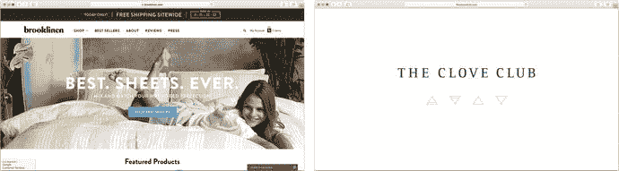

图 6-1

Brooklinen 的首页（左图）清晰展示了其产品系列，而 Clove Club 则为了保持神秘感牺牲了转化率

##### 传达产品范围

Baymard 研究所的 Christian Holst 将电商首页的试金石测试描述为：

> 快速浏览你的首页能否充分传达店铺的产品多样性？如果不能，首次访问者可能会对网站产品目录的范围得出错误结论。

简而言之，如果你的店铺销售种类繁多的产品，但首页只突出展示了其中一小部分或单一产品系列，客户可能会认为你不出售他们想要的商品而离开网站。传达产品的最佳方式取决于所提供的产品范围。如果店铺更偏向“产品型”公司，只销售单一产品线（如苹果），那么只需突出展示几款最热门或最新的商品可能就足够了。相反，如果店铺更偏向“零售商”模式，销售多种不同产品线（如沃尔玛），则更可能在首页突出展示并推广整个品类或产品线（见图 6-2）。

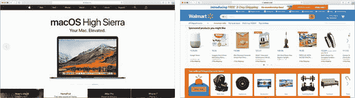

图 6-2

苹果（“产品型”公司）和沃尔玛（“零售型”公司）的首页

注意两家店铺在关注点上的差异——苹果侧重于突出某一关键产品并直接链接到该产品，而沃尔玛则直接通过首页展示整个品类的链接。

##### 清晰的下一步操作

电商店铺设计师可能犯的最大错误之一，就是让访客不清楚该采取什么行动才能更接近购买目标。

在传达了品牌定位和所提供的产品之后，下一步任务是确保潜在客户拥有清晰的路径，能够浏览店铺的品类和/或深入查看特定产品。与你选择展示产品范围的方式一样，设计如何实现这一目标很可能取决于所提供的品类和产品数量。

“产品型”公司可以在首页不同位置展示其全部产品线，并直接链接到各个产品页面。行动号召可以更具体（“了解更多关于新款 MacBook Air 的信息”）。

“零售型”公司则应在首页展示关键品类，鼓励用户点击并浏览其全部产品范围，以增加找到心仪商品的几率。产品范围广泛的店铺应设计首页，使其更侧重于导航元素和搜索功能——回顾第 4 章对这些元素的讨论。

#### 实现首页

正如设计目标所示，你的首页通常需要高度的灵活性，以适配使用你主题的不同类型商家，并允许展示不同内容类型——这些内容可能不与产品或系列直接相关（例如，博客文章）。即使你正在为特定商家设计主题，他们的需求和营销活动也会随时间变化，这要求首页内容能够被定制。

幸运的是，Shopify 为其网站首页提供了一项名为“动态分区”的功能，它允许你设计各种关键组件，商家随后可以选择并配置这些组件，以匹配自己的使用场景。下一节将介绍如何在我们的示例主题中创建三种不同类型的动态分区——“主视觉图片”、“特色产品”区块和“特色系列”区块（见图 6-3）。使用此主题的店主将能够根据需要在其首页上添加、配置和重新排列这些分区，以满足本章开头列出的设计目标。

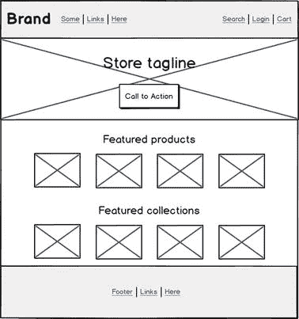

图 6-3

显示我们将实现的三个关键首页分区——“主视觉图片”、特色产品区块和特色系列区块的示意图

##### 上手首页分区

Shopify 使用文件`template/index.liquid`来渲染商店的首页。与其他模板一样，由`index.liquid`生成的 HTML 将在`layout/theme.liquid`内部渲染。传统上，首页模板的实现方式与其他页面模板相同，首页所需的 HTML 和 Liquid 代码直接添加到`index.liquid`中。

然而，在主题首页上引入动态分区意味着，用于渲染首页内容的大部分代码将出现在独立定义的分区中。就像`layout/theme.liquid`中的`{{ content_for_layout }}`标签会被当前主题的页面内容替换一样，`templates/index.liquid`中的`{{ content_for_index }}`标签也会被店主配置的动态生成的分区内容替换。

由于目前将所有首页内容交由分区管理已足够，我们可以更新`templates/index.liquid`的内容，使其仅包含清单 6-1 中的代码。

```
{{ content_for_index }}

清单 6-1
`templates/index.liquid`的简单内容，用于在首页启用动态分区渲染
```


##### 添加英雄图像部分

如果你还记得，在本书的第 4 章中，当你设计和实现页面布局的页眉和页脚元素时，你第一次接触到了“部分”。我们即将为首页构建的动态部分将以完全相同的方式实现——唯一的区别在于，这些新部分将由商店店主在 Shopify 后台选择和插入，而不是通过主题中其他地方的`` Liquid 标签显式包含。

你可以先添加一个用于展示“英雄图像”的部分，这是一种常见的设计元素，用于吸引访问首页用户的注意力并传达一些关于你品牌的信息。我们还会在该元素顶部添加一句标语，以及一个包含行动号召的按钮。所有这些元素（使用的图像、文本内容和目标 URL）都将由商店店主配置。

为此，我们首先在主题中创建一个新的 Liquid 文件`sections/hero.liquid`，并插入代码清单 6-2 的内容。

```

{
"name": "英雄图像",
"settings": [
{
"id": "image",
"type": "image_picker",
"label": "英雄图像"
},
{
"id": "title",
"type": "text",
"label": "标题"
},
{
"id": "label",
"type": "text",
"label": "按钮文本"
},
{
"id": "href",
"type": "url",
"label": "按钮链接"
}
],
"presets": [
{
"name": "英雄图像",
"category": "图像"
}
]
}


{{ section.settings.title | escape }}
{{ section.settings.label | escape }}

代码清单 6-2
sections/hero.liquid 文件内容
```

希望这里没有太多你不熟悉的内容。与页眉和页脚部分一样，我们有一个包含 JSON 的``标签，用于定义英雄图像部分的可配置属性。这些可配置设置随后在文件底部被使用，以输出用于渲染包含图像和文本元素的`<div>`元素的 HTML。

如果我们把这个部分上传到开发商店并刷新首页，页面不会有任何变化。这是因为要显示英雄图像，它需要先被添加到 Shopify 后台的“自定义主题”页面中的首页上。如果你导航到后台的主题定制器（如果你忘了在哪里，请参阅第 4 章），你会看到现在在左侧边栏的“页面内容”部分中有一个“添加部分”选项。点击它，你将可以选择添加一个“英雄图像”部分，并可以用图像、文本和链接对其进行配置（见图 6-4）。

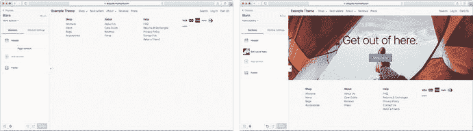

图 6-4

在配置和添加英雄图像部分之前（左）和之后（右）的 Shopify 后台主题定制器

与第 4 章中实现的“静态”页眉和页脚部分不同，这些动态的首页部分可以被多次使用，并且可以独立配置或根据需要重新排列。与静态部分一样，它们也支持使用块（blocks），这意味着我们可以让商店店主对每个部分中显示的内容拥有大量控制权。

现在，我们将再添加几个动态部分，以便实现图 6-3 中草拟的首页布局。首先，我们将添加一个“特色产品”部分（见代码清单 6-3），文件名为`sections/featured-products.liquid`。当添加至首页时，该部分会要求商店店主从其商店中选择一个产品系列，并显示该系列中的前四个产品。我们还将添加一个“特色系列”部分（见代码清单 6-4），文件名为`sections/featured-collections.liquid`。该部分将以类似于特色产品部分的方式显示一系列产品系列，但与其显示预设数量的系列不同，我们将使用块来允许商店店主精确选择他们想要显示多少个系列。

```

{
"name": "特色产品",
"settings": [
{
"id": "title",
"type": "text",
"label": "部分标题",
"info": "默认使用系列标题。"
},
{
"id": "collection",
"type": "collection",
"label": "产品系列"
}
],
"presets": [
{
"name": "特色产品",
"category": "特色"
}
]
}



{{ section.settings.title | default: collection.title | escape }}




代码清单 6-3
首页上的动态“特色产品”部分
```

```

{
"name": "特色系列",
"max_blocks": 4,
"settings": [
{
"id": "title",
"type": "text",
"label": "部分标题"
}
],
"blocks": [
{
"type": "collection",
"name": "产品系列",
"settings": [
{
"id": "collection",
"type": "collection",
"label": "产品系列"
}
]
}
],
"presets": [
{
"name": "特色系列",
"category": "特色"
}
]
}


{{ section.settings.title | escape }}






代码清单 6-4
首页上的动态“特色系列”部分
```

有了这些新的部分，我们在主题定制器的“添加部分”选项下就能看到一些额外的选择，并且可以配置这两个新部分来实现图 6-3 中期望的布局，如图 6-5 所示。

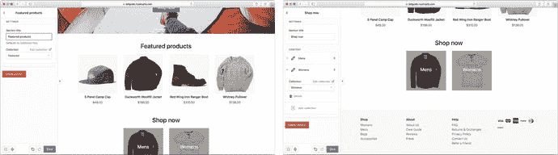

图 6-5

在 Shopify 主题定制器中配置特色产品部分（左）和特色系列部分（右）

仅凭这几个简单的部分，我们就赋予了商店店主对首页布局和显示内容的巨大控制权，同时确保每个独立的部分都与整体主题设计保持一致。如图 6-6 所示，商店店主可以使用同一部分类型的多个实例来构建适合其品牌和产品系列的首页。

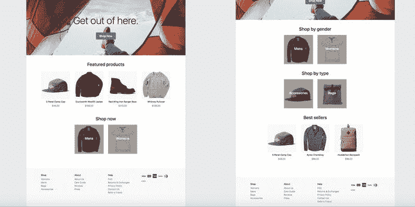

图 6-6

使用我们刚刚实现的部分构建的几种不同的首页布局示例

### 产品系列页面

在完成了产品页面和首页的设计与实现之后，我们现在可以着手设计和实现主题的产品系列页面了。这些页面（也称为“分类页面”）会展示特定系列中包含的所有产品列表，以便顾客可以一次性浏览大量产品，然后再深入了解他们感兴趣的商品。

所有 Shopify 商店都带有一个默认的“全部”系列（通过`/collections/all`访问），其中包含 Shopify 商店在线渠道中列出的所有产品。此外，Shopify 还在`/collections`提供了一个产品系列列表页面，用于展示所有可用的产品系列。该系列列表页面通过`templates/list-collections.liquid`进行渲染。

**提示**

在某些情况下，你可能不希望“全部”系列实际列出所有可供购买的产品。例如，你可能有一系列产品，其中包含一个“隐藏”的产品类型，该类型只能通过产品 URL 访问的用户才能看到。在这种情况下，你可以通过在 Shopify 后台创建一个新系列，并确保其系列句柄设置为“all”，来覆盖默认的“全部”系列。然后，你可以根据需要为该默认系列配置任何规则，例如“产品类型不是隐藏的”。


#### 商品集合页的设计目标

优秀的商品集合页应达成三个关键设计目标：

-   为用户呈现当前集合中商品（或通过当前筛选条件匹配的商品）的清晰概览。
-   为用户提供充足的商品信息，使其能够判断是否对特定商品感兴趣。
-   为用户提供易用的导航和筛选工具，以便他们能够优化商品列表，更精准地匹配自身兴趣。

商品集合页通常被视为顾客初次访问网站到进入商品详情页之间的“垫脚石”，顾客在详情页将商品加入购物车并最终完成购买。然而，不应低估它们在帮助顾客通过视觉和信息对比来选择感兴趣商品方面的重要作用。

由于 Shopify 中的商品集合可以关联自身的图片和文本内容，商品集合页还能通过提供针对顾客可能搜索的关键词类型的内容，在店铺的搜索引擎优化（SEO）中发挥重要作用（见图 [6-7]）。对于某些类型的店铺，商品集合页甚至更为重要，因为预期顾客能在此获得足够信息，无需访问商品详情页即可直接将商品加入购物车（见图 [6-8]）。

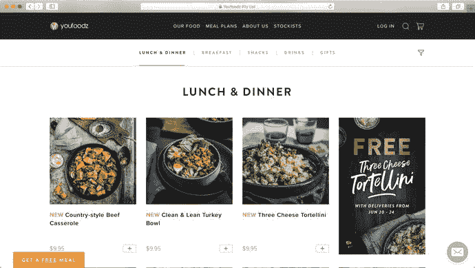

**图 6-8**

Youfoodz 期望顾客直接从“午餐与晚餐”集合页将单个商品（餐食）加入购物车。请注意，他们在每份餐食下方提供了一个形似“加号”按钮的操作提示，并且顾客如果需要在做出购买决定前获取更多信息，仍可以深入查看单个餐食的详细信息。

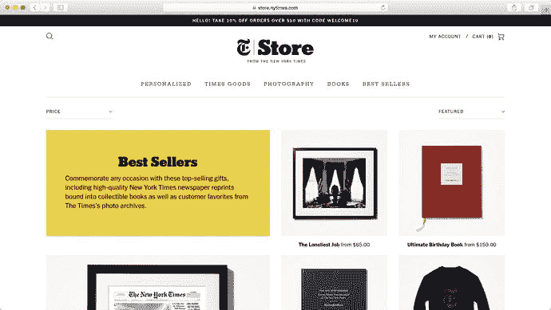

**图 6-7**

《纽约时报》“畅销书”集合包含一些集合专属的文本内容，旨在为顾客提供其所查看集合的上下文信息，并帮助搜索引擎将“纽约时报畅销书”等搜索词直接导向此页面。

我将在本章后续部分，随着对集合页各功能实现的逐步讲解，更详细地讨论这些设计目标。

#### Shopify 商品集合页概念

在开始着手实现一个满足上述设计目标的商品集合页之前，有必要先概览一些关键的主题集合概念，并理解 Shopify 期望如何对商品进行分类和导航。

##### Shopify 中的分类

在 Shopify 之外，电子商务系统通常拥有“嵌套式分类”结构，商品可被分配到一个或多个存在于多层级体系中的分类。Shopify 的层级结构则扁平得多——商品可以属于零个或多个商品集合，且没有固有的子分类概念。商品集合分为两种类型：**手动集合**（也称为自定义集合），由店主手动分配商品成员；以及**智能集合**，其成员由一组规则决定（例如，“类型为‘衬衫’的商品”）。

进一步的商品分类可以通过商品标签实现（稍后在“筛选”部分讨论）。我见过很多尝试使用嵌套导航列表或通过句柄和标签名链接的集合，在 Shopify 主题中塞入更复杂分类结构的做法，但总的来说，我认为最好坚持使用 Shopify 的基本概念。如果商家拥有的产品系列需要更复杂的分类方法，那么研究一个专门构建的搜索和筛选应用程序是值得的，Shopify 应用商店中有大量此类应用。

##### 筛选

如上述所暗示的，Shopify 允许我们通过使用商品标签进一步细化集合中展示的商品。商家可以从 Shopify 后台为商品添加任意数量的标签，将标签名称追加到集合页面的 URL 末尾，将仅显示带有相应标签的商品。

例如，在 Shopify 店铺中访问 `/collections/shirts/blue` 将显示“衬衫”集合中所有标记为“蓝色”的商品。标签的常见用途包括颜色、尺寸、性别、商品类型、“促销中”或“库存有限”标记，等等。

虽然你可以按多个标签进行筛选（例如 `/collections/shirts/blue+large`），但需要注意筛选是以合取方式应用的（在此例中，意味着仅显示同时标记了“蓝色”和“大号”的商品）。无法使用标签应用范围筛选（例如，“价格在 100 到 200 美元之间”）或析取逻辑（例如，“蓝色”或“红色”）。

##### 排序

Shopify 提供了几个常用属性，你可以根据它们对展示的商品集合进行排序（“A-Z”、“Z-A”、“价格：从低到高”、“价格：从高到低”、“畅销商品”等）。所需的排序顺序可以通过 URL 中的 `sort_by` 查询参数传递——例如 `/collections/shirts?sort_by=price-ascending`。

商家可以从 Shopify 后台设置集合中商品的默认排序顺序，但目前无法在不使用第三方应用程序的情况下定义自定义排序属性。

##### 分页

Shopify 还支持在集合 URL 中使用 `page` 查询参数（`/collections/shirts?page=3`）。要使用分页功能，你需要使用 `` 标签包裹在集合中遍历商品的 Liquid 代码，你很快就会看到。

目前，Shopify 在对集合进行分页时，每页商品数量上限为 50 件。

##### 视图

与商品模板类似，我们也可以为商品集合页创建备选商品模板，并通过使用 `view` 查询参数在它们之间切换（如需回顾其工作原理，请参阅第 [5] 章的“创建备选页面模板”）。

在商品集合页的上下文中，备选模板在允许顾客切换集合的不同视图（例如列表视图与网格视图）时非常有用。我将在即将进行的实现阶段中讨论何时以及为何可能需要这样做。

##### 整合所有要素

图 [6-9] 将所有商品集合 URL 参数整合在一起，并展示了每个参数的作用。

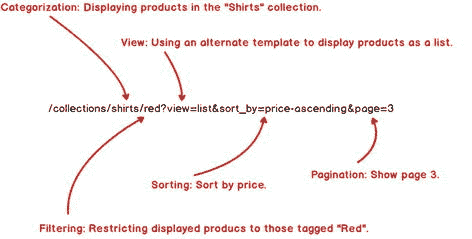

**图 6-9**

生成商品集合 URL 时可用选项的分解说明

因此，商品集合页的实现就变成了这样一个练习：（a）以对用户最有用的方式展示商品列表，以及（b）提供一个简单的用户界面，使用户能够通过生成和操作商品集合 URL 在商品系列中进行导航。

#### 实现商品集合页

正如商品模板位于 `templates/product.liquid`，Shopify 用于渲染商品集合页的模板位于 `templates/collection.liquid`，这也是本章余下部分的重点。与商品页和首页一样，起点将是一个“原型”商品集合页布局，如图 [6-10] 所示。

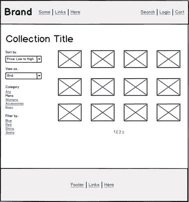

**图 6-10**

显示我们在此示例主题中将要实现的商品集合页布局的线框图

如您所见，我们将致力于实现前面讨论过的商品集合页的所有关键功能——排序、备选视图样式的支持、分类级别筛选、标签级别筛选以及分页。让我们开始吧！


#### 添加带分页的商品循环

首先，我们在 `templates/collection.liquid` 中添加一些初始代码（见列表 6-5），以实现最关键的功能——列出商品。

```
{{ collection.title | escape }}







{{ paginate | default_pagination }}




列表 6-5
用于列出和分页商品的基础集合页面
```

列表 6-5 中需要关注的重点是商品循环（``），它会遍历集合中的商品，并使用之前创建的商品代码片段来渲染商品本身（``）。此迭代循环中可用的商品由包裹该循环的 `` 的 Liquid 标签控制。如您所见，我最初选择按每组 12 个对集合进行分页。每页显示 12、18 或 24 个商品是列表页面的常见选择，因为它们具有许多约数，从而更容易创建响应式布局。在此示例中，每页显示 12 个商品，我们可以在较大的桌面屏幕上每行显示四个，在平板电脑和其他较小设备上每行显示三个，而在移动设备上也许每行显示两个。

我们引入的另一项“新”内容是页面底部的 `{{ paginate | default_pagination }}` 标签。顾名思义，这个方便的 Liquid 辅助工具会获取 `paginate` 变量中的信息（当前页面、商品总数等），并将其渲染为一组简单的链接，允许用户浏览集合的每一页。您可以在图 6-11 中看到这些链接的样式，以及初始实现的其余部分。

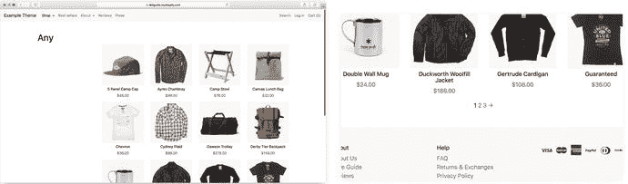

**图 6-11**  
集合页面的初始实现（左），以及在初始 12 个商品页面底部渲染的分页链接的详细视图（右）

#### 添加排序功能

接下来，我们将添加对集合进行排序的支持，使用 Shopify 支持的任意预定义排序方式。为此，我们将在集合模板的左列中添加一个下拉控件，并用一系列可能的排序机制填充它。为了从无 JavaScript 的解决方案开始，我们将所有集合控件包裹在一个 `<form>` 元素内，并要求用户提交该表单以应用所选排序选项。

让我们看看列表 6-6 中集合模板的效果。

```
{{ collection.title | escape }}


排序方式...

精选
价格：从低到高
价格：从高到低
字母顺序 A-Z
字母顺序 Z-A
从旧到新
从新到旧
最畅销

更新







{{ paginate | default_pagination | replace: '&laquo; Previous', '&larr;' | replace: 'Next &raquo;', '&rarr;' }}




列表 6-6
添加排序控件后的集合模板
```

添加此代码后，集合页面上会渲染出一个下拉选择框。用户能够选择排序方式，并点击**更新**按钮提交表单。然后，他们会被重定向到同一个集合 URL，但会带有相应的 `sort_by` 查询参数（这得益于包裹新控件的表单上的 `method="get"` 属性，该属性会根据提交时的表单输入将用户发送到一个新的 URL，而不是将数据“发布”到服务器）。您可以在图 6-12 中查看结果。

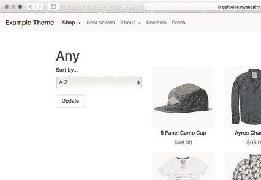

**图 6-12**  
在集合页面左列添加排序控件

您可能会疑惑，为什么我选择实现这种包裹 `<form>` 的模式，而不是（比如说）向 `<select>` 元素的 `change` 事件添加一个 JavaScript 事件处理程序，并直接更新集合 URL？对于用户来说，后者可能比必须选择排序方式并提交表单更省事。

我采用这种方法有几个原因。正如在第 3 章中讨论过的，构建不依赖 JavaScript 的功能有助于加快页面加载时间，并在 JavaScript 出错或尚未加载的情况下保持网站可用。此外，专注于基础组件往往能产生更简单、更易于管理的设计模式。您将在本章末尾看到这一点，届时我们将使用渐进增强技术，在现有简单的基于表单的控件之上添加一个 JavaScript 层。我想，当您看到基于坚实的基础开始实现“动态”用户界面模式时，需要的额外代码竟然如此之少，您会感到惊讶。


#### 产品列表的不同呈现方式

如前所述，集合页面设计的主要目标之一是让顾客能够有效了解当前集合中的产品范围，同时还能在不深入产品页面的情况下直接比较特定产品。

让顾客实现这一目标的最佳方式往往取决于所售产品的类型以及顾客所处的场景。一个经典的例子是：在“网格”视图（例如示例主题当前的产品列表方式）与“列表”视图（每行仅显示一个产品）之间做出选择。

传统观点认为，网格视图在以下情况下最为适用：

- 产品的外观比产品信息更重要。
- 所展示的产品之间视觉差异明显。
- 顾客不太可能对展示的产品进行直接比较。
- 顾客更倾向于浏览，而非寻找特定产品。

由此推论，列表视图在以下情况下则更为适宜：

- 产品的信息比产品外观更重要。
- 所展示的产品视觉上相似或完全相同。
- 顾客可能想要对展示的产品进行比较。
- 顾客很可能在寻找特定产品。

第一种场景的一个典型例子是服装店的“新品”集合。该集合很可能包含完全不同类型的服装（围巾、帽子和夹克），顾客可能在毫无特定目标的情况下随意浏览。一般来说，那些产品外观至关重要的店铺（如服装店）更倾向于使用网格视图（见图 6-13）。

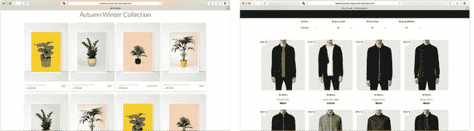

图 6-13  
时尚店铺及其他产品视觉元素突出的店铺常使用网格视图

相反的案例是电子产品商店中的“液晶电视”列表。所有电视机看起来都相当相似——重要的是规格参数（尺寸、对比度和功能），而且顾客很可能想要比较两种或多种选择。当产品细节更为重要时，更倾向于使用列表视图（见图 6-14）。

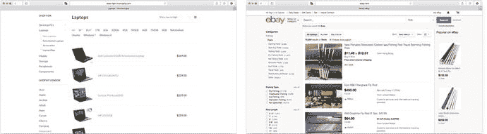

图 6-14  
拥有大量技术信息或产品比较尤为重要的店铺常使用列表视图

电商网站提供在这两种视图之间切换的功能相当普遍。添加此类功能会增加额外的工作量，但在以下情况下会很有用：

- 你无法确定所设计的主题将面向哪些产品类型（在构建供多位商家使用的主题时很常见）。
- 你有一些产品集合更适合网格视图，而另一些则更适合列表视图。
- 你拥有大型产品集合，顾客可能希望先用网格视图直观地缩小选择范围，再通过列表视图对挑选出的产品进行比较。

我一直主张保持界面简洁并降低用户的认知负担，所以如果你认为集合页面仅凭网格视图或列表视图就能胜任其功能，我会建议你坚持单一视图。如果你确实觉得需要提供视图选择功能，务必添加主题选项（见第 8 章），以便店主能够独立开启或关闭每种视图，并设置默认视图类型。

你还需要花些时间思考：根据不同的视图类型，你所展示给顾客的信息可能会发生怎样的变化。如果考虑经典场景——网格视图主要用于浏览，那么“顶层”信息（如产品外观、标题和价格）可能就足以让用户判断是否要进一步了解。列表视图通常信息密度更高，以便顾客能够从集合页面进行更全面的比较（见图 6-15）。

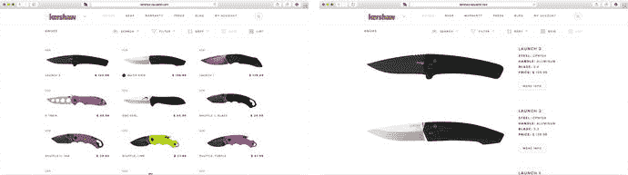

图 6-15  
Kershaw 刀具网站在网格视图中仅显示产品图片、标题和价格

切换到列表视图后，会展示更详细的信息，如组件材质和刀片规格。这使得比较变得更加容易，尽管列表视图中产品图片的尺寸使得同时比较两个以上产品时略显困难。


##### 为主题示例添加视图切换选项

基于我们希望为主题示例用户提供视图选择的前提，接下来我们探讨如何为商品集合页面添加列表视图，以补充现有的网格视图。为此，我们将使用前一章讨论过的 Shopify 备选模板功能。

首先，我们将 `templates/collection.liquid` 中的所有现有代码移至一个代码片段 (`snippets/collection-view.liquid`)。之所以这样做，是因为我们希望在网格视图和列表视图之间共享大量代码——排序、筛选、分页以及页面的整体布局对两种视图而言都是相同的，我们希望尽可能避免重复代码。完成此步骤后，我们就可以从新版本的 `templates/collection.liquid` 中包含此代码片段（请参见列表 6-7）。每当集合 URL 包含 `?view=grid` 参数，或者未指定视图参数时，都将使用此模板。默认的集合模板 (`templates/collection.liquid`) 包含了集合代码片段，并指定应使用网格视图。

```

列表 6-7
网格视图
```

下面的备选集合模板 (`templates/collections.list.liquid`) 将在集合 URL 包含 `?view=list` 参数时被渲染（请参见列表 6-8）。

```

列表 6-8
?view=list 参数
```

如果你之前没遇到过，`` 标签中的 `with` 关键字允许我们向包含的代码片段传递一个参数。在该代码片段内部，将创建一个名为 `collection-view` 的 Liquid 变量，其值就是我们要渲染的视图类型。

在 `collection-view.liquid` 代码片段内部，代码与原始集合模板基本保持一致，有两个关键改动。在集合排序的 `<select>` 元素下方，我们添加了第二个 `<select>` 来处理视图切换（请参见列表 6-9）。它被插入到 `snippets/collection-view.liquid` 中，位于原有的排序选择下拉菜单和“更新”表单提交按钮之间。然后，围绕产品循环输出的代码（请参见列表 6-10）会检查 `collection-view` 的值，以渲染相应的产品代码片段——要么是之前用于网格视图的 `product.liquid` 代码片段，要么是用于在单行水平排列中渲染产品的新 `product-list.liquid` 代码片段（请参见列表 6-11）。

```
视图切换为...

网格
列表

列表 6-9
新视图选择下拉菜单的代码
```

```
...











...
列表 6-10
产品循环的更新代码
```

```
{{ product.title | escape }}
{{ product.vendor | escape }}

{{ product.price | money }}

列表 6-11
新的 snippets/product-list.liquid 代码片段
```

图 6-16 展示了结果，左侧栏出现了一个新的视图选择下拉菜单，右侧则用新的列表样式渲染了产品。

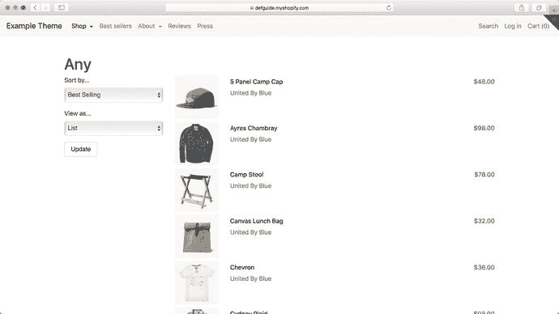

图 6-16

商品集合页面现在可以以简单的列表视图显示

##### 添加类别级筛选

目前我们已经在商品集合页面上实现了分页、排序和视图管理。最后要添加的功能是筛选——一种让客户能够将产品范围缩小到他们感兴趣商品的方式。

与我们之前在集合页面所做的其他工作相比，产品筛选是最依赖于具体用例的。根据所涉及的产品范围不同，需要采用不同的筛选策略以及不同的分组方法来组合不同筛选条件。一家卖酒的商店可能有成千上万种产品，需要让客户根据年份、原产国或葡萄品种的各种组合进行筛选。另一方面，一家销售有限范围预包装餐食的网站，可能每次只需提供单一维度的筛选（早餐、午餐或晚餐）。

大多数商店都需要某种“类别级”筛选的概念，这是一种将产品范围初步缩小到客户感兴趣商品的高级方法。如前所述，Shopify 中通过集合来实现这个层次的筛选。在商品集合页面上添加类别级筛选，可以简单到在商店中为每个集合添加一个链接列表，这就是我在列表 6-12 中为主题示例实现的方式。此代码已添加到 `snippets/collection-view.liquid` 中，位于排序和视图控件之下。

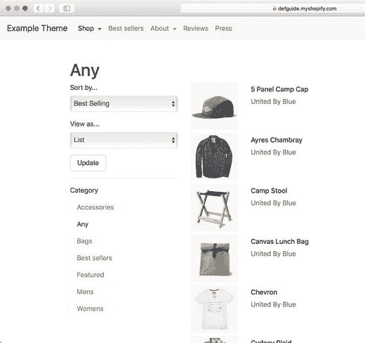

图 6-17

类别筛选在左侧栏显示为一个简单的链接列表。一次只能选择一个类别

```
...
更新

类别




{{ collection_option.title | escape }}


{{ collection_option.title | escape }}





...
列表 6-12
添加一个直接的类别（集合）级筛选
```

这种简单的方法允许客户通过遍历所有集合，并为每个集合渲染一个指向其集合页面的链接，轻松地在商店的各个集合之间导航。请注意，在生成指向每个集合的 URL 时，我们包含了当前视图和排序参数，以便在集合之间切换时保持一致的体验。相反，我们没有包含当前分页信息，因为从用户体验的角度来看，当我们完全改变可见类别时，跳回到第一页似乎是最优的。

这种直接方法的一个潜在问题是，店主无法控制显示的集合列表或它们的排列顺序。我们将在本章末尾解决这个问题，但现在，让我们继续探讨下一级别的筛选功能。


#### 添加基于标签的筛选功能

对于产品数量有限的商店，按类别筛选就足够了。然而，在许多情况下，还需要额外的细化筛选层级。这时就要用到基于标签的筛选功能。

正如你之前查看集合页面 URL 结构时所看到的，在集合 URL 末尾添加一个标签名称，会将可见产品筛选为仅显示该集合中带有该标签的产品。Shopify 提供了几个 Liquid 辅助工具，可以轻松生成用于在当前集合视图中添加或移除这些标签的集合 URL。你可以在代码清单 6-13 中看到这些 Liquid 辅助工具（`current_tags`、`link_to_remove_tag` 和 `link_to_add_tag`）的用法，我在类别级筛选器下方添加了一个可筛选的标签列表。另请注意，我还更新了表单的 `action` 属性，以确保在更改排序顺序或视图时能够保留标签筛选信息。使用 `&#9745;` 和 `&#9744;` HTML 实体来显示选中或未选中的复选框，具体取决于当前标签是否处于激活状态。

```
...
筛选方式...




{{ '&#9745;' | append: tag | link_to_remove_tag: tag }}

{{ '&#9744;' | append: tag | link_to_add_tag: tag }}




代码清单 6-13
在类别级筛选器下方添加基于标签的筛选器
```

如图 6-18 所示，这段代码片段会在类别级筛选器正下方渲染出一个标签列表。

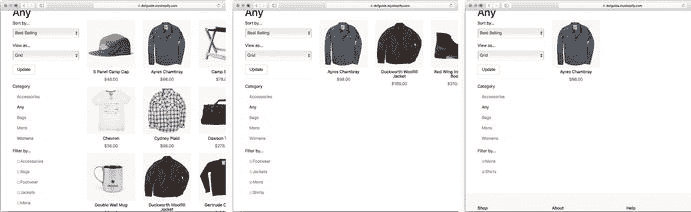

**图 6-18**  
添加标签筛选器后集合页面的效果：分别选择零个（左）、一个（中）和两个（右）标签进行筛选

关于这种方法，需要注意两个重要事项：

- 这里的标签筛选器是以累加方式使用的。也就是说，如图 6-18 所示，我们可以先筛选出男士产品，然后再添加第二个“衬衫”筛选器。这是一种选择；另一种可能是只允许单层标签筛选，类似于我们只允许单层类别筛选的方式。
- 你可能已经从截图中注意到，随着我们添加筛选条件，“筛选方式...”标题下的可用标签筛选器列表会缩小。这是因为标签循环 `` 只会返回当前可见产品中存在的标签列表。这通常是期望的行为，因为它能避免显示对最终产品列表没有影响的标签筛选选项。但如果你希望保持标签筛选器列表的一致性，可以使用 `` 来代替。

#### 渐进增强集合页面

现在的集合页面功能已经相当完善，能够让客户执行本节开头所述的所有关键任务。为了总结本节，我们将介绍一些可用于改进页面用户体验的方法。

首先是当用户可使用 JavaScript 时，添加一些功能（渐进增强）。之前添加排序和视图选择下拉框时，我提到要求用户在更改下拉框后点击**更新**是一个不必要的额外步骤。得益于我们迄今为止构建集合页面的稳健方式，只需添加少量 JavaScript 和 CSS，我们就可以增加一些逻辑：当下拉选择框发生变化时自动提交集合表单。你还将看到当 JavaScript 可用时如何隐藏**更新**按钮，因为届时它已不再需要。

由于这些更改所需的代码涉及多个不同的文件，我不会在书中完整复制（和往常一样，这些代码更改可在示例主题在线仓库中找到）。以下是该方法的大纲：

1. 添加一些 `no-js` 和 `js-hide` CSS 类，分别应用于 `<body>` 和**更新**按钮，以便在 JavaScript 可用时隐藏**更新**按钮。
2. 添加一行 JavaScript，在初始化时从 `<body>` 中移除 `no-js` CSS 类。
3. 使用 JavaScript 捕获排序和视图选择下拉元素的 `change` 事件。
4. 在该事件的处理程序中，自动提交集合表单以应用更改。

实施这些更改后，你应该能够在启用和不启用 JavaScript 的情况下加载集合页面，并看到与图 6-19 中相同的结果。对排序顺序或视图选择的任何更改都应立即生效。

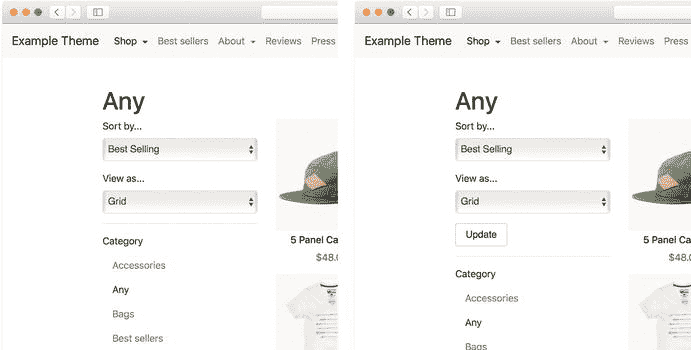

**图 6-19**  
渐进增强的实际效果！

当 JavaScript 可用、已被解析并初始化后，**更新**按钮被隐藏，更改选择框会立即更新视图。否则，按钮保持可见，并提供一个可访问的后备方案。

我们可以进行的另一项增强是，使用 Ajax 调用避免在每次更改排序、视图或筛选条件时都刷新整个页面。虽然我认为基于 Ajax 的动态界面带来的速度优势常常被夸大（特别是如果你已经花精力对主题进行了适当优化），但如果在稳固的基础上渐进式地添加，你可以用相对较少的工作来避免一些开销（例如重新解析页面加载时涉及的样式表和 JavaScript）。

同样，为了简洁起见，我将跳过完整代码，仅提供该方法的大纲：

1. 使用 JavaScript 拦截集合表单的 `submit` 事件，该事件将在排序或视图下拉框更改时触发。
2. 阻止默认的表单提交，而是向原本的目标 URL 发起一个 Ajax 请求以获取页面内容，然后用新内容替换当前页面内容。
3. 使用 JavaScript 拦截类别和标签筛选链接的 `click` 事件。
4. 采用类似于表单提交的方法，发起 Ajax 请求获取链接的目标 URL，并用新内容替换当前页面。

### 本章小结

在本章中，你了解了如何实现任何 Shopify 商店中两个关键页面——主页和集合页面。对于主页，你明确了页面的关键目标（传达品牌形象和产品范围），并了解了如何使用动态板块构建一个高度可配置的布局。

你还学习了集合页面的设计目标与实现技术，以及客户在这些页面上的四个关键操作——视图选择、排序、筛选和分页。

