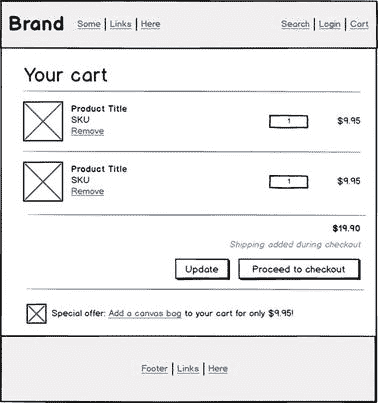
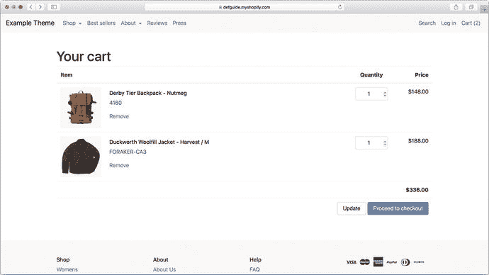
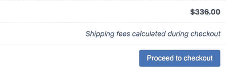
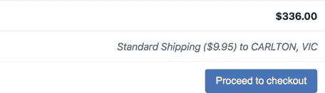
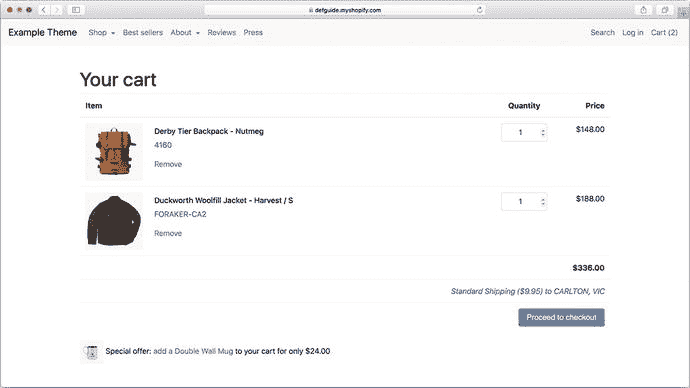
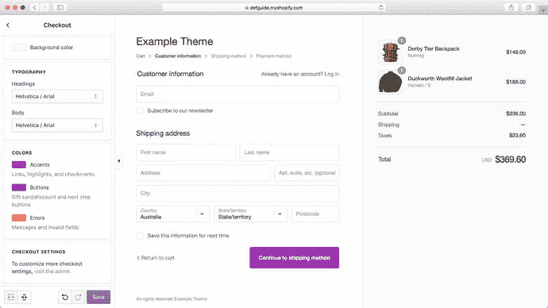
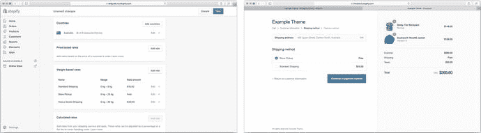
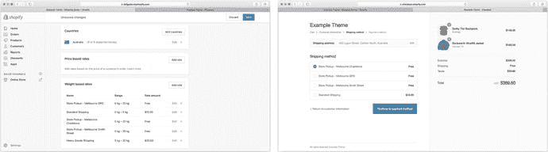
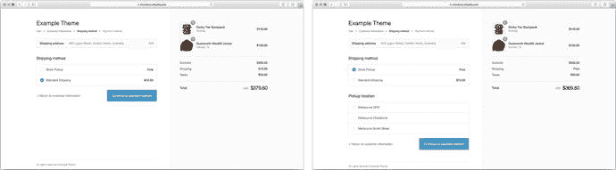

# 购物车、结账与内容

前三章涵盖了 Shopify 商店访客发现想要购买的产品（或产品）并将其加入购物车所需组件的设计与实现。在本章中，我们将讨论如何鼓励客户从这一点开始完成他们的旅程，并顺利完成结账，以便商家收到付款。作为其中的一部分，我们将研究如何最大限度地减少购物车放弃率，以及最大化平均订单金额的策略。

本章的最后部分还将讨论 Shopify 商店主题中涉及的“其他”页面——内容页面、博客页面和文章页面，这些页面在推动产品销售方面起到辅助作用。

## 购物车页面

当客户将商品添加到购物车后，Shopify 的默认行为是将他们重定向到 `/cart` 页面，作为进入结账流程前的最后一步。如果你正在开发的主题使用了基于 Ajax 的“加入购物车”功能（通常来自商品页或商品系列页），客户可能会停留在当前页面，此时默认行为将不适用。

无论哪种情况，购物车页面都让客户有机会在提供收货和付款信息前，复核订单并确保满意。为了尽可能让更多客户顺利完成结账流程，在设计购物车页面时，我们需要牢记一些设计要点。

### 购物车页面的设计目标

研究表明，平均有 69% 的在线购物车会在结账流程的某个阶段被放弃。¹ 虽然再精妙的设计也无法挽回所有流失的销售，但我们可以采取一些关键措施来鼓励用户完成订单。上述报告中对购物车放弃原因的分析表明，导致在线商店转化率下降的两大主因是：

- 添加了不合理或意外的附加成本（如运费、税费或手续费）
- 结账流程过于复杂，或需要花费太多时间和精力才能完成

虽然商家收取的实际运费和税费不在主题设计师的掌控范围内，但我们完全可以在购物车页面上采取措施，确保客户在结账过程中不会遭遇意外或“隐藏”费用。我们还可以集中精力简化购物车页面，确保只显示对客户有用的信息，并鼓励他们采取下一步合乎逻辑的操作（结账）。

下一节将介绍如何在示例主题中添加一个符合这些设计目标的购物车页面。在每一步中，我们都会更详细地探讨具体的设计决策。

### 实现购物车页面

延续示例主题采用“标准”设计的传统，我们将要构建的购物车页面将遵循图 7-1 所示的布局。



图 7-1

本章将实现的购物车页面布局示意图

你会注意到该购物车布局的几个关键设计特点：

- 它允许客户编辑购物车，既可以调整商品数量，也可以完全移除商品。这对于提高平均订单价值（当客户希望或被鼓励订购更多数量时）和降低放弃率（如果客户认为调整数量或从购物车中移除商品过于困难，他们可能会直接离开网站）都至关重要。
- 它包含一条关于运费率的提示，旨在降低客户在结账过程中遇到意外费用的风险。
- 它包含一个购物车内的追加销售（upsell）推荐，旨在通过冲动消费决策提高平均订单价值。实施这类推荐时务必谨慎，确保它们不会干扰客户完成结账这一首要目标，因此在实施时应考虑其对转化率和整体营收的影响。

#### 添加可编辑的购物车内容列表

我们将从添加一个显示当前购物车内容的简单表格开始购物车页面的工作，如代码清单 7-1 所示。

```
您的购物车


商品
数量
价格



{{ item.title | escape }}
{{ item.sku | escape }}
移除

{{ item.line_price | money }}



{{ cart.total_price | money }}



您的购物车是空的。



代码清单 7-1
templates/cart.liquid 的初始 Liquid 模板
```

表格内容被包裹在 `<form>` 中，页面底部包含一个“更新”按钮。客户可以通过更改数量输入框的值并提交表单来更新购物车中商品的数量。我们还会为每个商品行添加一个“移除”链接，以及一个“前往结账”按钮作为页面上的主要行动号召。

实现后，包含几件商品的购物车应如图 7-2 所示。



图 7-2

购物车页面的初始浏览器显示效果

正如我们在第 6 章中对商品系列页面的视图控制所做的处理一样，我们可以使用渐进增强技术，在 JavaScript 可用时驱动商品数量的更新，避免用户在购物车页面上必须点击“更新”按钮的笨拙体验。实现该功能所需的完整代码可在示例主题的 GitHub 仓库中找到，但总体思路是：

- 拦截购物车表格中数量输入框的 `change` 事件。
- 当变化发生时，使用 Shopify 的 Ajax API² 发起一个 Ajax 请求，以更新指定商品行的数量。
- 利用我们为商品系列页面实现的 CSS 类，在 JavaScript 可用时隐藏“更新”按钮。

#### 添加运费计算器

在购物车页面的基本功能就绪后，我们可以在“继续结账”按钮上方添加一条提示，旨在降低顾客在结账过程中遇到意外情况的风险。由于加载运费需要一些动态 JavaScript，我们可以先实现一个默认的纯 HTML 备用方案——如代码清单 7-2 和图 7-3 所示，显示一条静态提示。在代码清单 7-2 中，代码清单 7-1 中的表格底部已被更新，加入了一条静态运费信息。包含该信息的元素被赋予了 `id` 属性，以便我们后续引用并动态更新它。



图 7-3 购物车表格中显示的备用运费信息

```
...
{{ cart.total_price | money }}
Shipping and taxes calculated during checkout
...
代码清单 7-2
更新后的代码清单 7-1 中的表格底部包含静态运费信息
```

有了这个备用方案后，我们现在来实现一些 JavaScript 代码，使用 Shopify 的 Ajax API 获取运费估算并显示给顾客。为了准确估算运费，我们需要知道发货目的地（国家、州和邮政编码）——这些信息通常在购物车步骤中并不具备。

出于示例主题的考虑，我们将保持简单，仅为已知收货地址的已登录顾客获取并显示更准确的运费估算。在其他情况下，我们不会执行任何动态更新，而是显示备用信息。在实际场景中，你可以扩展即将实现的代码，通过 JavaScript 地理定位 API 获取陌生顾客的位置，或根据其 IP 地址进行近似定位，也可以直接通过一个表单请求其详细地址。

实现此功能需要对三个主题文件进行修改：

1.  首先，我们需要在 `assets/theme.js.liquid` 中添加一个新的 `fetchShippingRateEstimate` JavaScript 方法。该方法需要接收已登录顾客的地址以及用于渲染运费估算信息的目标元素的选择器。然后，它会向 Shopify 的运费 API 发出 Ajax 调用并渲染结果。此方法见代码清单 7-3。
2.  由于任何已登录顾客的详细信息仅在核心 Liquid 模板中可用，而非资产文件，因此我们需要在 `templates/cart.liquid` 中将顾客详情传递给新编写的 `fetchShippingRateEstimate` 方法。如代码清单 7-4 所示，这里使用了笔者称之为“捕获 JS”的模式，具体解释见随后的提示。
3.  最后，为了让“捕获 JS”模式生效，我们需要在 `layout/theme.liquid` 的底部、所有其他 JavaScript 代码之下添加一行代码。如代码清单 7-5 所示。

**提示**

良好的实践要求将 JavaScript 加载并初始化在 `theme.liquid` 所有页面的底部，因为顶部加载 JavaScript 是导致页面加载缓慢和加载时间过长的主要原因之一。然而，有时你可能希望只在特定页面上加载或执行某些 JavaScript 代码——这里对 `fetchShippingRateEstimates` 的初始化调用就是一个很好的例子。

在这些情况下，我使用捕获 JS 技术：在 Liquid 模板中使用 `` 标签，将任何页面特定的 JavaScript 存储到名为 `captured_js` 的变量中。只要确保将 `captured_js` 之前的内容与新捕获的内容一同输出，就可以在页面上多次使用此方法（参见代码清单 7-4）。然后，你的 `theme.liquid` 模板可以在页面最底部输出捕获的内容，确保所有 JavaScript 库在执行前都已加载完毕。

请注意，代码清单 7-3 将此方法暴露在 `window` 对象的全局作用域中——在生产主题中，你可能需要为其设置命名空间（例如 `window.ExampleTheme.fetchShippingRateEstimate`）。

```
...
window.fetchShippingRateEstimate = function(target, shipping_address) {
if(!shipping_address) return;
$.ajax({
url: '/cart/shipping_rates.json',
data: $.serialize({ shipping_address: shipping_address }),
success: function(shipping_rates) {
if(shipping_rates.length === 0) return;
var shipping_rate = shipping_rates[0];
$(target).html(
'' +
shipping_rate.name + ' ($' + shipping_rate.price + ') 发往 ' +
shipping_address.city + ', ' + shipping_address.province +
''
);
}
});
};
...
```

代码清单 7-3
添加到 `theme.js.liquid` 中的 `fetchShippingRateEstimate` 方法

请注意，代码清单 7-4 使用了方便的 Liquid `| json` 过滤器，它可以将 Liquid 变量（例如顾客的默认地址）转换为 JSON 对象，以便在 JavaScript 中使用。

```
...

{{- captured_js -}}

fetchShippingRateEstimate('#cart-shipping', {{ customer.default_address | json }});


```

代码清单 7-4
`cart.liquid` 底部执行的“捕获 JS”模式

```
...
{{- 'theme.js' | asset_url | script_tag -}}
{{- captured_js -}}
```

代码清单 7-5
`theme.liquid` 底部新增内容——输出 `captured_js` Liquid 变量

图 7-4 展示了购物车页面在获取运费后的效果。



**图 7-4** 如果拥有已知地址的顾客已登录，购物车页面现在会为其所在地获取运费估算，并提供更具体的运费信息

##### 添加追加销售优惠

购物车页面的最后一项功能，将是一个基于购物车当前内容的简单追加销售优惠。为了实现此功能，我们将采用以下方法：

1.  我们将引入一个新的“追加销售”元字段，它可以应用于我们的产品（关于其工作原理，请参阅第 5 章“使用元字段管理附加信息”一节）。

2.  在购物车页面上，我们将遍历购物车中的每一项，检查它是否设置了追加销售元字段，并且该字段指向的商品是否尚未在购物车中。如果是，我们将显示追加销售商品的图片以及一个按钮，让顾客可以将其添加到购物车。

为了使这种方法生效，我们需要添加一个 `cart-upsell.liquid` 代码片段（参见代码清单 7-6），并将其包含在现有 `cart.liquid` 模板的底部。它包含 Liquid 逻辑，用于遍历当前购物车，查找被指定为追加销售但尚未在购物车中的商品。一旦找到有效的追加销售商品，我们就跳出循环，因此每次最多只会显示一个优惠。

```



















Special offer: add a {{ upsell_product.title }} to your cart for only {{ upsell_product.variants.first.price | money }}


```

代码清单 7-6
`cart-upsell.liquid` 文件

完成这最后一项添加后，购物车页面就完成了，应该如图 7-5 所示。



图 7-5  

完整的购物车页面，包含购物车表格、运费估算和追加销售优惠

### 结账流程

一旦顾客点击“继续结账”按钮，他们就会离开主题的购物车页面，进入 Shopify 的结账流程，系统会要求他们输入配送和付款信息以完成订单。出于安全原因，结账流程中使用的布局和 Liquid 模板与其它页面模板不同，不会以相同的方式向主题开发者开放。取而代之的是，商户可以在 Shopify 管理后台的“主题”部分访问多个预定义设置，允许他们自定义标题图片和颜色，以匹配其店铺的其他部分（参见图 7-6）。



图 7-6  

商户可以在 Shopify 管理后台选择有限的选项来自定义其结账流程以匹配主题

Shopify 结账流程缺乏可定制性，常被认为是该平台的一个主要缺点。这确实可能带来限制——例如，无法更改结账时表单元素的顺序、无法从顾客那里获取额外信息，或无法使用自定义字体。但作为交换，你获得的是一个安全、稳健的结账体验，并且 Shopify 会持续对其进行调整和优化——在我看来，尽管存在局限性，这对店铺来说总体上仍然是赢家。

在 Shopify 结账流程可能的范围内，我认为需要牢记的最重要一点是增强对店铺品牌以及结账流程本身的信任。应选择与主商店主题紧密匹配的字体、颜色和标题图片，这样顾客就不会感觉他们“跳转”到了另一个网站。

**旁注**

历史上，顾客在结账过程中会从 Shopify 店铺被引导到一个不同的域名 (`checkout.shopify.com`)，这让商户担心这可能会影响转化率。如今，Shopify 的结账流程与店铺其他部分托管在同一个域名下——但有趣的是，在为此更改进行的测试中，结账团队发现无论域名是否更改，转化率都没有差异。

#### 使用 Shopify Plus 自定义结账流程

使用 Shopify Plus 企业平台（相对于“常规”Shopify 产品）的店铺，在处理结账模板时拥有更高的灵活性。Plus 店铺可以为结账流程添加自定义的 Liquid、CSS 和 JavaScript，尽管布局和结账步骤的控制权仍由 Shopify 掌握。这些自定义需要针对每个店铺单独实施，因为你无法在主题中提供通用的自定义 `checkout.liquid` 模板（无论如何，结账自定义往往具有很强的店铺特异性）。

虽然你早期的主题工作不太可能涉及 Shopify Plus 店铺，但掌握一些结账自定义知识作为储备还是有益的。为此，我们将在示例主题中通过添加一个简单的门店自提选择器，来探讨一个常见但简单的结账自定义。

##### 在结账流程中添加门店自提选择器

为与商家实体零售店位于同一国家或地区的顾客提供“本地自提”配送选项是相当常见的做法。通常，这通过在 Shopify 配送设置中添加一个“门店自提”选项来实现，并限制在特定的地理位置（见图 7-7）。



图 7-7

在 Shopify 后台中配置的门店自提配送选项（左）；以及结账时向顾客展示的最终配送选项（右）

虽然这种方法适用于简单的场景，但对于拥有多个自提点的商家来说，可能会遇到复杂情况。假设你的示例商店在澳大利亚的几个主要城市——墨尔本、悉尼和布里斯班——都设有实体店。虽然我们可以为每个自提点创建独立的配送选项，并按州进行限制，但这会导致在结账过程中选项过多，让顾客感到不知所措（见图 7-8）。



图 7-8

当有多个实体自提点时，配置变得难以管理，结账流程对顾客来说也更加复杂。

借助 Shopify Plus 商店对 `checkout.liquid` 模板的访问权限，我们可以通过一些自定义 JavaScript 来解决这个问题。具体方法如下：

1.  在 Shopify 后台中设置一个名为“门店自提”的单一配送区域。
2.  添加一些自定义 JavaScript，用于检测顾客何时选择了“门店自提”配送选项。当该选项被选中时，渲染一个自定义下拉元素，让顾客可以选择他们想从哪个具体门店提货。
3.  当顾客进入下一步时，将所选选项作为购物车属性传递，从而将该选择与最终订单关联起来。

你可以在示例主题仓库中查看实现此功能所需的代码变更（虽然代码不算复杂，但在此列出会占用过多篇幅）。你可以在图 7-9 的结账页面中看到结果。



图 7-9

结账自定义功能现已就位。

有了结账自定义功能后，顾客在结账时首先会看到一个单一的“门店自提”选项（左）。选择该选项后，会显示第二个表单输入，允许顾客选择具体的自提地点（右），随后该信息会出现在 Shopify 后台订单详情页的“其他详细信息”部分。

### 内容页面

现在你已经了解了顾客在 Shopify 网站上最关键的几个环节——首页、商品系列页、产品页、购物车页和结账页。但这些并非 Shopify 商店仅有的页面——大多数商店还会包含“内容”页面，用于存放常见问题解答、关于我们、联系表单、退货政策等内容。许多商店还会有博客内容，无论是用于内容营销和搜索引擎优化，还是用于记录新产品的发布。

虽然这些页面对所有商店都很重要，但我不会在此详细展开介绍。我们用于构建首页、产品页和商品系列页的原则和技术，同样适用于页面、博客和文章模板。通常，处理这些页面的主要工作在于组织内容本身，并围绕内容构建设计。诸如 Liquid 变量和过滤器、替代页面模板、主题区段和设置等功能，在这些模板中均可使用，这为你实现功能和布局提供了高度的灵活性。

你可以查看示例主题仓库，了解我是如何为页面、博客和文章模板实现简单示例的。

### 总结

本章涵盖了顾客从商店购买商品旅程中最后几步的设计与实现。你学习了如何构建一个可编辑的购物车页面，该页面包含运费估算和追加销售等额外功能。

本章还讨论了 Shopify 结账流程及其在自定义方面的一些限制。在结束本章之前，我们简要介绍了 Shopify Plus 商家如何克服其中一些限制，并讨论了 Shopify 商店中的“其他”内容页面。

### 脚注

1.  [`https://baymard.com/lists/cart-abandonment-rate`](https://baymard.com/lists/cart-abandonment-rate)
2.  [`https://help.shopify.com/themes/development/getting-started/using-ajax-api`](https://help.shopify.com/themes/development/getting-started/using-ajax-api)