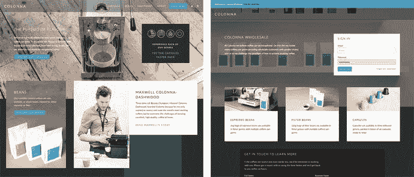

# 8. 主题设置与全球化

无论何种情况，Shopify 主题的最终用户通常都需要一定程度的主题自定义。为了避免每次商店需要变更时都让商家去找开发者，Shopify 主题通过两种不同的功能——主题设置和区域设置——提供按商店进行配置的能力。

对于为客户开发的主题，使用这些功能添加一定程度的自助自定义能力，将为你节省大量宝贵的“五分钟修复”式客户支持时间。对于你销售给多个客户的主题来说，最终用户能够修改主题的多个方面至关重要，这样他们才能“拥有”自己的主题，并以符合其品牌的方式进行自定义。


### 主题设置

正如你在第 1 章“剖析 Shopify 主题”一节中所看到的，主题的可配置项是通过一种特殊的 JSON 格式来指定的，要么在 `config/settings_schema.json` 文件中（用于应用于整个主题的全局设置），要么位于模板文件内部的 `` Liquid 标签内（用于特定模板的设置）。一个全局设置文件的简单示例如代码清单 8-1 所示，其对应的 UI 界面如图 8-1 所示，向 Shopify 管理员端用户展示。请注意，你可以添加 Markdown 风格的引用标记，以提供指向更多信息的链接，并避免主题编辑器中出现信息过载。


**图 8-1** 代码清单 8-1 中的简单复选框设置在 Shopify 管理后台界面中的显示结果

```
{
"type": "checkbox",
"id": "favicon_enable",
"label": "使用[自定义图标](https://en.wikipedia.org/wiki/Favicon)"
}
```

**代码清单 8-1** 一个简单复选框设置的 JSON 格式设置

设置项的 JSON 格式以及所有可能的设置输入类型在 Shopify 的在线文档中都有详细说明，¹ 因此我在此不再赘述。（Shopify 也会定期添加新的输入类型，所以定期查阅最新资料是值得的。）本章重点讨论何时使用主题设置是合理的、探索其用例，以及一些关于如何在你的主题中使用这些设置的实用技巧。

> **注意**
> 除了 `settings_schema.json` 文件，在你的主题的 `/config` 目录下还有一个名为 `settings_data.json` 的文件。该文件包含特定商店实例中主题的当前选定设置。请尽量避免在开发过程中直接编辑此文件，并确保在你使用的任何版本控制或自动上传流程中忽略它。否则，可能会导致开发者意外覆盖商店所有者精心配置的设置。

#### 什么应该被设为设置项？

决定是否通过主题设置让商店所有者配置某项功能，通常取决于这个主题是为谁而构建的。

##### 针对“单次使用”主题的设置

为特定商店的特定客户构建的主题（“单次使用”主题）在主题设置方面通常范围非常狭窄。

鉴于你很可能与客户紧密合作设计和构建了网站，像字体、品牌颜色和图形元素等关键设计元素不太可能频繁更改。主题可能需要集成的第三方服务列表（例如，邮件列表服务商）很可能是预先确定的，或者至少在你的掌控之中。

因此，我发现为单次使用主题添加的设置类型通常是时敏功能标志或数值——例如，一个用于切换全站横幅的开关，显示关于正在进行的促销或假日配送延误的自定义信息；或者，哪些产品应该出现在某个关键内容页面上。

作为主题设计流程的一部分，我会与客户沟通，试图理解网站哪些部分可能会以这种方式具有时敏性，并据此规划我的设置项。一般原则是，如果你不确定某件事是否需要转为主题设置，那就先不要做，直到客户多次要求修改它。（我发现，如果放任不管，客户会想要定制一切，即使实际上它根本没有可能被更改。）

##### 针对“多用途”主题的设置

“单次使用”主题的一个变体是“多用途”主题，你为某个特定客户设计和构建一个主题，但该主题将用于多个 Shopify 商店。此类主题的常见用例是，客户运营多个 Shopify 商店来服务不同地区（例如，美国与澳大利亚）或不同的客户群体（例如，零售与批发）。

除非地区或客户群体之间的差异大到需要完全不同的设计，否则，使用单一的代码库来驱动特定主题的所有变体是非常有用的，通过每个独立商店的设置来决定该地区或目标客户的最终外观和功能。

作为这种实际应用方法的例子，你可以对比图 8-2 中 Colonna Coffee Shopify 商店的零售版和批发版。



**图 8-2** Colonna Coffee 零售页面（左）和 Colonna Coffee 批发页面（右）的主页。两个网站都由完全相同主题代码驱动

两个商店使用相同的主题，并且 `settings_schema.json` 文件中包含一个用于 `store_type`（设置为 `retail` 或 `wholesale`）的选项，模板文件本身可以读取并根据结果显示不同的内容。

其他常用于“多用途”主题的主题设置示例包括：

*   根据所服务地区的法律要求激活主题功能（例如，年龄验证或 Cookie 警告）
*   批发站点的最低订单金额
*   用于区分零售和批发的品牌主色

同样，确定哪些内容需要进入主题设置的最佳方式是与客户进行讨论，并了解他们的需求。

##### 针对“分发式”主题的设置

与为特定客户设计的“单次使用”主题范围狭窄截然相反的是“分发式”主题——一种可能被无数与你无直接关联的企业使用的主题。这在主题设置方面带来了最多的问题。

用户会想要更大的灵活性和控制权，包括能够配置颜色、字体和布局设置。你所支持的集成功能也需要有更大的灵活性——例如，你的新闻通讯组件现在可能需要支持使用 MailChimp、Campaign Monitor 和 InfusionSoft 的设置，而不仅仅是单一的服务商。

我能提供的最佳建议是，从一些有主见的选择开始（例如有限的字体范围、这几个邮件列表服务商、这些布局选项），并且只有在收到客户反复反馈时才加以扩展，因为每向你的主题选项列表中添加一项，都会导致你需要测试的事项成倍增加。


#### 主题设置指南

为主题编写优秀设置的关键在于深入思考最终用户的需求。当然，你需要运用自己的判断力，但我建议遵循以下通用指南：

- 如果主题中包含这些元素，请务必将其设为主题设置项：
  - JavaScript 库使用的任何 API 密钥（例如 Instagram 客户端密钥）
  - 所有关键图像，包括背景图、网站徽标和网站图标
  - 用于“附加”主题功能（如新闻通讯弹窗或倒计时器）的开启/关闭开关
- 避免“上帝设置”——即那些影响网站诸多方面的主题设置（Colonna Coffee 商店使用的零售/批发主题设置可能就属于此类——这是我的过错！）。一个设置引发网站的重大变更，会使主题状态难以推理，或难以隔离功能变化。如果可能，请将这些设置拆分为更聚焦、控制单个行为的设置项。
- 避免直接在主题设置中指定列表，而应利用 Shopify 内置的概念，如导航菜单、商品系列和博客。使用一个指向灵活尺寸商品系列（例如“精选商品”）的设置，远比使用多个分别指向特定商品的设置简单得多。
- 几乎毫无例外，所有向客户展示的可配置文本内容，都应通过商店的语言文件（我们稍后会讨论）而非主题设置来配置。这能让店主在一个地方控制所有主题文本内容，避免遗漏翻译或文本更改。

#### 在主题中使用设置

在主题的 Liquid 代码中，设置可以像其他任何变量一样使用，如清单 8-2 所示。

```liquid



```

##### 迭代模式

经常会有需要重复多次使用的一组设置。例如，如果你的主题在主页上有一个图片轮播，你可能希望用户能够为每张幻灯片配置图片、标题和链接。最直接的方法（如清单 8-3 所示）是为每个重复元素重复一次 HTML 逻辑。更好的方法（如清单 8-4 所示）是动态迭代设置值。

```liquid

  {{ settings.caption_slide_1 | escape }}


  {{ settings.caption_slide_2 | escape }}


  {{ settings.caption_slide_3 | escape }}

```

```liquid

show_slide_{{i}}
image_slide_{{i}}.png
caption_slide_{{i}}

  {{ settings[setting_slide_title] | escape }}


```

这段代码不仅编写起来更简短，而且当你想要添加超过三张幻灯片时，扩展也非常容易。同时，这意味着你只需在一个地方更新每张幻灯片渲染的 HTML。

##### 在预处理文件中使用设置

如果你的 `assets` 目录中有 JavaScript 或样式表文件，并且文件名末尾带有 `.liquid` 扩展名，Shopify 会在提供这些文件之前通过 Liquid 解析器运行它们，如清单 8-5 所示。

```css
/* assets/styles.css.liquid */
body {
  background-color: {{ settings.body_background_color }};
}
```

当直接在 `assets` 目录中处理简单资源时，这没问题，但通常你希望在将最终文件添加到 `assets` 之前进行一些预处理（例如 LESS/SCSS 编译，或 JavaScript 连接和压缩）。在这些情况下，你需要考虑预处理器将如何与资源文件中的 Liquid 语法交互。

为了解决这些限制，你需要将可控的样式或 JavaScript 设置提取到主 Liquid 模板中，或者以一种能通过任何预处理工具和 Liquid 检查的方式编写 SCSS 和 JavaScript。Lucid Design 的 Stewart Knapman 在他的文章“Escaping Liquid in SCSS”² 中剖析了 SCSS 文件的问题，并提供了一些示例变通方法，如清单 8-6 所示。

```scss
/* assets/styles.scss.liquid */
body {
  /*  */
  background: url(#{'{{ settings.background-image | asset_url }}'}) center no-repeat;
  /*  */
  background: whitesmoke;
  /*  */
}
```

Stewart 在此概述的方法——将 Liquid 包裹在注释中——通常也适用于其他形式的预处理，如 Less 和 JavaScript。

> **注意**
> `assets` 目录中带有 `.liquid` 扩展名的 SVG 文件也会被 Liquid 处理，因此可以使用主题设置。

##### 默认值过滤器

当你的主题首次安装时，某些设置可能没有初始值。为了处理这些情况，建议在 Liquid 模板中使用默认值，以防止生成无效的 HTML 或 CSS。例如，如果你将页面背景色设为主题设置，你可能需要像清单 8-7 那样操作。

请注意，你也可以在 `settings_schema.json` 中为设置指定默认值——例如，使用 `default: 'white'`。一般来说，我建议在两个地方都设置默认值，以避免未设置值的边缘情况。

```css
/* assets/styles.css.liquid */
body {
  background-color: {{ settings.body_background_color | default: 'white' }};
}
```

### 走向全球化

说电子商务是全球性事务是显而易见的，但为了达到字数要求，我还是得提一下。对于主题开发者来说，这意味着我们的工作需要开箱即用，支持不同的地区、语言和货币。

#### i18n 与 l16n 的区别

你知道我花了多久才意识到 “i18n” 是国际化（internationalization）的缩写（严格来说是数字缩写词）吗？好吧，我不告诉你确切时间，因为太尴尬了。简而言之，在我开始深入研究如何让非英语母语者也能使用我正在构建的软件和网站之前，我已经从事专业软件开发工作一段时间了。

那么，快速回顾一下：

- `i18n` 是国际化（internationalization）的简写（中间有 18 个被省略的字母，因此得名），指的是使软件（包括网站）能够支持多种区域设置的过程。
- `l16n` 是本地化（localization）的简写，指的是在软件产品中为支持 `i18n` 而实际实现某个区域设置的过程。

为了清晰起见，在 Shopify 主题的上下文中：

- `i18n` 是使用 `| t` 翻译过滤器使主题支持多种区域设置的过程。
- `l16n` 是为主题创建特定语言翻译（例如瑞典语）的过程。


#### 区域设置，而非语言

您可能注意到，我在本节中使用了“区域设置”而非“语言”这一术语。这是因为虽然语言可能是本地化中最重要的部分，但它并非全部。两个区域设置可能共用同一种语言，但它们可能使用不同的日期/时间格式、货币、数字格式、度量衡与温度体系，以及电话/地址格式。

本课程主要聚焦于语言和货币，但了解您所处理的区域设置之间其他这些潜在差异也很有益处。

#### 为何本地化至关重要

归根结底，如果无法为客户或消费者带来实际价值，讨论`i18n`便毫无意义。本节列出了店主可能希望拓展新区域、要求为其主题制作新本地化版本的一些原因。

##### 获取流量

拥有本地化网站可以为店铺带来来自新地区的流量。Google 不仅会将网站内容和商品页面收录到本地化搜索索引中，而且客户更愿意分享来自他们社交网络所使用和理解语言的网站内容。

##### 转化率

让客户在完成任务时需要思考，是扼杀转化率的可靠方式——而用第二或第三语言摸索如何进入结账流程，这本身就属于思考行为。即使客户具有较高的第二语言流利度（例如，北欧国家用户浏览英语店铺）时，情况也同样如此。

##### 上级要求

在某些情况下，客户可能仅仅需要以多种语言提供店铺服务。这可能是法律义务（例如，政府机构需要同时以英语和法语提供服务和产品），或者仅仅是其组织内部其他部门的硬性要求。

##### 实证需求

如果您对此仍存疑虑，我请您参考 Shopify 论坛上一个八年前的帖子，自远古以来，店主和主题设计师们一直在那里为 Shopify 支持`i18n`而争论。³

人们对`i18n`支持非常渴望！

如果您打算销售自己的主题，而不是为客户开发主题，拥有可靠的`i18n`方案也是一个巨大的卖点。（如果您计划在 Shopify 官方主题商店销售主题，则这是强制性的。）

展示您的主题能够适配多种语言，将让潜在购买者对您深思熟虑的能力充满信心——即使您没有针对他们计划使用的特定语言提供翻译。更进一步，将您主题的基础部分翻译成目标市场中的几种常见语言（例如，美国的西班牙语或加拿大的法语），也能使您的主题从众多主题中脱颖而出。

#### 要么不做，要么做好

对于`i18n`而言，敷衍了事的尝试比不做更糟糕。将您的主题内容放入 Google 翻译，然后复制粘贴结果，这绝不会带来好结果。

想一想您在网上见过的那些翻译成您的母语却质量低劣的网站——您对它们的信任度有多高？您会从它们那里购物吗？

拥有一个单一语言但做得好的主题，远比拥有三种明显由 Google 翻译“撰写”的语言要好得多。请让母语者提供翻译，无论是您认识且信任的人，还是使用值得信赖的翻译服务，或者暂时搁置`i18n`，直到您有资源妥善处理它。

这也是给正在考虑多语言支持的客户们的良好建议。

#### Shopify 主题的局限性

既然您已经认同整个`i18n`概念并渴望将其融入主题，请允许我稍稍泼点冷水。

不幸的是，在 Shopify 上进行国际化处理时，存在一些显著的限制。近年来，Shopify 开始着手解决这些问题（我们很快将使用的较新的`i18n`主题功能就是一个很好的例子），但了解仍然存在一些硬性限制非常重要。

这些限制包括：

-   对于任何一个店铺，店主一次只能设置一个区域设置。
-   对于任何一个 Shopify 店铺，店主一次只能设置一种结账货币。

这意味着，即使您在主题中投入精力支持多种区域设置，店主一次也只能选择一种区域设置向顾客展示。没有内置的方式可以让顾客选择语言，或根据访客的浏览器区域设置自动显示翻译。

同样，也没有办法让顾客使用店主在店铺后台所选货币以外的任何货币进行支付。

虽然这些限制可能令人烦恼，但在本课程的剩余部分，我们将探讨在这些限制下我们能做些什么。我有意将对提供翻译功能的 Shopify 应用的任何讨论排除在外。了解这些应用是好事，但归根结底，安装自定义应用在大多数情况下超出了主题设计师的职责范围。

#### 让主题可翻译

确保您的主题可翻译的过程非常简单——只需确保您 Liquid 文件中所有面向用户的文本内容都映射到“翻译键”，然后通过翻译过滤器 `| t` 处理即可。

作为一个实际例子，我们可以看看国际化之前（见清单 8-8）和之后（见清单 8-9）的结账链接在 Liquid 中的样子。

```
...

立即结账

...
清单 8-8
国际化之前的结账链接
```

```
...

{{ 'cart.links.checkout_now_text' | t }}

...
清单 8-9
来自清单 8-8 的结账链接，已国际化
```

`cart.links.checkout_now_text` 字符串是一个翻译键，用于标识当前区域设置文件中的特定部分。区域设置文件以 JSON 格式存储在主题的 `locales` 目录中，主题支持的每种语言都有一个对应的文件。

有关翻译键结构、区域设置文件命名约定以及一些更高级的翻译功能（如插值和复数形式）的完整说明，请参阅 Shopify 的详细翻译文档：[`https://help.shopify.com/themes/development/internationalizing`](https://help.shopify.com/themes/development/internationalizing)。

##### 别忘了 JavaScript！

如果您的 JavaScript 文件生成面向用户的文本，如错误消息或闪存消息，您需要确保它们也是可翻译的。

JavaScript 文件中的翻译键应以 `_html` 结尾（这告诉 Shopify 不要转义其内容），并通过 `json` 过滤器处理，如清单 8-10 所示。

```
// assets/alerts.js.liquid
function outOfStockError() {
alert({{ 'cart.messages.out_of_stock_message_html' | t | json }});
}
清单 8-10
JavaScript 中的翻译过滤器
```


#### 向顾客展示多种货币

正如本节开头所述，店主在结账时只能选择一种货币。这对于面向国际客户的商店来说显然是个问题，但主题开发者可以通过在主题中构建多货币显示支持来一定程度上缓解这个问题。

这种方案不会影响结账时使用的货币，但它确实能让顾客清楚了解产品以其本国货币计算的具体价格。最常用方法的核心思路如下：

1.  确保在 Liquid 文件中，任何显示价格信息的元素 HTML 都标有特殊的 `data-` 属性。
2.  使用名为 `currencies.js`（由 Shopify 提供）的文件来获取当前外汇汇率列表。
3.  添加一个包含支持货币列表的下拉输入框，允许用户选择其首选货币。
4.  当下拉选项更改时，查找所有带有特殊标记的元素，并使用汇率信息将其转换为指定货币。
5.  使用 cookie 存储用户的首选货币以备将来使用。

在你的练习商店中实现此模式的具体代码，请参见本书的代码资源。如果你使用了这种技术，应确保向顾客说明：即使他们选择了不同的货币，结账时仍会以商店的默认货币进行收费。

### 本章小结

本章讨论了 Shopify 主题（单次使用、多次使用和分发）的不同用例，以及每种用例可能用到的主题设置类型。我们涵盖了主题设置的实际实现，并讨论了确保设置易于商家使用的最佳实践。

最后，本章介绍了 Shopify 对国际化和翻译的内置支持。你学习了如何在 Liquid 模板中实现翻译，并了解了 Shopify 在此领域的一些局限性。

脚注 1  
[`https://help.shopify.com/themes/development/theme-editor/settings-schema.`](https://help.shopify.com/themes/development/theme-editor/settings-schema.)  
2  
[`https://github.com/luciddesign/bootstrapify/wiki/Escaping-liquid-in-SASS`](https://github.com/luciddesign/bootstrapify/wiki/Escaping-liquid-in-SASS)  
3  
[`https://ecommerce.shopify.com/c/shopify-discussion/t/definitively-time-for-multi-language-support-19980`](https://ecommerce.shopify.com/c/shopify-discussion/t/definitively-time-for-multi-language-support-19980)

