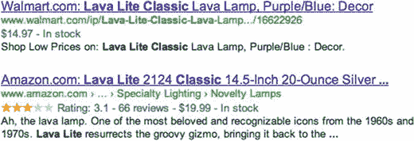
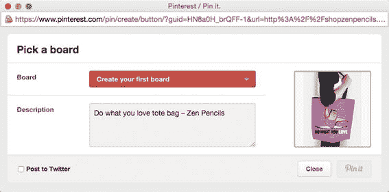
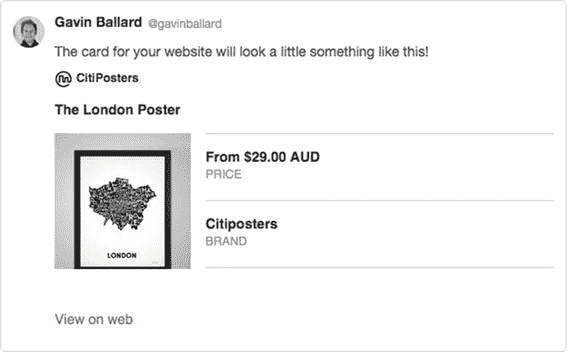
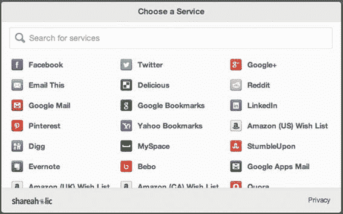
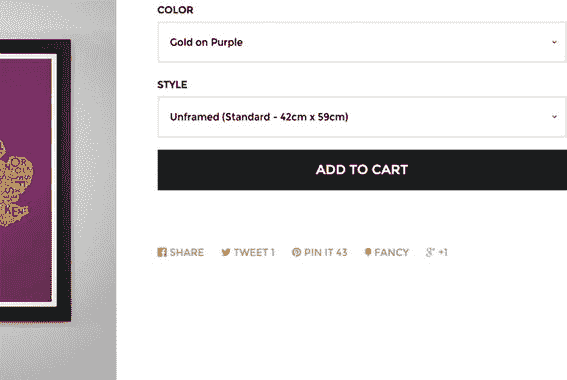

# SEO 与社交分享

你见过希望网站流量减少的客户吗？

反正我没见过。

流量是任何在线商店的命脉，虽然其质量可能参差不齐，但就数量而言，通常越大越好。当然，困难的部分在于如何首先获得这些流量。

每天，Shopify 店主都在尝试数百种不同的营销渠道和策略，试图为他们的网站带来更多的付费客户。即使只覆盖这些策略的一小部分，也远远超出了本书的范畴。

相反，本章重点介绍作为 Shopify 主题开发者可以做的具体事情，以确保你的主题为寻求营销和发展品牌的商家提供最佳起点。本章涵盖了一份“页面内”最佳实践清单，讨论了向搜索引擎提供 Shopify 商店结构化信息的方法，并最后探讨了如何通过社交渠道促进商店内容的分享。

## 搜索引擎优化（SEO）

为网站带来高质量流量是一项棘手、令人困惑且耗时的工作——庞大、复杂且往往令人反感的搜索引擎优化（SEO）和在线营销行业正是依赖于此。该行业中普遍存在的错误信息和欺诈性商业行为，常常训练客户将“SEO”视为一个神奇的“黑箱”，他们在这一头投入资金，就能从另一头获得流量。

好消息是，随着搜索引擎变得越来越智能，对可疑做法和“投机取巧”的敏感度降低，那些做“正确事情”（例如为访客提供更好的体验）的网站得到了更好的回报。在我看来，这使得主题开发者在 SEO 方面的工作变得简单直接——在构建网站时遵循最佳实践，确保搜索引擎能够读取和理解你的页面，最重要的是，确保网站对与之交互的人类用户来说是可访问和可用的。

### 站外优化与站内优化

广义上讲，各种各样的 SEO 策略、技巧和技术可分为两大类：

- **站内优化** 方法直接实现在网站的代码中，以帮助提高流量和点击率。站内方法的示例包括：确保页面具有合理的 HTML 结构，添加适当的元数据，以及确保网站快速加载。

- **站外优化** 方法涵盖了你可能用来吸引别人访问你网站的所有其他方式：电子邮件营销、点击付费广告、社交分享，或者是在固特异飞艇侧面做广告。

当我们扮演 Shopify 主题开发者的角色时，我们关注的是站内优化这一类别，因为这是我们唯一能直接控制的。站外方法对商家的成功同样重要，但可能需要（也确实有）一整本书来阐述。如果你有兴趣了解更多，我强烈推荐 `Moz.com`，它提供了大量免费和付费的 SEO 资源。他们的材料不仅写得很好、详细、及时，而且诚实，没有在 SEO 领域其他地方能感受到的那种令人反感的东西。

本章及本书其他地方涵盖的主要站内优化方法有：

- 语义化 HTML

- 关键词与内容

- 结构化数据

- 性能（见第 10 章）

- 布局与导航设计（见第 4 章）

### 语义化 HTML

这里的“语义”一词仅指“按照各种 HTML 标签的预期目的来使用它们”。这有助于搜索引擎（以及屏幕阅读器等辅助工具）理解页面上的信息，并向用户显示正确的信息。

- 标题标签（`<h1>`、`<h2>`、`<h3>` 等）应按重要性顺序使用，与页面最相关的文本内容应放在 `<h1>` 中，副标题放在 `<h2>` 中，依此类推。标题应少于 70 个字符，并且每个页面应独一无二。

- 使用 `<nav>`、`<main>` 和 `<article>` 等 HTML5 元素来帮助指示页面元素的作用。

- 确保每个页面都呈现一个唯一的元描述（位于网站 `<head>` 中的 `<meta name="description">` 标签内的内容）。

- 确保所有图片都定义了 `alt="图片描述"` 属性，以便基于图片的搜索引擎能够索引它们，并针对相关搜索词进行显示。

Shopify 不会自动验证你主题的 HTML，因此请确保在质量保证过程中，使用 HTML 验证工具（例如 [`https://validator.w3.org`](https://validator.w3.org)）对主题中的关键页面进行验证。

### 关键词与内容

在互联网早期，搜索引擎很容易被“操纵”。某些短语的相关性是由特定单词出现的频率决定的，这意味着你会看到很多页面进行“关键词堆砌”，如图 9-1 所示。


图 9-1  

这帮家伙到底在哪？

## 关键词分析

幸运的是，搜索引擎如今已更为智能，关键词堆砌的策略不再奏效。但这并不意味着关键词分析与研究不再重要。搜索引擎并非读心术士，因此它们需要明确指示，了解哪些词语和短语与每个页面最相关。理解顾客在寻找商家产品时使用的词汇和短语，对于确定主题应在页面不同元素上给予何种优先级至关重要。请思考以下问题：

-   顾客在搜索时更倾向于使用品牌或供应商名称（例如 “耐克气垫” 而非 “气泵”）吗？

-   顾客是否会使用标准化的部件或型号编号（例如 “MS2846728”）来搜索产品？

-   产品的变体（如尺寸或颜色）是产品的附属属性，还是决定性特征（例如 “苹果手表” 与 “金色苹果手表”）？

## 重复内容

电商商店常遇到的一个问题是“重复内容”。由于许多商店转售他人的产品，商家可能会被诱惑直接从供应商或竞争对手的网站复制粘贴产品描述。应强烈反对这种做法，因为搜索引擎会识别出来，并认为你的产品页面在搜索结果中的相关性低得多。

另一个 Shopify 网站特有的问题是，同一件产品可能出现在多个 URL 地址下（它出现在其“根 URL” `https://example.myshopify.com/products/product-name`，但也出现在 `https://example.myshopify.com/collections/widgets/product-name`、`https://example.myshopify.com/collections/under-50-dollars/product-name`，产品出现在每个集合中都会产生一个 URL）。

幸运的是，缓解此问题只需确保你的主题布局在页面顶部包含一个规范 URL 引用，如下所示：

`<link rel="canonical" href="{{ canonical_url }}" />`

## 结构化数据

如果你花时间让你的网站易于人类使用，并遵循 HTML5 规范中的标准约定，那么搜索引擎和社交网络等自动化系统也能很好地理解你的页面。

然而，你还可以采取一些措施，让机器更容易理解你网站上的信息，并提示这些信息如何最有效地呈现给用户。

方法之一是使用多种不同类型的结构化数据，这些数据以标准的、机器可读的格式提供信息。本章重点介绍与电商商店最相关的两种结构化数据类型：

-   `Schema.org` 标记，它允许谷歌及其他搜索引擎读取并展示价格、库存、评价和产品状况信息。它也用于一些商品库存源应用，例如 Google Shopping。

-   社交媒体标记，由 Facebook、Twitter 和 Pinterest 等社交网络使用，用于决定如何展示你网站上被分享的页面。

### Schema.org 词汇表

`Schema.org` 词汇表是一项开放的努力，旨在为描述网络上的“事物”提供一种标准化方式。它包括从 `TVSeason` 到 `RentalCarReservation` 等广泛对象及其属性的层次化定义。与 Shopify 商店最相关的是，它允许指定网站上每个待售 `Product` 的信息（以及销售这些产品的 `Organization` 信息和网站博客上可能出现的任何 `Article` 信息）。

所有主流搜索引擎和许多其他自动化系统都能读取 `Schema.org` 标记，正是它驱动了你在各种搜索结果中肯定见过的“丰富”信息，如图 9-2 所示。



图 9-2 谷歌搜索结果中的产品“丰富摘要”。亚马逊的结果不仅包含价格和库存信息，还包含汇总评价信息。

### 微数据

历史上，`Schema.org` 标记是通过一种称为微数据（Microdata）的系统提供的。这需要在网站的 HTML 元素中添加与相关数据对应的特殊属性和属性。要了解此过程的工作原理，请比较清单 9-1（无微数据标记）和清单 9-2（有微数据标记）。

```
{{ product.title | escape }}
{{ product.price | money }}
{{ product.description }}





清单 9-1
无微数据标记的产品 Liquid 模板示例
```

```
{{ product.title | escape }}

{{ product.price | money }}

{{ product.description }}





清单 9-2
添加微数据标记后的同一产品 Liquid 模板示例
```

虽然微数据得到广泛支持，但它给 Web 开发者带来了一些问题。在现有的 HTML 标记中到处添加这些额外属性，增加了源代码的视觉复杂性。Shopify 开发者可能要将单个产品实体的微数据标记分散到多个模板和 Liquid 代码片段中，这使得跟踪和维护变得困难。

除此之外，添加微数据还强制将页面 HTML 结构与相关的 `Schema.org` 数据模型紧密耦合，降低了灵活性，并常常迫使开发者为了迎合 `Schema.org` 的嵌套结构而在页面中添加无意义的 HTML 元素。

### 进入 JSON-LD

Microdata 的局限性现已通过 JSON-LD（用于链接数据的 JSON，[`http://json-ld.org`](http://json-ld.org)）得到解决。

JSON-LD 将实体的信息与其 HTML 表示解耦，并允许在 HTML 页面的单个位置指定该信息，这使其成为 Shopify 主题提供 `Schema.org` 结构化数据的推荐方式。它作为 `<script>` 标签内的简单 JSON 对象添加到页面中，如清单 9-3 所示。

```json
{
"@context": "http://json-ld.org/contexts/person.jsonld",
"@id": "http://dbpedia.org/resource/John_Lennon",
"name": "John Lennon",
"born": "1940-9-09",
"spouse": "http://dbpedia.org/resource/Cynthia_Lennon"
}
```

*清单 9-3 简单的 JSON-LD 示例*

对于 Shopify 主题，我通常的做法是创建一个单独的 `json-ld.liquid` 代码片段，其中包含条件逻辑，以便为当前页面显示适当的结构化数据，并将其包含在主题布局文件的 `<head>` 中。

由于篇幅限制，此处略去了 Liquid JSON-LD 示例，但我在大多数主题中使用的完整代码片段可在本书的可下载资源中找到。请查找 `code/snippets/json-ld.liquid` 文件。它不仅包含了 JSON-LD 产品标记的良好起点，还包含了商店实体本身以及任何博客文章的标记。

**提示：** 尽管 Shopify 使许多您希望使用 JSON-LD 标记的产品信息（如标题、价格和库存信息）在 Liquid 模板中可用，但某些属性（如商品状况或制造商 URL）在 Shopify 管理后台中没有对应的字段，因此无法以标准化方式获取。

如果您希望在 Shopify 商店中包含此信息，好的方法是使用产品和变体元字段来存储该信息，并使其可用于您的 JSON-LD Liquid 代码片段（有关元字段使用的详细信息，请参阅第 5 章）。资源中提供的 JSON-LD 示例代码片段包含了对此的演示。

关于 JSON-LD 最后要注意的一点是，某些类型的 `Schema.org` 信息尚不支持。其中一个例子是 `Breadcrumb` 实体，它通常出现在网站导航栏的 HTML 中。如果您希望结构化数据机器人理解这些导航提示，则必须使用 Microdata 方法，并将这些属性直接添加到相关的 HTML 元素中。这可以与页面上的 JSON-LD 结合使用，因此您只需标记不受支持的元素即可。

### 社交分享

除了 Microdata，还有其他几种标记模式可用于为特定网站（尤其是社交媒体平台）提供更多信息。这里涵盖的两个主要模式是开放图谱协议（由 Facebook 开发和使用，现在被 Pinterest 用于其 Rich Pins 功能）和 Twitter 卡片标记。

添加对这些标记模式的支持的好处是，这些及其他社交网络可以更多地了解商店的产品和页面，从而带来“更丰富”的分享体验。

#### 开放图谱标记

开放图谱标记只是一系列添加到主题 `<head>` 部分的 `<meta>` 标签。通过这些标签添加的信息被 Facebook 用于在页面被分享时生成图片和描述。

这些标签也被 Pinterest 的 Rich Pins 功能使用，该功能提供价格和库存信息，以便用户可以直接从 Pinterest 购买 Shopify 商店的产品。

##### 添加开放图谱标记

对于 Shopify 主题，我们主要关注将开放图谱信息添加到我们的产品页面和（如果我们有博客）文章页面。这些是我们希望确保 Facebook 和 Pinterest 能够从中提取大量信息的页面。

与 JSON-LD 标记一样，我通常使用 Liquid 代码片段来处理开放图谱标记，然后将该代码片段包含在布局文件的 `<head>` 部分，类似于清单 9-4 和 9-5。在清单 9-4 中，请注意 `<html>` 元素上的 `prefix` 属性，该属性用于指示我们正在使用开放图谱模式。为简洁起见，我在清单 9-5 的逻辑块中省略了文章模板的开放图谱标记。资源部分随课程捆绑的文件包含该部分的完整代码。

```html
<!-- ... 标签，样式表包含 ... -->

```

*清单 9-4 示例 `layout/theme.liquid`*

```html

  
    <meta property="og:image" content="{{ image.src | img_url: 'grande' }}" />
  
  
    <meta property="og:price:amount" content="{{ product.price | money_without_currency }}" />
    <meta property="og:price:currency" content="{{ shop.currency }}" />
  

  <!-- Article template Open Graph markup -->

```

*清单 9-5 示例 `snippets/open-graph.liquid` 代码*

##### 测试开放图谱标记

使用 Facebook 的开放图谱调试工具（[`https://developers.facebook.com/tools/debug`](https://developers.facebook.com/tools/debug)）可以轻松检查您的开放图谱标记是否正常工作。您只需输入要测试的页面的 URL，然后点击调试按钮，即可获取关于 Facebook 能够提取哪些信息的报告。

**注意：** 如果您正在开发的商店受密码保护，开放图谱调试工具将无法工作！这是因为 Facebook 需要能够请求页面以读取您的开放图谱标记。

当您在 Facebook 或 Pinterest 上启动分享过程时，检查一下显示效果也是值得的，如图 9-3 所示。



*图 9-3 从开放图谱标签中正确提取了图片和描述*

进行此最终测试将让您确切了解当您的产品或文章被分享时其他人会看到什么，包括图片的检索和裁剪方式，以及任何被截断的文本信息。

务必注意，Facebook 经常缓存开放图谱信息。因此，如果您看到错误或过时的数据，请使用调试工具获取相关 URL，然后点击“获取新的抓取信息”按钮强制刷新。

#### 推特卡片标记

推特卡片标记提供与开放图谱标记类似的功能，它允许 Twitter 在共享商店页面时显示“更丰富”的信息。添加标记本身的过程与开放图谱数据的处理几乎完全相同，只是多了几个测试和验证结果的步骤。

**注意：** 需要 Twitter 账户才能为您的 Shopify 主题添加 Twitter 卡片支持。

##### 添加推特卡片标记

首先，我们需要添加所需的标记，与开放图谱标记一样，它采用 `<head>` 内一系列 `<meta>` 标签的形式。同样，我倾向于使用 Liquid 代码片段来保持我的 Twitter 卡片标记独立，如清单 9-6 和 9-7 所示。同样，为简洁起见，清单 9-7 中处理文章模板的代码已被省略，可在本书的资源部分查看完整内容。

```html
<!-- ... Tags, stylesheet includes ... -->


```

*清单 9-6 示例 `layout/theme.liquid`，包含了 Twitter 卡片标记代码片段*

```markdown
# 验证 Twitter 卡片标记

与 `Open Graph` 标记不同，你需要“验证”新的标记后，`Twitter` 才会使用它。

为此，请直接访问 Twitter 的卡片验证器 [`https://cards-dev.twitter.com/validator`](https://cards-dev.twitter.com/validator)（你需要登录 `Twitter`）。在 `Card Catalog` 中选择 `Product`，接着选择 `Validate & Apply` 选项卡，并输入你网站上任意商品页面的 `URL`。

点击 `Go`，你应能看到确认信息，表明你的卡片标记已通过验证，同时还会显示预览效果，展示当有人从你的主题分享商品时的呈现样式，如图 9-4 所示。



图 9-4 Twitter 卡片验证器会根据提取的数据显示预览

## 重视分享

一旦你花费精力设置好这些标记，你就应充分利用它，鼓励访问你网站的访客分享你的商品和内容页面。

### 决定支持哪些分享选项

首先，你需要认识到，“多多益善”这句口号并不适用于分享小部件。相反，网站若专注于少数几个关键社交网络，而非在商品页面上堆砌大量图标，通常能获得更好的社交流量（见图 9-5）。



图 9-5 像这样散弹枪式的分享方式很少有效，用户参与度也不高

用户很容易被过多的选择压垮，因此简化选择（比如“我该分享到 `Facebook` 还是 `Twitter`？”）能提高他们采取其中一项操作的可能性，而不是彻底放弃。将重点放在两三个网络上，也能让店主在运营店铺时更容易管理这些网络并与用户互动，而不会因为精力分散而力不从心。

如果你是在为特定客户工作，与他们进行沟通将有助于你们共同确定哪些网络对其最有益。¹ 根据具体情况，更多小众或针对特定地理位置的平台也可能很重要。

如果你是在构建一个供多家店铺使用的主题，那么你应该添加对所有主流社交网络的支持，并允许店主在主题设置页面中开启或关闭它们（请参考第 8 章关于主题设置定制的内容）。

无论你选择专注于哪些网络，我强烈建议你为用户提供一种通过邮件分享页面的简便方式。虽然并非所有人都习惯你使用的社交网络，但电子邮件无所不在，并且是与特定个人分享商品最常用的方式。添加邮件分享支持非常简单，只需添加一个 `mailto:` 链接，设置空白收件人、简短的预设主题和正文，让用户通过自己的邮件客户端发送消息即可。

### 整合分享功能

所有主流社交网络都允许你非常轻松地整合分享按钮，通常只需一小段 JavaScript 代码片段。然而，使用这些默认按钮存在两个主要问题：

-   它们很可能与你主题的设计美学不匹配

-   它们往往会带来性能开销，可能拖慢你的网站

第一个问题在于，如果按钮与页面其他部分不匹配，最终可能会分散用户对页面主要内容的注意力。第二个问题是可用性问题，尤其是在移动设备上，添加四五个脚本（这些脚本又通常会加载额外的脚本）会严重影响性能。

幸运的是，这两个问题的解决方案都非常简单！所有社交网络都允许用户通过简单的 `<a href="">` 链接触发分享操作，你当然可以随意设计它的样式（图 9-6 展示了在 Shopify 的 `Pop` 主题中如何实现这一点）。



图 9-6 `Pop` 主题中的分享触发器被重新设计为与美学风格匹配的简单链接

为不同社交网络构建 `href` 属性所需的 `URL` 可能会有点棘手。以下是一个例子，展示我如何在 `Liquid` 中为 `Twitter` 分享链接实现这一点：

```
Tweet this!
```

Twitter 的用例相当简单，因为它只要求我们传递文本和 `URL` 参数。像 `LinkedIn` 这样的网络则需要更多参数。

本书附带资源中的 `code/snippets/social-share.liquid` 示例包含一个处理多个社交网络分享链接的模式，并且能够根据所使用的页面类型（商品、文章或内容页面）进行适配，欢迎你在自己的主题中复用。

## 练习：SEO 与社交分享

按照本章各节的内容，逐一检查你的练习主题，确保其符合 `SEO` 最佳实践，并已为社交分享做好配置。

你应检查的一些事项包括：

-   每个页面都包含一个 `<h1>` 标题和一个 `meta` 描述。

-   你的 `theme.liquid` 使用 `Liquid` 的 `{{ canonical_url }}` 标签为每个页面定义了规范 `URL`。

-   所有图片都定义了合适的 `alt` 属性。

-   在首页、商品页面和文章页面上，通过 `Microdata` 或 `JSON-LD` 提供了 `Schema.org` 标记。

-   商品和文章页面定义了 `Open Graph` 和 `Twitter Card` 标记。

-   商品可通过页面内链接轻松分享。

你可以随意使用可下载资源中提供的 `JSON-LD`、`Open Graph`、`Twitter Card` 和 `Social Sharing` 代码片段来实现这些功能。但请务必花几分钟浏览一下代码，以确保你清楚每个片段的作用。

## 总结

本章讨论了页面内 `SEO` 与页面外 `SEO` 的区别。随后，重点介绍了在主题中改进页面内 `SEO` 的技术，因为这些元素通常是我们作为设计师和开发者最能控制的。

本章还探讨了如何帮助客户从主题中分享内容，并研究了你的主题支持哪些分享机制才有意义。

## 脚注

[1] Kevan Lee 发表的一篇名为“如何为你的企业选择合适的社交网络”的精彩博文为此提供了极佳的指导：[`https://blog.bufferapp.com/how-to-choose-a-social-network`](https://blog.bufferapp.com/how-to-choose-a-social-network)。
```