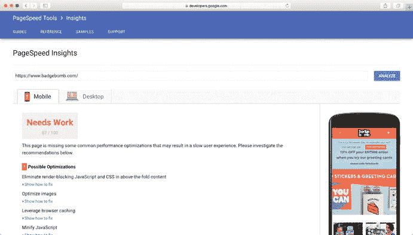
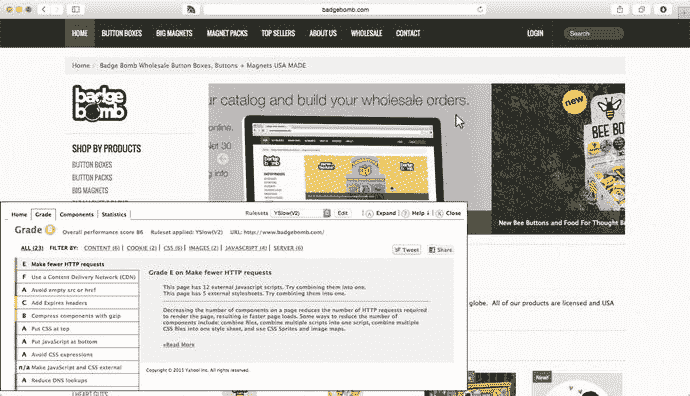
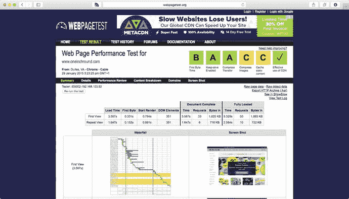
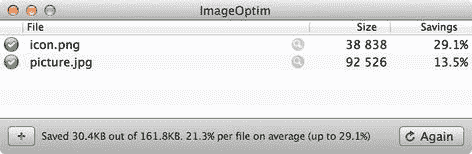
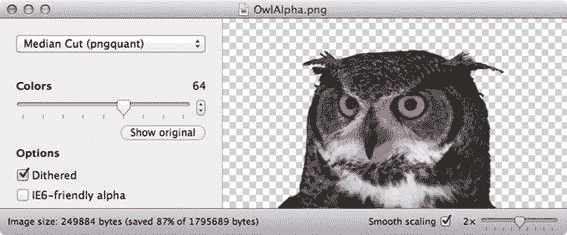
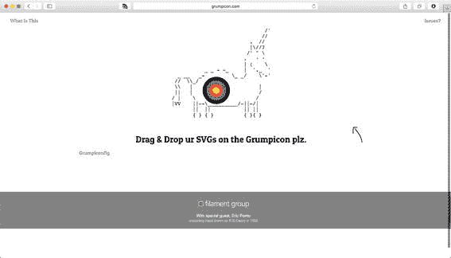
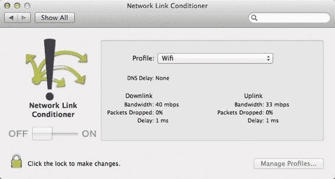

# 10. 性能

本章解释了主题性能——为什么它很重要，如何衡量它，以及如何改进它。讨论了我们可以用来减少初始加载时间和提高 `Shopify` 商店界面感知响应速度的技术。

虽然从主题设计的第一天就开始考虑这些想法会大有裨益，但这里讨论的技术对于那些需要精简优化的现有主题同样有用。

## 为什么性能很重要

早在遥远的网页古早时代（2009 年），必应的 Eric Schurman 和谷歌的 Jake Brutlag 进行了一系列实验，观察用户对服务器响应时间受控增加的反应。¹

结果令人信服：以谷歌为例，增加不到半秒的延迟导致用户参与度下降 0.6%。必应则更进一步，让测试用户经历了整整两秒的延迟，结果参与度（和每用户收入）下降了超过 4%。他们的结论是，“速度很重要”并非空谈，而且“不到半秒的延迟就会影响业务指标”。

这种性能影响并不仅仅局限于实验室实验：

*   Mozilla 将页面加载时间缩短了 2.2 秒，下载量增加了 15.4%。

*   巴拉克·奥巴马的竞选团队将网站速度提升了 60%，捐款额增加了 14%。

在当今的电子商务背景下，我认为网站性能比以往任何时候都更加重要。随着越来越多的企业转向网络，消费者在网上花钱的地方有了更多选择，他们对欠佳购物体验的耐心也越来越低。

> 消费者期待更快的网络。企业因更快的网络而成功。— Steve Souders，“我们现在有多快？”²

人们很容易通过指出设备性能越来越强大、互联网连接提供的带宽越来越高来忽视这类性能问题。我认为这是一种危险的想法，原因如下：

*   自 2014 年以来，Shopify 商店的大部分流量来自移动设备，这些设备的处理能力不那么普遍，且 3G（或更慢）的连接也不稳定。

*   在发展中市场，电子商务增长迅速，这些市场对在线销售的需求很高，但互联网连接常常滞后。

*   即使在发达国家，在网络连接不佳的情况下进行网购也很常见（我现在就在一家瑞典咖啡馆里写这句话，这里的 WiFi 相当差劲）。

*   随着物联网的兴起，客户可能用来加载你网站的、能够联网但功耗低的设备（比如电视或冰箱）数量正在增加。

此外，最初我们若将自身对 Shopify 主题性能的责任推卸掉，很容易让我们的工作像滚雪球一样，变成臃肿的怪物网站。

## 为什么性能会被忽视

如果你为客户做转化率优化，并且提升了 1%，那将是一个巨大的成功。你会打开香槟庆祝，并讨论你将为他们赚到的数万美元该如何使用（希望能给你一笔奖金，但那只是美好愿望）。

那么，考虑到一个性能不佳的网站对转化的负面影响可能远超 1%，你会以为性能优化是主题开发者的首要任务之一，对吧？

并非如此。

虽然一些在 Shopify 上运行的网站确实重视性能，但绝大多数网站都严重未经优化——它们拥有巨大的图片、大量的 HTTP 请求以及结构不佳的页面。

当我开始为自己的 Shopify 主题框架工作时，我对 Shopify 主题商店中的现有主题进行了一次“性能汇总”。结果相当糟糕——商店中的平均主题在页面加载时加载了 2MB 的资源，并产生了 58 个 HTTP 请求。

我对此有自己的一套理论：客户看不到性能，所以他们不会将其作为优先事项来付费。

与所有那些漂亮的图片或时髦的 JavaScript 功能不同，客户无法“看到”他们网站的速度。当一个页面需要十秒钟才能加载时，他们可能会感到有点不对劲，但即便如此，他们也是以店主的心态（而非潜在客户的心态）来审视自己的网站。他们很少会想到，如果加载的不是他们自己的网站，他们五秒钟前就会关闭标签页，然后转向谷歌搜索结果中的下一个链接。

设计师和开发者也不能免于此问题。当我们坐在高速桌面连接上，在本地开发且浏览器缓存中已填充内容时，许多性能问题会被忽略。就像客户一样，当页面加载时，我们的心思也不在性能上——我们在寻找对齐问题，检查颜色是否匹配，以及新的灯箱效果是否按预期工作。

当这些因素结合在一起时，作为主题创建者，很容易让性能问题变成低优先级事项。

在构建用于广泛销售的主题时（例如，在 Shopify 主题商店中），情况尤其如此。主题商店列表中没有“按性能排序”的选项——能卖出你主题的是大型光鲜图片和流畅的 CSS 动画。

## 性能分析与指标

那么，假设你想成为一位开明且重视性能的主题创建者，你的第一步是什么？

和许多事情一样，提高性能的第一步是了解你当前的状况（“你无法管理你无法衡量的东西”，诸如此类）。因此，接下来的几个部分将介绍几种有助于此的不同工具。

### 性能测量工具

我将在这里介绍三种工具，但你无需花太多时间纠结哪个“最好”。大多数性能工具都会涵盖一组相似的指标——关键是在优化工作之前和之后都使用某个工具，这样你就能评估你的更改是否产生了效果。

#### PageSpeed 见解（PageSpeed Insights）

谷歌的 `PageSpeed` 工具可能是最常用的性能分析工具。通过在线工具运行 `PageSpeed` 测试，将显示你的主题存在的性能问题明细，以及需要优先处理的事项列表（见图 10-1）。



*图 10-1 — 在线 `PageSpeed Insights` 工具。看来这个主题还有改进空间！*

#### 雅虎 YSlow

如果你在理念上反对谷歌，或者只是想尝试点不同的东西，`YSlow` 是一个适用于 Safari 和 Firefox 的浏览器插件，提供与 `PageSpeed` 类似的分析功能（见图 10-2）。



*图 10-2 — Safari 中的 `YSlow` 报告*

#### WebPageTest.org

这是我最喜欢的性能测试工具，没有之一。与之前的方案不同，它并非浏览器插件——你只需访问 [`http://www.webpagetest.org`](http://www.webpagetest.org) 并输入待测页面的 URL 即可。

如图 10-3 所示，这是一款比 `PageSpeed` 或 `YSlow` 强大得多的工具，允许你在运行测试时指定大量变量（浏览器、地理位置、连接类型与速度、用户代理字符串……不胜枚举）。它还支持将测试过程录制成视频、模拟页面加载过程中特定域名失效的情况，并为你提供详尽的页面加载“瀑布流”时间线。



图 10-3

`WebPageTest.org` 或许不是外观最漂亮的工具，但它提供了大量实用细节。

另一个出色的附加功能是网站的“成本分析”，它能根据移动用户所在国家的平均移动数据资费，估算出用户加载你的网站需要支付多少费用。这对于那些身处数据流量和 Wi-Fi 资源丰富国家的人来说，是一个很好的提醒。

`WebPageTest.org` 是本文提及的唯一一个能分析网站 `SpeedIndex`³ 的工具，该指标用于衡量页面可见部分呈现给用户的速度（通常这比整体页面加载时间重要得多）。

#### 该用哪个工具？

除非你非常渴望深入性能优化的细枝末节，否则我建议暂时坚持使用 `PageSpeed Insights` 和 `YSlow` 提供的更简单报告和分析。它们能帮你找出主题中 90% 的性能问题，并指出哪些优化能带来最大收益。

一旦你处理完了这些“低垂的果实”，再转向 `WebPageTest` 的详细报告，它会帮你识别出那些“百分之一”的细节问题。对于销量庞大的网站，投入时间优化这些问题往往物有所值。

如果你想将性能测试整合到开发工作流中，可以看看 `grunt-perfbudget` 这个 Grunt 插件。⁴ 它由 Tim Kadlec 编写，他在他的博客上（[`https://timkadlec.com`](https://timkadlec.com)）提供了大量关于为网站设定“性能预算”的资料。

### 主题性能指标

能够获取所有这些性能信息当然很好，但问题是：我们该如何利用它们？首先，最好清楚哪些事情需要担心，哪些可以安全地忽略。

对于 Shopify 主题而言，任何需要服务器或 CDN 配置的性能优化都不在你的掌控范围内。幸运的是，Shopify 在这方面做得相当不错，因此我们通常不必为此操心，而可以专注于我们力所能及的事情。

在接下来的章节里，我会列出在尝试优化 Shopify 主题时关注的关键指标，以及我用来改进这些指标的技术列表。对于经验丰富的 Web 开发者来说，其中许多技术都很熟悉（毕竟，Shopify 主题归根结底只是 HTML、CSS 和 JavaScript），但有些技术在概念或实现上是 Shopify 特有的。

本章的最后部分将详细阐述这些技术，并逐步讲解如何实施它们。

#### 关键指标 1：页面重量

页面重量指的是将你的网站显示在浏览器中需要传输的字节数。你需要关注两个数字：页面首次加载时（浏览器缓存任何内容之前）传输的字节数，以及缓存后传输的字节数。

即使你的网站图片很多，你也应该能够用几百 KB 甚至更少的字节，向顾客呈现一个可用的页面。利用本课程中描述的一些技术，你可以做到这一点，然后根据需要稍后加载更大的资源（例如高分辨率图片）。

侧重于减少页面权重的优化技术包括：

*   图片优化
*   资源压缩
*   懒加载
*   页面精简

### 关键指标 2：HTTP 请求次数

浏览器为获取一个资源而发起的每一次 HTTP 请求，都需要浏览器与服务器之间进行一次往返，并伴随由此产生的所有开销。

专注于提高页面请求效率的方法有：

*   资源合并
*   无 Cookie 的 CDN 域名（由 Shopify 处理）
*   CDN 主机名分发（不由 Shopify 处理，但如果我们仍想利用 Shopify 全面的 CDN，我们能做的也有限）
*   智能资源加载
*   页面精简

### 关键指标 3：加载时间

“加载时间”这个术语有点不精确，因为在 Web 性能的上下文中，“加载”可以指代几种不同的情况。它可能意味着：

*   浏览器加载初始 HTML 并开始渲染页面所花费的时间（“渲染时间”）
*   浏览器在视觉上向用户呈现页面所花费的时间（“视觉完成时间”）
*   整个页面（包括所有资源）加载、渲染和执行所花费的时间（“加载时间”）

从用户体验的角度来看，“视觉完成时间”是最重要的解释，因为它能让网站感觉“更快”。不幸的是，它也是最难以通过自动化工具衡量的（尽管 `SpeedIndex`——这个由 Google 开发并在 `WebPageTest.org` 的报告中得到详尽分析的指标——在这方面做得相当不错）。

好消息是，针对所有类型页面加载的优化技术存在一些重叠，因此，你为优化初始渲染时间所做的努力也将有助于改善其他指标。在某些情况下，你可能希望优先考虑某一种加载时间——这最常见于那些试图尽快让页面达到初始“视觉完成”阶段，然后再完成额外资源加载的技术中。

一个例子是使用渐进式 JPEG。它会先渲染一个低质量的“首遍”图像，随后随着页面继续加载，该图像会被更高质量的版本替换。其效果是，用户感觉页面加载速度快得多，即使传输给用户的字节总数增加了，因为我们需要发送多个不同质量级别的图像版本的数据。

## 性能优化技术

在确定了我们认为最重要的指标之后，现在我们来谈谈本章的核心内容：作为主题开发者，你实际上可以做些什么来改善这些数字。

### 技巧一：简化页面

有句老话说得好，“少即是多”。在网页性能方面，这句话同样适用。你的主题中“少”的东西越多——越少的图片、请求和页面元素——你的页面加载和显示的速度就越快。

听起来合情合理且直截了当，对吧？我同意，但这一点似乎从未被纳入互联网上那些“加速网站并改善你生活的五种方法”之类的列表中。

它缺席的原因，或许在于它并不总是一个容易的、“立竿见影”的办法。与我们稍后要探讨的一些技巧不同，花时间审视自己的心血之作并从中剔除冗余，既耗时又需要情感上的勇气。但是，就像写出好文章一样，制作高性能的 Shopify 主题需要无情的编辑。

这个技巧的妙处在于，除了性能提升之外，你还能获得一些附带好处。就像编辑文字能让读者更易理解一样，编辑你的 Shopify 主题也能让你的客户看得更清晰、用得更顺手，同时还能因减轻维护负担而改善你作为开发者的生活。这真是三赢！

如果你想找到一些关于如何“精简”你的 Shopify 主题的灵感，这里有一些思路：

*   重构 CSS：在一个网站的开发过程中，很容易在 CSS 文件中积累技术债务。重构并简化你的 CSS 不仅能减少样式表的大小，还能让网站更易于维护，并为访客提供一致的用户体验。
*   干掉轮播图：轮播图不仅用户体验糟糕，而且通常会加载大量高分辨率图片。为了你的用户和网站性能着想，请用一个（经过优化的）单张图片来替换轮播图。
*   用 CSS 替换背景图片：如今的 CSS 功能已经非常强大。如果你还在使用平铺图片作为背景，不妨考虑用 CSS 背景来替代。你会惊讶于 CSS 能做到的事情。

### 技巧二：图片优化

这几乎是每一篇关于页面加载优化的文章都会首先提到的内容。这并非巧合——图片占用了大多数网站体量中的最大比例，而你只需付出很少的努力就能获得巨大的收益。

#### 图片优化基础

这里有一个在不到 50 秒内精简主题的超级简单方法：

1.  从 [`imageoptim.com`](https://imageoptim.com) 下载 `ImageOptim` 并打开它。
2.  将你主题的 `assets` 文件夹拖拽到该应用程序中。
3.  等待看看你节省了多少空间（见图 10-4）。

    

    **图 10-4** `ImageOptim` 正在工作

就这么简单！

当我撰写本书时，为了截图，我把自己正在开发的一个主题的 `assets` 文件夹通过 `ImageOptim` 跑了一遍。我之前已经用 `ImageOptim` 处理过这个主题了，但仅仅五秒钟的工作，我仍然节省了 200KB 的页面体积。还不错！

另一个值得一试的工具是 `JPEGMini` ([`www.jpegmini.com`](http://www.jpegmini.com))。与 `ImageOptim` 不同，它只处理 JPEG 图片（可能你也猜到了），但它应用了一些更高级的算法，可以进一步压缩这些文件。对于那些不是 Mac 用户的读者（抱歉，我很少走出自己的“舒适圈”），`Kraken` ([`kraken.io`](https://kraken.io)) 是一个很棒的替代方案。

#### 自动化图片优化

一旦你亲眼见证了图片优化的好处，你很可能就希望一直使用它。这时，像第 2 章中描述的那样使用基于 Grunt 的工作流就派上用场了。

使用像 `grunt-contrib-imagemin`（它使用了与 `ImageOptim` 程序相同的库构建）这样的 Grunt 插件，我们可以让 Grunt 在我们部署主题时自动优化所有图片。你可以回顾第 2 章中的示例，了解如何实现这一点。

#### 有损图片优化——突破极限

上述这些优化方法都是“无损”的——也就是说，它们在不降低图像质量的前提下减小文件大小。这听起来很合理，但通常我们可以通过牺牲一些微小的画质，来实现相当惊人的文件大小缩减——而这些画质损失中的一部分，最终用户根本看不出来。

我们先以 JPEG 图片为例。

如果你熟悉 Photoshop 的“存储为 Web 所用格式”功能，你就会知道可以选择最终图片的质量。默认情况下，这个值为 60——但事实上，你通常可以将这个质量设置降低到低至 25，而最终效果也不至于变得“一团糟”。如果你处理的是用于高分辨率显示器的 `@2x` 或 `@3x` 图片，情况尤其如此。

如果你不相信我，可以看看 [`retinafy.me/examples/jpeg-scaling.html`](https://retinafy.me/examples/jpeg-scaling.html) 上来自 Thomas Fuchs 的精彩著作 *Retinafy Me* 中的缩放示例，该书以大量有用的细节详细介绍了创建高分辨率图像的过程。

我们也可以对 PNG 图片进行有损优化，这要归功于一个名为 `ImageAlpha` 的工具（由与 `ImageOptim` 同一个出色的团队开发，可在 [`pngmini.com`](https://pngmini.com) 获取）。

与 `ImageOptim` 类似，`ImageAlpha` 允许你将特定 PNG 文件拖入此应用程序，选择一个质量级别（对于 PNG 来说，由可用的颜色数量决定），预览结果，并保存一个优化后的版本，如图 10-5 所示。



**图 10-5** 使用 `ImageAlpha` 很有趣

结果令人印象深刻，就像你在图 10-6 中的优化前后对比图里看到的那样。


**图 10-6** 优化前（上，224KB）与优化后（下，34KB）的对比（图片由 [`pngmini.com`](http://pngmini.com) 提供）

与无损优化不同，我不建议将有损优化自动化，因为你往往需要亲自检查结果，以确保优化没有做得太过分，并确认一切看起来“没问题”。

### 技巧 3：资源合并

对于页面引用的每个 JavaScript、样式表或图片，客户端的浏览器都需要发起一个 HTTP 请求来获取并解析该资源。资源合并是将多个资源文件合并成一个文件的过程，旨在减少浏览器必须发起的请求数量，从而降低这种开销，实现更快的加载速度。

举个例子，如果你的 `theme.liquid` 文件顶部包含类似代码清单 10-1 的内容，那么浏览器将在继续渲染页面之前，需要等待大量请求。更好的策略是选择性地合并这些文件以减少其数量，最终得到类似代码清单 10-2 的效果。

```
{{ 'bootstrap.css' | asset_url | stylesheet_tag }}
{{ 'index.css' | asset_url | stylesheet_tag }}
{{ 'products.css' | asset_url | stylesheet_tag }}
{{ 'articles.css' | asset_url | stylesheet_tag }}

{{ 'jquery.js' | shopify_asset_url | script_tag }}
{{ 'bootstrap-core.js' | shopify_asset_url | script_tag }}
{{ 'bootstrap-tooltips.js' | shopify_asset_url | script_tag }}
{{ 'bootstrap-modals.js' | shopify_asset_url | script_tag }}
{{ 'products.js' | shopify_asset_url | script_tag }}
{{ 'cart.js' | shopify_asset_url | script_tag }}
...
```

代码清单 10-1
包含来自多种来源资源的示例 `theme.liquid` 布局文件

```
{{ 'main.css' | asset_url | stylesheet_tag }}

{{ 'jquery.js' | shopify_asset_url | script_tag }}
{{ 'bootstrap.js' | shopify_asset_url | script_tag }}
{{ 'main.js' | shopify_asset_url | script_tag }}
...
```

代码清单 10-2
利用合并资源优化后的代码清单 10-1 版本

对于样式表和 JavaScript 文件，合并操作非常简单——只需将每个文件的文本内容依次复制并粘贴即可。只要你按照这些文件在 HTML 中最初出现的顺序进行合并，就不会察觉到任何功能上的差异，但浏览器必须发起的请求数量将显著减少。

**注意**：切勿像本示例那样，将 JavaScript 的 `<script>` 标签放在 `<head>` 元素中。浏览器在读取它们时会阻塞页面渲染。请将所有标签放在页面底部，紧挨在闭合的 `</body>` 标签之前。

与其他技巧一样，过度使用此技巧也可能适得其反，将一切合并到一个文件中可能会产生反效果。在接下来的几个小节中，我列出了在主题中可能合理选择保持分离的一些内容。

##### 大型 JavaScript 库

将 jQuery 这样的大型库与特定于网站的 JavaScript 打包在一起被视为不良实践，因为对网站脚本的任何修改都会迫使浏览器重新下载所有内容。

实际上，对于 jQuery 这类大型且通用的 JavaScript 库，更好的策略是使用公共的外部 CDN（谷歌的托管库是一个不错的起点）。这不仅意味着你无需担心在主题中管理该资源，而且网站访问者有很大可能已经在浏览器缓存中拥有该库。

##### 使用主题设置的资源

正如你在第 8 章所见，为资源文件附加后缀（例如 `main.js.liquid`）会促使 Shopify 使用 Liquid 对这些资源进行预处理，从而允许我们在这些文件中使用主题设置和资源过滤器。

如果你的主题利用了这一功能，我建议尽可能将使用主题设置的代码部分分离到它们自己的资源文件中。否则，你将遇到与大型 JavaScript 库类似的问题：每当主题设置发生变化时，都会迫使用户进行大量下载。

如果你仅对少数细微调整使用了主题设置，你甚至可以只保留一个静态资源文件，并将动态内容添加到主题的 `<head>` 中，如代码清单 10-3 所示。

```
{{ 'main.css' | asset_url | stylesheet_tag }}

body {
bgcolor: {{ settings.bgcolor | default: '#ffffff' }};
}

{{ 'https://ajax.googleapis.com/ajax/libs/jquery/2.1.3/jquery.min.js' | script_tag }}
```

代码清单 10-3
在 `<style>` 块中使用主题设置的简单示例

##### 仅用于特定页面的资源

当你通过合并来打包资源时，这些文件中的样式表和脚本将在你网站的所有页面上可用。这通常是一个合理的假设，即使某个脚本在单个页面上未被使用，拥有单一资源文件的好处通常也超过在某些页面上下载稍大文件的缺点。然而，如果你有仅用于特定、不常用页面的大型资源，那么将这些资源保持分离并仅在需要时加载，可能会更有效率。

一个很好的例子是 Shopify 商店为登录用户提供的订单历史查看和账户管理页面。由于网站的大部分访问并非来自登录用户，也非用于账户管理，因此避免将账户管理功能的脚本和样式与其他所有内容打包在一起是合理的。

##### 自动合并

合并的一个明显缺点是它使得资源的管理和开发变得更加困难，因为你现在所有的脚本和样式表都混在一个巨大的文件中。

建立一种自动合并文件的方式意味着你可以在不牺牲开发者便利性的情况下获得合并的好处。你可能已经猜到了，我建议使用一个工作流工具来自动化这个过程——更多信息请参见第 2 章。

##### 图片合并

本节主要关注脚本和样式表的合并，但合并同样适用于图片！事实上，你可能以前在 CSS 精灵图中见过这种做法，网站使用单个 PNG 图片来容纳它们所有的图标，如图 10-7 所示。


图 10-7：谷歌的 CSS 精灵图

这背后的逻辑与样式表和脚本相同：减少需要发起的请求数量可以提高网站性能。

自行进行图片合并的最简单方法是使用非常出色的 Grumpicon 网络应用 (`http://www.grumpicon.com`)。它是一个拖放式解决方案，额外的好处是还涉及一只独角兽（见图 10-8）。



图 10-8：任何带有 ASCII 独角兽的工具一定是个好工具

与所有优秀的资源管理任务一样，Grumpicon 背后的魔法也可以作为 Grunt 插件（`grunticon`）获得，用于添加到你的自动化开发工作流中。

##### 未来发展

如果你一直关注 Web 技术的最新发展，可能听说过 SPDY 或 HTTP2 协议。在不深入技术细节的情况下（主要是因为我自己也不完全清楚所有细节），这些是旨在大幅提升网络速度的下一代技术。

这些协议的特性之一是“请求多路复用”，其目标是在更底层实现与资源合并等效的功能。这意味着像我们这样的开发者可以只使用单个资源（更简单），而无需强迫浏览器发起比麦当娜的演出合同要求还多的请求。

然而，这些协议在服务器和客户端上的广泛部署和支持仍需时日，所以目前你还得坚持使用本文所述的技术。抱歉！

#### 技巧 4：资源压缩

虽然样式表和脚本通常不像图片那么庞大，但它们仍然会对页面的整体体积产生显著影响。

在遵循技巧 #1，尽可能简化并移除多余样式和内容之后，你可以使用资源压缩来进一步减小样式表和脚本的文件大小。

压缩会移除资源中那些让人类易于读写，但对浏览器并非必需的多余信息（例如换行符和空白）。就 JavaScript 而言，压缩还可以通过重写 `var aLongVariableNameUsefulForHumans` 为 `var a` 等方式，积极地优化你的代码大小。

##### 如何压缩资源

如果你想尝试压缩，或者只是想要进行一次性的压缩，有很多在线工具可以接收 CSS 或 JavaScript 文件并输出压缩后的版本（只需搜索“CSS/JavaScript minifier”）。然而，压缩最有用之处在于我们能将其嵌入工作流一次，然后不再操心。在这里，Grunt 插件 `grunt-contrib-cssmin` 和 `grunt-contrib-uglify` 再次登场，分别用于 CSS 和 JavaScript 的压缩。

如果你有不同的工作流流程，或想通过命令行进行压缩，可以试试功能全面的 `YUICompressor`，它能处理 CSS 和 JavaScript。`uglify` 工具也作为独立的 JavaScript 压缩器提供，可在命令行中运行。

#### 技巧 5：其他零碎事项

正确实施所有这些技巧，在大多数情况下，都能让你在提升主题性能方面取得很大进展。如果你和我一样，对性能有些吹毛求疵，或者你正处在一个需要压榨出每一丝速度来切实影响商店利润的情况，那么还有一些事情可以做。

##### 实现设备响应式设计

在“响应式设计”成为我们通过来回拖拽浏览器宽度来做的那件事之前，它有着更广泛的含义——网站能够响应一系列上下文环境以提供最佳体验。

这个想法在性能领域派上用场的一个好例子是“视网膜”或“高分辨率”图片。过去几年处理高分辨率图片的常见技术是，直接向所有客户端提供一张缩小到一半大小的高分辨率图片。然后由浏览器负责适当调整大小和显示。

这种方法的问题在于，当服务于非高分辨率屏幕时非常浪费——它们下载了一张四倍大小的图片却毫无益处。“设备响应式设计”正是考虑了这种情况，通过使用媒体查询或 JavaScript 库，仅在高分辨率设备上加载高分辨率图片。

### 使用延迟加载

这项技术对 Shopify 商店特别有效，因为它们通常包含大量图片。延迟加载图片涉及使用 JavaScript 库，仅在图片应在用户视口内可见时才进行加载，从而改善初始页面加载时间。

当你的主题涉及很长的页面，而许多访客实际上不需要加载大部分内容时，这项技术尤其方便。Matt Mlinac 的延迟加载 jQuery 插件（[`http://www.appelsiini.net/projects/lazyload`](http://www.appelsiini.net/projects/lazyload)）是一个非常可靠的实现。

### 为垫片/回退方案使用条件加载

如果你正在为旧版浏览器使用“垫片”或回退方案（例如，`RespondJS` 回退方案允许 Internet Explorer 8 等旧版浏览器使用媒体查询），请确保你不会在新版浏览器上浪费地下载它们。

你可以通过在加载脚本时使用条件注释来实现这一点，如清单 10-4 所示，或者根据使用 `Modernizr` 等库的测试结果，使用基于 JavaScript 的条件加载。

```
...
清单 10-4
使用条件注释为 Internet Explorer 8 及更低版本加载 Respond.js 回退方案
```

### 掌握“async”属性

如前所述，将 `<script>` 标签放在 HTML 的 `<head>` 部分会严重影响页面加载时间，因为浏览器在等待 JavaScript 加载时会阻塞页面渲染。常识告诉我们，页面中包含 `script` 标签的最佳位置是在页面最底部，`</body>` 标签之前。

这是一个很好的默认方法，但随着 HTML5 的出现，我们现在可以为 script 元素使用 `async` 属性，它告诉浏览器在后台加载脚本的同时，继续解析和渲染页面。

然而，使用 `async` 有一些重要的注意事项——即无法保证执行时间或顺序。如果你有兴趣深入探讨 `async` 的细节，我读过最好的文章是 Jake Archibald 在 [`http://www.html5rocks.com/en/tutorials/speed/script-loading/`](http://www.html5rocks.com/en/tutorials/speed/script-loading/) 上的讲解。

### 检查资源 404 和 301 错误

通过浏览器的开发者工具查看 Network 面板或类似面板，检查是否有资源返回 404 或 301 错误。

缺少的资源（404 错误）浪费了一次请求，你应该移除对该资源的引用或用有效的资源替换——如果网站本身有一个很大或复杂的自定义 404 页面，每次缺少资源时都需要下载它，这个问题会变得更加严重。

资源请求被 301 响应码重定向实际上相当常见（例如，对某个资源 `http://` 版本的请求可能会被自动重定向到 `https://` 版本）。如果你看到这种情况，直接链接到最终的 URL 以避免浪费最初的请求。

## 评估性能改进

每次进行性能优化后，最好再次测量你的性能指标，看看改变了什么。这不仅能给你带来成就感并激励你，你还会开始清楚地知道哪些地方容易优化，并开始将它们融入你正常的开发工作流程中。

现在，尽管所有这些测量都很有用，但没有什么比实际使用你的网站来检查客户是否获得了良好体验更有效的了！下次你在火车上，或者在信号不好的地方用手机时，试着清除浏览器缓存然后加载你的网站。如果你能让咖啡馆里的陌生人也做同样的事，并尝试从你的商店买东西，那将获得额外加分。

如果你等不及要离开家或办公室来测试你的性能改进，并且你有一台 Mac，你可以使用 OS X 的网络链路调节器，如图 10-9 所示。将你的连接设置调低到不稳定的 2G 网络，看看你的网站是否还能撑住。



*图 10-9 — 调节那个链接！*

在 [`http://nshipster.com/network-link-conditioner/`](http://nshipster.com/network-link-conditioner/) 上获取如何设置网络链路调节器的说明。Chrome 用户（Mac 和 Windows 上均可）在开发者工具的 Network 选项卡中可以使用类似的功能（称为 Throttling）。

## 最后想法

性能优化是一项能为店主带来显著回报的任务，但在开发和测试过程中却经常被忽视，因为我们很容易下意识地掩盖网站的问题。

请记住：作为主题开发者，你必须等待 Shopify 商店加载（这是你的工作）。客户没有这个义务，他们会毫不犹豫地转向竞争对手。

## 总结

本章探讨了为什么性能既是主题开发中最重要却又最常被忽视的方面之一。本章深入分析了提升主题性能的动机，并讨论了需要跟踪的关键指标以及用于跟踪这些指标的工具。

在理解了需要改进的方向之后，你将学习一系列具体的策略和技术，以确保主题快速加载并提供响应迅速的客户体验。

脚注 1

他们在 2009 年 Velocity 大会上提交的报告可在[`http://velocityconf.com/velocity2009/public/schedule/detail/8523`](http://velocityconf.com/velocity2009/public/schedule/detail/8523)找到。

2

[`http://www.stevesouders.com/blog/2013/05/09/how-fast-are-we-going-now/`](http://www.stevesouders.com/blog/2013/05/09/how-fast-are-we-going-now/)

3

[`https://sites.google.com/a/webpagetest.org/docs/using-webpagetest/metrics/speed-index`](https://sites.google.com/a/webpagetest.org/docs/using-webpagetest/metrics/speed-index)

4

[`https://github.com/tkadlec/grunt-perfbudget`](https://github.com/tkadlec/grunt-perfbudget)