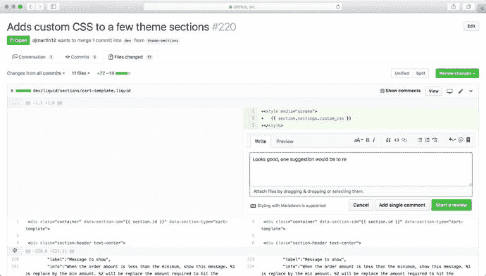
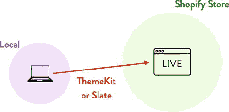
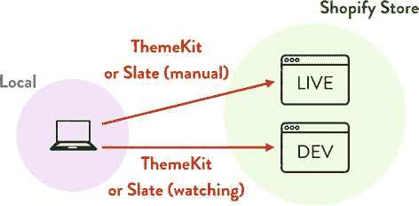
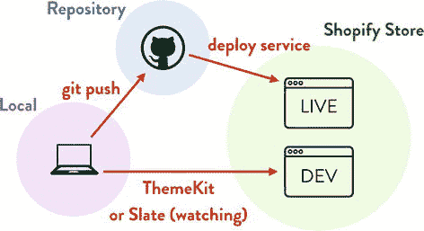
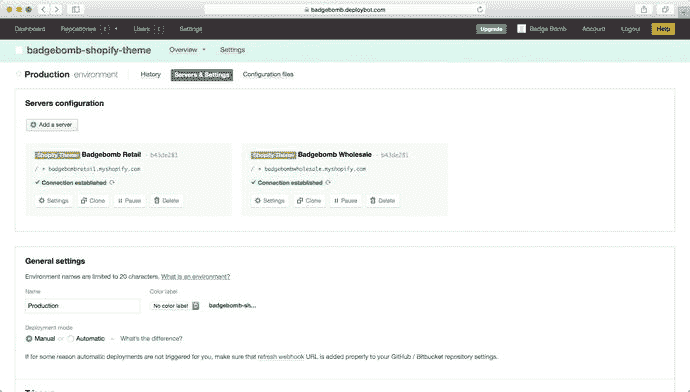
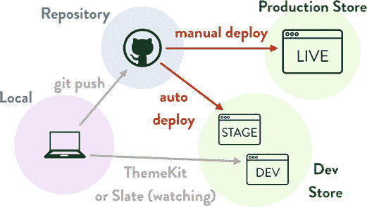
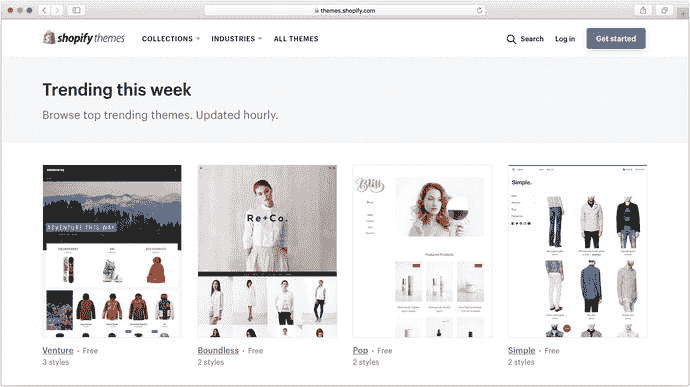
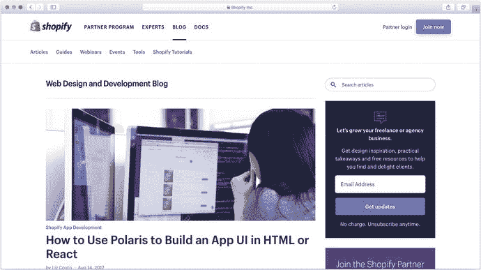

# 11. 协作式主题开发

最后一章将介绍一些策略和工具，帮助你更轻松地与他人协作构建 Shopify 主题。同时，还将讨论如何以专业的方式部署主题，以降低因故障、冲突或错误导致客户使用的主题出现问题（如停机）的风险。

最后，我将通过讨论如何充分利用 Shopify 生态系统来提升你对平台的理解，并在合作伙伴社区中建立更深的联系，以此结束本书的主要部分。

### 关于主题协作

前面的章节涵盖了 Shopify 主题的核心组件，讨论了构建主题的不同方法，并逐步讲解了一个示例主题的开发过程。这些讨论基于两个假设——我们的团队规模为一人，且代码直接上传到正在使用的 Shopify 网站。

在现实世界中，情况往往并非如此——主题可能由多个开发者、设计师和内容编辑组成的团队共同构建。此外，当你的主题被商家“投入生产环境”使用时，拥有专业的部署流程对于降低代码引入错误导致商店收入损失的风险至关重要。

即使你是一名独立开发者，并且预计这种情况不会改变，遵循我们即将概述的实践方法，不仅能让单人工作流程更顺畅，也能让接手项目的开发者（或者你在休假数月后重新回到主题开发时）享受到流畅、清晰的流程带来的好处。

#### 使用版本控制的协作工作流程

回顾一下第 2 章，其中讨论了如何使用 Git 将主题文件纳入版本控制——如果你计划与他人合作开发主题，这至关重要。简单回顾一下：

- 版本控制提供了一种跟踪主题文件变更的方法，并提供了一种简单的方法来从意外覆盖或删除的文件中恢复。
- 它提供了一种记录谁对主题进行了特定更改的方法，并允许多个开发者在“合并”更改之前同时处理一个项目。
- 你可以使用功能分支和多个预览主题来独立于线上主题开发新代码和主题功能。

要将其转变为现代化的协作开发工作流程，我们只需添加几个要素：

- 一个集中式服务器（或去中心化流程），允许多个开发者推送自己的更改并获取他人的更改。
- 一个用于组织待办事项及负责人系统的任务管理系统。
- 一个在更改合并到主代码库之前进行审查的流程。

这方面的工作流程和开发者数量一样多，因此我不打算列出所有。相反，这里描述的是我们公司用于管理此过程的典型工作流程（我们使用 GitHub 作为中央代码仓库，用于列出和跟踪问题，以及审查和合并更改）：

- 在 GitHub 上创建新的代码仓库，并为相关团队成员授予代码访问权限。如果我们要从头开始构建主题，有人会使用 `Slate` 或我们自己的主题框架在本地创建初始文件集。如果我们要处理现有主题，我们会使用 `Slate`、`Theme Kit` 或 Shopify 的 `.zip` 导出功能获取当前文件集，并将其提交到仓库作为起点。
- 每位团队成员在我们正在处理的商店上创建自己未发布的“预览主题”，以确保所做的任何更改不会影响线上网站或其他开发者，但仍能利用“真实”的商店数据。
- 我们确定需要完成的工作，并将其分解为小的、独立的特性，作为“议题”添加到 GitHub 中。通过将这些议题分配给不同的团队成员来分担工作。
- 在处理新议题时，开发者会创建一个特定于该议题的新“功能分支”，并在其上工作，代码更改会自动更新个人预览主题。
- 对更改满意后，开发者会创建一个 GitHub 拉取请求，要求将更改合并到仓库的“主”分支。另一名团队成员（通常是项目的技术负责人）被指派审查更改（见图 11-1）。在给出反馈并进行任何必要的更改后，更改将被合并到仓库的“主”分支，然后流程重复处理下一个议题。

图 11-1 在 GitHub 上进行的主题代码审查

使用这样的流程，并且仅将“主”分支部署到 Shopify 商店已发布的主题上，可以确保开发者不会意外覆盖或重复彼此的工作。在将更改合并到“主”分支之前进行代码审查，也能确保所有更改都经过另一个人检查。

好的，作为一名高级文档工程师和翻译员，我将严格遵循您提供的注意事项和示例，将给定的英文文本翻译成中文。

#### 协作部署流程

一旦我们建立了一个用于分配任务、独立处理任务、然后审查和合并变更的系统，下一个问题就是如何推出该主题的整合版本。在讨论这个问题之前，让我们回顾一下您目前所学到的流程。

早先在第 2 章中，当您了解了如何将主题开发迁移到本地机器时，部署工作流程如图 11-2 所示。在本地进行的更改通过 `Theme Kit` 或 `Slate` 直接上传到 Shopify 商店的已发布主题。

**图 11-2** 早期的部署工作流程，更改直接上传到已发布主题

正如第 2 章 中也讨论过的，这种工作流程存在一些问题：

*   在本地进行的更改会立即上传到生产环境，这很容易引入影响真实客户的错误。在开发者和生产代码之间，没有像测试或代码审查这样的质量控制机制。
*   如果多个开发人员在一个主题上工作，很容易意外覆盖彼此的更改，但很难回滚到某个已知的时间点。
*   很难或不可能知道线上主题处于什么状态。

图 11-3 描述了对此的改进。在这里，Shopify 商店拥有多个主题在运行——一个“开发”主题（如果有多人处理该主题，那么很可能每个开发人员至少有一个主题）和一个“上线”主题。它仍然使用 `Theme Kit` 或 `Slate` 在我们本地进行更改时自动将更改上传到开发主题，但由于此主题未发布，这些实时更改不会影响真实客户。

**图 11-3** 稍作改进的部署工作流程，区分了开发和上线主题

使用此工作流程，一旦开发者对开发主题的状态感到满意（并且他们已经拉取了其他开发者的更改），开发者可以通过将 `Theme Kit` 或 `Slate` 指向主题的上线版本，并从命令行使用 `theme replace` 运行完整上传，来“部署”最终的主题状态。

这种改进避免了最大的问题——意外做出影响客户的更改——但我们仍然存在覆盖他人代码的风险，没有合适的 QA 流程，也无法判断主题处于什么状态。

我们可以通过在本地开发机器上的代码与主题的生产版本之间添加一个中间步骤——一个中央代码仓库——来进一步改进这一点，如图 11-4 所示。

**图 11-4** 在本地开发机器和代码的生产版本之间添加一个代码仓库

通过添加此步骤，我们强制执行一条规则：只有来自中央代码仓库并且位于特定版本控制分支（`master` 或可能是 `production`）上的代码才能部署到上线主题。这确保了所有更改在合并到主分支并推出到生产环境之前，都经过了质量保证流程，例如代码审查和可能的自动化测试。

为了将您的主题代码部署到上线主题，有必要使用某种形式的部署服务。您的选择会有所不同，具体取决于您用于托管代码仓库的服务以及可用的集成。在 Shopify 领域中一个常见的选择（也是我最熟悉的选择）是 DeployBot（请参阅 [`https://deploybot.com`](https://deploybot.com)）。`DeployBot`，如图 11-5 所示，原生支持连接到特定的 Shopify 主题，并从各种版本控制源（例如 GitHub）向其部署代码。

**图 11-5** 一个 DeployBot 配置界面，将一个 GitHub 仓库链接到 Shopify 主题的两个生产版本（一个用于零售，一个用于批发）

像 `DeployBot` 这样的部署服务可以配置为手动部署（通过登录并点击按钮触发）或自动部署（通过简单地将代码推送或合并到主题仓库的特定分支来触发）您的主题代码到 Shopify 商店。

您选择的流程可能因项目而异，但我通常会设置两个部署触发器——一个用于自动将仓库 `master` 分支的所有更改部署到主题的 `staging`（预发布）版本，另一个必须手动触发以将最终更改推送到生产商店（见图 11-6）。

**图 11-6** 一个可用于生产环境的部署工作流程，包括自动和手动部署触发器以及多个 Shopify 商店

如您所见，图 11-6 还通过将上线主题、预发布主题和开发主题放置在不同的 Shopify 商店上来显示它们的分离。这通常是一个好做法，可以进一步降低您的开发工作流程意外影响真实客户的风险，并且允许您将测试数据（如订单、产品和客户）与 `production`（生产）数据分开。

在一些真实场景中，您的工作流程可能更加复杂，涉及更多的 Shopify 商店，每个商店都包含上线或预发布主题。当您使用单一代码库驱动 Shopify 商店的许多不同 `variants`（变体）时（例如，单个品牌的零售/批发变体，或针对不同地区的变体），就可能会出现这种情况。在这种情况下，拥有自动部署服务对于避免主题状态不一致和正确管理您的开发流程至关重要。

##### 克隆 Shopify 商店

我提到的一些更`高级的`部署场景涉及创建一个或多个`开发型` Shopify 商店，以便在不影响线上商店数据的情况下进行实验。通常，最好让生产商店上的产品、产品系列、页面和主题数据尽可能与真实商店保持同步，这样您就能在更`真实`的环境中进行开发。

Shopify 确实允许您导出和导入产品和主题数据（尽管保持主题最新应该是开发者和您的部署服务的责任），但遗憾的是，没有内置的方法可以自动化此过程，也无法导入/导出其他数据，如页面、产品系列和博客内容。

除了定期的手动同步过程之外，还有几个选择。第一个是安装 Shopify 应用商店中众多`商店同步`应用之一。根据您需要同步的数据类型和数量，使用一个或多个此类应用可以成为保持开发商店数据最新的简单方法。

第二个选择（也是我更喜欢的方法）是使用免费提供的 `Quickshot` 工具（请参阅 [`https://quickshot.readme.io`](https://quickshot.readme.io)）。虽然此工具最初是为了将主题数据从本地机器同步到 Shopify 商店而构建的（类似于第 2 章中讨论的 `Slate` 现在提供的功能），但它也包含用于同步产品、产品系列、博客和页面数据的工具。

### Shopify 主题商店

我想许多读者拿起这本书时，都带着对 Shopify 主题商店（见 [`https://themes.shopify.com`](https://themes.shopify.com)）的期待。如图 11-7 所示，商家可以从商店购买新主题用于自己的店铺。让你的主题成功上架主题商店，回报可能相当可观。尽管 Shopify 并未公布官方数据，但据估计，商店中排名前十的主题每月销售额在 15,000 到 25,000 美元之间，而排名前十的主题作者（其中许多人拥有多个上架主题）每月收入则在 25,000 到 50,000 美元之间。

图 11-7
Shopify 主题商店

这些数字得以实现，得益于 Shopify 对主题维持着“高价”策略（每次安装费用在 140 美元到 180 美元之间），并且拥有非常、非常严格的提交审核流程，从而限制了主题数量（在撰写本文时，仅有 55 个主题可供选择，每个主题包含 2-4 种预设风格）。虽然这意味着只有一小部分提交的作品能够最终发布，但本节接下来的内容将探讨如何最大化你的成功几率，同时也涵盖了一些当你的主题被拒时的备选方案。

#### 进入主题商店

显然，进入主题商店并无魔法捷径。你需要具备主题设计和开发的经验，拥有扎实的概念，以及投入大量艰苦工作的意愿——在设计、修改、提交阶段，以及主题发布之后都是如此。你开发或提交的第一个主题不太可能顺利通过审核流程。

话虽如此，总有一些方法可以提高你的成功几率。

##### 熟悉流程

根据 Shopify 主题团队的说法，他们发现主题开发者犯的最大错误就是一头扎进开发，在主题构建上花费大量时间和精力，结果却在第一步就因未能满足商店需求或与现有主题过于相似而被拒。

Shopify 在 [`https://themes.shopify.com/services/themes/guidelines`](https://themes.shopify.com/services/themes/guidelines) 提供了其流程的详细说明，其中概述了三个关键步骤：

-   提交主题概要，涵盖主题愿景、对主题所能满足的未满足商家需求的描述，以及关于主题将如何实现及背后团队的详细信息。
-   使用 `Invision` 或类似工具提交交互式移动端设计原型。
-   使用 `Invision` 或类似工具提交交互式桌面端设计原型。

在进入下一阶段之前，你应该在每一步都从 Shopify 主题团队那里获得详细反馈。第一道关卡可能是最难通过的——你的主题概要需要令人信服地论证你的主题将如何解决商家面临的实际问题，同时又不会过于小众或特定于某个垂直领域。

获得 Shopify 对主题概要的批准并不能自动保证最终进入主题商店，但如果你提交的概要足够详细，并且最终产品完全实现了概要内容，你就拥有了最大的成功机会。

##### 拥有新颖或独特的视角

Shopify 主题团队声明：

> 我们需要看到的是一个包含主观意见和客观研究的项目概要，它需要概述所感知到的问题、机遇和解决方案的必要性和有效性。

在评估所感知的问题和解决方案时，你需要避免宽泛和主观的陈述（例如“没有足够多能良好运用扁平化设计的主题”），或者仅仅提供你的主题将具备的功能列表（例如“多级导航菜单、图片轮播和流畅的快速购物功能”）。相反，应该从更高层次开始思考你认为哪些类型的商家可能是你的客户，以及你的主题为何能在现有主题无法满足的方面帮助他们。（例如“专注于销售特定系列数字产品的商家未能得到充分服务，因为大多数主题都侧重于销售实体商品的商家。我的主题将通过为商家提供仅在数字语境下有意义的实用功能来解决这一问题，从而帮助提高这些类型产品的转化率。”）

##### 与主题团队密切合作

虽然主题团队始终愿意在提交过程中就你的主题概要和原型提供反馈和建议，但仔细关注他们给你的反馈，并根据他们的关切点修改你的提交材料至关重要。

在你的提交被永久拒绝之前，你能进行的修改次数是有限的，因此请尽量收集关于主题团队所担忧问题的详细信息。如果他们的反馈中有不清楚的地方，请要求澄清——甚至更好的是，为你的审核人员提供针对原始建议的几个备选方案，以减轻他们的工作量，并找到一个他们可以支持的方向。

##### 遵循主题 Liquid 和内容指南

为了确保你清楚自己将要面对什么，请在开始提交流程前，务必阅读主题团队的 `Liquid` 要求（[`https://help.shopify.com/themes/development/theme-store-requirements/theme-file-requirements`](https://help.shopify.com/themes/development/theme-store-requirements/theme-file-requirements)）和内容清单（[`https://help.shopify.com/themes/development/theme-store-requirements/content-style-guide`](https://help.shopify.com/themes/development/theme-store-requirements/content-style-guide)）。

在规划开发时间表时，主题团队在功能性、可访问性和内容方面检查的大量事项常常会让开发者猝不及防。

##### 做好准备提供支持

Shopify 为主题开发者提供两种收入分成模式：70/30 和 50/50。70/30 分成模式要求开发者同意处理主题的支持工作，而在 50/50 模式下，则由 Shopify 处理接收到的支持请求。

然而，需要特别注意，50/50 的分成模式仅根据具体情况提供，因此，即使你考虑放弃额外的 20% 收入，你也应准备好处理大量的支持请求。据我所知，我认为 Shopify 未来很少会向主题开发者提供 50/50 模式，因为要为第三方产品提供支持需要大量资源且困难重重。

在你的主题概要文件中，提供一个清晰的计划，说明你（和你的团队，如果有的话）将如何提供高质量、专注的客户支持，是至关重要的组成部分。这能向 Shopify 保证，他们最终不会因为遇到不答复用户的问题的主题开发者而不得不去处理投诉。

#### 如果主题未获通过怎么办

无论你投入多少时间和精力向主题商店提交主题，数据显示被拒绝的可能性很高。虽然这可能会令人沮丧（我深有体会，我协助提交给主题团队的最初几个设计均被拒绝），但并非全盘皆输。你仍然有办法从你的辛勤工作中获取价值。

##### 单打独斗

我推荐的第一种方法就是直接搭建一个自己的落地页来销售主题（顺便说一句，即使你已被主题商店收录，也可以并且应该这样做）。撰写落地页内容时，要瞄准那些有特定使用场景的店主——你的主题能完美呈现这种场景，而常规的主题商店里却找不到类似方案。

这种方法的优势在于，你到手的收入是 **100%** 减去手续费，而不是 70%。当然，缺点也很明显：在官方渠道之外推动销售会困难得多，而且这类主题的定价通常较低（大约在 50 到 100 美元之间）。

近年来，一些成熟的 Shopify 主题开发者已经尝试在官方商店之外以更高的价格销售主题。一个典型的例子是图 11-8 中由长期开发者 Out of the Sandbox 开发的“Turbo”主题，其目前零售价为 350 美元。虽然这对他们来说是一个成功的策略，也更公平地补偿了他们支持主题所花费的时间，但我觉得，对于一个没有现有客户基础的“非知名”开发者来说，要效仿这种做法会非常困难。

图 11-8

这个“Turbo”主题由 Out of the Sandbox 在主题商店之外销售

##### 使用替代的主题市场

像 ThemeForest（`https://themeforest.net`）和 Creative Market（`https://creativemarket.com`）这样的网站提供了替代的主题市场，你可以将主题上架到这些平台。这些网站通常是一场价格的“下限竞赛”，所以你需要做好心理准备，你的主题在这里可能只能卖到 30 到 50 美元。这些平台上主题的质量通常（但并非总是）比较低。

##### 框架化

大多数为客户构建定制主题的 Shopify 主题开发者，最终都会开始开发自己的主题“框架”——一套起始模板和样式，以避免一遍又一遍地重复相同的步骤。考虑将你构建的部分内容提取出来，形成你自己的框架或模式库，这样你下次为客户开展项目时就能抢占先机。

##### 使用开源策略

你无法直接从这种策略中获利，但将你的主题开源是让你被更多精明的客户和其他主题开发者注意到的绝佳方式。这反过来又能为定制开发工作带来潜在的业务线索。下一节将讨论将你的 Shopify 作品开源的一些好处。

### 利用 Shopify 生态系统

当我刚开始以 Shopify 专家的身份工作时，我和其他开发者的互动并不多。我喜欢独来独往，靠着专家列表推荐或口碑推荐来的客户，也勉强能维持生计。

在摆弄这个平台几年后，我建立了信心，开始在我的个人博客上偶尔发表文章。这些文章并非什么颠覆性的东西——大部分只是描述我当时如何绕过 Shopify 的一些限制，比如让 `Respond.js` 库在 Shopify 的 CDN 上工作。¹ 我收到了一些（Shopify 内部和外部的）开发者的积极反馈，所以我就继续发表一些与 Shopify 相关的文章。

随着时间的推移，知道我的博客内容有人阅读并且觉得有用，这给了我勇气，开始将我正在做的其他事情发布出来。从那时起，我发布了一个付费框架来帮助人们使用 Bootstrap 前端框架构建主题，开发了一系列开源项目来辅助 Shopify 开发（可见于 `https://github.com/discolabs`），录制了几个关于主题和应用程序开发的截屏视频，在世界各地的聚会和会议上就 Shopify 发表演讲并举办研讨会，现在又写了这本书。

这些项目没有一个让我赚得盆满钵满，也没有一个发展成极受欢迎且备受瞩目的项目（尽管其中一个，`Cart.js`，被 Kanye West 的 Yeezy 商店使用，这相当酷）。尽管没有直接获得巨大的经济回报，但我觉得在每种情况下我都收获了一些东西：

-   当完全陌生的人对我的文章或项目表示赞赏时，我感到了许多温暖和欣慰。
-   当完全陌生的人为我的文章或项目付费时，我感到了更多的温暖和欣慰。
-   来自更优质客户的咨询数量增加了，而当你能说自己真正写过一本关于 Shopify 的书时，说服客户也变得更加容易。
-   我和一个最重要的客户的关系，始于多年前他们请我对我的付费框架做一个小的调整，这种关系至今仍在继续，并且对我们双方都有利可图！
-   我得以联系并结识了 Shopify 生态系统中一些非常棒的人。

我之所以不厌其烦地讲这些，并非想做个史上最长的低调炫耀，而是想强调，将你的工作（无论贡献多么微小）分享给社区，可以带来许多有趣的机会，并产生切实的回报。

现在你已经读到了这本书的结尾，希望你对自己的下一个 Shopify 主题开发项目更有信心了。（嗯，我当然希望如此——如果不是，你最好联系我，让我知道下一版需要改进什么。）

当你开展那个项目时，我鼓励你思考一下，你正在学习和开发的东西如何能转化为对更广泛社区有价值的东西。当我说“社区”时，我指的不是任何官方组织。没有准入流程，也没有秘密握手礼。我也不认为你需要拥有多年的 Shopify 经验才能教给别人有价值的东西。

它可以是一篇描述你在构建主题时如何克服困难的博客文章，也可以是回复一个在 Shopify 论坛上提问的人。甚至只是在 GitHub 上为你一直在使用的开源库提交一个问题（issue）也是非常有用的，维护者会非常感激！

水涨船高，拥有一个充满活力、充满积极和支持性成员的 Shopify 开发者社区，只会促进整个生态系统的成长。

### 去哪里参与

本节列出了我认为对于参与 Shopify 社区有用的一些资源列表。

#### 官方 Shopify 渠道

Shopify 有一系列用于与开发者及合作伙伴沟通、并促进社区讨论的“官方”渠道。主要渠道有：

- Shopify 论坛（`https://ecommerce.shopify.com/forums`）是开始搜索有关 Shopify 概念或开发问题的好地方。在社区中建立声誉的最佳方式之一，就是在这里帮助他人，或分享自己的经验。
- 请确保你通过 RSS 或电子邮件订阅了 Shopify 的各类博客。官方博客共有三个——一个面向商家（`https://www.shopify.com/blog`），一个面向合作伙伴和开发者（`https://www.shopify.com/partners/blog`），还有一个专注于企业级产品 Shopify Plus（`https://www.shopify.com/enterprise`）。图 11-9 展示了合作伙伴博客。

  

  图 11-9

  Shopify 合作伙伴博客源源不断地为对 Shopify 感兴趣的开发者和合作伙伴提供信息。

- 目前有两个“官方” Shopify 播客——由 Keir Whitaker 主持的更新频率不高但内容深入的 Shopify 合作伙伴播客（`https://soundcloud.com/shopify-partners`），以及由 Felix Thea 主持、以商家为中心的 Shopify Masters 播客（`https://www.shopify.com/blog/topics/podcasts`）。
- 有一个面向所有已注册 Shopify 合作伙伴开放的官方 Shopify 合作伙伴 Slack 社区。注册后，请向你的客户经理介绍自己并申请邀请。

#### 其他资源

当然，让 Shopify 变得如此出色的原因之一，是众多由社区驱动的团体和倡议。以下是其中一些值得关注的亮点：

- 由 Kurt Elster 主持的非官方 Shopify 播客（`http://www.unofficialshopifypodcast.com`）。它虽然以商家为中心，但通常包含许多对开发者以及其他希望学习技能以造福店主的合作伙伴而言实用且可操作的建议。
- 由 TJ Mapes 运营的 eCommTalk Slack 频道（`http://ecommtalk.com`）。这个社区汇聚了合作伙伴、营销人员和商家，其中有许多经验丰富、愿意帮助 Shopify 开发者的人。
- 由 Jonathan Kennedy 运营的 Shopify 创业者 Facebook 群组（`https://www.facebook.com/groups/shopifyentrepreneurs/`）。虽然技术性不强，但这是联系和帮助有抱负的 Shopify 商家的好方法，因此对于开发者来说，这里是磨练主题开发技能的沃土。

#### 线下活动

如果你渴望与 Shopify 社区的其他成员线下见面，也有很多机会。2016 年，Shopify 开始在全球范围内支持“官方” Shopify 聚会网络，该网络正在加速扩张。你可以在 Shopify 网站的合作伙伴活动页面（`https://www.shopify.com/partners/blog/partner-events`）上找到即将举行的聚会列表。

还有 Unite，这是 Shopify 的年度合作伙伴大会，也是公司发布重大功能公告的场所。此外，Shopify 经常在全球范围内支持或举办本地研讨会和为期一天的卫星会议。请联系你在 Shopify 的客户经理，了解你所在地区即将举办的活动。

#### 使用开源

最后，在从事 Shopify 项目时可以利用的最佳资源之一是 GitHub（是的，还有其他开源平台可供选择）。Shopify 不仅倾向于将大量代码作为“官方”开源仓库发布，来自世界各地的第三方开发者和专家也分享了自己的项目、工具和代码片段。

除了发布我们自己的几个开源项目外，我的公司还使用（并随后贡献代码给）现有库，例如 Ruby 和 Python 的 Shopify API 客户端，或 Shopify App gem。修复你遇到的问题并将你的补丁贡献回项目，这对每个人都有帮助，并且常常能带来与有趣客户合作的机会。

在为客户解决问题时，熟悉开源流程也可能是一个优势。在某些情况下，你可以直接与试图修复 Shopify 代码库中错误的开发者进行对话。²

### 总结

在结束本章（以及本书的主体部分）之际，我想强调，我认为 Shopify 合作伙伴生态系统的协作性质是其平台成功的关键。在我从事该平台的多年间，每当我有疑问或请求时，几乎毫无例外地都感受到了 Shopify 社区其他成员的温暖、耐心和帮助。

只需在 Twitter 上联系一位专家，或通过电子邮件给他们发条消息，就能带来富有成效的讨论、有趣的客户工作，偶尔还能收获友谊，因为事实证明，大多数人都乐于讨论他们的工作并分享他们所知。

以 Twitter 上的 `@gavinballard` 为例——他总是乐于聊 Shopify 并欢迎新关注者！

脚注  
1  
`http://gavinballard.com/using-respond.js-with-shopify/`

2  
例如，请查看 `https://github.com/Shopify/active_shipping/pull/170#issuecomment-50399499`，在那里我能够直接与负责配送逻辑的 Shopify 开发者合作，为我们的一个客户解决问题。

## 索引

### A

### B

### C

- **购物车页面**
  - 设计
  - 可编辑列表实现
  - 运费计算器
  - 追加销售优惠
- **分类页面**
- **结账**
  - 商家
  - `Shopify Plus` 门店自提选择器
- **协作部署流程**
  - `DeployBot`
  - 开发主题与在线主题
  - `Theme Kit`/`Slate` 版本控制
- **集合页面**
  - 替代视图
  - 分类级别筛选
  - 设计
  - 筛选功能
  - 嵌套分类分页
  - 产品分类
  - 产品列表
  - 渐进增强
  - 排序
  - 基于标签的筛选
  - 类型
  - 视图
- **内容页面**
- **自定义集合**

### D

### E

### F

### G

### H

- **首页**
  - 品牌个性
  - 集合页面（参见*集合页面*）
  - 设计
  - 动态版块
  - 主视觉图片实现
  - 产品系列

### I

- **信息层级**

### J

### K

### L

- **布局与导航**
  - `Ecommerce` 网站
  - 元素
  - 页眉实现
  - 大型菜单
  - 产品数据
  - 产品
  - 网站页脚
  - 主题框架

### M

- **手动集合**
- **微数据**

### N

### O

### P

- **性能优化技巧**
  - 资源拼接
  - 资源压缩
  - `HTTP` 请求
  - 图片优化
  - 测量工具
  - 零碎技巧
  - 页面简化
  - `PageSpeed Insights`
  - 页面重量
  - 速度至关重要
  - 主题性能指标
  - 加载时间
  - `WebPageTest.org`
  - `Yahoo YSlow`
- **产品页面**
  - 备选页面模板
  - 购物车表单
  - `Ecommerce` 商店
  - 服装护理信息
  - 图片代码实现
  - 设计
  - 筛选器
  - 灯箱
  - 缩放
  - 产品信息层级
  - 移动端体验
  - 产品信息
  - 推荐产品
  - 相关产品与替代产品
- **渐进增强**

### Q

### R

### S

- **搜索引擎优化（SEO）**
  - 重复内容
  - `HTML`
  - `JSON-LD`
  - 关键词与内容
  - 微数据
  - 站外优化与站内优化
  - `Schema.org` 词汇表
  - 结构化数据
- **Shopify 主题**
  - 资源文件
  - 设计
  - 防御式与模块化编程
  - 记录文档
  - `Liquid` 代码片段
  - 渐进增强
- **商店**
  - `Grunt` 与 `Gulp` 安装
  - `Liquid` 本地开发环境
  - 处理客户与项目匹配
  - 客户投资预期设定
  - 迭代开发
  - 用户体验测试
- **`Slate` 结构**
- **`Theme Kit`**
  - 版本控制系统
- **智能集合**
- **社交分享**
  - 集成分享功能
  - 添加 `Open Graph` 标记
  - 测试
  - 散弹式方法
  - 添加 `Twitter Card` 标记
  - 验证

### T

- **主题设置**
  - 获取
  - 复选框设置
  - 转化
  - 默认筛选器
  - 分发主题
  - 经验需求
  - 全力以赴 / 适可而止
  - 指导原则
  - 更高权限
  - `i18n` 与 `l16n` 迭代模式
  - `JavaScript` 限制，`Shopify` 主题
  - 本地化事宜
  - 多币种
  - 多用途主题
  - 一次性主题
  - 预处理文件
  - 可翻译主题

### U

### V

- **版本控制系统，`Git`**
  - 功能分支
  - `Shopify` 主题

### W

### X

### Y

### Z
