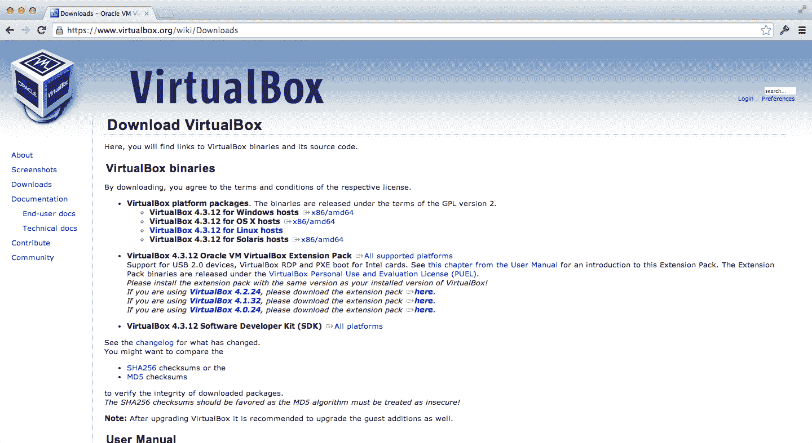
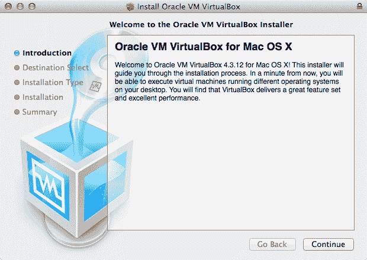
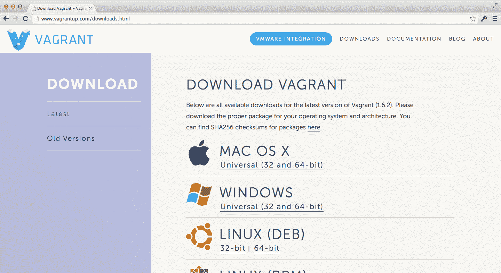
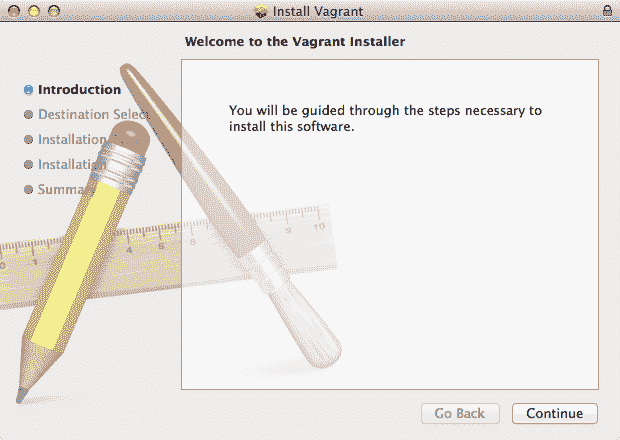
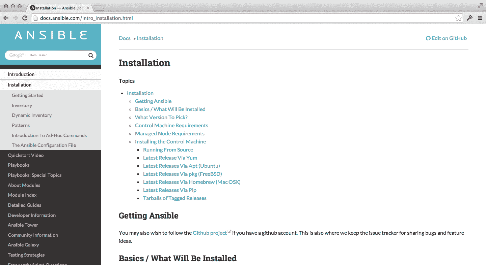
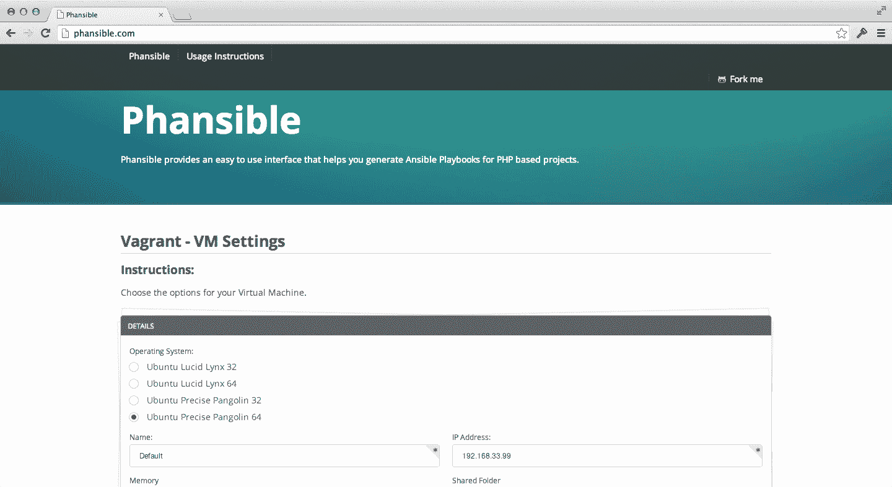

# 强类型 PHP

## 更健壮的类型，更整洁的代码

### 克里斯托弗·皮特

本书在 [`leanpub.com/typedphp`](http://leanpub.com/typedphp) 有售

此版本发布于 2014 年 6 月 23 日


---

这是一本 [Leanpub](http://leanpub.com) 出版的书籍。Leanpub 通过精益出版流程为作者和出版商赋能。[精益出版](http://leanpub.com/manifesto) 是一种使用轻量工具和多次迭代来获取读者反馈、调整方向直至写出正确书籍，并在此过程中建立影响力的进行中电子书出版方式。

---

© 2013 - 2014 克里斯托弗·皮特

## 目录

*   引言

    *   为何写这本书

    *   本书面向的读者

    *   过程式 / 面向对象

        *   过程式编程

        *   面向对象编程

        *   哪种更好？

        *   PHP 是哪种？

    *   原生函数的不一致性

        *   零散的下划线

        *   零散的缩写

        *   不一致的参数顺序

        *   正则表达式 / 字符串

        *   名词 / 动词

        *   奇怪的返回值

    *   结论

*   结构

    *   装箱

    *   类型解析

        *   标量类型

        *   函数

        *   类

        *   正则表达式

    *   命名空间函数

        *   Composer 自动加载

        *   未来的好东西

    *   结论

*   扩展

    *   Vagrant + Phansible

        *   安装

        *   配置

        *   Vagrant 命令

    *   SPL 类型

        *   安装 SPL 类型

        *   使用 SPL 类型

    *   标量对象

        *   安装标量对象

        *   使用标量对象

    *   Zephir

        *   安装 Zephir

        *   使用 Zephir

    *   结论

*   设计

    *   使用哪种方法

        *   命名空间方法

        *   标量对象 / SPL 类型

        *   Zephir

    *   如何构建类型

        *   类型解析

        *   链式调用

        *   组合数字类型

    *   如何进行测试

        *   PHPUnit

        *   应该测试什么？

        *   何时编写测试？

        *   建议

    *   如何打包

        *   编写 `Readme` 文件

        *   几个示例

        *   测试说明

        *   安装说明

        *   许可证

        *   贡献指南

    *   结论

*   面向未来的设计

*   附录

    *   PHP 实现

    *   Zephir 实现

    *   JavaScript 实现

## 引言

### 为何写这本书

在花费了大量时间致力于构建能够简化处理字符串、数字、数组等操作方法的库之后，我决定写这本书。它们被称为标量类型，因为 PHP 对待它们的方式与对象不同。它们没有属性，也没有方法。

PHP 有着悠久的历史，并且在网络世界中占据着主导地位。尽管存在语言上的不一致性和困难（尤其是在涉及这些标量类型时），它仍然取得了巨大的成就。比雅尼·斯特劳斯特鲁普曾说过：“只有两种编程语言：人们抱怨的和没人用的。” PHP 是一种*每个人*都在使用的语言，但这通常被视为忽略其糟粕、完成工作的好理由。

我完全支持把事情做成，为此，我许多年来一直使用纯粹的 PHP。在一个面向对象库和框架的生态系统中，PHP 的过程式风格总是困扰着我。所以我决定更深入地研究如何在 PHP 之上构建一个更强大的类型系统。

这就是本书的目标。我们将研究如何使用*标准* PHP 库，如何使用用户层面的库，以及如何使用扩展和交叉编译器。所有这些努力都是为了创建一套可复用的工具，来统一并简化 PHP 的标量类型。

### 目标读者

本书假定你具备 `PHP` 的实用知识。这意味着你了解编程基础，并且已经运用这些知识编写过 `PHP` 代码。

你不需要知道如何搭建 `PHP` 运行环境——我们会介绍如何轻松完成这项任务（使用 `VirtualBox`、`Vagrant` 和 `Phansible`）。

你还需要保持开放的心态。本书涉及的许多概念都处于实验阶段，几乎没有哪个是普遍采用的。这并非说你不能在生产应用中使用这些技术，而是需要你自行判断你的架构是否会从第三方扩展（除了 `PHP` 核心之外）中受益。

最后，你需要有畅通的网络连接。本书中的示例在 `Vagrant` 虚拟机中运行效果最佳。如果你不熟悉这个术语，不必担心。我们稍后会讨论它，但它本质上是一种用于安装开发环境的软件。这种安装经常发生，因此需要高速网络连接。

### 过程式 / 面向对象

**过程式**和**面向对象**是两种不同的编程风格，它们以不同的方式处理程序执行。了解它们的工作原理以及它们如何定义标量类型的状态是很有益的。

#### 过程式编程

**过程式编程**描述了一种自上而下的程序执行方法。也就是说，过程式程序由解释器需要执行的一系列步骤（从上到下）组成。

用伪代码表示，一个过程式图像缩放程序可能如下所示：

1.  开始执行

2.  然后存储由 `open_file` 函数返回的文件引用

3.  然后存储由 `resize_image` 函数返回的修改后的图像

4.  然后关闭打开的文件

5.  然后存储由 `open_file` 函数返回的文件引用

6.  然后将修改后的图像数据写入第二个打开的文件

7.  然后关闭打开的文件

8.  然后清空修改后的图像变量

9.  结束执行

**过程式**程序可以调用函数（如示例所述）并可以定义函数。当前执行行的位置可以通过循环结构和类似 `goto` 的结构进行修改，但在大多数情况下，程序是由一组指令构成的框架。

#### 面向对象编程

**面向对象编程**将程序执行描述为实体（或对象）的交互和描述。这些对象可以拥有属性（即拥有的变量的另一种叫法）和方法（即拥有的函数的另一种叫法）的任意组合。

这些拥有函数内部的代码仍然是从上到下执行的，但主要思想在于程序依赖于对象间的通信来维持其连贯性。

用伪代码表示，一个面向对象的图像缩放程序可能如下所示：

1.  开始执行

2.  然后创建一个文件对象

3.  然后创建一个图像缩放对象

4.  然后将文件对象传递给图像缩放对象

5.  然后创建另一个文件对象

6.  然后将图像缩放对象的 `resize` 方法的结果写入第二个文件对象

7.  然后关闭第二个文件对象

8.  然后销毁第二个文件对象

9.  然后销毁图像缩放对象

10. 然后销毁第一个文件对象

11. 结束执行

#### 哪种最好？

……问这个问题本身就不对。两者各有优缺点。**面向对象编程**通常比**过程式编程**产生更多的代码。**面向对象编程**有助于更好地实现关注点分离。换句话说——思考对象及其行为比思考整个程序的流程更容易。

最终，**过程式**代码可以和**面向对象**代码一样整洁。

“有时，优雅的实现就是一个函数。不是一个方法。不是一个类。不是一个框架。仅仅是一个函数。”——约翰·卡马克

#### PHP 是哪种？

`PHP` 非常过程式。这是拉斯马斯当初构建它的方式（在那个众所周知的年代），并且这种方式在很大程度上延续至今。这一点在标量变量如何处理和操作时表现得尤为明显。`PHP` 类型不是对象。它们没有方法或属性。如果你想对 `PHP` 标量变量（`string`、`int`、`float`、`bool`……）进行操作，你需要将其传递给一个函数。

在 `PHP 5.3` 之前，没有命名空间。因此——所有这些类型特定的方法都被添加到了全局命名空间中。它们随处可用，并且（正如我们所看到的）它们是不一致的。

这使得标量类型的代码变得丑陋。

### 原生函数的不一致性

PHP 常因其原生函数的不一致性而受到批评。PHP 也常因其文档质量而受到赞扬。这两者是相关的！文档之所以能发展得如此出色，正是因为 PHP 原生函数本身是不一致的。

这一节可能会让我听起来像个 PHP 反对者。但事实远非如此！我热爱 PHP，并致力于使用它并帮助他人使用它。要了解我们在构建什么，我们必须知道我们试图避免构建什么。这就是接下来要讲述的重点。

#### 零星的下划线

-   `parse_str`

-   `printf`

-   `str_pad`

-   `strcmp`

-   `strip_tags`

-   `stripslashes`

这些函数在 [`php.net/manual/en/ref.strings.php`](http://php.net/manual/en/ref.strings.php) 中有描述。

完整列表包含 98 个函数，其中 30 个使用了一个或多个下划线。有时，明显由多个完整单词组成的函数（如 `setlocale`）却没有下划线。有时，功能几乎完全相同的函数（如 `strlen` 与 `str_word_count`）处理方式却不一致。

#### 零星的缩写

-   `addslashes`

-   `chr`

-   `htmlentities`

-   `lcfirst`

-   `number_format`

-   `stroll`

大多数字符串函数都使用了某种缩写。如果应用一致，这不成问题。然而，一些非缩写函数的存在使得字符串 API 难以记忆，这通常意味着需要反复查阅文档。

#### 不一致的参数顺序

-   `array_key_exists($needle, $haystack)`

-   `stripos($haystack , $needle)`

参数的排列顺序取决于你是在处理数组函数还是字符串函数。Rasmus 解释说，这是为了尽可能接近底层 C 库的作法。这个解释的问题在于，对于那些从未使用过 C 语言、只想使用 PHP 的开发人员来说，毫无意义。

记住这一点很有帮助：数组方法是**针/草垛**（needle/haystack），而字符串方法是**草垛/针**（haystack/needle）。

#### 正则表达式 / 字符串

-   `preg_filter`

-   `str_replace`

-   `preg_match`

-   `strstr`

-   `preg_split`

-   `explode`

在 PHP 中，正则表达式被表示为字符串，但却用一套完全不同的函数来处理。这很奇怪。虽然我可以接受正则表达式与字符串有相似的表示形式，并且它们被传递给（C 库中的）函数期望处理的是字符串，但开发人员不应该需要考虑这一点。

如果字符串以可识别的分隔符开头和结尾，PHP 就会将其视为正则表达式。你可以在 [`www.php.net/manual/en/regexp.reference.delimiters.php`](http://www.php.net/manual/en/regexp.reference.delimiters.php) 了解更多信息。

或者，正则表达式应该有自己的表示形式，以明确地与字符串区分开来。一个已经具备此特性的语言例子是 **JavaScript**：

```javascript
"abc".replace("b", "123"); // "abc" 变为 "a123c"
"def".replace(/[e]/, "456"); // "def" 变为 "d456f"
```

这些语言明确区分了字符串和正则表达式。

#### 名词 / 动词

-   `echo`

-   `htmlentities`

-   `lcfirst`

-   `md5`

-   `parse_str`

-   `soundedex`

一些原生函数是动词（如 `echo` 和 `parse_str`），而另一些则是名词（如 `htmlentities` 和 `soundex`）。这使得推断方法的作用变得棘手。

#### 奇怪的返回值

许多原生函数返回多种类型。对于 `strstr` 函数，如果匹配到则返回字符串，否则返回 `false`。

与此相反，`preg_match` 函数在找到模式时返回 `1`，未找到时返回 `0`，如果发生错误则返回 `false`。这使得在将任何返回值用于预期目的之前，需要进行大量的类型检查。

## 结论

PHP 是一门伟大的语言。

但是，如果你经常使用 PHP，你要么已经逐渐忽略了 PHP 在标量类型处理方面的糟糕状况，要么因为缺乏良好的替代方案而感到沮丧。

对于大多数中小型项目来说，增加一个修订后的类型系统是没必要的。然而，如果你学会了如何构建（甚至只是使用）一个构建良好的类型系统，将其用于大型项目不是很有意义吗？或者用于你足够关心的任何项目？

PHP 的这个领域常常会把开发者驱赶到更漂亮的语言中去。不要成为那些开发者之一！通过学习使用清晰的抽象来编写更整洁的代码。

## 结构

### 装箱

**装箱（Boxing）** 是一个术语，指的是将数据包裹（封装）在一个类中的实践，以便可以为包裹的数据添加行为。让我们看一个例子：

```php
<?php

class StringBox
{
  /**
   * @var string
   */
  protected $data;

  /**
   * @param string $data
   */
  public function __construct($data)
  {
    $this->data = $data;
  }

  /**
   * @return string
   */
  public function toString()
  {
    return (string) $this->data;
  }

  /**
   * @return string
   */
  public function toUpperCase()
  {
    return strtoupper($this->data);
  }

  /**
   * @return string
   */
  public function toLowerCase()
  {
    return strtolower($this->data);
  }

  /**
   * @param string $needle
   * @param mixed  $offset
   *
   * @return int
   */
  public function getIndexOf($needle, $offset = null)
  {
    $index = strpos($this->data, $needle, $offset);

    if ($index === false) {
      return -1;
    }

    return $index;
  }
}

$box = new StringBox("Hello World");

print $box->toString();          // "hello world"
print $box->toUpperCase();       // "HELLO WORLD"
print $box->toLowerCase();       // "hello world"
print $box->getIndexOf("foo");   // -1
print $box->getIndexOf("World"); // 6
```

这种方法完全受 PHP 支持，无需任何额外的扩展或依赖。如果你仔细想想，这是一个简单的概念。你正在使用受保护的属性，并公开一个公共 API 来设置、获取和操作它们。

它的难点在于，相比直接使用原生函数，这会导致更多的代码。你需要定义包装器。你需要定义设置器和获取器。每次你想要将*原生*类型传入并获取*原生*类型时，都必须使用它们。我最后那句是什么意思？

```php
$helloBox = new StringBox("Hello");
$worldBox = new StringBox("World");

$helloWorldBox = new StringBox(
  $helloBox->toString() . " " . $worldBox->toString()
);
```

这很快就变得笨重了。它也更耗内存，并且比直接使用原生函数和类型要慢。

PHP 允许使用一个名为 `__toString` 的方法。当一个类定义了此方法（来返回一个字符串），并且该类的实例被用于期望字符串的操作中时；`__toString` 方法会被自动调用。

这还不足以让我们模拟一个可扩展的类型系统，否则这本书就不会这么短了。

### 解析类型

PHP 是一种弱类型语言。也就是说，变量可以在不指定类型的情况下声明。它们的类型可以在任何时刻改变。它们可以根据需要被强制转换为不同的类型。

如果我们想要实现更强的类型处理，我们需要能够识别变量的类型。PHP 提供了一些有助于此的函数，但它们有一些需要克服的问题……

#### 标量类型

`gettype()` 函数用于返回变量的数据类型。它可以识别以下类型：

-   `"boolean"`

-   `"integer"`

-   `"double"`

-   `"string"`

-   `"array"`

-   `"object"`

-   `"resource"`

-   `"NULL"`

如果这些类型都不能正确描述该变量，`gettype()` 将返回 `"unknown type"`。我们再次看到一些奇怪的不一致之处。首先，浮点数被识别为 `"double"`，而空值则返回为 `"NULL"`（大写形式，与其他所有类型标识符形成对比）。

我们可以通过类似下面的代码来对这个函数进行抽象：

```php
<?php

function type($variable) {
  $type = gettype($variable);

  switch ($type) {

    case "integer":
    case "double":
      return "number";

    case "NULL":
      return "null";

  }

  return $type;
}

print type(0);    // "number"
print type(.0);   // "number"
print type(null); // "null"
```

当变量包含一个回调时该怎么办？这种情况下，我们可以使用……

### 函数

`is_callable()` 函数用于检查某个东西是否是一个可调用的函数，无论它是字符串还是匿名函数。

```php
<?php

print is_callable("is_callable"); // true
print is_callable(function(){});  // true
print is_callable(null);          // false

class Foo
{
  public function bar()
  {

  }

  public function identify()
  {
    return is_callable([$this, "bar"]);
  }
}

$foo = new Foo();

print $foo->identify(); // true
```

从技术上讲，`is_callable()` 识别的是 PHP 中任何接受回调的函数的有效参数。对于这类函数来说，以下形式都是有效的：

- 一个实际的函数（`function(){}`）

- 一个包含上下文和方法名的数组（`[$this, "bar"]`）

- 一个函数名，以字符串形式提供（`"is_callable"`）

由于这个方法比较宽松，在同一个解析器函数中尝试识别字符串和函数时需要格外小心。如果你同时使用 `is_string()` 和 `is_callable()`，最终的结果可能会因为这两者的调用顺序不同而不同。

例如：

```php
$variable = "is_callable";

if (is_string($variable)) {
  die("variable is a string");
}

if (is_callable($variable)) {
  die("variable is callable");
}
```

该脚本会以字符串 `"variable is a string"` 终止，因为它是一个字符串。但它同时也是一个可调用函数的名称，所以如果交换这两个条件语句的顺序，脚本将以 `"variable is callable"` 终止。

如果你想更具体地判断一下，那么了解一下 `gettype(function(){})` 会返回 `"object"` 会很有帮助。在这种情况下，我们可以这样做：

```php
<?php

function is_function($variable) {
  return is_callable($variable) and gettype($variable) === "object";
}

print is_function(function(){});  //true
print is_function("is_function"); //false
print is_function(new stdClass);  //false
```

### 类

有时我们想要做的是识别出我们正在处理的对象类型。`gettype()` 只会告诉我们变量是一个对象，而无法提供更多信息。我们需要将其与 `get_class()` 函数结合使用：

```php
<?php

function type($variable) {
  $type = gettype($variable);

  switch ($type) {

    case "integer":
    case "double":
      return "number";

    case "NULL":
      return "null";

    case "object":
      return get_class($variable);

  }

  return $type;
}

print type("foo"); // "string"

class Foo
{

}

$foo = new Foo();

print type($foo);         // "Foo"
print type(function(){}); // "Closure"
```

我们可以进一步将 `"Closure"` 规范化为类似 `"function"` 的形式；前提是我们希望像对待其他类型一样，以同样的重视程度来处理它。

### 正则表达式

由于 PHP 有多套字符串函数（一套用于普通字符串，几套用于正则表达式），如果我们能有一种方法来区分看起来像正则表达式的东西和看起来不像的东西，那就太好了。

明确区分“确定是正则表达式”和“看起来像”非常重要。仅仅因为某个东西看起来像正则表达式，并不意味着它就是一个正则表达式，也不代表作者的意图就是让它成为正则表达式。

PHP 文档（位于 [`www.php.net/manual/en/intro.pcre.php`](http://www.php.net/manual/en/intro.pcre.php)）将表达式描述为[一个字符串]被包含在定界符中。这些定界符可以是任何非字母数字字符，只要不是反斜杠或空字节即可。

我们可以使用以下代码覆盖绝大多数情况：

```php
<?php

function is_regex($variable) {
  return @preg_match($regex, "") !== false
    && preg_last_error() == PREG_NO_ERROR;
}

print is_regex("/^.*$/"); // true
print is_regex("/hello world/"); // true
print is_regex("/hello world/i"); // true
print is_regex("hello world"); // false
print is_regex("\\hello world\\"); // false
print is_regex("\\x00foo\\x00"); // false
print is_regex("1foo1"); // false
print is_regex("afooa"); // false
```

`preg_match()` 函数在匹配成功时返回 `1`，没有匹配时返回 `0`，如果发生错误则返回 `false`。假设 `preg_match()` 返回 `false`，错误可能有多种原因（例如 `PREG_INTERNAL_ERROR` 或 `PREG_BAD_UTF8_ERROR`）。因此，我们使用 `preg_last_error()` 函数来排除所有其他错误。

使用错误抑制符（`@`）通常是个坏主意。只有极少数情况下认为使用它是可以接受的。这就是其中之一！

## 命名空间函数

我之前谈到过所有这种全局函数都不好，其实有一个非常简单替代方案：命名空间函数。你可能已经将命名空间用于类，同样的结构也可以很好地用于隔离函数：

```php
<?php

namespace Type\String {
  function length($string) {
    return strlen($string);
  }
}

namespace {
  print Type\String\length("Hello World");
}
```

### Composer 自动加载

这种函数定义方式不遵循常规的自动加载模式。要让 Composer 自动加载这类文件，需要明确指定哪些文件需要被加载：

```json
{
  "autoload" : {
    "files" : [
      "namespace-functions.php"
    ]
  }
}
```

接下来，我们需要转储旧的自动加载器，命令如下：

```
$ composer dump-autoload

Generating autoload files
```

现在，只要使用了 Composer 自动加载器，这些包含命名空间函数的文件就会被自动加载。

### 未来的便利功能

PHP 5.6 支持 `use function` 结构，用于从其他命名空间导入函数。在撰写本文时，该功能仍处于测试阶段，但这一特性正好符合我们一直以来的期望。

在此期间，也可以部分导入函数：

```php
use Type\String;

print String\length("Hello World");
```

这对于深度嵌套的命名空间设计尤其有用。即使只是能省略完整命名空间的一小部分，也仍然很棒。结果就是更清晰、无冲突的面向过程代码。

## 结论

即使在今天，创建更清晰的标量类型系统/抽象也是可能的。我们不需要特殊的扩展或编译步骤。只需要一点点工作就可以让代码变得清晰。

话虽如此，扩展仍然能在很大程度上让我们的工作更轻松，同时仍然允许我们实现所期望的自定义程度和统一性。我们将在下一章中探讨其中的几个……

## 扩展

### Vagrant + Phansible

我们要使用的许多库都需要一些特殊的安装步骤。为了避免针对每个操作系统编写冗长的指南，我们将改用 `Vagrant` 来搭建开发环境。

`Vagrant`（如果你还没听说过的话）是一个用于管理虚拟机的程序化接口。如果你曾经设置过虚拟机、安装过操作系统和开发工具，就会知道这需要花费多少时间。而这个过程可以通过 `Vagrant` 实现自动化。

`Vagrant` 依赖于底层的虚拟化提供商和配置管理工具。我们将使用 `VirtualBox` 作为虚拟化提供商，并使用 `Ansible` 作为配置管理工具。

#### 安装

要安装 `VirtualBox`，请访问 [`www.virtualbox.org/wiki/Downloads`](https://www.virtualbox.org/wiki/Downloads) 并下载适用于你操作系统的安装程序。

 

下载并安装 `VirtualBox` 后，你就可以安装 `Vagrant` 了。访问 [`www.vagrantup.com/downloads.html`](http://www.vagrantup.com/downloads.html) 并下载适用于你操作系统的安装程序。

 

我们还需要安装 `Ansible`，以便使用 playbooks 来配置虚拟机。访问 [`docs.ansible.com/intro_installation.html`](http://docs.ansible.com/intro_installation.html) 并下载适用于你操作系统的安装程序。



#### 配置

配置（Provisioning）不过是指一组指令，告诉 `Vagrant` 为你安装哪些依赖项。`Vagrant` 有多种配置工具，但我们只会用到 `Ansible`。

我们将使用 [`phansible.com`](http://phansible.com) 来完成大部分繁重的工作。



设置以下选项：

1.  操作系统：`Ubuntu Precise Pangolin 64`

2.  Web 服务器：`Nginx + PHP5-FPM`

3.  PHP：`5.5`

4.  Composer：`启用`

5.  PHP 模块：`php-pear php5-cli php5-common`

点击“Generate”后，你将开始下载一个压缩文件。将其解压到一个工作目录中，然后启动终端。

这些文件是指令文件（使用 Ansible 特定的 YAML 语法），描述了 `Vagrant` 必须自动安装哪些依赖项。为了让 `PHP` 环境正常运行，你无需修改它们，但欢迎你熟悉一下它们的功能。

要启动虚拟机，请运行以下命令：

```
$ vagrant up
```

在设置虚拟机的过程中，可能会要求你提供管理员密码。这将允许设置 `NFS` 共享文件夹。

虚拟机初始化后，你可以通过以下命令登录：

```
$ vagrant ssh
```

你还可以通过以下命令检查已安装的 `PHP` 版本（并确认 `CLI` 已正确安装）：

```
$ php -v
```

#### Vagrant 命令

有几个你可能会经常用到的 `Vagrant` 命令：

```
$ vagrant up
```

此命令将启动 `Vagrant` 虚拟机，并运行任何未完成的配置。这意味着第一次运行此命令时，启动时间会更长（取决于配置脚本的复杂程度）。

```
$ vagrant halt
```

此命令将关闭虚拟机。它会尝试优雅地关闭机器。

```
$ vagrant destroy
```

此命令将移除虚拟机并清除创建时应用的设置。如果你在虚拟机内部弄坏了某些东西，并希望将其重置为默认状态，你需要先运行此命令，然后运行 `vagrant up`。

```
$ vagrant ssh
```

此命令将带你进入虚拟机内部，就像你连接到一个远程服务器一样。在虚拟机内部，你可以运行客户操作系统通常支持的任何命令，包括针对虚拟机上安装的软件包执行 `PHP` 脚本。

[`phansible.com`](http://phansible.com) 是 [Erika Heidi](https://twitter.com/erikaheidi) 的杰作。她也是《Vagrant Cookbook》([Vagrant Cookbook](https://leanpub.com/vagrantcookbook))的作者。如果你有任何疑问，或者只是想了解更多关于 `Vagrant` 的知识，我强烈推荐阅读这本书！

### SPL 类型

`SPL`（即标准 PHP 库）是一个附加类型库，用于增强 PHP 原生的核心类型。其中包含一些流行的类（例如 `LogicException` 和 `ArrayObject`）。部分 `SPL` 组件随*标准* PHP 安装包一同提供。而我们即将查看的部分则并不包含在内……

你可以在 `http://www.php.net/manual/en/book.spl-types.php` 找到这些神秘的库。

本节假设你正在使用前面介绍的 Vagrant 虚拟机。如果没有，请先进行配置。以下命令均为 Linux 专用，并依赖于前面介绍的预装模块。

#### 安装 SPL 类型

要安装它们，请运行以下命令：

```
$ sudo apt-get install libpcre3-dev php5-dev

正在读取软件包列表... 完成
正在构建依赖关系树
正在读取状态信息... 完成
将安装以下额外的软件包：
  autoconf automake autotools-dev build-essential...
```

```
$ sudo pecl install SPL_Types

正在下载 SPL_Types-0.4.0.tgz ...
开始下载 SPL_Types-0.4.0.tgz (8,388 字节)
.....完成：8,388 字节
6 个源文件，正在构建
运行：phpize...
```

这两条命令会安装编译 `PECL` 扩展所需的先决条件。`PECL` 是一个类似于 `PEAR` 的仓库。如果你对两者都不熟悉，也无需担心。你只需知道 `SPL` 类型托管于此，因此要安装它们，我们需要能够编译 `PECL` 扩展。

```
$ sudo bash -c "echo extension=spl_types.so >> /etc/php5/cli/php.ini"
```

该命令会将 `extension=spl_types.so` 追加到 `php.ini` 文件中（按照安装说明操作）。

```
$ sudo service php5-fpm restart

php5-fpm stop/waiting
php5-fpm start/running, process...
```

该命令会重启 `PHP-FPM`——这是负责解释 PHP 命令行指令和处理 `Nginx` Web 请求的进程。上述命令应该已经安装了 `SPL` 类型，但为了确保万无一失，请运行以下命令：

```
$ php -i | grep SPL_Types
SPL_Types
```

如果你看到了 `SPL_Types` 这一行，那么就表示一切就绪！

#### 使用 SPL 类型

让我们来看几个如何使用这些类的示例：

```
 1 <?php

 3 class NumberType extends SplFloat
 4 {
 5   /**
 6    * @return float
 7    */
 8   public function toInteger()
 9   {
10     return round($this);
11   }
12
13   /**
14    * @return string
15    */
16   public function toString()
17   {
18     return (string) $this;
19   }
20 }
21
22 $number = new NumberType(13.86);
23
24 print $number->toInteger(); // 14
25 print $number->toString();  // "13.86"
26
27 print (float) $number + 1.00; // 14.86
28 print $number * 12;           // 156
```

`toInteger` 和 `toString` 方法的功能与装箱类类似。神奇之处在于我们对 `$number` 对象进行基本算术运算时发生。`SPL` 类型在用于算术表达式、强制类型转换或字符串拼接时，会被自动拆箱。任何通常用于标量类型的运算符，都可以与对应的 `SPL` 类型一起使用。

这里是另一个示例：

```
 1 <?php

 3 class StringType extends SplString
 4 {
 5   /**
 6    * @param int   $start
 7    * @param mixed $length
 8    *
 9    * @return StringType
10    */
11   public function slice($start = 0, $length = null)
12   {
13     if ($length === null) {
14       return new static(substr($this, $start));
15     }
16
17     return new static(substr($this, $start, $length));
18   }
19 }
20
21 $string = new StringType("Hello World");
22
23 print $string->slice(6); // "World"
```

我们可以设计自己的类型，使其返回新的实例。这为我们提供了一个简单的*链式调用*接口。

在假设原生 PHP 函数的返回类型时要小心。在调用 `new static()` 之前一定要检查它们，否则可能会遇到致命错误。

### 标量对象

[Nikita Popov](https://twitter.com/nikita_ppv) 是 PHP（包括核心和用户层）的一位多产贡献者。他制作了诸如 [PHP-Parser](https://github.com/nikic/PHP-Parser) 之类的库，这些库在网络上以及流行的框架（如 [Laravel](http://laravel.com)）中被广泛使用。他倡导了许多 RFC，这些 RFC 已成为 PHP 核心的一部分。

他还创建了一个自定义扩展，允许注册自定义类型处理器。你可以在 [`github.com/nikic/scalar_objects`](https://github.com/nikic/scalar_objects) 找到它。

我们将安装并使用这个模块，以更接近我们理想的类型处理情况……

本节假设你正在使用前面介绍的 Vagrant 虚拟机。如果没有，请先进行配置。以下命令均为 Linux 专用，并依赖于前面介绍的预装模块。

#### 安装标量对象

首先，我们需要安装 `Git` 命令行工具：

```
$ sudo apt-get install git

正在读取软件包列表... 完成
正在构建依赖关系树
正在读取状态信息... 完成
将安装以下额外的软件包：
  git-man liberror-perl...
```

接着，我们可以克隆并构建该扩展：

```
$ git clone https://github.com/nikic/scalar_objects.git

Cloning into 'scalar_objects'...
remote: Reusing existing pack: 213, done.
remote: Total 213 (delta 0), reused 0 (delta 0)
Receiving objects: 100% (213/213), 75.36 KiB, done.
Resolving deltas: 100% (112/112), done.
```

```
$ cd scalar_objects && phpize && ./configure && make && sudo make install
```

这些命令会安装标量对象扩展，但我们还需要将其添加到配置文件中：`$ sudo bash -c "echo extension=scalar_objects.so >> /etc/php5/cli/php.ini"`

此命令与我们用于安装 `SPL` 类型的命令类似。我们本质上是在做同样的事情，因此我们需要重启 `PHP5-FPM`：

```
$ sudo service php5-fpm restart

php5-fpm stop/waiting
php5-fpm start/running, process...
```

这应该可以完成标量对象扩展的安装过程，但我们可以通过运行以下命令来确认它是否正常工作：

```
$ php -i | grep scalar

scalar_objects
scalar-objects support => enabled
```

#### 使用标量对象

这个新扩展添加了一个方法，我们可以用它来注册这些类型处理器。以下是如何使用它的方法：

```
 1 <?php

 3 class StringHandler
 4 {
 5   /**
 6    * @param int   $start
 7    * @param mixed $length
 8    *
 9    * @return StringType
10    */
11   public function slice($start = 0, $length = null)
12   {
13     if ($length === null) {
14       return substr($this, $start);
15     }
16
17     return substr($this, $start, $length);
18   }
19 }
20
21 register_primitive_type_handler("string", "StringHandler");
22
23 $string = "Hello World";
24
25 print $string->slice(6); // "World"
```

这比装箱标量类型更简单，因为我们不必从类实例中提取*原生*类型。这比 `SPL` 类型更简单，因为我们不必将*原生*类型放入类实例中。

支持七种类型：

*   `null`

*   `bool`

*   `int`

*   `float`

*   `string`

*   `array`

*   `resource`

你可能想知道这个扩展是否能与 `SPL` 类型良好协作。答案是*可能不行*。你不应该混合使用这些扩展，并且由于标量对象扩展能完成 `SPL` 类型的所有功能，你应该不需要两者都用。

#### Zephir

`Zephir` 是一个用于编写可编译且可安装的 PHP 扩展的框架，它使用一种与 C 代码有相似之处的 PHP 超集语言。`Zephir` 严格来说并非 PHP 扩展，使用 Zephir 编写的库也并非用真正的 PHP 写成。

它属于与 `Phalcon` 框架相同的集体，而 `Phalcon` 本身就是一个 PHP 扩展。这应该会变得有趣起来！

#### 安装 Zephir

Zephir 需要一些库才能正确编译。我们可以通过以下命令安装它们：

```
$ sudo apt-get install git gcc make re2c php5 php5-json php5-dev libpcre3-dev
```

接下来，我们需要安装 JSON-C 库（Zephir 使用它来编译扩展）：

```
$ git clone https://github.com/json-c/json-c.git && cd json-c && sh autogen.sh && ./configure && make && sudo make install
```

这些命令会克隆 JSON-C 仓库，并进行配置和编译。最后，我们需要安装 Zephir：

```
$ git clone https://github.com/phalcon/zephir && cd zephir && ./install -c
```

这应该已经安装了一个可用的 Zephir 版本。您可以通过进入克隆文件夹并运行以下命令来检查它是否正常工作：

```
$ zephir version
```

#### 使用 Zephir

使用 Zephir 相对简单（考虑到实际发生的后台工作）。让我们从初始化一个新的扩展框架项目开始：

```
$ zephir init type
```

这将在当前工作目录中创建一个框架项目文件夹。进入新的 `type` 目录并运行：

```
$ ls -la
ext/ type/ config.json
```

扩展类放在 `type` 文件夹中（该文件夹的名称特定于我们提供给 `init` 命令的扩展名）。在其中创建一个名为 `StringType.zep` 的文件，并在编辑器中打开它。

Zephir 的语法与 PHP 非常相似，但带有 C 风格的变体。您可以在 [`www.zephir-lang.com/index.html`](http://www.zephir-lang.com/index.html) 找到相当多的文档。

创建以下类：

```
namespace Type;

class StringType
{
    protected data;

    public function __construct(var data)
    {
        let this->data = data;
    }

    public function length()
    {
        return strlen(this->data);
    }
}
```

除了缺少 `$` 符号以及添加了 `var`/`let` 关键字之外，这部分代码相当容易理解。保存文件并从扩展基础文件夹运行：

```
$ zephir build

Compiling...
/bin/bash /vagrant/zephir/type/ext/libtool --mode=compile gcc  -I. -I/vagrant/zephir/type/ext -DPHP_ATOM_INC -I/vagrant/zephir/type/ext/include -I/vagrant/zephir/type/ext/main -I/vagrant/zephir/type/ext -I/usr/include/php5 -I/usr/include/php5/main -I/usr/include/php5/TSRM -I/usr/include/php5/Zend -I/usr/include/php5/ext -I/usr/include/php5/ext/date/lib  -DHAVE_CONFIG_H  -O2 -fvisibility=hidden -Wparentheses -flto   -c /vagrant/zephir/type/ext/type/stringtype.zep.c -o type/stringtype.lo...
```

Zephir 将扩展类文件交叉编译成普通 C 语言，并添加类加载代码。构建输出的结尾应该类似于：

```
Installing...
Extension installed!
Add extension=type.so to your php.ini
Don't forget to restart your web server
```

……因此我们需要将扩展添加到 `php.ini` 文件中：

```
$ sudo bash -c "echo extension=type.so >> /etc/php5/cli/php.ini"
```

这将安装我们刚刚创建的 Type 扩展。我们可以通过运行以下命令来检查它是否已安装：

```
$ php -i | grep "type => enabled"
type => enabled
```

如果您看到那一行返回，说明扩展已安装并可以使用了。

使用这个新扩展非常简单：

```
<?php

$string = new Type\StringType("Hello World");

print $string->length();
```

命名空间和类完全存在于编译后的扩展文件中。Zephir 扩展可以使用预先存在的核心和扩展命名空间/类。它们可以被普通的 PHP 代码使用（前提是在使用时扩展已注册）。

Zephir 扩展甚至可以用性能更好的版本覆盖核心函数。

## 结论

扩展通过为我们处理诸如装箱和拆箱之类的事情，让我们的生活变得更加轻松。它们让我们能够创建性能更好的代码（如 Zephir 的情况）和更严格的类型（如 SPL Types 的情况）。

我们不必使用这些来构建一个更干净的系统。如果我们使用了，就可以期望拥有一个更强大的类型系统，而无需像纯库代码那样付出艰苦的努力。

## 设计

### 使用哪种方法

我们已经了解了许多方法和扩展，它们可以帮助我们抽象化 PHP 向我们呈现的不一致的类型处理。创建这种抽象的一部分工作是决定使用哪些方法和/或扩展。

#### 命名空间方法

通常，我们应该避免任何会在全局作用域中暴露大量函数的方法。我们不想制造比现有更多的混乱，并且能够在使用标准内容的同时使用我们的抽象，这无疑是有益的。

> 我们应该努力使所有代码都位于命名空间中。

此外，我们应该以一种既能用于过程式环境，也能用于面向对象环境的方式来实现代码。换句话说；我们应该将业务逻辑包含在函数中，并从面向对象的框架内调用这些函数（以便它们可以在过程式代码中使用），以便标量类型可以像对象一样使用。

> 我们应该在函数中构建逻辑，并将这些函数（作为方法）添加到标量类型对象中。

#### 标量对象 / SPL Types

这意味着我们将希望使用之前介绍的命名空间函数，并且也希望使用标量对象或 SPL Types 作为我们类型系统的面向对象基础。

我提到过，不应同时使用标量对象和 SPL Types 扩展。这是因为它们做的是同样的事情。如果不为每个扩展重复整个面向对象的部分，就不可能（以我刚才描述的方式）代理函数调用。

这是因为标量对象扩展会自动对变量进行装箱，而 SPL Types 扩展则期望开发者自己进行变量装箱。区别在于 `return new static(substr($this, $offset, $length));` 和 `return substr($this, $offset, $length);`

虽然我喜欢标量对象扩展，但我倾向于建议使用 SPL Types 扩展。主要原因是它不会干扰 PHP 处理标量类型的方式。这意味着我们需要对变量进行装箱，但我们也将享受到状态（类似对象的标量变量）和自动拆箱的好处。

#### Zephir

尽管 Zephir 很酷，但它不是 PHP。这意味着任何你希望他们处理你代码的开发者，都需要知道或学习另一种语言。这也增加了编码、测试和发布之间的时间。

因此，在本书的其余部分，我将展示构建在 SPL Types 之上、并且没有转换为 Zephir 扩展的代码。

附录 [将] 包含 PHP 和 Zephir 的实现。我不想让实现成为本书的重点，但我会很享受制作它的过程！

### 如何构建类型结构

我们已经决定将基于命名空间的函数作为基础，因此需要确定如何在类中使用这些函数。

#### 类型解析

在类型方法中，我们经常需要解析类型。任何参数都可能是错误类型。将类型解析/转换函数放在它们自己的命名空间中是有意义的：

- `Type\isString`

- `Type\isStringObject`

- `Type\isExpression`

- …

- `Type\toStringObject`

- `Type\toExpression`

- …

我们应该代理到这些创建方法：

```
class StringObject extends SPLString
{
  public function trim($mask = "\t\n\r\0\x0B")
  {
    $isString       = Type\isString($mask);
    $isStringObject = Type\isStringObject($mask);

    if ($isString or $isStringObject) {
      if (Type\isExpression($mask)) {
        $raw = Type\String\trimWithExpression(
          $this,
          $mask
        );
      } else {
        $raw = Type\String\trimWithString(
          $this,
          $mask
        );
      }

      return Type\toStringObject($raw);
    }

    throw new LogicException("mask is not a string");
  }
}
```

#### 链式调用

我们采用的面向对象方法的好处之一是可以在类型上链式调用方法。你可能已经注意到这是如何实现的（从前面的例子中），但以防你没注意到：

```
return Type\toStringObject($raw);
```

操作方法应返回纯 PHP 类型——因为我们希望人们能够互换使用这些类型。因此，由类（代理）将纯 PHP 类型包装到 SPL 类型中。

#### 组合数字类型

我已经暗示过我希望使用单一数字类型，这正是我在这里想要实现的。出于这个原因，我们将完全忽略 `SPLNumber` 类，转而使用 `SPLFloat`。

原因很简单——数字应该能够处理小数点，而无需额外的方法集或额外的认知负担。这虽会导致数值运算中存在额外的类型转换，但这并非世界末日。

## 如何测试

测试是取代原生类型处理系统的重要组成部分。好消息是这很容易做到！

### PHPUnit

`PHPUnit` 是一个单元测试库，它使测试小块代码的过程变得超级简单：

```
class StringObjectTest extends PHPUnit_Framework_TestCase
{
  /** @test */
  public function trimWorksWithStrings()
  {
    $subject = Type\toStringObject("Hello World...");

    $this->assertEquals(
      "Hello World",
      $object->trim(".")
    );
  }
}
```

这种测试可以通过多种测试框架完成。归根结底，只要你编写测试，使用哪个测试框架由你决定。

### 应该测试什么？

简短的回答是：一切。

我们的目标是构建一个稳固的东西，而且它是相当底层的。这意味着我们需要确保事情继续按预期工作。考虑到我们要编写的方法是多么简单，这甚至不是那么困难。

我们应该努力对命名空间函数有良好的覆盖率，并进行一些测试，以确保这些函数从（代理）类中被正确调用。

### 何时编写测试？

这真的取决于你。也许你想先编写测试，遵循红-绿-重构循环。也许你想先编写所有库代码，然后确保一切按预期工作（通过为库代码编写测试）。

重要的是要编写测试。

### 推荐阅读

我强烈推荐以下书籍：

- [《代码整洁之道》，作者：Robert C. Martin](http://www.amazon.com/Clean-Code-Handbook-Software-Craftsmanship/dp/0132350882)

- [《暴躁程序员的 PHPUnit 烹饪书》，作者：Chris Hartjes](https://leanpub.com/grumpy-phpunit)

## 如何打包

如果你希望你的代码被（其他人）使用，明智的做法是以他人愿意使用的方式来打包它。

### 编写 `Readme` 文件

这听起来很简单，但你会惊讶于实际这样做的开发者竟然这么少！当其他开发者偶然发现你的仓库（在 Github/BitBucket 或其他平台上）时，看到一个光秃秃的目录结构而别无他物，他们不会留下好印象。

编写一个 `Readme` 文件，并包含以下内容……

### 几个示例

展示你的库能做什么。没有什么比被一些宣传所吸引（去了解一个库），结果却不得不从测试和/或源代码中摸索出用法更令人沮丧的了。

这些是学习的好地方，但它们需要主动去寻找，而几个示例（在你的 `Readme` 文件中）则很容易找到。涵盖你的库主要方面的示例。

在我们的案例中，这意味着提供一个（或两个）关于支持库的过程式代码的示例。这意味着提供一个（或两个）关于面向对象包装器的示例，这些包装器为传统的过程式操作提供了流畅的接口。这意味着提供一个（或两个）关于如何子类化类型以进行进一步定制的示例。

制作这些并不难——它们甚至可以从你的单元测试中提取出来……

### 测试说明

开发者想知道你的代码有多稳固。当然你使用了[语义化版本控制](http://semver.org)，但你的测试覆盖率是多少？你的测试通过了吗？我能信任你吗？

回答这些问题最简单的方法是编写单元测试，然后提供如何运行它们的说明。你不需要任何复杂的东西：

```
$ composer install && phpunit
```

这就是你运行单元测试的方式，并且很容易告诉其他人如何运行它们。

### 安装说明

好的——你已经说服某人使用你的[希望是]经过良好测试的库。示例展示了它的价值。那么他们如何安装你的库呢？

这就是你制作 `composer.json` 文件并包含 Composer 安装说明的地方。这需要到 [Packagist](https://packagist.org) 一趟，但你将因此变得更好。

然后，你只需要添加一组简单的说明：

```
$ composer require "vendor/library:1.0.0"
```

### 许可证

包含一个开源许可证。像 [MIT](http://opensource.org/licenses/MIT) 这样友好的许可证就很合适。在你的 `Readme` 文件中指定这一点，并包含一个名称清晰的文件（如 `LICENSE` 或 `license.md`），其中包含完整的许可证文本。

### 贡献指南

这是可选的，但会大大增加其他开发者发送兼容合并请求的机会。如果你对代码风格很挑剔（你应该如此），那么请务必告诉人们你希望他们的提交是什么样子的。

## 结论

构建一个新的类型系统仅仅部分关乎代码。精心设计的库需要大量的设计考量。花时间决定一个合理的结构——一个能给使用者最大灵活性的结构。

做好测试。做好打包。清晰明确。

### 面向未来设计

本章节不完整。

## 附录

### PHP 实现

此部分不完整。

### Zephir 实现

此部分不完整。

### JavaScript 实现

此部分不完整。
```