第五章


应用程序结构

从前有一个来自莱姆的年轻人

谁不能让他的打油诗押韵

当被问及“为什么不呢？”

*据说他认为*

它们可能太长，结构不良，一点也不好笑。

匿名的

本章和下一章主要关注 PHP 主题。一般来说，这一章涵盖了结构问题:MySQL 和 PHP 之间的接口，HTML 页面和生成它们的 PHP 程序应该如何组织，以及如何维护会话，以便独立的 PHP 程序可以组成一个应用程序。下一章将讨论更详细的主题。

如您所知，我的目的不是要深入了解 PHP 编程的所有细节，我假设您已经知道其中的大部分内容，或者可以在现有的大量 PHP 书籍中轻松找到。相反，我会尽量把你的时间花在那些很少在任何书中讨论的事情上。

我按照以下顺序介绍了本章中的主题:

*   如何通过 PDO 接口从 PHP 访问 MySQL？
*   PHP 如何与表单交互，以及如何将表单域连接到数据库列。
*   PHP 会话，允许应用程序页面组成一个应用程序。
*   一个可以用来编码标准化页面的框架。
*   如何处理与表单的一对多和多对多关系？

从 PHP 访问 MySQL

作为一等公民，已经有一些尝试将数据库访问合并到编程语言中，但是这不是你在 PHP 中使用 SQL 的方式。该接口具有传统的函数调用。您将 SQL 以字符串的形式传递给数据库驱动程序，如果有结果集返回，您将以 PHP 数组的形式接收它。这是一种完全令人满意的工作方式，而且我从来不觉得这种语言需要被额外的语法搞得乱七八糟。

有时，您会在运行`mysql`命令的终端会话中、在 MySQL Workbench 查询窗口中或以其他方式直接执行 SQL，但本章专门讨论在 PHP 程序中使用 SQL。

连接 PDO

自从 PHP 和 MySQL 出现以来，它们就一直在一起，并且在过去的几年中，已经引入了几个应用程序接口(API)。有最初的 API，简称 mysql，改进的 API，称为 mysqli，以及最近的 PDO (PHP 数据对象)。

出于三个原因，PDO 是你想要的(除非在极少数情况下，它不支持一些模糊的 MySQL 特性)。

*   你可以设置一个`PDO::ERRMODE_EXCEPTION`选项，让每个错误抛出一个异常，就像我在实例化 PDO 对象之后，在清单 4-10 的[中所做的那样。(实例化失败总是会引发异常。)这意味着你不会无意中忽略一个错误，也不必检查每个 PDO 函数调用的返回。](#list10)
*   PDO 为参数化查询提供了方便的支持。mysqli API 对它们的支持就不那么方便了。
*   PDO 适用于任何数据库，不仅仅是 MySQL，所以，一旦你学会了，你就万事俱备了。

我已经在第 4 章中演示了 PDO 的一些用法，但是没有一个显示结果集(一个虚拟表)被返回给 PHP。[清单 5-1](#list1) ，基于[清单 3-1](#list1) 的测试程序，就是这样一个。事实上，它以二维数组的形式一次性获得整个结果集。第一个整数维是行，第二个整数维给出列值，按列名索引。工作台没有被加工，只是被转储出去，如图[图 5-1](#Fig1) 所示。

***[清单 5-1](#_list1)*** 。以 PHP 数组的形式检索结果集

```php
define('DB_HOST', 'localhost');
define('DB_PORT', '3306');
define('DB_NAME', 'mydb');
define('DB_USERNAME', 'root');
define('DB_PASSWORD', '...');
try {
    $dsn = 'mysql:host=' . DB_HOST . ';port=' . DB_PORT .
      ';dbname=' . DB_NAME;
    $pdo = new PDO($dsn, DB_USERNAME, DB_PASSWORD);
    $pdo->setAttribute(PDO::ATTR_ERRMODE,
      PDO::ERRMODE_EXCEPTION);
    $pdo->setAttribute(PDO::ATTR_DEFAULT_FETCH_MODE,
      PDO::FETCH_ASSOC);
    $pdo->exec('set session sql_mode = traditional');
    $pdo->exec('set session innodb_strict_mode = on');
    $stmt = $pdo->prepare('select * from department');
    $stmt->execute();
    $result = $stmt->fetchAll();
    echo '<pre>';
    print_r($result);
    echo '</pre>';
}
catch (PDOException $e) {
    die(htmlspecialchars ($e->getMessage()));
}

```

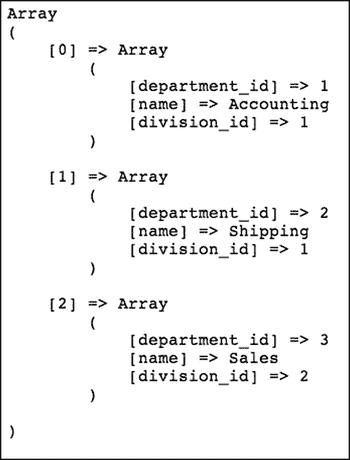

[图 5-1](#_Fig1) 。清单 5-1 中[运行程序的屏幕截图](#list1)

除了`PDO::ERRMODE_EXCEPTION`之外，我一直启用的另一个选项是`PDO::FETCH_ASSOC`，正如你在[清单 5-1](#list1) 中看到的，这样数组中返回的任何结果都只按列名进行索引。否则，默认情况下会有第二组按列号索引的元素，这是多余的。我还将`sql_mode`设置为`traditional`，将`innodb_strict_mode`设置为`on`，以强制对数据值进行更严格的检查。

我调用`htmlspecial`用 HTML 实体替换错误消息中的特殊字符(在`catch`块中)。这是一个方便的函数，我定义为

```php
function htmlspecial($s) {
    return htmlspecialchars($s, ENT_QUOTES, 'UTF-8');
}
```

我没有在每次访问数据库时重复 PDO 设置代码，而是将它放入一个函数中，在需要时可以调用，如[清单 5-2](#list2) 所示。这个函数在一个`DbAccess`类中，我将在接下来的几节中添加这个类。注意凭证的定义(`DB_HOST`等)。)都不见了；我马上告诉你他们去了哪里。

***[清单 5-2](#_list2)*** 。设置 PDO 的常用`getPDO`功能

```php
class DbAccess {

function getPDO() {
    static $pdo;

    if (!isset($pdo)) {
        $dsn = 'mysql:host=' . DB_HOST . ';port=' . DB_PORT .
          ';dbname=' . DB_NAME;
        $pdo = new PDO($dsn, DB_USERNAME, DB_PASSWORD);
        $pdo->setAttribute(PDO::ATTR_ERRMODE,
          PDO::ERRMODE_EXCEPTION);
        $pdo->setAttribute(PDO::ATTR_DEFAULT_FETCH_MODE,
          PDO::FETCH_ASSOC);
        $pdo->exec('set session sql_mode = traditional');
        $pdo->exec('set session innodb_strict_mode = on');
    }
    return $pdo;
}

}
```

该函数将 PDO 对象保存在一个静态变量中，以防它在 PHP 程序中被多次调用。在`getPDO`中根本没有检错。实例化失败(`new`操作符)总是会导致异常，并且，一旦`PDO::ERRMODE_EXCEPTION`被设置，所有其他失败的 PDO 调用也会如此。

我通常不希望一次得到整个结果集，这是函数`PDO::fetchALL`给我的。我几乎总是想一次处理一行，如[清单 5-3](#list3) 所示，它调用了`PDO::fetch`。注意，它使用了`DbAccess`类和`getPDO`方法。它生成 HTML 来格式化结果，而不仅仅是将结果转储出来，如图 5-2 所示。

***[清单 5-3](#_list3)*** 。按行检索结果集

```php
try {
    $db = new DbAccess();
    $pdo = $db->getPDO();
    $stmt = $pdo->prepare('select * from department');
    $stmt->execute();
    echo '<table border=1>';
    $first = true;
    while ($row = $stmt->fetch()) {
        if ($first) {
            echo '<tr>';
            foreach ($row as $attr => $val)
                echo "<th>$attr";
            $first = false;
        }
        echo '<tr>';
        foreach ($row as $attr => $val)
            echo "<td>$val";
    }
    echo '</table>';
}
catch (PDOException $e) {
    die(htmlspecialchars($e->getMessage()));
}

```

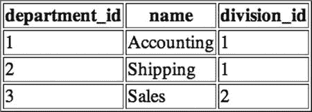

[图 5-2](#_Fig2) 。检索到的 HTML 格式的结果集

关于[清单 5-3](#list3) 中的 HTML，我已经跳过了周围的 HTML ( `<!doctype ...>`、`<html>`、`<head>`等)。).这是草率的，不是我在产品代码中会做的事情，但是我在测试代码和小例子中一直这样做。我还跳过了像`<tr>`和`<th>`这样的元素的结束标记，但这是完全合法的，省去了试图让所有内容正确匹配的麻烦。我也大多省略段落的结尾`</p>`，因为它们也是可选的。(一些 HTML 编码人员出于风格考虑，更喜欢以段落结尾。)我通常也会省略 HTML 属性值周围的可选引号(例如`<table border=1>`)，因为 PHP 程序已经被单引号和双引号搞得过于混乱了。

数据库凭证

询问任何 web 程序员数据库凭证应该放在哪里，您会被告知永远不要将它们放在使用它们的数据库访问代码所在的文件中。不过，这一建议的理由并不充分。关于 web 服务器意外地以纯文本的形式提供 PHP 程序，或者在 web 站点上访问源代码的人能够看到用户名和密码，或者如果您发布或以其他方式分发源代码时意外地发布了它们。

只有最后一点对我真正有意义。因为凭证必须放在服务器上的某个地方，任何人都可以访问服务器上的所有文件。Web 服务器不以文本形式提供 PHP 程序，而是将它们传递给 PHP 处理器执行。断开的 web 服务器可能会显示文本，但是，一旦设置正确，web 服务器就不会中断。

也许将数据库凭证放在它们自己的文件中并放在一个标准位置的最好理由是，服务器上所有相关的应用程序都可以访问它们。这就是我所做的，尽管，正如我所说的，给我增加的安全是最小的。

文件应该有一个“.php”扩展名，以防它被直接访问。使用类似于“.”的扩展名。include”是危险的，因为如果它在服务器的文档树中，它*将*作为纯文本提供。你通常可以把它放在树之外，但并不总是这样，因为主机服务可能不允许你访问任何其他目录。

无论如何，为了谨慎起见，我将凭证放在一个名为`credentials.php`的文件中，并在可能的时候将它们放在文档树之外。(更好的名字可能更难猜，比如`X56-2345-QR77-J654.php`，但这真的太离谱了。)

[清单 5-4](#list4) 显示了我在`DbAccess`类前面执行的代码，它在几个地方寻找凭证文件。如果它没有找到它们，它会尝试环境，这就是亚马逊的弹性豆茎放它们的地方。如果这不起作用，它将它们定义为伪值，以防我想测试该路径(例如，用 PHPUnit)。

***[清单 5-4](#_list4)*** 。正在搜索`credentials.php`文件

```php
foreach (array(
  "/.config/credentials.php",
  "{$_SERVER['DOCUMENT_ROOT']}/../.config/credentials.php",
  "{$_SERVER['DOCUMENT_ROOT']}/.config/credentials.php",
  "../.config/credentials.php",
  "../../.config/credentials.php"
  ) as $f)
    if (file_exists($f)) {
        require_once $f;
        break;
    }
if (!defined('DB_HOST')) {
    if (isset($_SERVER['RDS_HOSTNAME'])) {
        // Amazon Elastic Beanstalk
        define('DB_HOST', $_SERVER['RDS_HOSTNAME']);
        define('DB_PORT', $_SERVER['RDS_PORT']);
        define('DB_NAME', $_SERVER['RDS_DB_NAME']);
        define('DB_USERNAME', $_SERVER['RDS_USERNAME']);
        define('DB_PASSWORD', $_SERVER['RDS_PASSWORD']);
    }
    else { // force an error, mostly for PHPUnit
        define('DB_HOST', 'no host');
        define('DB_PORT', 0);
        define('DB_NAME', 'no db');
        define('DB_USERNAME', 'no user');
        define('DB_PASSWORD', 'no password');
    }
}
```

我把清单 5-4 中的[代码和其他公共代码，比如`DbAccess`的`require_once`语句，放在一个名为`common.php`的文件中，我的每个 PHP 应用程序文件都包含这个文件。对于这本书，所有内容都放入 EPMADD 名称空间](#list4)，所以我的 PHP 文件如下开始:

```php
namespace EPMADD;
require_once 'lib/common.php';
```

并不是每个文件都需要`common.php`中的所有内容，但是我不会费心把它们分开。如果您认为自己的`common.php`文件已经变得太大，并且开始影响执行时间，那么您可以这样做。

为了完成这个故事，我的`credentials.php`文件包含了你所期望的内容。

```php
define('DB_HOST', 'localhost');
define('DB_PORT', '3306');
define('DB_NAME', 'mydb');
define('DB_USERNAME', 'root');
define('DB_PASSWORD', '...');
```

每台服务器(开发平台，亚马逊 EC2，A2 托管等。)有自己的`credentials.php`文件，如果有几个应用程序的话，有时会有几个。

还有一件事:即使有人得到了我的 MySQL 密码，他们也不能从服务器以外的任何地方访问数据库本身，因为只允许从`localhost`访问。您可以通过 SSH 连接 MySQL Workbench 或 UNIX shell 来解决这个问题，但是 SSH 比 MySQL 安全得多，所以这不是问题。

使用 PDO 执行 SQL 语句

在[清单 4-17](#list17) 中，当我添加触发器时，我展示了用于执行不返回结果集的 SQL 语句的`PDO::exec`方法，比如`drop trigger`。在这一章中，在清单 5-1 和 5-3 中，我展示了另外两个一起使用的方法:`PDO::prepare`，准备一个 SQL 语句，和`PDOStatement::execute`，执行它。你可以用`PDO::query`同时做这两个步骤，我还没有展示。

为了解释为什么做同样的事情有三种方法，我将从两步方法开始，然后再到其他方法。

`PDO::prepare`将一条 SQL 语句作为参数，尽可能多地处理它，而不实际执行它。这意味着编译它，分析它，想出一个执行它的计划，尽可能的聪明。它可能会对连接进行重新排序以提高处理效率，重新安排部分`where`子句，使用索引，以及其他任何它足够聪明可以解决的问题。完成这些后，它返回一个名为`PDOStatement`的 PDO 对象，这就是为什么在清单 5-1 和 5-3 中我将返回值赋给了一个名为`$stmt`的变量。

如果需要多次执行那个语句，可以只准备一次，然后调用`PDOStatement::execute`来执行。这样可以节省时间，但是，根据我的经验，这种情况很少发生。不过，这是值得记住的。

使用 prepare + execute 的真正动机是完全不同的:您可以使用参数化查询，这一点非常重要，就像本书中的任何内容一样，它几乎是一条绝对的规则。如果 SQL 语句的任何部分包含运行时提供的值，请始终使用参数化查询。我这样做有两个原因:

*   这使得处理字符串更加容易，因为您不必担心使用`PDO::quote`方法引用。事实上，如果你的代码中有`PDO::quote`，你就没有遵守我的规则。
*   它阻止了 SQL 注入。

SQL 注入是一个聪明的技巧，用户将 SQL 片段放入表单字段，试图改变传递给数据库的 SQL，从而破坏或危及安全性。数据库编程书籍的作者对此大加赞赏，大多数人建议使用`PDO:quote`或`mysqli::real_escape_string`，如果你正在使用那个 API 的话。使用这些功能很笨拙，而且很容易忘记这样做，所以 SQL 注入是一个问题。

编造 SQL 注入的例子很有趣。一个常见的是把

```php
'; drop person; --
```

在名称字段中，比如说。假设提交了 PHP 表单，该字段的值以 PHP 变量`$name`结束，程序员编写了

```php
$pdo->query("update person set name = '$name'");
```

当 PHP 代入`$name`的值时，查询结果是

```php
$pdo->query("update person set name = ''; drop person; --'");
```

您应该感到害怕，因为这个恶意用户已经知道如何删除`person`表。这是一个有趣的例子，但它不会起作用，因为`PDO::query`只处理一条语句，大多数其他 SQL APIs 也是如此。

好吧，那么用下面的方法来检查密码是否有效呢:

```php
$pdo->query("select userid from user where
  password = '$password'");
```

(我暂时不考虑密码应该被散列。)用户可以在密码字段中键入以下内容:

```php
' or 'x' = 'x
```

变量替换后得出

```php
$pdo->query("select userid from user where
  password = '' or 'x' = 'x'");
```

答对了。条件为真，检索到`userid`，用户已经闯入。

你可能会说用户不知道包含用户信息的表的名称，不知道程序内部的 SQL 是如何编写的，等等。然而，今天的许多应用程序都是开源的(例如，用于博客的 WordPress)，所以在许多情况下，用户确实拥有这些信息。做大量的尝试来找出合适的东西也是有效的，甚至有破解程序可以自动做到这一点。

嗯，我可以继续下去，但是你可以用一个简单的规则 100%排除 SQL 注入的所有可能性:*永远不要把任何包含数据值的 PHP 变量放在传递给任何采用 SQL 语句的方法的字符串中。*(分别是`PDO::exec`、`PDO::prepare`、`PDO::query`)。)

为了帮助您遵守规则，请始终将 SQL 语句放在单引号中。你仍然可以用串联操作符(`.`)来绊倒自己，但是这需要足够的工作，所以也许你会意识到你违反了规则。

那么，如何动态构建 SQL 语句，使其包含用户输入的值呢？用*参数化查询*。每当您想要替换一个值时，请在标识符前加一个冒号，不带引号，如下所示:

```php
$stmt = $pdo->prepare('select userid from user where
  password = :pw');
```

注意，我使用了`prepare`，而不是`query`，因为只有`prepare`接受参数。另外，请注意我使用了单引号。

您用`PDOStatement::execute`执行语句:

```php
$stmt->execute(array('pw’ => $password));
```

数组中的元素数量必须与参数数量完全相同，并且所有名称必须匹配。

我所做的是剥夺 PHP 进行字符串替换的机会。参数`pw`的替换由 PDO 接口执行。如果有人输入密码

```php
' or 'x' = 'x
```

嗯，你知道，这其实是一个很好的密码。这就是它的全部—只是数据，而不是 SQL。

我的建议是，不要问自己一个 SQL 语句是否会涉及字符串替换，因此需要防范 SQL 注入。那只是那种浪费时间、消耗大脑能量、导致错误的额外思考。总是将 SQL 语句放在单引号中，永远不要在 SQL 语句中使用 PHP 变量，并且总是使用`PDO::prepare`后跟`PDOStatement::execute`。假以时日，它将成为第二天性。

事实上，我并没有直接调用这些 PDO 方法，因为在我的`DbAccess`类中有一个方法为我完成了这项工作。我称之为`query`，尽管它适用于所有 SQL 语句，而不仅仅是查询。它在[清单 5-5](#list5) 中。

***[清单 5-5](#_list5)*** 。`DbAccess::query`方法

```php
function query($sql, $input_parameters = null, &$insert_id = null) {
    $pdo = $this->getPDO();
    $insert_id = null;
    if (is_null($input_parameters))
        $stmt = $pdo->query($sql);
    else {
        $stmt = $pdo->prepare($sql);
        $stmt->execute($input_parameters);
    }
    if (stripos($sql, 'insert ') === 0)
        $insert_id = $pdo->lastInsertId();
    return $stmt;
}
```

第一个参数`$sql`是您提供的 SQL 语句，当然，其中没有任何 PHP 变量。然后是`$input_parameters`，这是将被传递给`PDOStatement::execute`的同一个数组。第三个参数是一个自动增量值，我稍后会解释。

该方法每次都为自己调用`DbAccess` :: `getPDO`，但是回想一下[清单 5-2](#list2) 中的内容，如果已经建立了数据库连接，那么该函数是即时的。

因为这个方法将由计算机执行，如果没有输入参数，我就调用`PDO::query`来节省一点时间。(回想一下我的建议，如果您自己直接编写 PDO 调用，就不要进行这种区分。)不然我叫`prepare` + `execute`。

如果 SQL 语句是一个`insert`，如果其中一个列(假设是一个代理键)是自动递增的，那么可能会有一个自动递增值。如果是这样，它将通过函数的第三个参数`$insert_id`返回，因为调用者可能想知道主键是什么，以防新插入的行需要被其他 SQL 操作引用。(注意，比较使用的是`===`，而不是`==`，因为如果没有匹配，它将返回`false`，当使用`==`时，它等于零。)

在我的应用程序代码中，我将`DbAccess::query`用于 100%的 SQL 语句。我从来不直接叫`PDO::exec`、`PDO::query`或`PDO::prepare`。

这里有一个对`DbAccess::query`的调用，取自我在“页面框架使用”一节中介绍的一个例子(它做什么现在并不重要)。

```php
$stmt = $this->db->query('delete from member where
      member_id = :member_id',
      array('member_id' => $_REQUEST['pk']));
```

有了参数化查询提供的所有保护，我可以直接将表单数据从 PHP 存放表单数据的`$_ REQUEST`数组发送到`DbAccess::query`，而不需要使用引号。它干净、高效、绝对安全。

处理数据库插入和更新

假设你有一个类似于图 5-3 中的表单，取自我在“页面框架使用”一节中展示的一个示例应用程序T3】


[图 5-3](#_Fig3) 。示例表单

要输入新记录，用户单击 new 按钮得到一个空表单。填写完毕后，单击 Save 按钮将其插入数据库。要更新一条记录，有一种方法(图中未显示)可以将其数据输入表单，此时用户更改一些数据并单击 Save。这里的要点是，保存可能是插入一个新记录或更新一个现有记录。

您看不到它，但是，当检索现有记录时，它的主键被放入表单中的隐藏字段。在点击 submit 按钮(这里是 Save 按钮)时 PHP 放置表单数据的`$_POST`数组中，隐藏字段中主键数据的存在表示应该进行更新，不存在表示插入。

因此，很容易将 PHP 代码写到`insert`或`update`，它们是单独的 SQL 语句。如果主键是一个代理键，这在我的应用程序中很常见，那么在`insert`之后找出它是什么就很方便了，这是由`DbAccess::query`提供的，如我在[清单 5-5](#list5) 中所示。例如，如果您想在另一个表中插入一行，而第一个表与该表有关系，需要引用一个外键(您刚刚得到的主键)，那么您可能需要该键。

与其决定你是需要一个`insert`还是一个`update`，不如使用一个叫做 *upsert* 的语句。您提供数据，语句更新现有的行，或者，如果没有行，插入一个新行。MySQL 提供了一个 upsert 特性，在它的`insert`语句后面附加了一个`on duplicate key`子句，如下所示，其中`person_id`是代理主键:

```php
insert into person (person_id, last, first)
values (1234, 'Smith', 'John')
on duplicate key update
last = 'Smith',  first = 'John'
```

因为主键 1234 是已知的，所以这一定是由从现有记录填充的表单产生的。因为已经有一行具有该键，所以它是重复的，并且执行了`update`子句。

如果表单最初为空，则没有预先存在的主键，因此`upsert`可能如下所示:

```php
insert into person (person_id, last, first)
values (NULL, 'Smith', 'John')
on duplicate key update
last = 'Smith',  first = 'John'
```

这里没有重复的键，所以执行`insert`。

看起来 MySQL 的 upsert 做了我们想要的，但是有一个问题。回想一下，在第 4 章的[中，我说过如果你在已经有一个自然候选键的情况下定义了一个代理主键，你应该在候选键上放置一个唯一的约束来防止重复。假设您已经为自然键`(last, first)`完成了这一步。如果用户试图为 John Smith 插入新记录，而那里已经有一个 John Smith，那么即使您没有提供代理键，也将执行更新。为什么呢？因为该子句显示“无重复键](4.html)”，而不是“无重复*主键*”更糟糕的是，如果你试图获取代理键，因为它应该是一个新行，你需要代理键，方法`PDO::lastInsertId`(出现在[清单 5-5](#list5) )不会给你，因为没有插入。等等，还有更多:如果重复键是一个意外，你不会从 MySQL 得到一个违反约束的错误，所以你不能警告用户。简而言之，除了主键以外，任何键的存在都可能造成严重破坏。

如果主键是自然的，情况似乎会更好。我不认为`(last, first)`是一个非常好的自然键，因为相同的名和姓太常见了。尽管如此，如果这是自然键，当键是新的时插入一行并更新一个现有的行是正确的行为，并且`upsert`语句会自动这样做。

然而，仍然有一个问题:如果有一个名字的改变——约翰·史密斯结婚了，并决定使用他新丈夫的名字——它将被视为一个插入，现在新婚的约翰·多伊在数据库中有两个记录。但这确实是自然键选择不当的问题，而不是 upsert 语句本身的问题。这是我通常更喜欢代理键的一个原因。有了代理键，对任何(自然)列的任何更改都很简单。

所以，我希望我已经说服了您，MySQL upsert 语句充满了特殊情况和奇怪的副作用，除了您有一个简单、自然的键之外，它不值得使用。取而代之的是，当行是新的时候使用普通的`insert`，当你正在更新的时候使用`update`。听起来很简单，事实也确实如此，尤其是与我花了六段时间来解释`upserts`的危害相比。

如你所料，我不会到处都编码`inserts`和`updates`的序列。我有一个单一的方法，`DbAccess::update`，，来为我做这个工作。与`DbAccess::query`不同，它不使用 SQL 语句，而是使用一个规范来构造和执行适当的语句。这是它的声明。

```php
DbAccess::update($table, $pkfield, $fields, $data,
  &$row_count = null)
```

第一个参数是要更新的表的名称，第二个参数是它的主键列，假设它是一个单列，对我来说总是这样。然后是要插入或更新的列的数组，然后是包含列值的另一个数组。为`$data`参数提供`$_POST`、`$_GET`或`$_REQUEST`是很常见的，尽管您也可以为调用合成一个数组。最后一个可选参数是受影响行数的计数，因此您可以通过检查其值是否为 1 来验证`insert`或`update`是否正常工作。(如果主键与任何记录都不匹配，那么`update`不会做任何事情，所以它不是会抛出异常的错误。)

假设您有一个俱乐部成员的表单，其中可能包含新成员的数据(开始时为空，隐藏字段中没有存储主键)，或者可能包含现有成员的更新数据。然后，当收到提交的表单时(例如，单击了 Save 按钮)，您将执行这条语句。

```php
$pk = $this->db->update('member', 'member_id',
  array('last', 'first', 'street', 'city', 'state',
  'specialty_id'), $_POST);
```

表是`member`，主键是`member_id`，要插入或更新六个字段(不包括代理键，`member_id`)，这些字段的值可能在`$_POST`数组中。我说“可能”是因为如果`member_id`不在表单中，它的值就不会出现。该方法判断是否需要一个`insert`或`update`，执行它，然后如果它是一个`insert`并且主键是一个代理，则返回主键的值。

看起来可能是一个奇怪的方法，但是它准确地反映了我是如何处理保存按钮的，并且我一直都在使用它。

清单 5-6 显示了`DbAccess::update`的代码。

***[清单 5-6](#_list6)*** 。`DbAccess::update`方法

```php
function update($table, $pkfield, $fields, $data,
  &$row_count = null) {
    $input_parameters = array();
    $upd = '';
    foreach ($fields as $f) {
        if (!isset($data[$f]) || is_null($data[$f]))
            $v = 'NULL';
        else {
            $v = ":$f";
            $input_parameters[$f] = $data[$f];
        }
        $upd .= ", $f=$v";
    }
    $upd = substr($upd, 2);
    if (empty($data[$pkfield]))
        $sql = "insert $table set $upd";
    else {
        $input_parameters[$pkfield] = $data[$pkfield];
        $sql = "update $table set $upd
          where $pkfield = :$pkfield";
    }
    $stmt = $this->query($sql, $input_parameters, $insert_id);
    $row_count = $stmt->rowCount();
    return $insert_id;
}
```

`foreach`循环建立了一个参数赋值列表——而不是实际值！—添加到`$fields`参数中的列。也就是说，如果列`last`被列出，如果在`$data`数组中有一个非空值，赋值将是`last=:last`，否则赋值为`last=NULL`。它还从`$data`获取值，并将其放入`$input_parameters`。这是必需的，因为`$input_parameters`的元素必须与 SQL 语句中的命名参数完全匹配。对于为`$data`传递的任何内容来说，都有可能包含额外的元素，尤其是当它是`$_REQUEST`时，这种情况甚至很常见。这个函数做了更多的工作，所以使用它更容易。

构建列表的方式在前面添加了额外的逗号和空格，因此对`substr`的调用会删除它们。

现在做出决定:如果在`$data`数组中没有指定主键，那么语句将是一个`insert`；否则，一个`update`。在后一种情况下，主键的元素被添加到`$input_parameters`，因为该参数在 update 语句的`where`子句中被引用。

注意，我利用了非标准的 MySQL `insert`语句，该语句允许赋值列表，就像`update`一样。这节省了标准形式的`insert`所需的几行代码，标准形式的【】需要一个列列表和一个带有值列表的`values`子句。

执行参数化语句的实际工作由`DbAccess::query`完成。剩下的就是设置行数并返回以插入 ID 的方式提供的任何内容。

您可能已经注意到 SQL 字符串包含 PHP 变量替换，这似乎违反了我的规则。然而，该规则是关于包含数据值的变量的。这些 PHP 变量都没有:它们是表名、列名和参数名，没有一个来自用户。值本身被隔离在`$input_parameters`数组中。

在我的应用程序中，`DbAccess`、`query`和`update`这两个主要方法处理了大约 99%的 MySQL 接口。从两个非常小的函数中可以看出很多！

PHP-浏览器交互

现在是时候研究一个运行在服务器上的 PHP 程序如何与运行在客户机上的浏览器交互了。(在开发系统的情况下，服务器是本地的，区分服务器和客户机仍然是有用的。)接下来的大部分内容对你来说都很熟悉，但无论如何，请听听我要说的话，即使是一篇综述，因为这将有助于理解用户如何与 PHP 应用程序交互。

HTTP 如何工作

基本上，HTTP 是这样工作的:当你在浏览器的 URL 字段中键入一个 URL 时，浏览器通过在一个名为 DNS(域名服务)的目录服务中查找其名称(例如`basepath.com`)来找到其 IP 地址，然后通过一个名为 TCP/IP 的通信协议连接到你指定的服务器。一旦建立了连接，浏览器和服务器就可以交换消息。最初，服务器在监听——浏览器应该先走。

通常，浏览器会向服务器发送一条`GET`消息。你可以自己尝试一下，不用浏览器，打开一个到服务器的`telnet`会话，自己输入`GET`命令。在一个*nix(类 UNIX)系统上，包括 Mac OS，从你运行的任何终端应用程序，你使用一个叫做`telnet`的命令。在 Windows 上，您可能必须从控制面板小程序程序和功能安装它；点击“打开或关闭 Windows 功能”，然后勾选 Telnet 客户端，如图[图 5-4](#Fig4) 所示。

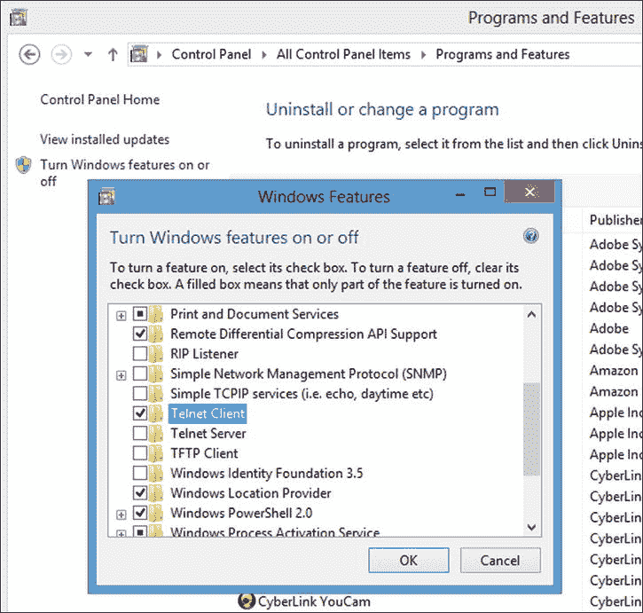

[图 5-4](#_Fig4) 。在 Windows 上安装 Telnet

这是我放在文件`dump.php`中`basepath.com`上的一个 PHP 程序。

```php
<?php
print_r($_REQUEST);
?>

```

我通过`telnet`(当然是在客户端)执行它，如[清单 5-7](#list7) 所示；我打的是黑体字。

***[清单 5-7](#_list7)*** 。`GET`通过`telnet`输入的请求

```php
$ telnet `basepath.com` 80
Trying 75.98.162.194...
Connected to basepath.com .
Escape character is '^]'.
GET /dump.php?p1=mustard & p2=pepper HTTP/1.1
Host: `basepath.com`

HTTP/1.1 200 OK
Date: Fri, 17 May 2013 15:43:09 GMT
Server: Apache
X-Powered-By: PHP/5.3.8
Transfer-Encoding: chunked
Content-Type: text/html

31
Array
(
    [p1] => mustard
    [p2] => pepper
)

0

Connection closed by foreign host.
$
```

注意，在输入了**主机**行之后，我必须按两次回车键。(由于分页符的原因，您看不到这两个空行。)服务器返回一个以`HTTP/1.1 200 OK`开始的响应，后面是一些被称为头的行。数字`31`是第一个块中的字符数，因为 Transfer-Encoding 头表示数据将分块存储。只有一大块，然后计数为零表示没有更多。你会认出第一个块是 PHP 程序写的。它只是`print_r`函数的输出；我没有用 HTML 把它包围起来。

注意，在我输入的`GET`行中，我提供了两个参数，`p1`和`p2`，它们被 PHP 自动放到全局`$_REQUEST`数组中。实际上，它们在`$_GET`数组中，但是`$_REQUEST`同时包含了`$_GET`和`$_POST`(我将对此进行解释)。

正如我所展示的，当浏览器发出一个`GET`时，参数与 URL 在同一行，这是你所熟悉的，因为你已经在浏览器的 URL 字段中多次看到这样的参数。这是将参数放在那里的一个缺点:用户可以看到它们。他们也进入历史和书签。

为了更加隐私，浏览器可以使用`POST`，而不是`GET`，并在发送给服务器的消息中输入参数。那么它们在浏览器 URL 字段、历史记录或书签中都不可见。[清单 5-8](#list8) 显示了与之前相同的两个参数，但是输入了一个`POST`请求。这一次 PHP 将它们放入`$_POST`数组和`$_REQUEST`数组。出于某种原因，这次来自服务器的响应没有被分块。不管怎样，这不是你关心的事情，因为处理服务器发送的内容是浏览器的工作。

***[清单 5-8](#_list8)*** 。`POST`通过`telnet`输入的请求

```php
$ telnet `basepath.com` 80
Trying 75.98.162.194...
Connected to basepath.com .
Escape character is '^]'.
POST /dump.php HTTP/1.1
Host: `basepath.com`
Content-Type: application/x-www-form-urlencoded
Content-Length: 21

p1=mustard& p2=pepper
HTTP/1.1 200 OK
Date: Fri, 17 May 2013 15:40:48 GMT
Server: Apache
X-Powered-By: PHP/5.3.8
Content-Length: 50
Content-Type: text/html

Array
(
    [p1] => mustard
    [p2] => pepper
)
Connection closed by foreign host.
$
```

你应该总是让你的表单使用`POST`，你会发现不在表单中的按钮和锚点(HTML `<a ...>`元素)使用`GET`是最简单的。(也有可能让他们用`POST`。)

PHP 和表单

除了我刚才展示的例子，你不能通过`telnet`与 web 服务器交互。发生的情况是，PHP 程序，或运行在服务器上的其他东西，可能是一个静态的 HTML 页面，在浏览器显示的页面上放置一些交互元素，然后，当用户单击该元素时，一个`GET`或`POST`被发送。它调用 PHP 程序，PHP 程序做一些处理，然后发送一些 HTML 到浏览器。等等，等等。。。这就是应用程序的工作方式。

最常见的交互元素是表单，毫无疑问您已经使用过了。例如，在[清单 5-9](#list9) 中有一个，显示在屏幕上的[图 5-5](#Fig5) 中，其中有我输入的一些数据。(没有显示布局表单的一些 CSS。)

***[清单 5-9](#_list9)*** 。简单的形式

```php
echo <<<EOT
    <form action=dump.php method=post accept-charset=UTF-8>
    <label for=p1>p1:</label>
    <input type=text size=50 name=p1 id=p1>
    <label for=p2>p2:</label>
    <input type=text size=50 name=p2 id=p2>
    <input type=submit name=button_name value='Click Me'>
    </form>
EOT;

```


[图 5-5](#_Fig5) 。带有输入数据的表单

注意，表单的动作被设置为`dump.php`，这个程序与`telnet`请求执行的程序相同，它将您期望的内容写入浏览器。

```php
Array ( [p1] => hotdog [p2] => pickle [button_name] => Click Me )
```

当我编码时，我经常转储出`$_REQUEST`数组来查看什么进入了 PHP 程序，然后使用它作为发送了什么参数以及它们的名称的指南。当然，一旦我运行了这个程序，我就会删除转储代码。在本例中，您可以看到单击表单的提交按钮向`$_REQUEST`数组添加了一个元素`button_name`，这意味着该按钮被单击了；否则，元素就不会存在。我不在乎它的价值，只在乎它的名字。在我的代码中，每个按钮都有一个不同的名称，我用它来确定点击了什么。另一种方法是使用值，但是，由于值被用户视为按钮的标签，因此它会随着用户界面的调整而被修改，如果应用程序是本地化的，甚至会被翻译。所以，用这个名字。

通常最好将与一个表单相关的所有交互保存在同一个 PHP 文件中，而不是让表单的动作成为一个完全不同的文件，如清单 5-9 中的。将处理代码与表单保存在同一个文件中增加了内聚力；您最终会得到一堆非常独立的微型应用程序，每个都在自己的文件中，并且每个都只与数据库通信。正如我在[第一章](1.html)中提到的，数据库中心性允许并行开发，减少模块间的耦合，并且方便调试和测试。(凝聚力好；耦合不好。)

因此，大多数主 PHP 文件(不包括包含的类和其他公共代码)在顶部都有一些代码，以便在单击任何按钮时执行操作，或者在没有参数的情况下调用文件时生成一些输出。通常，即使采取了某个操作，也会生成该输出。例如，如果提交的表单导致新的一行被添加到表中，最好再次显示该表单，以防用户想要进行一些更改。

考虑到这一点，图 5-5 中的表单可以由[清单 5-10](#list10) 中所示的微型应用程序来处理，它是按照我的建议来组织的:一个处理任何按钮点击的动作部分，后面是一个显示部分。

***[清单 5-10](#_list10)*** 。表单显示后的动作处理

```php
if (isset($_REQUEST['button_name'])) {
    echo <<<EOT
        Button was clicked.
        <br>p1: {$_REQUEST['p1']}
        <br>p2: {$_REQUEST['p2']}
EOT;
}
echo <<<EOT
    <form action="{$_SERVER['PHP_SELF']}" method=post
      accept-charset=UTF-8>
    <label for=p1>p1:</label>
    <input type=text size=50 name=p1 id=p1>
    <label for=p2>p2:</label>
    <input type=text size=50 name=p2 id=p2>
    <input type=submit name=button_name value='Click Me'>
    </form>
EOT;
```

注意，表单动作现在是`$_SERVER['PHP_SELF']`，它将提交的数据发送回同一个文件。顶部的代码截取一个按钮点击，进行处理——在本例中不太多——并重新显示表单。它是空白的，因为我没有为两个表单字段编写任何`value`属性来用提交的数据填充它们。[图 5-6](#Fig6) 显示了输出。


[图 5-6](#_Fig6) 。空白表单后的动作处理输出

到目前为止，这个程序只有一个按钮还可以，但是随着按钮越来越多，文件顶部的`if`语句开始堆积，很快就会变得一团糟。[图 5-7](#Fig7) 显示了这样一种形式。

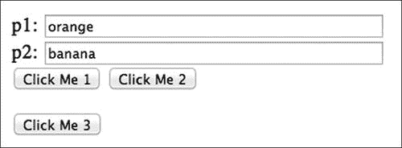

[图 5-7](#_Fig7) 。有三个按钮的表单

处理几个按钮的一个简单方法是采用惯例，动作按钮的名字以`action_`开头。然后，文件顶部的代码可以简单地遍历`$_REQUEST`数组，查找以`action_`开头的名字，并以该名字调用函数。这允许每个按钮的动作被放入它自己的功能中，这比一系列的`if`语句要干净得多。就几行而已。

```php
foreach ($_REQUEST as $name => $value)
    if (strpos($name, 'action_') === 0)
        $name();
```

例如，如果 Click Me 2 按钮的 name 属性是`action_button2`，那么它的动作代码将进入一个同名的函数中。

```php
function action_button2() {
    echo <<<EOT
        <p>Button 2 was clicked.
        <p>{$_REQUEST['p1']} -- {$_REQUEST['p2']}
EOT;
}
```

清单 5-11 显示了整个程序。注意，第三个按钮是独立的，不在表单中，所以在一个`form`元素上没有`action`属性来指示应该调用什么文件，而前两个按钮有。相反，`onclick`事件的 JavaScript 改变浏览器的`window.location`，这导致它请求指定的 URL。正如我所说，在这种情况下，将参数放在那里也是最容易的，所以它们将进入 PHP 程序的`$_GET`数组，而不是`$_POST`数组。但是，程序使用了`$_REQUEST`数组，所以它不关心。

***[清单 5-11](#_list11)*** 。一个有三个按钮的窗体程序

```php
foreach ($_REQUEST as $name => $value)
    if (strpos($name, 'action_') === 0)
        $name();
echo <<<EOT
    <form action="{$_SERVER['PHP_SELF']}" method=post
      accept-charset=UTF-8>
    <label for=p1>p1:</label>
    <input type=text size=50 name=p1 id=p1>
    <label for=p2>p2:</label>
    <input type=text size=50 name=p2 id=p2>
    <br>
    <input type=submit name=action_button1 value='Click Me 1'>
    <input type=submit name=action_button2 value='Click Me 2'>
    </form>
    <button onclick='window.location="{$_SERVER['PHP_SELF']}\
?action_button3=1&p3=cake"'>
Click Me 3
</button>
EOT;

function action_button1() {
    echo <<<EOT
        Button 1 was clicked.
        <br>{$_REQUEST['p1']} -- {$_REQUEST['p2']}
EOT;
}

function action_button2() {
    echo <<<EOT
        Button 2 was clicked.
        <br>{$_REQUEST['p1']} -- {$_REQUEST['p2']}
EOT;
}

function action_button3() {
    echo <<<EOT
        Button 3 was clicked.
        <br>
EOT;
    print_r($_REQUEST);
}
```

[图 5-8](#Fig8) 和 [5-9](#Fig9) 显示了点击第一个和第三个按钮的输出。

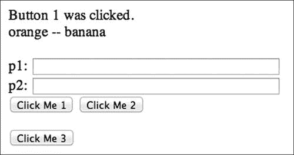

[图 5-8](#_Fig8) 。单击第一个按钮的输出

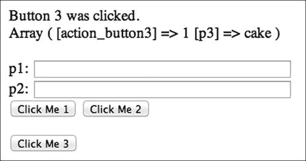

[图 5-9](#_Fig9) 。单击第三个按钮的输出

如果不明显的话，因为第三个按钮不在表单中，它与表单无关，任何输入表单的东西都不会随之进入 PHP 程序。也就是说，它不是一个提交按钮；它是独立式的。通常，像这样的按钮会把用户带到一些其他的迷你应用程序，比如从会员页面到捐赠页面。

表单文本字段和按钮只是许多可能的交互元素中的两种。有像复选框和选择列表这样的标准选项，也有像日期选择器这样的自定义选项。我将在第 6 章中讨论这些，因为我们现在只需要文本字段和按钮。过早地把事情复杂化是没有意义的。

整合表单和数据库

现在是整合我在本章中讲述的两个主题的时候了，数据库访问和表单。我已经重新标记了两个表单字段“last”和“first”，它们将保存一个`member`表的姓和名，该表的代理主键是`member_id`。[图 5-10](#Fig10) 显示了表单。


[图 5-10](#_Fig10) 。带有查找、新建和保存按钮的成员窗体

我将从一个显示表单的函数开始，该函数填充了来自参数数组`$data`的数据。它在[清单 5-12](#list12) 中。

***[清单 5-12](#_list12)*** 。函数来显示成员窗体

```php
function show_form($data) {
    $member_id = empty($data['member_id']) ? '' :
      $data['member_id'];
    $last = empty($data['last']) ? '' :
      $data['last'];
    $first = empty($data['first']) ? '' :
      $data['first'];
    echo <<<EOT
        <form action='{$_SERVER['PHP_SELF']}' method=post
          accept-charset=UTF-8>
        <label for=last>Last:</label>
        <input type=text size=50 name=last id=last
          value='$last'>
        <label for=first>First:</label>
        <input type=text size=50 name=first id=first
          value='$first'>
        <input type=hidden name=member_id value='$member_id'
          hidden>
        <br>
        <input type=submit name=action_find value='Find'>
        <input type=submit name=action_new value='New'>
        <input type=submit name=action_save value='Save'>
        </form>
EOT;
}
```

关于这个函数有两点需要注意。

*   如果数组中不存在用于保存传入数组中的值的变量，则必须将这些变量设置为空字符串，以避免出现关于引用不存在的元素的 PHP 错误消息。
*   `member_id`在表单的隐藏字段中传递。

在文件的顶部，我包含了公共代码，它引入了`DbAccess`。我不希望这个文件在`EPMADD`名称空间中，因为那会干扰动作函数的动态调用。有一种方法可以解决这个问题，但我不会为此而烦恼，因为很快我将展示一种完全不同的处理表单的方法，这种方法将使问题消失。

调用适当动作函数的代码与我之前展示的类似，只是这次我传入了对`DbAccess`实例的引用，并取回数据数组，该数组被传入`show` _form。它在[清单 5-13](#list13) 中。

***[清单 5-13](#_list13)*** 。文件顶部，显示调用动作函数和`show_form`

```php
require_once 'lib/common.php';
$db = new EPMADD\DbAccess();
$data = array();

foreach ($_REQUEST as $name => $value)
    if (strpos($name, 'action_') === 0) {
        $data = $name($db);
        break;
    }
show_form($data);
```

最后，[清单 5-14](#list14) 展示了三个动作函数，因为我在本章前面展示了`DbAccess`函数，所以没什么要做的。函数`action_new`特别有意思。

***[清单 5-14](#_list14)*** 。动作功能

```php
function action_find($db) {
    $last = empty($_REQUEST['last']) ? '' : $_REQUEST['last'];
    $stmt = $db->query('select member_id, last, first from
      member where last like :pat',
      array('pat' => "$last%"));
    if ($row = $stmt->fetch()) {
        return $row;
    }
    echo "<p>Not found";
    return array();
}

function action_new($db) {
    return array();
}

function action_save($db) {
    $db->update('member', 'member_id',
      array('last', 'first'), $_REQUEST);
    echo "saved";
    return $_REQUEST;
}
```

如果你仔细听了我的介绍，你可能会注意到一些严重的缺陷。

*   所有的错误都会抛出异常，但是我不会处理它们。
*   Find 按钮不使用名字字段，这对用户来说并不明显。
*   如果找到多行，则只显示第一行。
*   页面的外观可以得到实质性的改善。其中一些可以用 CSS 来完成，但是请注意，我甚至都懒得放入一些必需的 HTML ( `DOCTYPE`、`html`、`head`等等)。).

我不打算修复这些问题，因为整个程序只是一个例子，用来展示处理表单的 PHP 应用程序的一般结构。我保证在本章结束时，我会展示更好的代码，它们足够健壮，可以在您自己的应用程序中使用。

在获取和发布之间选择

在下一章，当我详细讨论安全性时，我会说你应该用`POST`而不是`GET`向网页传递参数。在表单中使用`POST`非常简单——您只需在`form`元素中指定`POST`——但是对于按钮和页面传输来说就复杂了，PHP 程序员通常使用`header`函数，参数在 URL 中指定。

我将在下一章中讨论所有这些复杂的问题，但是现在，在这一章中，我将使用`GET`,因为这可能是你所习惯的，尽管这不是最好的方法。最终都会解决的。

PHP 会话

从概念上讲，*会话*是用户和 web 服务器调用的一些 PHP 程序之间的一组相关交互。将它们联系起来的是，它们不仅可以通过数据库共享数据(任何可以访问数据库的代码都可以这样做)，还可以更直接地通过会话中的程序共享的一个名为`$_SESSION`的 PHP 数组共享数据。如果一个程序设置了一个元素`$_SESSION`，那么作为会话成员的任何其他程序也可以访问该元素。

让会话工作的诀窍是 PHP 将`$_SESSION`的内容存储在服务器上的一个私有文件中，这个文件有一个很难猜到的名字(例如，88734 ab 92 a 219031 C4 ACD 7 ea 6 ee 0 ff 83)，称为*会话 ID* 。每个会话都有一个唯一的名称。如果运行 web 浏览器的客户端知道该名称，它就可以访问会话，就像运行在同一服务器上的任何 PHP 程序一样。事实上，由于运行在任何服务器上的程序都可以模仿 web 浏览器，就像我在本章前面对`telnet`所做的那样，一旦名称被泄露，会话就被破坏了。而且，这个名字就是全部的保护——不需要密码或其他任何东西。

因此，要将会话限制为仅授权的客户端，即启动会话的实际人员，保持会话 ID 的私密性非常重要。当通过将 ID 存储在用户浏览器中的 cookie——一段命名数据——中来创建会话时，这是由 PHP 完成的。与大多数其他 cookie 不同，会话 cookie 保存在内存中，所以当浏览器退出时，cookie 和会话 ID 的记录也消失了。会话 ID 必须从服务器发送到浏览器一次，随着会话的进行，可能从浏览器发送到服务器很多次，因此，为了真正安全，整个会话应该加密，这意味着服务器应该设置为`https`访问，而不是普通的`http`。这被称为安全套接字层(SSL)会话。

想要作为会话运行的 PHP 应用程序应该命名会话，因此每个应用程序都有一个唯一的名称。这样，运行 Front Range Butterfly Club 应用程序的用户将与运行脸书的用户处于不同的会话中。您不必试图对会话名称保密，因为如果用户显示 cookies 列表，他或她就会看到它们。事实上，让名称具有描述性是一个好主意，这样用户就能知道这是哪个 cookie。在我的例子中，我使用了 EPMADD 这个名字(来自这本书的标题)。

因为浏览器执行时会有一个 cookie，所以每个应用程序(会话名)和用户都有一个会话。在数据库术语中，您可以将名称和用户视为复合主键，会话 ID 就是数据。如果你离开你的电脑一会儿，而我坐在它旁边，我可以访问你的 cookie 并得到你的会话 ID。但是，从我自己的电脑，你的饼干是完全无法访问的。即使我可以访问你的文件，那也是真的，因为正如我所说的，会话 cookies 保存在内存中。图 5-11 显示了一个真实的 cookie，由我的 Chrome 浏览器显示。

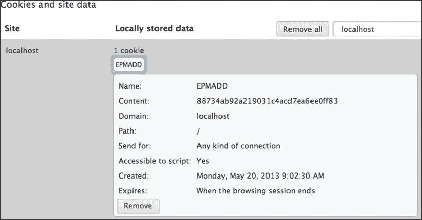

[图 5-11](#_Fig11) 。Chrome 浏览器显示的 Cookie

很明显，会话 id 必须是秘密的，并且组成应用程序的 PHP 程序可以访问它。Cookies 和 SSL 连接实现了这一点。通过在每个 URL 中包含会话 ID，也可以在没有 cookies 的情况下运行会话，但这会使它出现在您的 web 浏览器的 URL 字段中，因此这是一个非常糟糕的主意。您可能会不经意地将该链接通过电子邮件发送给某人，或者张贴到脸书，这可能不会造成任何伤害，但这仍然是一个安全漏洞。在我将要展示的代码中，我特别禁止 PHP 将会话 id 存储在 cookies 之外的任何地方。如果用户禁用了 cookies，应用程序将拒绝运行。

会话数据本身保存在服务器上的一个临时文件中。在我的开发系统上，我在应用程序中执行了以下语句:

```php
$_SESSION['somedata'] = 'I am some data';
```

然后，我找到了会话文件并查看了它的内容(`cat`是 UNIX 的 view-file 命令)。

```php
$ cat /Applications/MAMP/tmp/php/sess_88734ab92a219031c4acd7ea6ee0ff83
userid|s:4:"marc";somedata|s:14:"I am some data";
```

所以你可以看到会话没有什么神秘的。(我把`userid`也放在那里了；我很快会解释原因。)

启动 PHP 会话非常简单。两行代码就够了，但四行更好。

```php
ini_set('session.use_only_cookies', TRUE);
ini_set('session.use_trans_sid', FALSE);
session_name(SESSION_NAME);
session_start();
```

第一行强制只使用 cookies，另外，第二行阻止 PHP 在 URL 中包含会话 ID。然后我设置会话名，之前已经将常量`SESSION_NAME`定义为`EPMADD`。最后，`session_start`在浏览器发送的 cookiess 中寻找一个名为`EPMADD`的 cookie。如果找到了，它就有了会话 ID，并使用它从会话数据文件中设置`$_SESSION`，无论应用程序决定要共享什么。如果没有找到 cookie，就假设要创建一个新的会话，PHP 发送一个头以及 PHP 程序要发送给浏览器的任何其他内容，以创建 cookie。然后在下一次执行这个语句序列时使用它。

我将这四条语句放在一个名为`start_session`的`Page`类的方法中。(随着我们的进展，我会给`Page`类添加更多的东西。)

具有讽刺意味的是，销毁一个会话比创建一个会话要麻烦得多，例如，当用户注销时，您可能会想这么做。您必须做三件事:破坏`$_SESSION`数组，告诉浏览器处理 cookie，删除服务器上的临时数据文件。那是在方法`destroy_session`里。

```php
private function destroy_session() {
    $_SESSION = array();
    if (ini_get("session.use_cookies")) {
        $params = session_get_cookie_params();
        setcookie(session_name(), '', time() - 42000,
          $params["path"], $params["domain"],
          $params["secure"], $params["httponly"]);
    }
    session_destroy();
}
```

要删除 cookie，它将在大约 11 小时前过期。你用什么时间并不重要，但是，众所周知，最好的数字是 42。(详见著《银河系漫游指南》(潘出版社，1979)；实际上，我从官方 PHP 文档中复制了这段代码，这些文档是由大概知道如何破坏会话的人编写的。)

我的应用程序很少在`$_SESSION`中存储太多。如果我想跟踪用户的面包屑(他或她的导航路径)，或者最近的搜索，或者类似的事情，我会使用它。不过，我确实在那里存储了一个非常重要的东西:用户登录时的`userid`。我想把它显示在每一页的底部(或者顶部——由你决定),但是，更重要的是，我想看看它是否在那里。如果是，则有一个`$_SESSION`数组，这意味着有一个会话，如果有`userid`，则用户成功登录。这样的用户有权运行应用程序，无论我选择给他或她什么特权。

我在`Page`中有一个方法告诉我用户是否登录。

```php
protected function is_logged_in() {
    return !empty($_SESSION['userid']);
}
```

有些页面，如登录页面本身，不在会话中运行。`Page`类变量`$want_session`指示页面是否在会话中运行。因此，每个页面都在任何应用程序代码之前执行这个序列。

```php
if ($this->want_session && !$this->is_logged_in()) {
    $this->message("Not logged in.");
    echo '<div class=div-process></div>'; // to get spacing
    $this->bottom();
    exit();
}
```

方法`bottom`只是输出应用程序希望在页面底部显示的任何内容(比如用户标识)。

我提到过登录页面本身不在会话中运行。它验证用户的用户标识和密码，如果它们都是正确的，就启动会话。否则，它会报告一个无效登录，并给用户另一次机会，仍然没有会话。任何包含营销信息之类的页面也不必在会话中运行。但是应用程序本身可以。

只是为了完成`Page`中与相关的方法，这里有一个登录用户

```php
protected function login($login) {
    $this->start_session();
    $_SESSION['userid'] = $login;
}
```

另一个用于注销用户

```php
protected function logout() {
    $this->start_session();
    $this->destroy_session();
}
```

关于页面标题还有一件事，其中一个是在需要创建 cookie 时设置的:它们是*标题*，所以它们必须在浏览器的任何其他输出之前。如果你试图设置一个标题为时已晚，你会得到你一生中可能见过几次的信息。

```php
Warning: Cannot modify header information - headers already sent
```

这只是一个警告，但很严重，因为标头没有发送。因此，您必须在页面上的任何其他代码之前执行`Page::start_session`。看一下`Page::login`，你会发现它也必须在任何输出之前被调用，因为它调用了`Page::start_session`。`Page::logout`同上。正如我将要展示的，这些限制将影响`Page`产生输出的方式。

页面框架

所有应用程序的 HTML 页面都应该有一致的外观，并以统一的方式进行处理，以确保所有需要的处理都正确执行，例如确保用户正确登录。为此，我总是使用一个通用的页面结构，并从同一个页面模板驱动我的处理。我将在这里展示一个简单的方法，尽管它足够完整，我已经在实际应用程序中使用过了，您也可以使用它。

页面结构

我的每一个应用页面都由相同的五个分部组成，如图[图 5-12](#Fig12) 所示。T3】

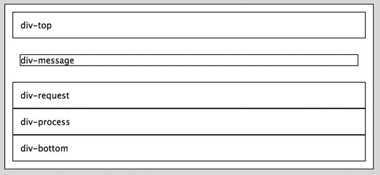

[图 5-12](#_Fig12) 。一页的分割

两个外部部分`div-top`和`div-bottom`，包含出现在每个页面上的标准项目，比如徽标、顶级菜单、版权声明、用户标识等等。有一个消息区，`div-message`，只用于 PHP 处理页面时生成的消息。我把这些放在顶部，这样用户可以很容易地发现它们。接下来是我称之为请求部分的部分，`div-request`，它用于页面最初显示的任何内容。通常它是一个搜索表单，用于请求用户想要处理的数据。最后，当页面后面的 PHP 执行一个请求时，它在`div-process`部分显示输出，通常是另一种形式。如何使用最后两个部分因页面而异，有些页面只使用其中一个。

由于划分的位置和外观是由 CSS 控制的，所以您可以更改它们的外观，而无需篡改应用程序代码本身。特别是，您可以对台式机和笔记本电脑使用一种布局，而对通常屏幕小得多的移动设备使用另一种布局。

[图 5-13](#Fig13) 显示了(虚构的)Front Range Butterfly Club 的会员页面。logo、俱乐部名称、菜单栏在`div-top`，底部的通知和链接在`div-bottom`。没有消息，所以`div-message`是隐藏的。查找会员记录的表单和查找、新建按钮在`div-request`中，`div-process`为空。


[图 5-13](#_Fig13) 。初始成员页面

单击 Find 按钮会导致应用程序检索姓氏以“s”开头的成员的所有记录，并在`div-process`部门显示这些记录的摘要，如图[图 5-14](#Fig14) 所示。在那里，单击一个细节链接在一个表单中显示该成员的数据，同样在`div-process`区域——以此类推，直到成员微型应用程序运行。在某个时候，用户可能会从菜单中选择其他事情来做，然后这个微型应用程序就会以相同的页面结构运行。


[图 5-14](#_Fig14) 。找到成员

这种僵硬的页面结构听起来可能有局限性，但是由于`div-request`和`div-process`部分的内容、位置和外观完全取决于每个应用程序，所以它实际上对几乎任何事情都足够通用。

页面框架用法

一个名为`Page`的类负责处理每个页面的标准处理，实现了统一的页面结构。子类是被实例化的东西，对于每个微型应用程序都是不同的，并且在页面处理过程中会调用该子类的方法。这些方法中的大部分相当于我在清单 5-11 中展示的动作函数。

文件`member.php`是成员微型应用程序，其结构如[清单 5-15](#list15) 所示。当在没有 URL 参数的情况下执行时，处理从`request`方法开始。然后，像以前一样，任何按钮单击都会导致对其中一个操作方法的调用。检查`$_REQUEST`数组以确定调用什么动作函数的代码在基类`Page`中，为页面输出整个 HTML 的代码也在基类中，包括五个标准分部(`div-top`等)。).

***[清单 5-15](#_list15)*** 。典型页面的结构

```php
class MyPage extends Page {

protected function request() {
    // ...
}

protected function action_find() {
    // ...
}

protected function action_new() {
    // ...
}

protected function action_detail() {
    // ...
}

protected function action_delete() {
    // ...
}

protected function action_save() {
    // ...
}

}

$page = new MyPage('Member');
$page->go();
```

我将展示每个方法内部的代码，但是如果你已经学习过清单 5-14 的话，我所做的将会很熟悉。

首先是[清单 5-16](#list16) 中的`request`方法，它输出查找表单。请注意，这两个按钮的名称以`action_ (in bold)`开头，这就是当您单击它们时基类如何知道要调用什么方法。

***[清单 5-16](#_list16)*** 。`request`方法

```php
protected function request() {
        echo <<<EOT
<form action="{$_SERVER['PHP_SELF']}"
  method=post accept-charset=UTF-8>
<label for=last>Last Name:</label>
<input type=text size=50 name=last id=last
  placeholder='Last Name'>
<input class=button type=submit name= action_find value='Find'>
<br>
<input class=button type=submit name= action_new value='New'>
</form>
EOT;
 }

```

点击 Find 按钮会导致您再次执行`member.php`，但是这次您调用的是`action_find`方法，如[清单 5-17](#list17) 所示。

***[清单 5-17](#_list17)*** 。`action_find`方法

```php
protected function action_find() {
    $url = $_SERVER['PHP_SELF'];
    $stmt = $this->db->query('select member_id, last, first
      from member where last like :pat',
      array('pat' => "{$_POST['last']}%"));
    if ($stmt->rowCount() == 0)
        $this->message('No records found', true);
    else {
        echo '<p>';
        while ($row = $stmt->fetch()) {
            $name = "{$row['last']}, {$row['first']}";
            echo <<<EOT
            <p class=find-choice>
            <a href=$url?action_detail&pk=$pk>Detail</a>
            <a href=$url?action_delete&pk=$pk>Delete</a>
            &nbsp;&nbsp;$name
EOT;
        }
    }
}
```

基类`Page`执行`action_find`，以及所有其他动作函数，因此它们的输出在`div_process`部分。在`action_find`中，我之前唯一没有展示的是基类方法`Page::message`，它在`div_message`部分显示了一条消息。在`action_find`执行之前，该部门的 HTML 已经输出，因为`div-message`在页面的顶部。因此，该方法不是输出直接的 HTML 来显示消息，而是输出 JavaScript 来修改页面的内容。这个 JavaScript 一到达浏览器就被执行，但是最好延迟实际的内容修改，直到浏览器处理完页面的所有 HTML。方法是使用 jQuery `ready`函数。稍后我会展示`Page::message`，但它所做的相当于向浏览器输出以下内容:

```php
<script>
    $(document).ready(function () {
        $('#div-message').css('padding', '10px');
        $('#message-error').html("No records found");
    });
</script>
```

`ready`的参数是一个匿名函数，当执行时，它向`div_message`添加填充，然后将消息本身放入该部分的一个段落中。该函数已排队；它在浏览器处理完页面的所有 HTML 后执行。您可以直接输出消息，可能如下所示:

```php
<p style='color:red;'>No records found
```

但是它会出现在页面的某个地方，这取决于正在编写的其他 HTML，用户可能会错过它。如果所有消息都出现在同一个地方会更好，这正是 JavaScript 方法所实现的。如我所说，我稍后将回到消息。

看到找到的成员列表，如图 5-14 中的[所示，用户可以点击其中一个细节链接，这将执行`action_detail`方法，如清单 5-18](#Fig14) 中的[所示。](#list18)

***[清单 5-18](#_list18)*** 。`action_detail`方法

```php
protected function action_detail($pk = null) {
    if (is_null($pk))
        $pk = $_REQUEST['pk'];
    $stmt = $this->db->query('select * from member
      where member_id = :member_id',
      array('member_id' => $pk));
    if ($stmt->rowCount() == 0)
        $this->message('Failed to retrieve record.');
    $row = $stmt->fetch();
    $this->show_form($row);
}
```

参数`$pk`用于函数被直接调用的情况，而不是被`Page`框架调用；稍后我会展示一个例子。如果省略参数，主键来自`$_REQUEST`数组；回想一下[清单 5-17](#list17) ，在`action_find`中的细节链接将它作为 URL 参数提供。

清单 5-19 的[中的函数`show_form`显示了一个相当实用的表单，使用列名作为表单标签，这通常不是你想要的，但是现在可以了。](#list19)

***[清单 5-19](#_list19)*** 。`show_form`功能

```php
protected function show_form($row) {
    echo "<form action='{$_SERVER['PHP_SELF']}'
      method=post accept-charset=UTF-8>";
    foreach (array('member_id', 'last', 'first', 'street',
      'city', 'state') as $col) {
        if ($col == 'member_id')
            $type = 'hidden';
        else {
            echo "<label for$col>$col:</label>";
            $type = 'text';
        }
        $v = is_null($row) ? '' : $row[$col];
        echo "<input type=$type id=$col size=50 name=$col
          value='" . htmlspecial($v) . "'>";
    }
    echo "<br><input class=button type=submit
      name=action_save value=Save></form>";
}
```

关于`show_form`，有三点需要注意。

*   主键必须在表单中，所以当单击保存按钮时,`action_save`方法将拥有它，但它是一个隐藏字段。
*   如果`$row`参数为空，则字段的值为空字符串。正如我们将看到的，这就是`action_new`用来输出一个空表单的东西。
*   我调用了函数`htmlspecial`(本章前面已经介绍过了)来处理写入页面的任何值。

将 HTML 特殊字符替换为它们的实体(例如，`<`的`&lt;`)是很重要的，以防有任何字符可能被解释为 HTML。这不仅是为了外观，也是为了防止有人试图通过将 HTML(尤其是 JavaScript)放入数据字段来劫持页面，这将导致页面做一些与设计目的不同的事情。这种利用的名称是跨站脚本(XSS)，我将在第六章的[中详细讨论。](6.html)

图 5-15 显示了在[图 5-14](#Fig14) 中点击妮娜·斯坦顿的细节按钮后，这个笨拙但可行的表单。

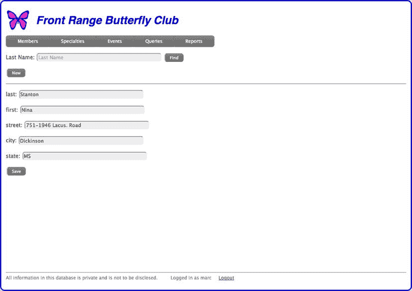

[图 5-15](#_Fig15) 。通过 show_form 方法显示的表单

如果新按钮被点击，它的`action_new`方法利用了`show_form`输出空白表单的能力。在这种情况下，`member_id`隐藏字段将是空的，这就是为什么由保存按钮调用的`action_save`知道这是一个要插入的新记录。[清单 5-20](#list20) 展示了这些方法。

***[清单 5-20](#_list20)*** 。`action_new`和`action_save`方法

```php
protected function action_new() {
    $this->show_form(null);
}

protected function action_save() {
    try {
        $pk = $this->db->update('member', 'member_id',
          array('member_id', 'last', 'first', 'street',
          'city', 'state'), $_POST);
    }
    catch (\Exception $e) {
        $this->show_form($_POST);
        throw $e;
    }
    $this->action_detail($pk);
    $this->message('Saved OK', true);
}
```

`DbAccess::update`方法自动处理插入和更新，所以这不是问题。我展示的所有其他代码都让异常向上下降，由`Page`基类处理，但是这里异常被捕获，这样表单可以在出现错误时再次显示，给用户一个修复问题的机会。(如[第 4 章](4.html)所述，该错误可能是由约束失败引起的。)

如果`DbAccess::update`起作用(没有抛出异常)，如果你插入一条新记录，`$pk`保存主键，如果你再次查看[清单 5-18](#list18) ，你会看到`action_detail`检索那一行。如果执行更新，`$pk`为空，因此`action_detail`从`$_REQUEST`获取主键，也就是调用`action_save`时的主键。

换句话说，出错时显示相同的表单，成功时再次检索记录。还有其他的编码方法，但是这是最简单的方法，可以确保在插入新记录后主键在表单中，因为如果用户修改了刚刚插入的内容，那就需要更新，而不是再次插入。代码不算多，但是编排的很仔细。

顺便说一下，Page:: `message`的第二个参数表明这是一个成功的消息，而不是一个错误。稍后，当我展示`Page::message`的代码时，您会看到它做了什么。

我还没有谈到的唯一方法是`action_delete`，当你点击删除链接时调用，如图[图 5-14](#Fig14) 所示。它在[清单 5-21](#list21) 中。

***[清单 5-21](#_list21)*** 。`action_delete`方法

```php
protected function action_delete() {
    $stmt = $this->db->query('delete from member where
      member_id = :member_id',
      array('member_id' => $_REQUEST['pk']));
    if ($stmt->rowCount() == 1)
        $this->message('Deleted OK', true);
    else
        $this->message('Nothing deleted');
}
```

如果单击删除链接，该行会立即被删除，但最好要求用户确认。您可以通过让`action_delete`显示一个确认表单，然后让该表单上的一个按钮调用另一个执行实际删除的动作方法来做到这一点。但是我更喜欢用 JavaScript 请求确认，这可以通过将清单 5-17 中的[删除链接改为如下:](#list17)

```php
<a href='' onclick="DeleteConfirm('$name', '$pk');">Delete</a>
```

JavaScript 函数`DeleteConfirm`是

```php
function DeleteConfirm(name, pk) {
    if (confirm('Delete ' + name + '?')) {
        event.preventDefault();
        window.location = document.URL +
          '?action_delete=1&pk=' + pk;
    }
}

```

[图 5-16](#Fig16) 显示了一个例子。如果用户同意，浏览器的 URL 被设置为类似

```php
member.php?action_delete=1&pk=117
```


[图 5-16](#_Fig16) 。删除确认

(实际上，`document.URL`返回了一个绝对 URL，但是我只显示了文件部分。)注意对`preventDefault()`的调用，以防止锚到它的`href`位置，这是不相关的。

由于`DeleteConfirm`独立于任何应用程序，它和其他普通的 JavaScript 一起位于一个名为`page.js`的文件中，这个文件是`Page`框架所包含的，我将很快展示。稍后会有其他 JavaScript 添加到该文件中。

页面框架文件

由于`Page`类有很多方法，当您阅读下一节时，您会发现按照本书的可下载代码(`www.apress.com`)进行学习是最容易的。如果手头没有代码，这里有一个`Page`类引用的文件树，以及本章中引用的三个应用程序页面(首先列出)。

```php
login.php
member.php
specialty.php

Directory incl:
    bottom.php
    logo.png
    page.css
    page.js
    top.php
    Directory menu_assets:
       ...

Directory lib:
    DbAccess.php
    Page.php
    Directory jquery:
        ...

```

在本章和本书的代码中，我没有在 PHP 文件的顶部显示一些设置包含路径的语句，但是你会在可下载的代码(`www.apress.com`)中看到它们。

页面框架实现

既然我已经展示了会话是如何工作的，以及如何使用`Page`框架来实现一个简单的应用程序，我将展示它的实现，这要简单得多。大部分代码在`Page::go`方法中，大部分我已经以某种形式展示过了。

首先，[清单 5-22](#list22) 显示了构造函数，它只是存储它的参数以备后用。第一个是页面的标题，第二个指示这个页面是否应该在会话中运行，第三个是包含文件的目录，比如`div-top`和`div-bottom`部分的内容。

***[清单 5-22](#_list22)*** 。`Page`构造器

```php
class Page {

protected $title, $want_session, $db, $incl_dir;

function __construct($title, $want_session = true,
  $incl_dir = 'incl') {
    $this->title = $title;
    $this->want_session = $want_session;
    $this->db = new DbAccess();
    $this->incl_dir = $incl_dir;
}

// ...

}
```

我已经把调用一个动作方法的代码(如清单 5-11 顶部所示)放入一个单独的方法中，在清单 5-23 的[中，因为它在任何 HTML 被发送到浏览器之前都在顶部被调用，并且在`div-process`部分内部也被调用。正常的动作以`action_`为前缀，就像我们一直做的那样；在任何其他输出开始之前执行的那些以`pre_action_`开始。返回值指示是否调用了操作方法。](#list23)

***[清单 5-23](#_list23)*** 。`perform_action`方法

```php
private function perform_action($want_pre = false) {
    if ($want_pre)
        $pfx = 'pre_action_';
    else
        $pfx = 'action_';
    foreach ($_REQUEST as $k => $v)
        if (strpos($k, $pfx) === 0) {
            $this->$k();
            return true;
        }
    return false;
}
```

现在，正如我所说的，`Page::go`做了大部分的工作。它在[清单 5-24](#list24) 中，我将一部分一部分地介绍它。

***[清单 5-24](#_list24)*** 。`Page::go`方法

```php
public function go() {
    if ($this->want_session)
        $this->start_session();
    try {
        if ($this->perform_action(true))      // actions before output
            return;
        $this->top();
    }
    catch (\Exception $e) {
        $this->top();
        echo '<p class=message-error>' .
          $e->getMessage() . '</p>';
        $this->bottom();
        return;
    }
    echo <<<EOT
<div class=div-message id=div-message>
<p class=message-error id=message-error></p>
<p class=message-ok id=message-ok></p>
</div>
EOT;
    if ($this->want_session && !$this->is_logged_in()) {
        $this->message("Not logged in.");
        echo '<div class=div-process></div>'; // to get spacing
        $this->bottom();
        exit();
    }
    try {
        echo '<div id=div-request class=div-request>';
        $this->request();
        echo '</div>';
        echo '<div class=div-process>';
        $this->perform_action();
        echo '</div>';
    }
    catch (\Exception $e) {
        $this->message($e->getMessage());
    }
    $this->bottom();
}
```

正如我已经解释过的，首先，你要加入一个现有的会话或者开始一个新的会话。然后，在除了头之外的任何输出之前，执行任何`pre_action_`方法。大多数页面没有，但是，特别是登录页面有，当我到达它的时候我会展示。任何错误都会被捕获，但是由于您还没有编写`div-message`，它们会被直接输出到页面。这是可以的，因为这里的任何错误都来自内部处理，而不是因为用户做错了什么。

接下来，调用`Page::top`方法来输出`div-top`部分中应用程序开发人员想要的任何内容。通常情况下，`Page::top`只是

```php
protected function top() {
    require_once "{$this->incl_dir}/top.php";
}
```

但是`Page`的子类可以覆盖它。

接下来是`div-message`部分，有两段，一段用于错误，一段用于成功消息。拥有两个段落可以让它们在 CSS 中有不同的风格。最初，两个段落都是空的，填充和边距都为零，所以整个部分根本不占用空间。正如我所展示的，如果显示一条消息，这种情况将会改变。

接下来是我在“会话转换和登录页面”一节中展示的会话检查如果页面应该在一个会话中运行，但是没有运行，那么将会有一条消息排队等待，并且页面以对`Page::bottom`的调用结束，该调用将写入`div-bottom`部分的内容:

```php
protected function bottom() {
    require_once "{$this->incl_dir}/bottom.php";
}
```

和`Page::top`一样，子类可以覆盖它。

现在，所有这些预备工作都完成了，是时候编写应用程序代码了，这很简单。子类为`Page::request`定义的东西在`div-request`部分中被调用；基类中有一个存根，以防应用程序没有定义它。如果有一个动作函数被调用，它在`div-process`部门被调用。所有这些都在一个`try`块中，捕获代码显示错误消息。最后，`Page::bottom`被称为。

剩下要展示的是清单 5-25 中的`Page::message`，它的重要部分我已经展示过了。

***[清单 5-25](#_list25)*** 。`Page::message`方法

```php
protected function message($s, $ok = false) {
    if ($ok)
        $id = 'message-ok';
    else
        $id = 'message-error';
    $s = str_replace('"', "'", $s);
    $s = str_replace("\r", '', $s);
    $s = str_replace("\n", ' ', $s);
    $s = htmlspecial($s);
    echo <<<EOT
        <script>
        $(document).ready(function () {
            $('#div-message').css('padding', '10px');
            $('#$id').html("$s");
        });
        </script>
EOT;
}
```

传入的消息文本必须被替换成 JavaScript，所以我用单引号替换双引号，并去掉回车和换行符。(我本来可以使用转义双引号，但是我用了最简单的方法。)

这就是整个`Page`框架。我没有显示的是包含样本 HTML 的包含文件，主要是`top.php`，如清单 5-26 中的[所示。(回想一下，它在`incl`目录中。)](#list26)

***[清单 5-26](#_list26)*** 。页面顶部的 HTML

```php
echo <<<EOT
<!doctype html>
<html lang=en>
<head>
<meta charset=utf-8>
<title>{$this->title}</title>
<link rel=stylesheet type=text/css
 href="lib/jquery/css/dark-hive/jquery-ui-1.10.3.custom.min.css">
<link rel=stylesheet type=text/css
 href="incl/menu_assets/styles.css">
<link rel=stylesheet type=text/css href="incl/page.css" />
<script src="lib/jquery/js/jquery-1.9.1.js"></script>
<script src="lib/jquery/js/jquery-ui-1.10.3.custom.min.js"></script>
<script src="incl/page.js"></script>
</head>
<body>
<div class=page>
<div class=div-top>
<table border=0 width=100%><tr>
<td class=logo>
<td class=company>Front Range Butterfly Club
</table>
</div>
EOT;
```

注意`title` HTML 中的变量替换`{$this->title}`。因为这个文件是 PHP 代码，而不仅仅是 HTML，它可以做类似的事情。

有两个 CSS 文件:一个用于 jQuery，它是从`jqueryui.com/themeroller`下载的，在这里你可以从常用主题中选择或者创建自己的主题；另一个包含应用程序的 CSS，用于所有的页面元素(`message-error`、`div_request`等)。).

有三个 JavaScript 文件:两个用于 jQuery，一个用于应用程序，其中包含类似于`DeleteConfirm go`的函数，我已经展示过了。以后再补充。我喜欢下载 jQuery 文件并把它们放在服务器上，这就是我在这里所做的。这对开发平台来说很重要，因为您希望能够在没有互联网的情况下进行测试，但是我也是为了生产而这样做的，所以我可以控制正在执行的 JavaScript。如果需要，您也可以引用外部 URL。

```php
<script
src=" //ajax.googleapis.com/ajax/libs/jquery/1.9.1/jquery.min.js ">
</script>
```

我听说使用 Google 的 URL 可以减少延迟、增加并行性和更好的缓存，所以你可能想这样做。

在正文中，整个页面处于一个`page`分割中；从这里开始，到`bottom.php`结束。接下来是`div-top`部分，包括网站的标志和名称。

清单 5-27 中的[文件`bottom.php`更简单。](#list27)

***[清单 5-27](#_list27)*** 。页面底部的 HTML

```php
echo <<<EOT
<div class=div-bottom>
<p class=bottom>
All information in this database is private and is not to be disclosed.
&nbsp;&nbsp;&nbsp;&nbsp;&nbsp;&nbsp;&nbsp;
EOT;
if ($this->is_logged_in())
    echo <<<EOT
    Logged in as {$_SESSION['userid']}
    &nbsp;&nbsp;&nbsp;
    <a href='login.php?pre_action_logout=1'>Logout</a>
EOT;
else
    echo <<<EOT
    (Not logged in)
    &nbsp;&nbsp;&nbsp;
    <a href='login.php'>Login</a>
EOT;
echo <<<EOT
</div>
</div>
</body>
</html>
EOT;
```

这里的大部分内容显示用户是否登录，如果登录，则显示用户 id。还有注销或登录的链接。我还没有展示`login.php`，但是你可以想象它可能会做什么。注意多出来的`</div>`；它结束了始于`top.php`的`page`分裂。

这几乎是所有的框架代码。我不打算展示 CSS，因为它太详细了，无法简洁地展示，此外，它超出了本书的范围。如果您想看的话，可以下载示例代码。

一大块 HTML 和一个关联的 CSS 文件处理菜单。我没有编码——我是从`cssmenumaker.com`下载的。如果你在那里制作一个菜单，把 HTML 代码放在`top.php`文件中，并在驱动菜单的 CSS 中添加一个`link`。(这类菜单完全由 CSS 运行，而不是 JavaScript。)

总结一下我带你去的地方:我们有一个`Page`框架，它将用于所有页面。它处理许多常见的处理，并确保像检查会话这样的关键事情得以完成。我解释了会话是如何工作的，尽管还没有解释如何处理登录。我展示了 Front Range Butterfly Club 的会员页面，并且我将展示它的一些增强功能。然而，我将继续使用`Page`框架。因为它实际上只是调用它的子类，所有的 HTML、CSS 和 JavaScript 都在单独的文件中，所以这个框架非常通用。它处理会话和页面结构的方式永远不会改变。

会话转换和登录页面

登录页面与普通页面`member.php`有些不同，因为它代表授权用户启动一个会话。它的对应物是注销页面，它的功能正好相反，这两个页面可以合并到同一个文件中，在我给出的例子中我称之为`login.php`。

`login.php`中的子类是`MyPage`，就像在`member.php`中一样，执行如下开始(你可能想回头看看[清单 5-15](#list15) ):

```php
$page = new MyPage('Login', false);
$page->go();
```

构造函数的第二个参数是`false`，表示不需要会话，因为这是登录页面的开始。

`Page::go`然后调用我的`Page::request`，如图[清单 5-28](#list28) 所示。我稍后将解释底部处理`msg`参数的部分。

***[清单 5-28](#_list28)*** 。`MyPage::request`方法

```php
protected function request() {
        echo <<<EOT
<form action="{$_SERVER['PHP_SELF']}" method=post
  accept-charset=UTF-8>
<label for=userid>User ID:</label>
<input type=text size=50 name=userid id=userid
  placeholder='User ID'>
<label for=password>Password:</label>
<input type=password size=50 name=password id=password
  placeholder='Password'>
<br>
<input class=button type=submit name=pre_action_login value='Login'>
<input class=button type=submit name=action_forgot value='Forgot'>
</form>
EOT;
    if (isset($_REQUEST['msg']))
        $this->message($_REQUEST['msg']);
}
```

[图 5-17](#Fig17) 显示了表单。这是一个非常小的页面。通常一个网站的首页会有更多的内容，比如新闻、营销信息、如何登录的细节等等。您可以在您的`request`方法中输出任何您想要的 HTML。

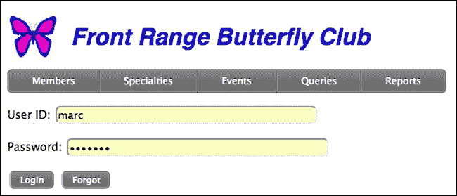

[图 5-17](#_Fig17) 。登录表单

有两个动作:登录和忘记，后者现在只是一个存根。

```php
protected function action_forgot() {
    $this->message('Not yet implemented');
}
```

第 6 章相当详细地讨论了忘记密码的问题。

如果你再次查看[清单 5-28](#list28) ，你会看到登录按钮的动作方法是`pre_action_login`，而不是`action_login`，所以它是由`Page::go`在任何输出被写入之前执行的(清单 5-23 和 5-24)。这一点很重要，因为如果一切顺利，它会想要启动一个会话，这只能在任何输出之前完成，因为 PHP 必须编写一个头来创建 cookie。`MyPage::pre_action_login`在[清单 5-29](#list29) 中。

***[清单 5-29](#_list29)*** 。`MyPage::pre_action_login`方法

```php
protected function pre_action_login() {
    // Somewhat naive!
    if ($_POST['password'] == 'cupcake') {
        $this->login($_POST['userid']);
        header('Location: member.php');
    }
    else
        header('Location: login.php?msg=Wrong%20password');
}
```

我将在第六章中正确处理密码，所以你在这里看到的只是临时代码。(我保证！)然而，如果密码检查是真实的，那么会发生什么:一个`userid`元素被添加到会话中，这是所有会话中页面检查的内容。(检查在清单 5-24 的[中的`Page::go`内)。)然后浏览器被重定向到`member.php`页面，这样用户就可以开始工作了。](#list24)

如果登录失败，可以立即写入页面，这样会出现一条错误消息，但是这使得`Page::go`中的处理过于复杂。将浏览器直接重定向回登录页面更容易，只是这一次会显示一条消息，这就是清单 5-28 底部的代码所做的。(通常你不会说密码错了，而是说一些不太具体的话，这样就不会通过暗示用户 id 是有效的来给猜测者提供不必要的帮助。)

从我所展示的内容中得到的关键是，因为如此多的处理都涉及到编写头部，无论是启动会话还是重定向页面，处理都必须在`Page::go`或它调用的任何方法编写任何 HTML 之前发生。

注销，如我在[清单 5-27](#list27) 中所示，页面底部有 HTML，`login.php`用一个`pre_action_logout`参数执行，得到那个被调用的方法。在[清单 5-30](#list30) 里。

***[清单 5-30](#_list30)*** 。MyPage::pre_action_logout 方法

```php
protected function pre_action_logout() {
    $this->logout();
    header('Location: login.php');
}
```

与`MyPage::pre_action_login`在出现错误时重定向浏览器的原因相同，一旦注销完成，浏览器将被重定向回登录页面。我在前面的“PHP 会话”一节中展示了`Page::logout`它启动会话，因为`login.php`总是从没有会话开始。然后它调用`Page:: destroy_session`。另一种方法是将日志放在它自己的文件中，`logout.php`，比如说，在一个会话中运行，但是我不认为仅仅为了保存这个小方法而创建一个单独的文件有什么意义。

处理人际关系

如果你有一个 cruddy 关系，我帮不上忙，但是我可以帮助编写 CRUD 页面来处理实体之间的关系。

最棘手的情况是当有一个外键时，就像一对多关系中的“多”方一样。例如，假设成员表单被增强为包括每个成员的专业，可以是刷脚、薄纱翼、金属标记、硫磺、燕尾或白色。(根据维基百科；我对蝴蝶的了解甚至比我对人际关系的了解还要少。)许多成员可以有相同的专长，但是一个成员只能有一个，所以这是一对多，在`member`表中有`specialty`表的外键——“多”方。

外键列只是一个列，尽管有一个约束，所以我们可以把它放在表单上，让用户在其中键入一个数字，比如 4738 表示燕尾，如果这就是代理键的话。显然这是一个糟糕的设计。最好是一个下拉列表，这对于蝴蝶专业来说可能是可以的，但是对于很长的列表来说就不行了。

如果可以使用下拉列表，那么可以在生成表单时动态填充它，方法是在表上执行`select`操作，为每一行获取一个描述性字符串及其相关的主键。字符串进入下拉框，主键存储在某个地方，可能在隐藏字段中。然后，当用户做出选择并提交表单时，可以将外键插入到引用列中。

如果外键引用一个更长的表，用户可能必须搜索该表以确定应该引用哪一行。因为这比下拉列表更复杂，所以我将详细展示它。然后我将展示如何处理多对多的关系。

带有外键的表单

在涉及代理键的一对多关系的“多”方的表单中，用户应该看到行的一些表示，比如名称，但是实际的外键应该是隐藏的。更新数据库时，只涉及外键列。举个例子会让事情变得更清楚。

[图 5-18](#Fig18) 显示了蝴蝶俱乐部会员形式，增加了一个新的领域，会员的专长(刷脚、游丝翼等)。)，以及两个按钮:选择和清除。在[清单 5-31](#list31) 中增强的`show_form`方法显示了那个字段，以及一个外键`specialty_id`的隐藏字段。

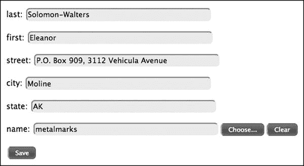

[图 5-18](#_Fig18) 。增强的成员表单

***[清单 5-31](#_list31)*** 。增强的`show_form`方法

```php
protected function show_form($row) {
    echo "<form action='{$_SERVER['PHP_SELF']}'
      method=post accept-charset=UTF-8>";
    foreach (array('member_id', 'last', 'first', 'street',
      'city', 'state', 'specialty_id', 'name') as $col) {
        if ($col == 'name')
            $readonly = 'readonly';
        else
            $readonly = '';
        $id = $col == 'name' ? 'specialty_id_label' : $col;
        if ($col == 'member_id' || $col == 'specialty_id')
            $type = 'hidden';
        else {
            echo "<label for=$id>$col:</label>";
            $type = 'text';
        }
        $v = is_null($row) ? '' : $row[$col];
        echo "<input type=$type id=$id size=50 name=$col
          value='" . htmlspecial($v) .
          "' $readonly>";
        if ($col == 'name') {
            echo "<button class=button type=button
              onclick='ChooseSpecialty(\"specialty_id\");'>
              Choose...</button>";
            echo "<button class=button type=button
              onclick='ClearField(\"specialty_id\");'>
              Clear</button>";
        }
    }
    echo "<p class=label><input class=button type=submit
      name=action_save value=Save></form>";
}
```

这些按钮是因为用户看到的字段`name`是只读的。(它应该有一个更好的标签，但这是另一个问题，我将在第 6 章中讨论。)选择按钮执行 JavaScript 函数`ChooseSpecialty`，清除按钮执行`ClearField`。两者都传递了外键字段的 id，即`specialty_id`(与列名相同)。此外，包含与外键字段配对的可见字段的字段具有相同的 id，但带有后缀`_label`。

适用于任何形式，非常简单:

```php
function ClearField(id) {
    $('#' + id).val('');
    $('#' + id + '_label').val('');
}
```

像会员一样，专业也有自己的页面，叫做`specialty.php`，你可以从窗口顶部菜单上的专业按钮进入。(你可以在[图 5-19](#Fig19) 中看到那个按钮。)我不打算呈现那个页面的细节，因为它与成员表单如此相似，但是[图 5-19](#Fig19) 显示了它的样子。除了代理键之外，只有一个字段`specialty_id`(它是隐藏的)。


[图 5-19](#_Fig19) 。专业表单

回到[清单 5-31](#list31) ，由成员表单上的选择按钮调用的`ChooseSpecialty` 功能，打开一个执行`specialty.php`并显示查找表单的新窗口，允许用户找到他或她想要与成员关联的专业。(如果有几十或几百条记录可供选择，那么 Find 表单的动机会更明显。)然而，在这种情况下，`specialty.php`被赋予了参数`choose`，这告诉它它被执行只是为了提供一个选择，而不是为了一般的 CRUD 操作。

首先，这里是`ChooseSpecialty` JavaScript 函数。

```php
function ChooseSpecialty(id) {
    window.open("specialty.php?choose=yes&id=" + id, "_blank",
      "height=600, width=800, top=100, left=100, tab=no, " +
      "location=no, menubar=no, status=no, toolbar=no", false);
}
```

窗口的细节并不重要，你可以随意设置。重要的是传递给`specialty.php` : `choose`的两个参数和仍然显示成员表单的窗口中隐藏的`specialty_id`字段的 id。[图 5-20](#Fig20) 显示了点击专业窗口中的查找按钮显示所有专业后的两个窗口。

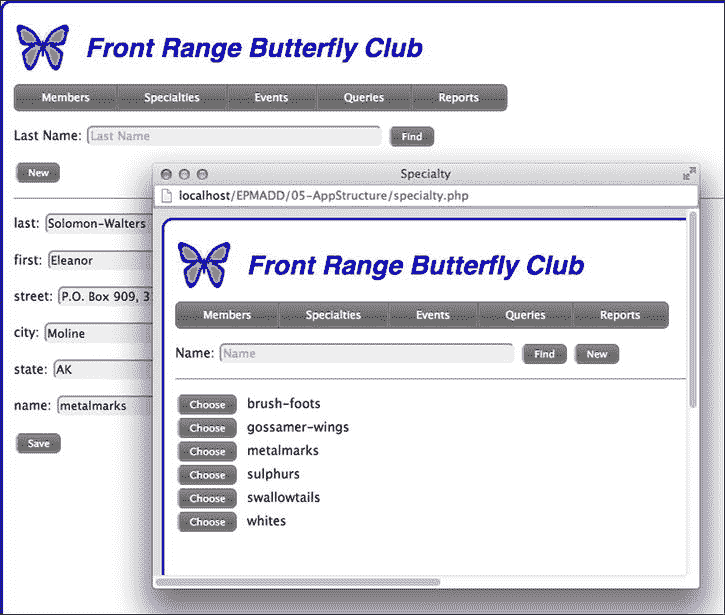

[图 5-20](#_Fig20) 。带有弹出专业表单的成员表单

[图 5-21](#Fig21) 显示了点击金属标记的选择按钮时会发生什么。调用 specialty 窗口中的 JavaScript 函数`MadeChoice`，使用三个参数:member 窗口中隐藏的`specialty_id`字段的 id(在图中用虚线轮廓显示)、所选专业的主键以及该专业的名称(“metalmarks”)。`MadeChoice`然后用同样的三个参数调用成员窗口中的 JavaScript 函数`HaveChoice` *，`HaveChoice`将`specialty_id`和`name`插入表单。这就是一个窗口(专业)如何写入另一个窗口(成员)的表单。有了这个解释，你应该能够理解我给出的代码。*


[图 5-21](#_Fig21) 。专业窗口修改成员窗口

[清单 5-32](#list32) 展示了`specialty.php`中的`action_find`方法，除了处理`choose`参数的代码之外，它看起来很像[清单 5-17](#list17) 中用于成员表单的方法。

***[清单 5-32](#_list32)*** 。`specialty.php`中的`action_find`

```php
protected function action_find() {
    $url = $_SERVER['PHP_SELF'];
    $stmt = $this->db->query('select specialty_id, name
      from specialty where name like :pat',
      array('pat' => "{$_POST['name']}%"));
    if ($stmt->rowCount() == 0)
        $this->message('No records found', true);
    else {
        echo '<p>';
        while ($row = $stmt->fetch()) {
            $name = $row['name'];
            $pk = $row['specialty_id'];
            echo '<p class=find-choice>';
            if (isset($_REQUEST["choose"]))
                echo "<button class=button
                  onclick='MadeChoice(\"{$_REQUEST['id']}\",
                  \"$pk\", \"$name\");'>Choose</button>";
            else {
                echo <<<EOT
            <p class=find-choice>
            <a href=$url?action_detail&specialty_id=$pk>Detail</a>
            <a href=''
            onclick="DeleteConfirm('$name', '$pk');">Delete</a>
EOT;
            }
            echo "&nbsp;&nbsp;$name";
        }
    }
}
```

它所做的是在每个专业名称旁边显示一个选择按钮(粗体)，而不是从菜单栏执行时显示的详细信息和删除链接。这就是你在[图 5-20](#Fig20) 中看到的。请注意，这些是按钮，而不是带下划线的链接；我展示了两种方法来说明这两种方法。为了保持一致性，您可能希望在自己的应用程序中使用按钮。

无论如何，当你点击一个选择按钮时，如图 5-21 中的[所示，JavaScript 函数`MadeChoice`被执行，带有三个参数:成员表单中的字段 id(在成员窗口中)，所选专业的主键，以及专业的名称。如我所说，这个函数需要做的是将名称放入成员表单上的可见字段，并将主键放入成员表单上的隐藏外键字段。听起来很容易，但是这些字段在不同的窗口中。幸运的是，做起来和说起来一样容易。](#Fig21)

```php
function MadeChoice(id, result, label) { // executes in popup
    window.opener.HaveChoice(id, result, label);
    window.close();
}
```

原来你可以用`window.opener`引用打开这个窗口的窗口，显示成员窗体的那个。函数`MadeChoice`调用那个窗口*中的函数`HaveChoice`。然后关闭弹出的专业窗口。*

回到会员窗口，这里是`HaveChoice`。

```php
function HaveChoice(id, result, label) { // executes in main window
    $('#' + id).val(result);
    $('#' + id + '_label').val(label);
}
```

它使用 jQuery 代码将主键(`result`参数)放入外键字段(其 id 被传入)，将专业名称(`label`参数)放入可见字段，其 id 相同，但带有一个`_label`后缀。

JavaScript 在一个完全不同的窗口中调用一个函数，这是一个来回的过程。我来回顾一下发生了什么，现在你可能想再读一遍这一节，研究一下图 5-21 ，因为你已经知道故事的结局了。

1.  在成员窗口中单击了只读名称字段旁边的选择按钮。
2.  弹出一个专业窗口，允许用户找到要选择的专业。它被传递了*成员*窗口中名称字段的 id。
3.  在专业窗口中，点击名称旁边的选择按钮，导致`member`窗口、`specialty_id`和`name`中名称字段的 id 被传递给专业窗口中的`MadeChoice`函数。
4.  成员窗口中的`HaveChoice`函数被调用，它将名称放入成员表单上的可见名称字段，并将外键放入隐藏字段。

此时，用户可以验证选择的专业是否正确，并点击保存按钮更新`member`表。

在您自己的应用程序中，您可能想要一个更光滑的用户界面，但是您仍然可以利用这种在表单之间传递数据的技术。

处理多对多关系

多对多关系比那些包含外键的表单更简单，因为你不需要像`MadeChoice`和`HaveChoice`函数中那样复杂的 JavaScript 来将数据从一个窗口复制到另一个窗口。当然，有一个表可以实现多对多关系，但是它不会以任何形式出现，并且可以在后台更新。

举个例子，假设 Butterfly Club 希望接纳拥有多项专长的会员，使`member`和`specialty`桌之间的关系成为多对多关系。

为了实现这一点，我添加了一个新表`member_specialty`，它有两列，共同构成主键:`member_id`和`specialty_id`。一排意味着那个成员有那个专长。具有相同`member_id`的多行意味着该成员具有多个专业。

为了显示成员的专长，我将窗口分成两半，并在列表中显示他或她的专长，以及两个按钮，删除选定和添加，如图[图 5-22](#Fig22) 所示，其中 Eleanor 有两个专长。

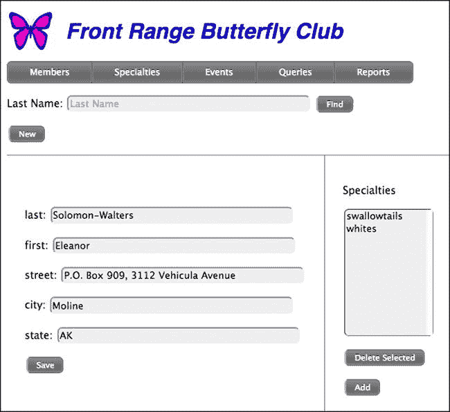

[图 5-22](#_Fig22) 。显示专业的表格

为了展示特色，我修改了`action_detail`方法来输出一个 HTML 表，带有主表单，在左边显示`member`表的字段，在右边显示一个新表单。我不会展示左半部分的代码，因为它与我已经展示过的相似，但是[清单 5-33](#list33) 展示了显示右半部分的方法。

***[清单 5-33](#_list33)*** 。窗体右半部分的方法

```php
protected function show_form_right($member) {
    $member_id = $member['member_id'];
    echo <<<EOT
        Specialties
        <form action='{$_SERVER['PHP_SELF']}'
          method=post accept-charset=UTF-8>
EOT;
    if (isset($member_id)) {
        $stmt = $this->db->query('select specialty_id, name
            from specialty
            join member_specialty using (specialty_id)
            where member_id = :member_id',
          array('member_id' => $member_id));
        echo '<select name=specialties size=10
          style="min-width:100px;">';
        while ($row = $stmt->fetch())
            echo "<option
            value={$row['specialty_id']}>{$row['name']}</option>";
        echo '</select>';
    }
    echo <<<EOT
    <br><input class=button type=submit
      name=action_delete_specialty value='Delete Selected'>
    <br><input class=button type=button
      value='Add'
      onclick='ChooseSpecialty($member_id);'>
    <input type=hidden name=member_id value=$member_id>
    </form>
EOT;
}
```

参数是一个列值数组，这里称为`$member`，而不是通常的`$row`，以免与函数内部的查询结果混淆。

该查询在`specialty`和`member_specialty`表之间进行连接，以查找该成员的专长。他们每个人都成为一个`select`领域的`option`。出现的是专业名称，所以用户会看到它，但是主键`specialty_id`是值。

删除选中的按钮导致页面在`action_delete_specialty`方法被调用，这在[清单 5-34](#list34) 中。它捕捉并重新抛出一个异常，这样如果有错误，表单将被重新显示。注意，要删除的`specialty_id`(只允许一个)是`select`字段的值，其名称是`specialties`(粗体显示)。

***[清单 5-34](#_list34)*** 。`action_delete_specialty`方法

```php
protected function action_delete_specialty() {
    try {
        if (isset($_POST['specialties'])) {
            $this->db->query('delete from member_specialty
              where member_id = :member_id and
              specialty_id = :specialty_id',
              array('member_id' => $_POST['member_id'],
              'specialty_id' => $_POST['specialties'] ));
        }
    }
    catch (\Exception $e) {
        $exc = $e;
    }
    $this->action_detail();
    if (isset($exc))
        throw $exc;
}
```

右边的另一个按钮 Add 使用了我之前展示的相同的`ChooseSpecialty` JavaScript 函数，只是这次参数是主键`member_id`，它将是`member_specialty`表中的外键。您应该还记得，`ChooseSpecialty`用参数`choose`和`id`执行`specialty.php`程序。

由于`specialty.php`必须更新`member_specialty`表，而不是像上一节那样仅仅将一个`specialty_id`和`name`返回给成员表单，因此其`action_find`中的处理与我在[清单 5-32](#list32) 中展示的不同。为了使代码更清晰，它会调用另外两个方法中的一个，这取决于您是否定义了 choose 参数。

```php
protected function action_find() {
    if (isset($_REQUEST["choose"]))
        $this->action_find_choices();
    else
        $this->action_find_normal();
}
```

当从菜单栏执行`specialty.php`时，方法`action_find_normal`用于正常的 CRUD 情况。这是我们关心的另一个方法，它显示了一个带有复选框的未选择的专业列表，如图[图 5-23](#Fig23) 所示。代码在[清单 5-35](#list35) 中。


[图 5-23](#_Fig23) 。选择专业的表格

***[清单 5-35](#_list35)*** 。`action_find_choose` 选择专业

```php
protected function action_find_choices() {
    $url = $_SERVER['PHP_SELF'];
    $member_id = $_REQUEST['id'];
    $stmt = $this->db->query('select specialty.specialty_id, name
      from specialty
      left join member_specialty on
      specialty.specialty_id = member_specialty.specialty_id and
      :member_id = member_specialty.member_id
      where name like :pat and member_id is null',
      array('pat' => "{$_POST['name']}%",
      'member_id' => $member_id));
    if ($stmt->rowCount() == 0)
        $this->message('No unchosen specialties found', true);
    else {
        echo <<<EOT
            <p>Unchosen Specialties
            <form action=$url method=post>
EOT;
        while ($row = $stmt->fetch()) {
            $name = $row['name'];
            $pk = $row['specialty_id'];
            echo <<<EOT
                <p class=find-choice>
                <input type='checkbox' name=specialty[$pk]>
                &nbsp;&nbsp;$name
EOT;
        }
            echo <<<EOT
            <p>
            <input type=hidden name=member_id value=$member_id>
            <input class=button type=submit
              name=action_add value='Add Specialties'>
            </form>
EOT;
    }
}
```

这种方法有几个值得注意的地方。

*   为了获取那些尚未选择的专业，我将`specialty`表与`member_specialty`表连接起来，并获取没有出现在后一个表中的专业。注意，`member_id`在连接条件中(粗体)，但是在`where`子句中有一个测试来证明它为空。(我本来可以使用子查询，但是我认为它是一个“左非连接”)
*   `name=specialty[$pk]`复选框的属性导致 PHP 将`$_REQUEST['specialty']`变成一个数组，我将在[清单 5-36](#list36) 中展示。我只想要所选行的主键，我将把它们作为数组下标。

你可以在[清单 5-36](#list36) (粗体)中的`action_add`方法中看到`specialty_id`值的数组是如何被访问的。

***[清单 5-36](#_list36)*** 。`action_add`专业方法

```php
protected function action_add() {
    if (isset($_REQUEST['specialty'])) {
        foreach ($_REQUEST['specialty'] as $specialty_id => $v )
            $this->db->query('insert into member_specialty
              (member_id, specialty_id)
              values (:member_id, :specialty_id)',
              array('member_id' => $_REQUEST['member_id'],
              'specialty_id' => $specialty_id));
        $this->message('Added OK. Window may be closed.',
          true);
    }
    else
        $this->message('No specialties were added.');
}
```

在这个循环中，所有需要做的就是为`member_id`(在[清单 5-35](#list35) 中作为隐藏字段传递)和`specialty_id`插入一个新行。该行肯定不会出现(这将违反主键的唯一约束)，因为选择表单中只显示了尚未选择的专业。

我忘了一件重要的事情:会员窗口在添加专业之后没有显示任何新的东西；你必须手动重新加载。我让您添加必要的 JavaScript 来使`specialty.php`更新成员窗口。(提示:在成员窗口中调用一个 JavaScript 函数，通过`window.opener`引用它，就像我在“带有外键的表单”一节中对`MadeChoice`函数所做的那样)

诚然，从六个专业中选择一个需要很多代码，正如我所说的，会员表单上的下拉菜单也可以，如果不是更好的话。但是我想展示更难的情况，因为有时会有数百甚至数千个选择，用户会希望使用完整页面的所有功能来进行选择。

在这一节和前一节之间，您将发现为一对多关系和多对多关系的“多”方面开发自己的用户界面所需的所有编码技巧。基本上，这两种选择是“传递表单”和“更新关联表”

章节总结

*   使用 PDO 从 PHP 访问 MySQL，因为它在出错时抛出异常，容易处理参数化查询，并且独立于数据库。
*   将`sql_mode`设置为`traditional`，将`innodb_strict_mode`设置为`on`。
*   将数据库凭证放在它们自己的文件中。
*   如果 SQL 语句的任何部分包含运行时提供的值，请始终使用参数化查询。不要将任何包含数据值的 PHP 变量放在传递给任何使用 SQL 语句的方法的字符串中。
*   大多数 MySQL 交互可以通过两种方法处理，`DbAccess::query`和`DbAccess::update`。
*   一个通用的页面框架，在一个`Page`类中，确保所有需要的处理在每个页面上执行，并且页面有一致的外观。
*   `Page`类中的代码使动作按钮调用按钮所在页面中的动作方法，从而提高了内聚力。
*   除了登录页面之外，应用程序页面应该在会话中运行，并且会话 id 必须保密。
*   为了安全起见，应用程序应该对任何包含会话 cookie 或敏感数据(如用户 ID 或密码)的页面使用 SSL(以`https`开头的 URL)。对于大多数应用程序，这意味着所有页面。
*   任何写入页面的用户提供的数据都应该由`htmlspecialchars`处理。
*   如果用户成功登录，登录页面将启动会话。注销页面(或登录页面中的注销方法)会破坏会话。
*   一对多关系的“多”方可以通过一个弹出窗口来处理，该窗口修改父窗口(`window.opener`)中的字段(通信表单)。
*   通过修改关联表，然后将结果反映在表单的列表中，可以处理多对多关系。