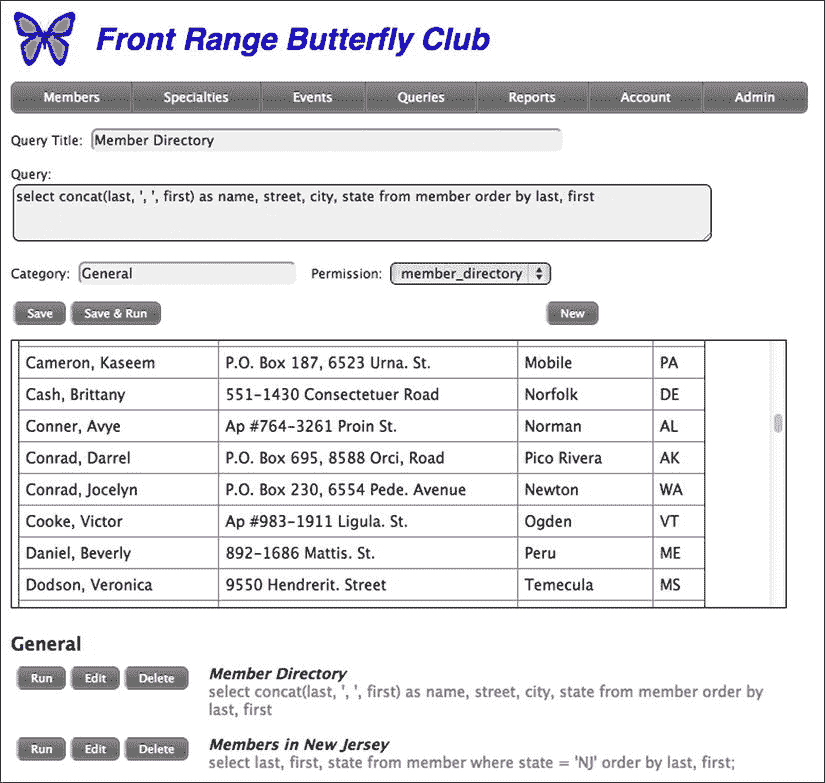
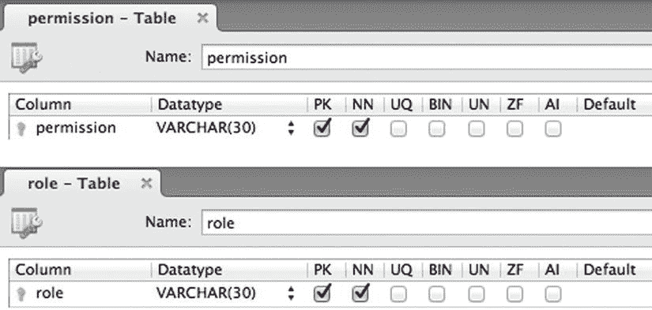
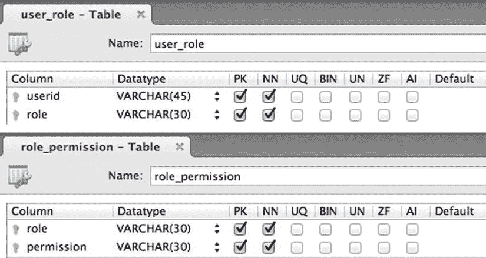
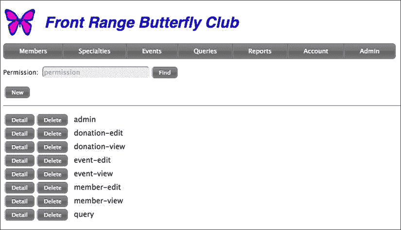

# 七、报告和其他输出

给你的程序员留些余地。告诉他(一)结果你一定有；(b)您希望获得的结果，如果每次运行额外收费不超过 25 美元；以及(c)如果可以在没有额外运行时间成本的情况下获得结果，那么这些结果将是方便的。(这往往是可能的。)

理查德·v·安德里，*编程 IBM 650 磁鼓计算机和数据处理机*，1958 年

正如我在[第 4 章](4.html)中所说，数据库是现实的部分模型，应用的 CRUD 部分(第 5 章和第 6 章)主要用于保持模型与现实同步。但是为了让您的应用发挥更大的作用，您必须从中获得一些输出，要么是报告，要么是其他输出，比如套用信函。

由于您的报告成本远低于 IBM 650(按 2013 年美元计算为 1600 美元/小时)，您可以获得“您想要的结果”和“方便的结果”。如何做到这一点是本章的主题。

作为报告的查询

您可能会认为 SQL `select`语句本身就是一个报告。例如，如果你想知道有多少 Front Range Butterfly Club 成员拥有各自的专长，你可以在终端窗口中启动`mysql`命令，然后用一条语句得到报告。

```php
mysql> select name, count(specialty_id) as count
    -> from member join specialty using (specialty_id)
    -> group by specialty_id order by name;
+----------------+-------+
| name           | count |
+----------------+-------+
| brush-foots    |    19 |
| gossamer-wings |    27 |
| sulphurs       |    25 |
| swallowtails   |    18 |
| whites         |    25 |
+----------------+-------+
```

事实上，像这样的快速和肮脏的报告是非常有用的。我刚刚检查并发现世界事务会议(CWA)应用定义了 113 个这样的小报告。它们被办公室工作人员用于诸如“2013 捐赠阿尔法无计划年”和“版主 w/联系信息”之类的事情

CWA 办公室没有人使用`mysql`命令，甚至不知道它的存在。相反，我创建了一个应用页面来编辑、保存和运行查询，助理协调员已经理解了 SQL 并开始使用它。我可能创建了三分之一的查询，而她创建了其余的。

图 7-1 显示了蝴蝶俱乐部查询页面，基于我为 CWA 创建的页面。


[图 7-1](#_Fig1) 。查询页面

要创建一个查询，您需要输入它的标题和 SQL，然后单击 Save。正如您在图的底部看到的，所有的查询都被列出来了。当您单击查询旁边的“编辑”按钮时，它的列会加载到表单中进行编辑。要运行查询，您可以单击它旁边的运行按钮，或者在表单上保存并运行。您还可以删除一个查询，或者为新的查询获取一个空白表单。

Category 字段将查询分配到一个类别，只是为查询列表提供一些分组。

显然，这个页面遭受了极端形式的 SQL 注入，因为数据实际上是 SQL。有两种保护措施:(1)代码只允许将`select`语句保存为查询；(2)有一个权限系统，如权限下拉菜单所示，我将在“基于角色的访问控制”一节中解释(这不是真正的 SQL *注入*，因为这是将 SQL 注入到一个不期望的字段中；查询字段*是期望 SQL 的*。)

当你运行一个查询时，它的输出直接出现在页面上，在表单下，在一个有滚动条的分区中，如图 7-2 所示。



[图 7-2](#_Fig2) 。显示运行查询结果的查询页面

正如您所猜测的，查询页面由一个`query`表支持，如 MySQL Workbench 中的[图 7-3](#Fig3) 所示。


[图 7-3](#_Fig3) 。查询表

由于我已经展示了许多使用`Page`类的应用页面的例子，我将不在本章和下一章展示所有的代码，而只展示重点，这里的第一个是查询表单，如[清单 7-1](#list1) 所示。

***[清单 7-1](#_list1)*** 。查询表单

```php
protected function show_form($data = null, $run = false) {
    if (empty($data['category']))
        $data['category'] = 'General';
    $f = new Form();
    $f->start($data);
    if (isset($data['query_id']))
        $f->hidden('query_id', $data['query_id']);
    $f->text('title', 'Query Title:', 70, 'query title');
    $f->textarea('query', 'Query:', 80, 3);
    $f->text('category', 'Category:', 30, 'category');
    $f->menu('permission', 'Permission:',
      $this->ac->get_permissions(), false, 'query');
    $f->button('action_save', 'Save');
    $f->button('action_save_run', 'Save & Run', false);
    $f->hspace(30);
    $f->button('action_new', 'New', false);
    $f->end();
    if ($run && isset($data['query']))
        if (stripos($data['query'], 'file ') === 0)
            $this->message("Can't run file reports here");
        else
            $this->run($data['title'], $data['query']);
    echo "<p style='margin-top:20px;'>";
    $this->query_list();
}
```

注意方法`Form::textarea`，我在[第六章](6.html)没有展示。这是对`Form`类的一个非常简单的添加。

```php
function textarea($fld, $label = null, $cols = 100,
  $rows = 5, $readonly = false) {
    $this->label($fld, $label, true);
    $v = isset($this->vals[$fld]) ?
      htmlspecial($this->vals[$fld]) : '';
    echo "<br><textarea id=$fld name=$fld cols=$cols
      rows=$rows>$v</textarea>";
}
```

当你需要新的东西时，你会想加入到`Form`类中，就像我一样。

权限下拉菜单由返回所有可能权限的表达式填充

```php
$this->ac->get_permissions()
```

它调用下一节描述的`Access`类的方法。

在清单的底部附近，您会看到查询页面没有运行“文件报告 s”，这是一种我将在本章末尾的“通用报告页面”一节中介绍的报告它通过调用`MyPage::run`方法来运行 SQL 查询报告，这几乎不需要任何代码，因为所有的工作都是由一个`Report`类完成的，我将在“报告类:HTML 和 CSV 输出”一节中展示这个类

```php
protected function run($title, $sql) {
    echo '<div class=run>';
    $stmt = $this->db->query($sql);
    $r = new Report();
    $r->html($title, $stmt);
    echo '</div>';
}
```

正如你所猜测的，`Report::html`方法将 HTML 直接输出到页面上，在`run`类的`div`中，CSS 限制了它的高度并允许它滚动。

```php
.run {
    overflow: auto;
    max-height: 200px;
    width: 600px;
    border: 1px solid;
    padding: 5px;
}
```

这个和其他一些我不会展示的 CSS 都是在实现查询页面的`query.php`文件中定义的，因为它们是特定于这个页面的。您也可以将 CSS 放在应用范围的`page.css`文件中，该文件由`Page`类包含在每个页面中，但是我更喜欢将专门的 CSS 本地化。这个页面还定义了一些 JavaScript 函数，我将在[清单 7-3](#list3) 中展示。

最后，[清单 7-1](#list1) 中`MyPage::show_form`方法的最后一行调用`MyPage::query_list`，它按类别列出查询，如[清单 7-2](#list2) 所示。

***[清单 7-2](#_list2)*** 。`MyPage::query_list`方法

```php
function query_list() {
    $stmt = $this->db->query('select * from query
      order by category, title');
    $cat = null;
    while ($row = $stmt->fetch()) {
        if ($cat != $row['category']) {
            if (!is_null($cat))
                echo "</table>";
            echo "<h2>{$row['category']}</h2>";
            echo "<table class=query-table>";
            $cat = $row['category'];
        }
        echo "<tr>";
        echo "<td nowrap valign=top>";
        echo "<button type=button class=button onclick=
          'RunQuery(\"{$row['query_id']}\")'>Run</button>";
        echo "<button type=button class=button onclick=
          'EditQuery(\"{$row['query_id']}\")'>Edit</button>";
        echo "<button type=button class=button onclick=
          'DeleteQuery(\"{$row['query_id']}\",
          \"{$row['title']}\")'>Delete</button>";
        $t = htmlspecial($row['title']);
        $q = htmlspecial($row['query']);
        echo "<td width=100% valign=top>
          <p class=name>$t<p class=query>$q";
    }
    echo "</table>";
}
```

这个函数没有什么特别的。我只说两点。首先，标题和查询都被`htmlspecial`(它调用`htmlspecialchars`)过滤，因为所有源自用户的内容都必须被过滤，以防止 XSS 攻击。

第二点是每个查询旁边的三个按钮在被点击时会启动 JavaScript 函数，如清单 7-3 所示。正如我提到的，它们出现在这个文件中，而不是应用范围的`page.js`文件中。

***[清单 7-3](#_list3)*** 。查询 JavaScript 函数

```php
function DeleteQuery(pk, name) {
    if (confirm('Delete query "' + name + '"?'))
        transfer('query.php', {'action_delete': 1, 'pk': pk});
}

function RunQuery(pk) {
    transfer('query.php', {'action_run': 1, 'pk': pk});
}

function EditQuery(pk) {
    transfer('query.php', {'action_edit': 1, 'pk': pk});
}
```

`DeleteQuery`需要主键(`query_id`)和名称，以便在`confirm`对话框中使用。其他的只需要主键。如果你想回顾这三个动作方法，你可以在 Apress 网站的源代码/下载区找到它们，但是我可以告诉你，它们确实如你所料。

基于角色的访问控制

我刚才展示的这种查询工具带来了一个问题:不是每个用户都应该能够访问整个数据库。应该只有某些用户能够定义和/或运行查询。只要应用的功能有限，区别用户就无关紧要，就像 Front Range Butterfly Club 的会员和专业页面一样，但是现在应用变得越来越复杂。

我在第 6 章中描述的安全防御可以有效地将野蛮人挡在门外。现在需要的是一种让受邀嘉宾保持一致的方法。需要有一种方法来限制用户只能访问应用中他们应该访问的部分。

一种简单而灵活的控制用户访问权限的方法是*基于角色的访问控制* (RBAC)。*角色*是可以分配给用户的工作职能或职责范围。每个角色包含一个或多个*权限*，这些权限是对访问系统资源、执行操作、访问部分数据库或对应用有意义的任何事情的批准。例如，假设权限`member-view`允许查看成员数据(包括运行某些报告)，权限`member-edit`允许更新成员数据。那么角色`member-maintenance`可以被定义为包含这两个权限。用户 Jack 和 Sally 的工作是维护成员数据，可以赋予他们角色`member-maintenance`，这将允许他们完成自己的工作。另一个角色，比如说`event-coordinator`，可能会被剥夺，这将阻止他们增加或修改俱乐部活动。活动委员会主席 Tom 拥有`event-coordinator`角色，但没有`member-maintenance`角色。

为了避免相关权限差别很小的角色激增，用户可以拥有多个角色。俱乐部秘书可能有`member-maintenance`角色、`event-coordinator role`和其他一些角色。

如果进行成员维护的用户需要额外的权限，他们只需添加到成员维护角色的定义中。不需要对用户本身做任何事情，因为他们与角色相关，而不是与权限相关。

如果你感兴趣，有一个 RBAC 的 ANSI 标准，ANSI INCITS 359-2004。你可以在`csrc.nist.gov/groups/SNS/rbac`找到更多关于 RBAC 和标准的信息。
我将暂时离开主题，展示如何在您的应用中实现 RBAC，然后我将回到实现查询和报告。据我所知，我在这里所做的符合 ANSI 标准“核心 RBAC”

MySQL 中的 RBAC

MySQL 使用一个特权系统，如“更改”、“创建视图”和“更新”，来控制给定用户可以做什么。您可以将其视为 RBAC 的用户和权限部分(没有角色)，用户和权限之间存在多对多的关系。特权可以与整个数据库相关联，也可以与特定的表甚至列相关联。

MySQL Workbench 确实允许您定义与权限(特权)相关联的角色(图 4-18 ),并将一个或多个角色分配给用户，但这些角色只是 MySQL Workbench 内置的一种便利，而不是 MySQL 本身的一个功能，它只处理特权。

正如我在[第 4 章](4.html)中所说的，MySQL 特权对于限制应用用户只能查看和编辑数据是有用的——不改变数据库模式——但是它们不适合定义应用角色，因为将应用操作映射到特定的表和列太繁琐了，而且让每个应用用户都成为数据库用户也不现实。在应用中实现 RBAC 要好得多。我只定义了两个 MySQL 用户:一个可以做任何事情的管理用户，和一个应用本身连接的应用用户。应用从不作为管理用户连接；只有 MySQL Workbench 和`mysql`命令可以。

RBAC 数据库表

作为应用开发人员，您应该实现 RBAC 机制，并将权限与应用的各个部分相关联，但是*策略*—角色的定义及其对用户的分配——应该由应用管理员决定，也就是控制谁可以成为用户的人。

RBAC 的实现非常简单。角色和权限只是字符串，定义在两个各有一列的表中，如图[图 7-4](#Fig4) 所示。请注意，这两个表都有自然主键。



[图 7-4](#_Fig4) 。权限和角色表

RBAC 的灵活性来自于两种多对多的关系:通过`user_role`表从用户到角色，通过`role_permission`表从角色到权限，如图[图 7-5](#Fig5) 所示。



[图 7-5](#_Fig5) 。用户角色和角色权限表

首先，用一个`admin`权限初始化`permission`表，用一个`admin`角色初始化`role`表，用一行将两者关联起来的`role_permission`表，用一行将该角色赋予管理用户的`user_role`表。这是必要的，因为操纵 RBAC 机制本身的各种页面需要被限制给管理员，这可以通过将它们限制到`admin`权限来实现。在访问这些页面之前，您需要进行初始化。您可以编写一个 PHP 页面来执行初始化，或者，因为它只需要做一次，只需用 MySQL Workbench 就可以了。

两个应用页面(本身需要`admin`权限)维护`permission`、`role`和`role_permission`表，如图[图 7-6](#Fig6) 和 [7-7](#Fig7) 所示。我不会展示这些页面的 PHP 代码，因为没有什么是我没有展示过的，但是你可以在 Apress 网站(`www.apress.com`)的源代码/下载区找到它。



[图 7-6](#_Fig6) 。许可页面


[图 7-7](#_Fig7) 。角色页面

作为开发人员，您根据需要定义权限，将它们添加到`permission`表中。没有硬性规定，但通常你希望每个应用页面(会员、专业、捐赠等。)拥有自己的权限。为查询分配额外的独有权限。如果您愿意，并且如果应用证明了这一点，您甚至可以得到更细粒度的服务。您拥有的独特权限越多，应用管理员就越能根据自己的需要定制角色。然而，权限太多，管理员很难理解每个权限的含义。

通常，只有 PHP 开发人员和任何被允许定义查询的人可以更新`permission`表。也就是说，因为权限与应用资源或操作相关联，所以只有那些可以添加资源或操作的人需要能够定义权限。我将很快展示应用实际上是如何实施权限的；现在，只需将每个权限视为一个由唯一字符串表示的抽象。

我已经在《T4》第六章中详细描述了`user`表，所以除了更新`role`和`role_permission`表的页面之外，应用管理员需要的是一种向用户分配角色的方法，从而导致`user_role`表被更新。

向用户分配角色的一个好方法是简单地将选项添加到应用管理员可以访问的用户页面。这不同于用户用来更新他或她的个人数据(姓名、地址、电子邮件等)的帐户页面。).[图 7-8](#Fig8) 显示了这样一个用户。因为很难准确记住每个角色做什么，所以页面在底部显示实际的权限，这是由一个连接`user_role`和`role_permission`表的简单查询产生的。(因为`permission`是一个自然主键，所以没有必要也连接到`permission`表，因为实际的权限字符串直接出现在`role_permission`表中。)


[图 7-8](#_Fig8) 。管理员访问用户表

概括一下谁做什么:权限是由应用开发人员和任何可以创建或修改查询的人定义的。应用管理员定义角色并将角色与用户相关联。

用访问类实现 RBAC

我已经展示了如何管理与 RBAC 相关的数据库表。现在我将展示如何实现一个`Access`类来控制对与权限相关的任何资源或操作的访问。

`Page`类实例化一个单独的`Access`对象，下面一行添加到页面构造函数的末尾，如[清单 5-22](5.html#list22) (也在这里，在[清单 7-5](#list5) )所示:

```php
$this->ac = new Access($this->db);
```

传入了对`DbAccess`对象的引用，因此`Access`实例不必实例化自己的实例。

当用户登录时，他或她的权限通过[清单 7-4](#list4) 中的`Access::load_permissions`方法存储在`$_SESSION`数组中。

***[清单 7-4](#_list4)*** 。访问构造函数和 Access::load_permissions 方法

```php
class Access {

protected $db;

function __construct($db) {
    $this->db = $db;
}

function load_permissions() {
    if (isset($_SESSION)) {
        $_SESSION['permissions'] = array();
        $stmt = $this->db->query('select permission from
          user_role join role_permission using (role)
          where userid = :userid',
          array('userid' => $_SESSION['userid']));
        while ($row = $stmt->fetch())
            $_SESSION['permissions'][$row['permission']] = 1;
    }
}
...
}
```

对`Access::load_permissions`的调用是在`Page::login_phase2`的结尾，我在[第六章](6.html)中展示过。这是修改后的版本。

```php
protected function login_phase2() {
    $_SESSION['userid'] = $_SESSION['userid_pending'];
    unset($_SESSION['userid_pending']);
    $this->ac->load_permissions();
}
```

如果用户的角色或与角色相关联的权限发生更改，用户必须再次登录以更新其权限。

您可以使用方法`Access::has_permission`在应用中的任何地方加入权限检查，该方法只检查`$_SESSION`数组。

```php
function has_permission($permission) {
    return isset($_SESSION['permissions']['admin']) ||
      isset($_SESSION['permissions'][$permission]);
}
```

每次定义新权限都要更新`admin`角色，太麻烦了，所以任何拥有`admin`权限的用户都自动被赋予所有权限。否则，作为参数给出的特定权限必须在`$_SESSION['permissions']`数组中。

例如，在成员表单中，您可能需要编辑成员数据的`member-edit`权限，但只需要查看成员数据的`member-view`权限。一种快速的方法是不显示保存按钮，除非用户有适当的权限(只显示部分表单代码)。

```php
...
$f->date('since', 'Member Since:', false);
if ($this->ac->has_permission('member-edit'))
    $f->button('action_save', 'Save');
$f->end();
```

记住，作为应用开发人员，您所要做的就是定义权限`member-edit`(如果还没有定义的话)，然后放入代码来检查它，如图所示。角色及其与权限和用户的关联完全取决于应用管理员，在开发应用时，您根本不必处理这些事情。这只是 RBAC 使用起来如此方便的原因之一。

通常，您会发现您需要的权限粒度可以通过将权限与每个页面相关联来实现。这很容易处理，通过添加另一个参数，一个字符串或数组，到[清单 5-22](5.html#list22) 中显示的`Page`构造函数。修改后的构造函数在[清单 7-5](#list5) 中。

***[清单 7-5](#_list5)*** 。修订的页面构造函数

```php
class Page {

protected $title, $want_session, $permissions, $db, $incl_dir, $error;

function __construct($title, $want_session = true,
  $permissions = null, $incl_dir = 'incl') {
    $this->title = $title;
    $this->want_session = $want_session;
    $this->permissions = $permissions;
    $this->db = new DbAccess();
    $this->incl_dir = $incl_dir;
    $this->error = new Error();
    $this->ac = new Access($this->db);
}
...
}
```

例如，`MyPage`的成员页面实例化现在看起来如下:

```php
$page = new MyPage('Member', true,
  array('member-edit', 'member-view'));
```

另一个例子:我在本章开始时展示的查询页面被实例化为

```php
$page = new MyPage('Queries', true, 'query');
```

因此，用户需要`query`权限来创建或运行查询。应用管理员可能会实现并分配一个角色，将`query`权限限制在很少的几个用户，因为查询允许访问数据库中的任何数据，但不能修改。

存储了所需的权限后，方法`Page::go`只需要一行额外的代码来检查它们，如果用户没有所需的权限，就抛出一个异常。

```php
$this->ac->check_permissions($this->permissions);
```

清单 7-6 中的[给出了`Access::check_permissions`的实现。同样，`admin`权限导致检查成功。否则，参数给出的每个权限都必须在`$_SESSION['permissions']`数组中。](#list6)

***[清单 7-6](#_list6)*** 。access::check _ permission 方法

```php
function check_permissions($permissions) {
    if (isset($_SESSION['permissions']['admin']))
        return;
    if (isset($permissions)) {
        if (!is_array($permissions))
            $permissions = array($permissions);
        foreach ($permissions as $p)
            if (empty($_SESSION['permissions'][$p]))
                throw new \Exception("You don't have permission
                  to access this page");
    }
}

```

访问层级

这就是实现 RBAC 所需要的一切。一些表单允许应用管理员建立角色，并且只需几行代码就可以将权限与应用中需要保护的每个部分相关联。

现在，从大到小回顾一下 access 的整个层次结构是很有用的。

*   服务器超级用户(root)登录是最强大的一种访问。
*   通过 SFTP(安全文件传输协议)的文件更新访问允许任何程序文件被修改。
*   数据库*管理*访问允许完全的数据库权限，包括创建或删除表或其他对象，以及查看或修改任何数据。(参见[第 4 章](4.html)中的“数据库安全”一节。)
*   数据库*应用*访问允许查看或修改数据，这是应用通常使用的。
*   用户可以登录系统。
*   已登录的用户被分配到角色，这些角色将他们限制到某些权限。

层次结构中的每一级都提供较低级别的所有特权。例如，超级用户可以读写所有文件，包括 PHP 或其他程序，甚至可以更改服务器软件。SFTP 登录允许访问数据库，因为程序可以读取和显示数据库登录和密码。具有应用访问权限的数据库用户可以修改`user`、`role`和`permission`表。

在“通用报告页面”一节中，我将使用 RBAC 系统实现一个报告页面，该页面自动限制用户只能运行他们有权运行的报告。如果没有 RBAC，这种级别的控制将必须由应用代码本身来执行，这将是一个维护的噩梦，因为用户总是来来去去。有了 RBAC，这完全不成问题，尤其是因为实施策略是应用管理员的责任，而不是开发人员。

报表类 : HTML 和 CSV 输出

现在回到我打开这一章的查询页面。回想一下，它为自己调用了`DbAcess::query`，但是随后将结果`PDOStatement`传递给了`Report::html`，后者获取这些行并将它们格式化为 HTML:

```php

    $r = new Report();
    $r->html($title, $stmt);
```

另外两个报告目的地也很有用。

*   逗号分隔值(CSV) 文件，可由任何电子表格应用和大多数数据库、邮件合并工具等读取，以及
*   PDF，适合直接显示、传输到电子阅读器或打印。

`Report::csv`和`Report::pdf`方法处理这些输出目的地。我将在这一部分解释第一个，在我解释了如何从 PHP 程序中编写 pdf 之后再解释`Report::pdf`。

报表::html 方法

清单 7-7 展示了`Report::html`是如何工作的。您从一个查询中传入报告标题和`PDOStatement`,并可选地传入一组列标题。如果不提供标题，该方法将使用列名本身。获取行并将列值放入 HTML `table`非常简单，特别容易，因为浏览器会完成计算表格列宽度的所有困难工作。

***[清单 7-7](#_list7)*** 。`Report::html`方法

```php
class Report {

function html($title, $stmt, $headings = null) {
    $ncols = $stmt->columnCount();
    if (is_null($headings))
        for ($i = 0; $i < $ncols; $i++) {
            $meta = $stmt->getColumnMeta($i);
            $headings[] = $meta['name'];
        }
    echo "<p style='font-weight: bold;'>$title</p>";
    echo "<table border=1 cellpadding=5 cellspacing=0
      style='border-collapse: collapse;'>";
    echo "<tr>";
    foreach ($headings as $h)
        echo "<th>" . htmlspecial($h);
    while ($row = $stmt->fetch()) {
        echo "<tr>";
        foreach ($row as $v)
            echo "<td>" . htmlspecial($v);
    }
    echo "</table>";
}

...
}

```

关于字符集

到目前为止，我已经确保数据库和所有表单都处理 UTF-8 字符集，您可能已经注意到了指定该字符集的各种属性，比如在这个 HTML 中启动一个表单。

```php
<form action=query.php method=post accept-charset=UTF-8>
```

众所周知，用所谓的拉丁字符集(如 ISO-8859-1)编码的 8 位(单字节)字符只能处理少数非英语字符。有两种方法可以处理所有常用的国际字符:宽字符，通常是 16 位(两个字节)，或多字节字符，每个字符从 1 到 4 个字节不等。最流行的多字节编码是 UTF-8，这是 PHP/MySQL 应用应该使用的。

除了记住 UTF-8 字符不一定只有一个字节的宽度，你很少需要知道关于它的任何其他事情。特别是，实际使用的编码对大多数 PHP 应用来说并不重要，因为除了偶尔寻找单字节标点符号之外，很少处理单个字符。

例如，假设您要在逗号上拆分一个 UTF 8 编码的姓名，该逗号用于分隔姓和名，如“rner，MnS”您可以逐字节扫描字符，即使其中一些字节是多字节字符的一部分，也要查找逗号。逗号由单个字节表示，其他字节(甚至是多字节字符的一部分)都没有该值，因此逗号的位置是正确的。逗号前的字节正确构成“rner”，逗号后的字节正确构成“MnS”所以，大多数时候使用 UTF-8 字符串的 PHP 程序员甚至没有意识到这一点。

问题不在于单个角色；这是通过 UTF-8 字符串周围没有得到他们的破坏。如果您为每个表和 PDO 界面指定 UTF-8，MySQL 就很好，网页也是如此。问题是输出 CSV 文件和 pdf 文件，这就是为什么我直到现在才打扰你。

对于 CSV 来说，用 UTF-8 写它们很容易，而且，如果你不做任何特别的事情，那就会发生。更确切地说，问题是微软 Excel，CSV 最受欢迎的目标，不能处理 UTF-8。(在其“获取外部数据”对话框中有一个“Unicode 6.1 UTF-8”选项，但它用下划线替换了它不理解的国际字符。)

你可以接受 Excel 对 UTF-8 的处理，或者把 UTF-8 转换成 Excel 能处理的东西，也就是说选择一种特定的 8 位编码。由于你通常不知道 UTF-8 字符串是什么语言(CWA 得到了来自世界各地的小组成员)，没有 8 位编码将工作。例如，如果您知道所有的 UTF-8 字符串都是匈牙利语，您可以选择 ISO 8859-2 语，但您很少遇到这种情况。(我将在下一节展示如何以及在哪里进行转换。)

另一种选择是不使用 Excel。其他电子表格，如 Apple Numbers 或 Apache OpenOffice，可以很好地处理 UTF-8(一个便宜，另一个免费)。

报告::csv 方法

在[清单 7-8](#list8) 中显示的`Report::csv`，与`Report::html`非常相似，但是有两个关键的区别:它必须将其输出写到一个文件中，并为用户提供下载它的方法，它必须处理字符集转换问题。

***[清单 7-8](#_list8)*** 。`Report::csv`方法

```php
function csv($stmt, $convertUTF8 = false) {
    $dir = 'output';
    $output_file = "$dir/" . date('Y-m-d') . '-' .
      uniqid() . '.csv';
    $output = fopen($output_file, "w");
    $ncols = $stmt->columnCount();
    for ($i = 0; $i < $ncols; $i++) {
        $meta = $stmt->getColumnMeta($i);
        $headings[] = $meta['name'];
    }
    $have_header = false;
    while ($row = $stmt->fetch()) {
        if (!$have_header) {
            fputcsv($output, array_keys($row));
            $have_header = true;
        }
        if ($convertUTF8) {
            $r = array();
            foreach ($row as $v)
                $r[] = iconv('UTF-8', 'ISO-8859-1//TRANSLIT', $v);
            fputcsv($output, $r);
        }
        else
            fputcsv($output, $row);
    }
    fclose($output);
    echo "<p>File to download:
      <a href='$output_file'><b>$output_file</b></a>";
    echo "<p>(Control-click or right-click and choose
      \"Save Link As...\", \"Download Linked File\",
      or equivalent.)";
}
```

如果调用者需要的话，转换是由行来处理的

```php
$r[] = iconv('UTF-8', 'ISO-8859-1//TRANSLIT', $v);
```

`ISO-8859-1//TRANSLIT`表示 UTF-8 字符被转换为 ISO-8859-1，没有映射到任何内容的字符被其他字符替换，并且您无法控制这种替换。结果文件将是纯 8 位 ISO-8859-1，因此任何接收应用都可以导入它，即使它不如 Excel 宽容，它至少可以用下划线代替它不知道的字符。

输出文件被写入目录`output`。该目录和其中的文件将只由 web 服务器写入，因此只有该用户需要具有读或写权限。尽管如此，只有请求 CSV 文件的用户才能访问它，所以它的名称包含了一个由 PHP 函数`uniqid`返回的惟一 id。这产生了如图[图 7-9](#Fig9) 所示的路径；用户可以通过点击链接来下载文件，然后在本地做他或她想做的任何事情。在服务器上一点用都没有。服务器管理员有时会想要删除旧文件，这不会自动发生。


[图 7-9](#_Fig9) 。Report::csv 方法的 HTML 输出

查询页面不使用`Report::csv`；一个更复杂的报告页面，我将在“通用报告页面”一节中展示。(这就是示例输出的来源。)

如果你不知道，这是一个 CSV 文件(来自 CWA 数据库)的样子。

```php
3203,2006-04-12,10:30:00,12:00:00,"China on the Brink"
3300,2006-04-12,11:00:00,12:30:00,"Small Town vs. Big City Careers"
3302,2006-04-12,11:00:00,12:30:00,"The Healing Power of Story"
3304,2006-04-12,11:30:00,13:30:00,"Party of Poets"
3400,2006-04-12,12:00:00,13:00:00,"Metro Children Matter"

```

从 PHP 生成 pdf

与运行在 Mac OS、Windows 或 Linux 系统上的本地应用不同，运行在服务器上的 PHP/MySQL 应用不能直接访问打印机。相反，他们生成一个 PDF，可以下载(像 CSV 文件)和打印，或以许多其他方式使用。例如，几乎所有的电子阅读器都可以浏览 pdf 文件。

HTML 页面也可以打印，甚至可以在电子阅读器上浏览，但是，由于没有对页面布局的精确控制，结果将是随意的。

关于 PDF 和 PDF 库

PDF 代表“可移植文档格式 ”，尽管每个人都知道它们是 PDF。它们是 Adobe 在 20 世纪 90 年代早期发明的，目的是将 Adobe 大约十年前发明的页面布局语言 PostScript 的一个子集合并到一种可以通过电子邮件发送、存储在磁盘上，当然还可以打印的文件格式中。随着时间的推移，pdf 已经发展到不仅仅是记录页面布局；它们可以包括表单、执行工作流规则，甚至运行 JavaScript。

完整的 pdf 包含了 Adobe 为其设计的所有功能，当然可以用 PHP 程序编写，但要做到这一点，你需要一个功能完整的库。最明显的方法是使用标准的 PDF 扩展，它与第三方库 PDFlib 接口。服务器版本的价格高达 1100 美元。我没用过 PDFlib，不能说有多全；当然，它处理页面布局部分，这是一个报告所需要的。以他们收取的价格，我希望它能做得更多。

实际上，生成 PDF 并不困难，因为它只是嵌入在定义良好的文件结构中的 PostScript。抱着这个简单的想法，Olivier Plathey 开发了完全免费的 FPDF 库，完全用 PHP 编写，只用了大约 1800 行代码。许可证上写着:“你可以自由地将它嵌入到你的应用中(商业或非商业)，修改与否都可以。”你可能会认为，与昂贵的 PDFlib 相比，FPDF 是相当有限的，但是，对于页面布局，你就错了。事实上，如果有的话，PHP/MySQL 应用需要做的事情几乎没有一件是 FPDF 不能处理的。

另一个免费的库，TCPDF，是 FPDF 的扩展，大部分是向上兼容的。对于这两个库都可以做的事情，TCPDF 运行速度慢 7 到 10 倍，包含的 PHP 代码多 25 倍，所以 FPDF 肯定是你想要的。如果在某个时候你决定你需要 TCPDF，你可以从 FPDF 转移到它，只需要几个小时就可以解决两者之间的一些不兼容问题。

事实上，我发现 TCPDF 相对于 FPDF 的大多数增强特性也可以由后者提供，只需添加在`fpdf.org`网站上的脚本。它比这更深入:添加到 TCPDF 中的许多特性都是基于这些脚本的，在源代码中应该归功于脚本的作者。这是从 FPDF 开始并根据需要添加来自`fpdf.org`的脚本的更强有力的理由，这正是 TCPDF 的开发者 Nicola Asuni 所做的。(自那以后，他走得更远了。)

我第一次发现 FPDF 是在我负责从为 Richardson(德克萨斯)学区开发的 Rgrade 应用中输出成绩单的时候。学区不想为商业库买单，所以我试着去了 FPDF。由于它只有 1800 行代码，我认为它只是一个真正库的 PHP 接口，显然是用 C++或其他工业级语言编写的。奇怪的是，我很好地输出了我的 pdf，但是我没有下载或安装它调用的核心库。惊喜！没有这样的库——FPDF 是独立的。当我更多地思考 pdf 是什么的时候(我在 80 年代学过 PostScript)，一切都有了意义。一个罕见的少给(更确切地说是少给)和多给的例子。

自从升级以来，我已经在几个应用中使用了 FPDF，取得了巨大的成功。这是为数不多的从未给我带来麻烦的第三方库之一，主要是因为 Olivier Plathey 不管它。他不时更新网站并回答用户的问题，但他已经两年没有更改主文件了，上一次更改是在那之前的三年。当你做对了，要做的就是停下来。

一个简单的 FPDF 例子

关于 FPDF 的文档非常少，我在 2012 年想到，这样一个伟大的库应该有一本关于它的书，所以我写了一本，叫做*用 PHP 和 FPDF 生成 PDF(和 TCPDF)* ，你可以在亚马逊上找到这本书的电子书。在你现在正在阅读的书中，我将简要介绍你如何使用 FPDF，这将帮助你以`fpdf.org` `. I’ll also explain all the FPDF functions that I’ll be using for the `Report::pdf`的方式阅读在线文档。如果你想要更多，你可以去我的 FPDF 书。`

 `要使用 FPDF，首先用几个参数实例化`FPDF`类，告诉它您想要的方向(纵向或横向)、您想要使用的单位(毫米、磅等)。)，以及页面大小，可以是名称，如“A4”或“letter”，也可以是宽度和高度维度的数组。例如，如果您想要一个法定大小的横向页面，并且想要以磅为单位工作，请执行以下操作:

```php
$pdf = new FPDF('L', 'pt', 'legal');
```

再添加四行，你就有了一个完整的生成 PDF 的程序，如图 7-10 所示。

```php
$pdf->SetFont('Times', '', 50);
$pdf->AddPage();
$pdf->Text(100, 200, 'Hello World!');
$pdf->Output();
```


[图 7-10](#_Fig10) 。Hello-World PDF 示例的输出

第一行设置字体，这是必需的，因为没有默认值。接下来，你要开始新的一页；没有假设的新一页。然后在位置 x = 100，y = 200 (y 自上而下)写一些文本，然后将 PDF 直接输出到屏幕上，这只有在还没有写输出的情况下才起作用(像 PHP `header`函数)，这里就是这种情况。这是最简单的你好世界 FPDF 程序。

FPDF 绘画方法

除了文本，您还可以使用`FPDF::Image`、`FPDF::Line`和`FPDF::Rect`方法绘制图像、线条和矩形。用`FPDF::SetLineWidth`、`FPDF::SetDrawColor`和`FPDF::SetFillColor`设置绘图属性。

清单 7-9 显示了所有这六种方法，它们生成了如图[图 7-11](#Fig11) 所示的输出。以下是一些关于代码的注释:

*   构造函数中的页面大小是 5x 6 英寸，以磅为单位指定为尺寸的`array`,因为这是指定的单位。
*   在对`FPDF::SetDrawColor`的第一次调用中，颜色以 0 到 255 范围内的 RGB(红、绿、蓝)值给出。在对该方法和`FPDF::SetFillColor`的后续调用中，给出了一个值，它设置了所有三个值——换句话说，一个灰度颜色。
*   前面提到过，原点在左上方，x 向右，y 向下。

***[清单 7-9](#_list9)*** 。FPDF 属性和绘制方法

```php
$pdf = new FPDF('P', 'pt', array(5 * 72, 6 * 72));
$pdf->AddPage();
$pdf->SetLineWidth(2);
$pdf->SetDrawColor(50, 50, 50);
$pdf->SetFillColor(220);
$pdf->Rect(50, 150, 100, 100, 'DF');
$pdf->SetLineWidth(6);
$pdf->SetDrawColor(190);
$pdf->Line(30, 30, 300, 400);
$pdf->Image('incl/logo.png', 60, 160);
$pdf->Output();

```


[图 7-11](#_Fig11) 。来自[清单 7-6 的输出](#list6)

我所展示的是一种制作艺术品的粗糙方法。组织代码来绘制类似蝴蝶俱乐部的信头会更有用。然后，很容易将 FPDF 呼叫与数据库查询结合起来生成套用信函。

首先是一个绘制页面的函数，清单 7-10 中的`setup_page`。它没有做清单 7-9 没有做的事情，只是做了更多。顶部的一个棘手的问题是，在 FPDF 没有直接的方法来获得页面大小(在 TCPDF 中有)。作为一种变通方法，您可以将 x 位置设置为刚好在页面的右边距内(`-1`参数)，然后将`1`添加到该位置以获得宽度。页面高度同上。

你会看到对`FPDF::SetFont`的两个调用中的第二个参数是一个样式:`B`、`I`、`BI`，或者一个空字符串。

***[清单 7-10](#_list10)*** 。绘制信头的功能

```php
function setup_page($pdf, &$margin_left, &$margin_top,
  &$height, &$width) {
    $pdf->AddPage();
    $pdf->SetX(-1);
    $width = $pdf->GetX() + 1;
    $pdf->SetY(-1);
    $height = $pdf->GetY() + 1;

    $pdf->SetFillColor(220);
    $pdf->Rect(0, 0, $width, $height, 'F');
    $inset = 18;
    $pdf->SetLineWidth(6);
    $pdf->SetDrawColor(190);
    $pdf->SetFillColor(255);
    $pdf->Rect($inset, $inset, $width - 2 * $inset,
      $height - 2 * $inset, 'DF');

    $margin_left = $inset + 20;
    $margin_top = $inset + 20;
    $pdf->Image('incl/logo.png', $margin_left, $margin_top);
    $x = $margin_left + 50;
    $pdf->SetFont('Helvetica', 'BI', 16);
    $pdf->SetTextColor(100);
    $pdf->Text($x, $margin_top + 20,
      'Front Range Butterfly Club');
    $pdf->SetFont('Helvetica', 'I', 9);
    $pdf->SetTextColor(180);
    $pdf->Text($x, $margin_top + 32,
      '220 S. Main St., Anytown, CA 91234, 800-555-1234');
    $pdf->SetLineWidth(1);
    $pdf->Line($margin_left, $margin_top + 45,
      $width - $margin_left, $margin_top + 45);
    $pdf->SetFont('Times', '', 10);
    $pdf->SetTextColor(0);
}
```

接下来，一个简单的循环，在清单 7-11 的[中，生成如图 7-12](#list11) 的[所示的套用信函，在每一页的开始调用`setup_page`。仅写入占位符文本；我将在下一节展示如何生成格式正确的段落。](#Fig12)

***[清单 7-11](#_list11)*** 。循环生成套用信函

```php
$db = new DbAccess();
$pdo = $db->getPDO();
$pdf = new FPDF('P', 'pt', array(5 * 72, 6 * 72));
$stmt = $pdo->query('select * from member
  order by last, first');
 while ($row = $stmt->fetch()) {
    setup_page($pdf, $margin_left, $margin_top, $height, $width);
    $pdf->Text($margin_left, $margin_top + 80,
      "[letter to {$row['first']} {$row['last']}");
}
$pdf->Output();

```


[图 7-12](#_Fig12) 。前四个套用信函，每个都在单独的页面上

FPDF::多池法

使用`FPDF::text`方法将文本段落写入 PDF 确实很笨拙，因为它要求您指定您绘制的每个字符串的位置，并且它不知道如何将文本换行。但是`FPDF::MultiCell`方法可以。

```php
MultiCell($width, $lineheight, $text [, $border [, $align [, $fill ]]])

```

论据如下:

*   `$width`:列宽。到达右边界的文本会换行到下一行。
*   `$lineheight`:每行的高度。比字体大一点或两点效果很好。
*   `$text`:要写入的文本。
*   `$border`:0 表示无边框(默认)，或者一个或多个字母`L`、`T`、`R`和`B`，表示您想要的边框。参数`LR`将设置左边和右边的边界，但不是顶部或底部。参数 1 与`LTRB`相同，或者是一个完整的帧。用`FPDF::SetLineWidth`设定边框线宽度。
*   `$align`:`L`、`C`、`R`或`J`中的一种，用于左对齐、居中对齐、右对齐或全对齐(默认)。
*   `$fill`:填充用`true`或`false`(默认)。用`FPDF::SetFillColor`设置填充颜色。

当前位置刚好在绘制的最后一行的下方结束，因此紧随其后的 FPDF:: `MultiCell`将堆叠在它的正下方。

所以现在可以打印一个实际的套用信函，如清单 7-12 中的[所示，第一个字母如图 7-13](#list12) 中的[所示。注意在清单 7-12](#Fig13) 中，正文在这里被换行，所以它适合本书，但不适合代码，因为文本中的任何换行符都会导致换行符。其他换行符被明确地插入到文本中以隔开字母；这些在本书中显示为空白行或者是一种逃避。

***[清单 7-12](#_list12)*** 。生成套用信函

```php
$body = <<<EOT
If you haven't heard, our Spring 2013 Meadow Adventure is scheduled for Saturday, June 22\. We'll meet at the Caribou Ranch trailhead, about 2 miles north of Nederland (make a sharp left at CR 126). Make sure you're ready to go at 9 AM. Bring the usual gear, and don't forget rainwear.

See you on the 22nd!

Regards,
Tom Swallowtail,
FRBC Event Coordinator
EOT;

$db = new DbAccess();
$pdo = $db->getPDO();
$pdf = new FPDF('P', 'pt', array(5 * 72, 6 * 72));
$stmt = $pdo->query('select * from member
  order by last, first limit 2');
while ($row = $stmt->fetch()) {
    $text = date('F j, Y') .
      "\n\nDear {$row['first']} {$row['last']}:\n\n$body";
    setup_page($pdf, $margin_left, $margin_top, $height, $width);
    $pdf->SetXY($margin_left, $margin_top + 80);
    $pdf->MultiCell($width - 2 * $margin_left, 12, $text, 0, 'L');
}
$pdf->Output();

```


[图 7-13](#_Fig13) 。套用信函

和 FPDF 一起写桌子

对于表格报表，用`FPDF::MultiCell`将文本设置成列太麻烦了。您想要更加自动化的东西，它获取数据行，计算每行应该有多高(取决于它包含的数据)，并知道何时开始新的一页。自动页眉和页脚也不错。

从盒子里出来的 FPDF 并没有完全正确的东西。FPDF 的开发者 Olivier Plathey 贡献了一个名为“多单元格表格”的脚本，你可以在他的网站(`fpdf.org` `), which almost does the job. The problem is that the spacing of lines that wrap (within table cells) is too great, making the table look sloppy. I’ve modified his script to fix that, packaged as a subclass of FPDF called `PDF_MC_Table`)上找到，你可以在 Apress 网站(`www.apress.com`)的源代码/下载区找到。在我的例子中，新方法叫做`PDF_MC_Table::RowX`。它唯一的参数是一个列值数组(带有数字下标)；每行调用一次。`

 `您需要在输出行之前设置表，通过一系列调用来设置列标题和宽度、填充等等。

```php
SetWidths($widths_array)
SetAligns($alignments_array)
SetStyles($styles_array)
SetHorizontalPadding($hp)
SetVerticalPadding($vp)
```

参数`$widths_array`是一个列宽数组；它应该具有与传递给`PDF_MC_Table::RowX`的行数组相同数量的元素，如下例所示:

```php
$pdf->SetWidths(array(25, 18, 18, 25, 14, 49));
```

参数`$alignments_array`是一个对齐字母数组，与 FPDF::MultiCell 使用的对齐字母相同。

```php
$pdf->SetAligns(array('R', 'C', 'C', 'C', 'C', 'L'));
```

参数`$styles_array`是列文本的字体样式数组。样式是`FPDF::SetFont` : `B`，`I`，`BI`使用的样式，或者是一个空字符串。

最后，您可以通过两个填充调用来调整单元格内的填充。(与宽度一样，单位是您在构造函数中设置的值。)

清单 7-13 中的代码生成一个使用`PDF_MC_Table::RowX`的成员目录，以及设置列宽和垂直填充的调用。有两点需要注意。

*   要实例化的类是`PDF_MC_Table`，不是`FPDF`。
*   `PDOStatement::fetch`有一个参数`PDO::FETCH_NUM`来获取带有数字下标的行，而不是列名(默认)，这是`PDF_MC_Table::RowX`想要的。

***[清单 7-13](#_list13)*** 。输出柱状报告

```php
$db = new DbAccess();
$pdo = $db->getPDO();
$pdf = new PDF_MC_Table('P', 'pt', 'letter');
$pdf->SetFont('Helvetica', '', 10);
$pdf->SetWidths(array(72, 72, 100, 72, 36));
$pdf->SetVerticalPadding(5);
$pdf->AddPage();
$stmt = $pdo->query('select last, first, street, city, state
  from member order by last, first');
while ($row = $stmt->fetch(PDO::FETCH_NUM))
    $pdf->RowX($row);
$pdf->Output();
```

这段代码生成了一个包含许多页面的 PDF。[图 7-14](#Fig14) 只显示了一页的一部分。请注意，行高各不相同。


[图 7-14](#_Fig14) 。表格报告

FPDF 页眉和页脚

您可以通过子类化`FPDF`(或`PDF_MC_Table`)和重写方法`FPDF::Header`和/或`FPDF::Footer`来输出每页的页眉和页脚。在方法内部，使用普通的 FPDF 调用来输出您希望页眉或页脚包含的任何内容。

在您对`FPDF::Header`的覆盖中，无论您离开哪里，y 位置都决定了页面主体的开始位置；换句话说，这就是割台高度。在您的`FPDF::Footer`覆盖中，您从发生分页的 y 位置开始。在这两种情况下，你有责任保持在页眉或页脚区域。

您通过调用`FPDF::SetAutoPageBreak.`来设置分页符位置

```php
SetAutoPageBreak($auto [, $bottom_margin])
```

第一个参数(`true`或`false`)决定是否打开自动分页符；如果是`false`，每一页都要自己调用`FPDF::AddPage`。第二个参数是页脚的高度，这是你的覆盖`of FPDF::Footer`开始绘制的地方。

在“报表类:PDF 输出”一节中，我将展示一个带有页眉和页脚的例子

更多 FPDF

除了我在这里讨论的，还有很多关于 FPDF 的东西，特别是如果你把在`fpdf.org` `发布的脚本计算在内的话。这里有一个我在 FPDF 书中包含的函数的列表，所以你可以感受一下那里有什么。`

 ```php`
AcceptPageBreak     Link                SetKeywords
AddFont             Ln                  SetLeftMargin
AddLink             MultiCell           SetLineStyle
AddPage             Output              SetLineWidth
AliasNbPages        PageNo              SetLink
Bookmark            Polygon             SetMargins
Cell                Rect                SetRightMargin
Circle              RegularPolygon      SetSubject
Close               Rotate              SetTextColor
Curve               RoundedRect         SetTitle
Ellipse             SetAuthor           SetTopMargin
Error               SetAutoPageBreak    SetX
Footer              SetCompression      SetXY
GetStringWidth      SetCreator          SetY
GetX                SetDisplayMode      StarPolygon
GetY                SetDrawColor        Text
Header              SetFillColor        Write
Image               SetFont
Line                SetFontSize
```

报表类:PDF 输出

现在你已经知道了`FPDF`和它的子类`PDF_MC_Table`，实现方法`Report::pdf`一点也不难。首先，`PDF_MC_Table`必须被子类化，以便定义页眉和页脚方法，如清单 7-14 中的[所示。我已经解释了`PDF_Report::Header`使用的所有方法，除了`PDF_MC_Table::RowX`的第二个参数，它取消了边框，所以标题将出现在表格网格之上，正如你在](#list14)[图 7-15](#Fig15) 中看到的，它显示了使用这个类的报告的部分输出。

***[清单 7-14](#_list14)*** 。具有页眉和页脚定义的 PDF_Report 类

```php
class PDF_Report extends PDF_MC_Table {

protected $page_title, $page_width, $page_height, $headings;

function Header() {
    $this->SetX(-1);
    $this->page_width = $this->GetX() + 1;
    $this->SetY(-1);
    $this->page_height = $this->GetY() + 1;
    $this->SetFont('Helvetica', 'B', 10);
    $this->SetXY(0, PDF_MARGIN - 10);
    $this->MultiCell($this->page_width, 8, $this->page_title, 0, 'C');
    $this->SetY(PDF_MARGIN);
    $this->SetFont('Helvetica', 'I', 8);
    $this->RowX($this->headings, false);
}

function Footer() {
    $this->SetFont('Helvetica', 'I', 8);
    $y = $this->page_height - PDF_MARGIN / 2 - 8;
    $cell_width = $this->page_width - 2 * PDF_MARGIN;
    $this->SetXY(PDF_MARGIN, $y);
    $this->MultiCell($cell_width, 8, date('Y-m-d H:i:s'), 0, 'L');
    $this->SetXY(PDF_MARGIN, $y);
    $this->MultiCell($cell_width, 8, $this->PageNo() . ' of {nb}',
      0, 'R');
}

function set_headings($headings) {
    $this->headings = $headings;
}

function set_title($title) {
    $this->page_title = $title;
}

}
```


[图 7-15](#_Fig15) 。Report::pdf 的输出示例。灰色椭圆表示对国际字符的正确处理

你可能已经注意到了`PDF_Report::Footer`倒数第二行的奇怪符号`{nb}`。如果您通过调用`FPDF::AliasNbPages`来启用该特性，我将很快展示这一点，那么`{nb}`将被 PDF 中的总页数所取代，当然，这在 PDF 完全编写完成之前是不知道的。(这是 FPDF 的特性，不是 PHP 的特性。)

类`PDF_Report`规定用`PDF_Report::set_headings`设置标题数组，用`PDF_Report::set_title`设置标题。一会儿我会展示这两个方法在哪里被调用。

定义了包含页眉和页脚的类`PDF_Report`,现在该是`Report::pdf`自己的时候了，如[清单 7-15](#list15) 所示。我已经展示了大部分代码，在`Report::html`或`Report::csv`中，或者在我对 FPDF 如何工作的描述中。这里的一个新东西是，如果一个列宽数组没有被提供，那么可用的宽度会在有多少列之间平均分配，这就是图 7-15 中发生的事情。如果提供了除最后一个宽度之外的所有宽度，最右边的列将占据剩余的空间，这在只有一个长文本字段时非常有用，如图 7-16 中的[所示，如“使用报告类构建报告”一节所示](#Fig16)

***[清单 7-15](#_list15)*** 。`Report::pdf`方法

```php
function pdf($title, $stmt, $widths = null, $headings = null,
  $orientation = 'P', $pagesize = 'letter') {
    define('HORZ_PADDING', 2);
    define('VERT_PADDING', 3);
    $dir = 'output';
    $path = "$dir/" . date('Y-m-d') . '-' . uniqid() . '.pdf';
    $url = "http://" . $_SERVER['HTTP_HOST'] .
      dirname($_SERVER['REQUEST_URI']) . "/$path";
    $pdf = new PDF_Report($orientation, 'pt', $pagesize);
    $pdf->set_title($title);
    $pdf->SetX(-1);
    $page_width = $pdf->GetX() + 1;
    $pdf->AliasNbPages();
    $pdf->SetFont('Helvetica', '' , 7);
    $pdf->SetLineWidth(.1);
    $pdf->SetMargins(PDF_MARGIN, PDF_MARGIN);
    $pdf->SetAutoPageBreak(true, PDF_MARGIN);
    $pdf->SetHorizontalPadding(HORZ_PADDING);
    $pdf->SetVerticalPadding(VERT_PADDING);
    $ncols = $stmt->columnCount();
    if (is_null($headings))
        for ($i = 0; $i < $ncols; $i++) {
            $meta = $stmt->getColumnMeta($i);
            $headings[] = $meta['name'];
        }
    $pdf->set_headings($headings);
    if (is_null($widths)) {
        $w = ($page_width - 2 * PDF_MARGIN) / $ncols;
        for ($i = 0; $i < $ncols; $i++)
            $widths[$i] = $w;
    }
    if (count($widths) == $ncols - 1) {
        $n = 0;
        foreach ($widths as $w)
            $n += $w;
        $widths[$ncols - 1] = $page_width - 2 * PDF_MARGIN - $n;
    }
    $pdf->SetWidths($widths);
    $pdf->AddPage();
    while ($row = $stmt->fetch()) {
        $r = array();
        foreach ($row as $v)
            $r[] = iconv('UTF-8', 'ISO-8859-1//TRANSLIT', $v);
        $pdf->RowX($r);
    }
    $pdf->Output($path, 'F');
    echo <<<EOT
    <p>Click below to access the report:
    <p><a href='$url'>$url</a>
EOT;
}
```


[图 7-16](#_Fig16) 。小组报告

也请注意这一行

```php
$pdf->Output($path, 'F');
```

它将 PDF 发送到一个文件，而不是您通常想要的屏幕，因为这允许应用页面显示运行报告的结果，以及菜单栏和典型页面的所有其他标准部分。如果 PDF 出现在屏幕上，就不会有其他内容。

我在`Report::pdf`中包含对`iconv`的调用是一个提示，FPDF 不处理 UTF-8，这很遗憾，因为 PDF 当然处理。TCPDF 在这方面是一个进步。

使用报告类构建报告

从`Report`类构建报告的一个简单明了的方法是以通常的方式构造一个页面，通过子类化`Page`类，如[清单 7-16](#list16) 所示；来自 it 部门的 PDF 报告在[图 7-16](#Fig16) 中。

***[清单 7-16](#_list16)*** 。报告的页面

```php
class MyPage extends Page {

protected function request() {
    $f = new Form();
    $f->start($_POST);
    $f->radio('dest', 'Screen', 'screen');
    $f->hspace(2);
    $f->radio('dest', 'PDF', 'pdf', false);
    $f->hspace(2);
    $f->radio('dest', 'CSV', 'csv', false);
    $f->text('year', 'Year:', 30, 'YYYY');
    $f->button('action_report', 'Report', false);
    $f->end();
}

protected function action_report() {
    $hdgs = array('Number', 'Date', 'Start', 'Stop', 'Title');
    $ttl = "{$_POST['year']} Panels";
    $stmt = $this->db->query('select number, date_held,
      time_start, time_stop, title from panelcwa
      where year = :year order by number',
      array('year' => $_POST['year']));
    if ($stmt->rowCount() == 0)
        $this->message('No records found', true);
    else {
        $r = new Report();
        if ($_POST['dest'] == 'screen')
            $r->html($ttl, $stmt, $hdgs);
        else if ($_POST['dest'] == 'pdf')
            $r->pdf($ttl, $stmt, array(50, 50, 50, 50), $hdgs);
        else if ($_POST['dest'] == 'csv')
            $r->csv($stmt);
    }
}

}

$page = new MyPage('Panels Report', true, 'panels-view');
$page->go();

```

[图 7-17](#Fig17) 显示请求表单，用户可以选择输出和年份。方法`MyPage::action_report`简单地调用适合请求输出的`Report`方法，对于 PDF 的情况，这就是产生[图 7-16](#Fig16) 的原因。


[图 7-17](#_Fig17) 。小组报告申请表

(如果你现在还不清醒，你应该想知道为什么 Front Range Butterfly Club 网站会发布一份 CWA 调查报告。这是因为蝴蝶俱乐部的副主席，一位才华横溢的 PHP/MySQL 程序员，自愿帮助 CWA 建立新的数据库。不相信我？好吧，那么也许你会相信我只是为了说明`Report`类而把它放在这里，FRBC 网站是一个方便的地方。不好意思。)

一个综合报告页面

查看清单 7-16 中的[，它实际上只不过是一个将输出发送给`Report`类方法之一的查询。因为任何查询都可以在我在本章开始时展示的查询页面上定义，并且有一个将权限与查询相关联的菜单，所以那些简单的报告可以自动生成——没有必要为每个报告编写一个 PHP 页面。](#list16)

`generalized reports page`查询查询表，列出用户有权限的所有查询，以及屏幕、PDF、CSV 按钮，如图[图 7-18](#Fig18) 所示。然后，用户可以单击一个按钮，将该查询运行到输出目的地。整个程序在[清单 7-17](#list17) 中。注意它与清单 7-16 中的[非常相似，后者只处理了一个报告。在`Page`类的实例化中，不需要指定任何权限，因为它们是在代码中通过调用`MyPage::request`方法的`PDOStatement::fetch`循环中的`Access::has_permission`显式检查的。(关于文件的东西——处理`stripos($row['query'], 'file ') === 0`的代码——我一会儿会解释。)](#list16)

***[清单 7-17](#_list17)*** 。综合报告页面

```php
class MyPage extends Page {

protected function request() {
    $stmt = $this->db->query('select * from query order by title');
    while ($row = $stmt->fetch()) {
        if ($this->ac->has_permission($row['permission'])) {
            echo "<br>";
            $this->button('Screen', array('action_run' => 1,
              'dest' => 'screen', 'query_id' => $row['query_id']));
            $this->button('PDF', array('action_run' => 1,
              'dest' => 'pdf', 'query_id' => $row['query_id']));
            $this->button('CSV', array('action_run' => 1,
              'dest' => 'csv', 'query_id' => $row['query_id']));
            echo '&nbsp;&nbsp;' . htmlspecial($row['title']);
        }
    }
}

protected function action_run() {
    $stmt = $this->db->query('select * from query
      where query_id = :query_id',
      array('query_id' => $_POST['query_id']));
    if ($row = $stmt->fetch()) {
        if (stripos($row['query'], 'file ') === 0)
            $this->transfer(substr($row['query'], 5),
              array('dest' => $_POST['dest']));
        else {
            $stmt2 = $this->db->query($row['query']);
            $r = new Report();
            if ($_POST['dest'] == 'screen')
                $r->html($row['title'], $stmt2);
            else if ($_POST['dest'] == 'pdf')
                $r->pdf($row['title'], $stmt2);
            else if ($_POST['dest'] == 'csv')
                $r->csv($stmt2);
        }
    }
    else
        $this->message('Query not found');
}

}

$page = new MyPage('Reports');
$page->go();

```


[图 7-18](#_Fig18) 。“报告”页面，列出基于查询的报告

如果你回头看[图 7-1](#Fig1) ，你会看到每个已定义的查询现在都变成了一个报告。既然已经有了查询页面，为什么还要有报告页面呢？三个原因。

*   创建和运行查询需要仅限于那些拥有`query`权限的用户。但是，这些查询创建者可能允许特权较低的用户运行查询，这可以通过设置查询的权限来实现。“报告”页面是在逐个查询的基础上实施权限的页面。
*   只有拥有`query`权限的用户才应该被允许查看任何 SQL，因为这暴露了数据库结构，而数据库结构最容易被坏人发现。
*   在报告页面上，用户可以选择目的地。当然，这本来可以添加到查询页面中，但是，由于前面的原因，并不需要添加。

简而言之，普通用户可以运行他们被允许运行的报告，但是没有`query`的许可，他们不能编写甚至查看查询。

现在关于文件的事情。有些报告太复杂，无法通过简单的查询来处理。有时您需要特定于报表的 PHP，因此您需要一个单独的 PHP 文件。我称之为“文件”报告。将它们与基于查询的报告一起包含在报告页面上很方便，因此用户可以进行一站式购物。为了实现这一点，可以将查询定义为单词`file`后跟文件名，如图 7-19 中的[所示。](#Fig19)


[图 7-19](#_Fig19) 。文件报告的定义

`query`表不关心`query`列包含什么。文件报告的执行由报告页面处理，这段代码摘自[清单 7-17](#list17) 。

```php
if (stripos($row['query'], 'file ') === 0)
    $this->transfer(substr($row['query'], 5),
      array('dest' => $_POST['dest']));
```

对`substr`的调用只从查询值中提取文件名。一旦文件执行，它就像任何其他应用页面一样是独立的，它可以做任何它需要做的事情。它甚至不局限于使用`Report`类输出。

章节总结

*   `Select`-报表查询是简单的报表，一个允许用户定义和运行的查询页面非常方便。
*   RBAC 提供了一种方法来限制用户访问他们有权访问的资源和操作。
*   一个`Report`类可以处理从查询到屏幕的表格输出，比如 PDF，或者输出到 CSV 文件。
*   FPDF 是一种从 PHP 程序生成 PDF 的廉价而有效的方法。
*   通用报告页面以及适当的 RBAC 策略提供了一种简单的方法来定义授权用户可以运行的报告。```