# 二、接口、平台、容器和三层编程

Electronic supplementary material The online version of this chapter (doi:[10.​1007/​978-1-4842-1730-6_​2](http://dx.doi.org/10.1007/978-1-4842-1730-6_2)) contains supplementary material, which is available to authorized users.

> "As of January 2013, more than 240 million websites (accounting for 39% of the sampled websites) and 2.1 million web servers have installed PHP."

——Ide，安迪(2013-01-31)。[“PHP 只是增长&增长](http://news.netcraft.com/archives/2013/01/31/php-just-grows-grows.html)”

## 章节目标/学生学习成果

完成本章后，学生将能够:

*   给出可以托管 PHP 程序的平台或容器的例子
*   使用 PHP 创建一个简单的动态 web 应用
*   解释三层设计并确定每层包含的内容
*   设计三层应用
*   解释程序开发生命周期的每一步(PDLC)
*   定义并解释 MVC 和依赖注入

## PHP 平台和容器

PHP 是一种强大的语言，因为它可以适用于几乎任何硬件或软件平台。它与 HTML 和 JavaScript 接口的便利性为 PHP 应用提供了在任何可以托管浏览器的系统上运行的能力。越来越多的应用是使用浏览器作为应用的主要界面工具来创建的。这使得应用可以在 PC、互联网甚至智能手机上运行，而无需在设备上安装实际的应用(或其他软件)。它还允许用户在设备之间切换时体验相同的应用“感觉”。

在接下来的几节中，我们将简要介绍一些可以托管 PHP 应用的平台和容器。我们将互换使用平台和容器这两个词。在这个讨论中，我们认为平台或容器是一个软件工具，它“托管”PHP 程序和执行程序返回的任何输出。

### PHP PC 应用

PHP 程序可以开发成运行在操作系统中的 PC 应用。然而，创建这些应用所需的技能要求深入理解操作系统和事件驱动的 PHP 程序之间的通信。这些高级技能超出了这本入门书所展示的概念。然而，有些人可能会认为完成这项工作所需的技能是不必要的，因为 PHP 程序可以在任何操作系统中的任何浏览器上运行。

PHP PC 应用确实具有“创建一次”和“在任何地方运行”的能力，就像其他语言(比如 Java)一样。PHP PC 应用可以被创建成不需要(或很少)在 PC 操作系统和硬件平台之间改变代码。

GTK SDK(软件开发工具包)是可用于 PC 应用开发的几种工具之一。如果你访问网站( [`http://gtk.php.net/`](http://gtk.php.net/) )，你可以找到最新版本和未来发展的信息。

> If you are interested in PHP PC application development, try the link below or search for "PHP GTK Tutorial" in your browser. [`http://www.developertutorials.com/building-desktop-applications-in-php-8-02-01/`](http://www.developertutorials.com/building-desktop-applications-in-php-8-02-01/) T7】

### PHP 智能手机应用

PHP 也可以用来创建智能手机应用。通常，这是为了尝试将当前的 web 应用更新到智能手机环境中。智能手机应用开发需要在程序和智能手机操作系统之间开发通信链接的高级技能。

使用智能手机操作系统内置的一些功能(如 GPS)可能需要智能手机应用。所有智能手机操作系统都提供 API(应用接口)调用，允许手机上的应用使用这些功能。尽管 web 应用(将在本章后面讨论)可以在智能手机的浏览器中运行，但它们不能对智能手机操作系统进行 API 调用(因为它们不在手机本身中)。如果应用需要与智能手机操作系统交互的能力，它必须驻留在智能手机上。

开发智能手机应用需要高级编程技能和对智能手机操作系统的深入了解。使用目前可用的免费智能手机 SDK(软件开发工具包)可以减少一些麻烦。一些 SDK 现在提供了转换应用以在多种操作系统上使用的能力。

在尝试创建智能手机应用之前，您应该具备良好的基本 PHP 技能。

### PHP 脸书和其他社交应用

PHP 可以用来创建托管在脸书画布平台和其他社交应用(如 Twitter)中的应用(和游戏)。这些应用中使用的技术是相似的。我们将简单地以脸书的油画为例。

应用可以使用工具在脸书本身(如脸书登录)使用 API(应用接口)调用。例如，应用可以使用脸书工具来监控应用的使用。当用户使用脸书登录功能登录到应用(或游戏)时，用户必须承认并接受运行该程序所需的安全级别。通过接受这些设置，用户授予应用进行 API 调用的权限，以便从用户的脸书环境中检索信息(可能是更改信息)。

您可以创建仅由脸书托管的 PHP 应用，而不需要 API 编程知识。许多包含用于更多信息的点进能力的广告被托管在画布中，但是实际上驻留在位于互联网上其他地方的 web 服务器上。脸书画布确实有能力解释 HTML 和 JavaScript 代码。这使得开发人员能够创建既可以在画布中显示又可以在外部浏览器中显示的应用。

让我们简单看看如何在脸书画布中托管应用。

您将保持“开发人员”模式的开发。这意味着当你完成演示后，脸书的每个人都将无法访问该应用。要使您的应用“活跃”，您还必须经历额外的步骤(详情见`developers.facebook.com`)。

Warning

脸书经常改变它的安全设置和 API(应用员接口)。随着时间的推移，下面的一些步骤可能会略有变化。如果你发现这些步骤不起作用，在互联网上搜索“一个简单的 PHP 脸书应用”,并检查教程或视频的创建日期，以确保你有最新的信息。

### 做它

完成以下工作:

For this example, you need to use your browser to search for an existing secure web page (one that uses `https` instead of `http`). Facebook no longer allows non-secured web pages to be hosted in the Canvas. Since this is a PHP book, it would be preferable to find a web application that includes PHP code (one that has a file ending of `php` instead of `html`). However, you can use an HTML site for this example. Remember, this is just for demonstration and educational purposes. You should always request permission to host a web site in another site (such as Facebook Canvas). All web sites are assumed to be protected by copyright laws (even when there is no indication on the site that they are copyrighted). Note: Some sites are secured to not allow their site to be hosted in another site. If you follow these directions and the site does not display, that may be the cause. If that happens, search for another secured web page. You could elect to use your own web page (such as the `hello world` example). However, the web page will need a hosting environment (besides your PC). Facebook cannot interface with your localhost development environment. There are many low-price hosting sites now available; some for as little as $1 a month. Most hosting companies enable you to have secured sites (using `https`). However, there is usually an additional fee for this service. When picking a host site, make sure to read the fine print to determine if it will host PHP applications. It is a good idea to have a hosting site for you to upload your test programs. Programs should be tested in multiple environments. Sometimes programs react differently in different environments. If you have your own secure URL, or one that your school allows you to use, upload your `Hello World` program onto the host. Then test it to make sure it still works in the host and make sure that you know the actual URL address that will run the program.   Sign in to Facebook ( [`www.facebook.com`](http://www.facebook.com/) ). If you do not have a Facebook user ID/password, you can create one for free. This demo does not require you to completely build a Facebook page. If you have an existing account, you might consider creating an extra account (with a different e-mail address) just for your development needs.   Once you are signed in to Facebook, go to the developer’s page (`developers.facebook.com`). Find the Menu on the page. Select Apps, and then select Add New App. A screen similar to the one shown in Figure [2-1](#Fig1) will appear. Locate and select the Facebook Canvas option.

图 2-1。

Selecting Canvas from Facebook developer’s page (11/17/14) (Remember that Facebook does change their screens. However, the sign-in process should be similar to this demo.) The next screen requires you to enter a name for your application. Any unique name is fine since this application will not become live. You might also be prompted with some other questions related to whether this app is part of another app (no) and you may be requested to select a category (`Apps for Pages` would be fine). Once you have filled (and selected) the required information click the Create App ID button.   You should now see a Quick Start page similar to Figure [2-2](#Fig2). Ignore the code at the top of the Quick Start page (it’s beyond what we want to accomplish). Scroll down the page to find the textbox that says, “Where Is Your App Hosted?”. You may see a textbox (not required) that requests you to enter a unique URL for your app. If you do not enter one, Facebook will generate one. For our demo, we will leave it blank.

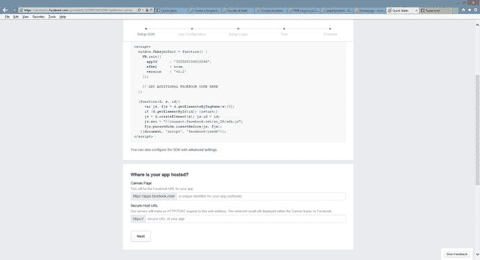

图 2-2。

The Facebook Quick Start page Another textbox requires you to enter a secure URL to link your app into Facebook. This is the actual location of your application on the Internet. Enter the complete address of the secure web page you have discovered or enter the location of your “Hello World” program if it is hosted on a secure site (`https`). Note: Facebook requires (at least) an ending slash for your link, something similar to: [`www.mysita.com/projects/myfirstprogram.php/`](http://www.mysita.com/projects/myfirstprogram.php/) Click the Next button.   The next page displayed will show more example code. This code can be used to log in to your application using the Facebook login and has the ability to request Facebook permissions for your application. However, our demo does not need login ability or any Facebook permissions. Just click the Next button at the bottom of the page.

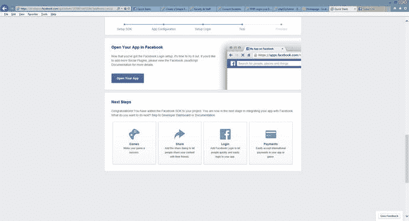

图 2-3。

The Facebook Open App page   Click the Open Your App button. Once you click the button, Facebook will try to load your page in the Canvas. However, if you have picked an existing secure web page and see a message similar to Figure [2-4](#Fig4), the page you selected might not allow hosting in another site. If this happens, go to Steps 7-10\. If you were successful, skip to Step 11\. However, copy and paste the URL (from the browser) that Facebook uses to display your page, so you can test it again, if needed.

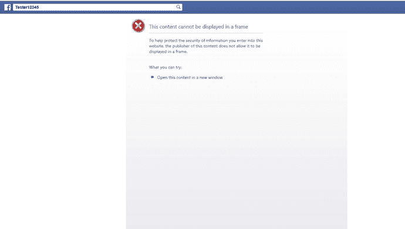

图 2-4。

Facebook open app failure   If your page did not display, do the following. After you have copied the URL, close the test page. You now want to find the “Dashboard” for your app. If it is not visible on your Developers Facebook page, go to the menu at the top of the page and select Apps. A drop-down list should display showing the name of your app(s). Select your app.

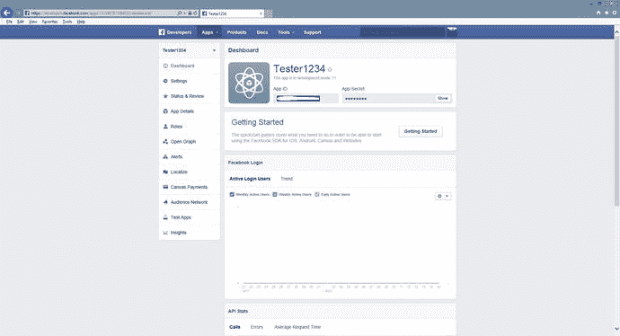

图 2-5。

The Facebook dashboard   Once you have displayed your dashboard, select Settings on the left menu.

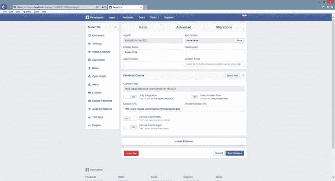

图 2-6。

The Facebook Settings page   Scroll down to the bottom of the page. Locate Secured Canvas URL and erase the address that resides in this textbox. Type the location of another secured web page (`https`) in the box. Remember, this must be a URL on the web, not your localhost. Click the Save Changes button.   Now paste the URL of your app (if you lost the URL address, it is under Canvas Page on the Settings Page) in your browser.

图 2-7。

Facebook working app   You should now see your app display on the canvas within your Facebook page.   Were you successful? What problems did you encounter following this example? How did you solve those problems?  

恭喜你，你已经创建了你的第一个脸书应用(虽然它不是实时的)。如果你想让你的一些朋友看到你的应用，你可以回到仪表盘，从菜单中选择滚动。然后，你可以使用你的朋友(是的，他们必须是脸书的朋友)，并在你的应用开发中给他们一个“角色”(如“开发人员”或“测试人员”)。然后他们就可以访问你的应用，而不用它上线。

作为一名脸书游戏开发者，你正在走向赚大钱的道路！嗯，也许还不是时候。我们省略了许多代码来应对脸书的 API。但是希望您明白，脸书可以很容易地用作 PHP 应用的容器。

### PHP、AJAX 和 CSS——网络应用

PHP 和 AJAX(异步 JavaScript 和 XML)配合得很好。AJAX 提供了动态改变部分网页而无需重新加载整个页面的能力。大多数网页都有静态区域(菜单、页眉和页脚)，它们不会随着用户交互而改变。当用户与页面交互(点击按钮)时，网页的这些区域不必改变。AJAX 可以让您开发一个容器(在下面的例子中，容器位于`div`标记之间)来显示 web 服务器上托管的程序的输出；而不会扰乱整个网页。然后，当用户交互(单击按钮)的结果仍在处理中时，用户可以查看网页上的内容(菜单、页眉和页脚)。如果由于某种原因程序运行缓慢、挂起或丢失，页面的其余部分仍然可以运行。当您显示一个页面时，可能会遇到这种情况，该页面由于试图一次加载大量信息(大量广告)而挂起，并且该页面将无法运行，因为它必须在可用之前完全加载。

AJAX 还允许您在不干扰网页的情况下改变 web 服务器上 PHP 应用的内容。然后，您可以在用户不知情的情况下更新应用中的代码(只要您保持应用的名称不变)。

我们来看一个例子。

Note

代码示例文件包含在该书的网站上。您可以复制并使用这些示例，无需任何更改。我们已尽一切努力确保本书中显示的代码是正确的。打印错误可能会影响显示的代码(例如大写和小写被调整，括号被尖括号替换)。网站上的所有代码都是有效的。

Example 2-1\. AJAX_Example_JavaScript.js

`function getXMLHttp()`

`{`

`var xmlHttp;`

`try`

`{`

`xmlHttp = new XMLHttpRequest();`

`}`

`catch(e)`

`{`

`//Internet Explorer is different than the others`

`try`

`{`

`xmlHttp = new ActiveXObject("Msxml2.XMLHTTP");`

`}`

`catch(e)`

`{`

`try`

`{`

`xmlHttp = new ActiveXObject("Microsoft.XMLHTTP");`

`}`

`catch(e)`

`{`

`alert("Old browser? Upgrade today so you can use AJAX!")`

`return false;`

`}`

`}`

`}`

`return xmlHttp;`

`}`

`function AjaxRequest()`

`{`

`var xmlHttp = getXMLHttp();`

`xmlHttp.onreadystatechange = function()`

`{`

`if(xmlHttp.readyState == 4)`

`{`

`HandleResponse(xmlHttp.responseText);`

`}`

`}`

`xmlHttp.open("GET", "myfirstprogram.php", true);`

`xmlHttp.send(null);`

`}`

`function HandleResponse(response)`

`{`

`document.getElementById('AjaxResponse').innerHTML = response;`

`}`

> JavaScript, a scripting language, provides interactive capabilities for web pages. With JavaScript, the web page can respond to the user's input of information in the text box and/or clicking the button. If you need to review JavaScript or need more examples, please watch the free "New Boston" (D `thenewboston.com`) video: `https://www.youtube.com/watch?v=yQaAGmHNn9s&list=PL46F0A159EC02DF82` To learn more about AJAX, please watch the free "New Boston" (`thenewboston.com`) video: [`https://www.youtube.com/playlist?list=PL6gx4Cwl9DGDiJSXfsJTASx9eMq_HlenQ`](https://www.youtube.com/playlist?list=PL6gx4Cwl9DGDiJSXfsJTASx9eMq_HlenQ) .

如果你不懂 JavaScript，不要太在意这个程序的细节。我们只看几个关键点。AJAX 使用 HTTP GET 请求程序，类似于浏览器请求页面。在这个例子中，类`XMLHttpRequest`(存在于 JavaScript 库中)的一个实例被命名为`XmlHttp`。然后这个对象被用来打开对`myfirstprogram.php`的请求(就像打开一个管道)。然后对象的`send`方法发送请求(将水推下管道)。如果文件被正确返回，文件的输出将放在 HTML 网页上 ID 为`AjaxResponse`的`div`标签之间。如果浏览器不能处理 AJAX 通信，将显示一个警告框，建议用户升级浏览器。尽管不太可能有人使用不能解释 AJAX 代码的浏览器，但是您仍然应该处理所有的可能性。

Example 2-2\. ajaxdemo.html

`<head> <title>PHP Ajax Demo</title>`

`<meta charset="utf-8">`

`<link href="ajaxdemo.css" rel="stylesheet">`

`</head>`

`<body>`

`
`

`
 <h1>PHP Ajax Demo</h1>  
`

`
  <h2>"Watch it!!"</h2>`

`
The words below will be replaced by "Hello World" which is pulled from the 'myfirstprogram.php' file via AJAX.
`

`<h2>AJAX DEMO</h2>`

`<input type='button' onclick='AjaxRequest();' value='Find Hello World!'/>  `

`
`

`Pay attention… Notice when you click the button that only this section changes.`

`
  
 <!-- end of content -->`

`
Copyright © 2015 Little Ocean Waves – Steve Prettyman`

`
<!-- end of footer -->`

`
 <!-- end of wrapper -->`

`</body></html>`

要使用这个脚本，更改`xmlHttp.open`语句来选择您想要执行的文件(而不是`myfirstprogram.php`)。更改`document.getElementById`行，在 HTML 文件中包含您想要用来存放输出的`div`标记的 ID(而不是`AjaxResponse`)(参见下一个例子中的 HTML 代码)。HTML—超文本标记语言是一种用于格式化网页布局的标记语言。浏览器解释 HTML，然后向用户显示结果。要更深入地了解 HTML，请访问免费的“新波士顿”(thenewboston.com)视频:g [`https://www.youtube.com/playlist?list=PL081AC329706B2953`](https://www.youtube.com/playlist?list=PL081AC329706B2953) 。

如果你对 HTML 不是很了解，不要担心。在这个例子中，你只需要看几行。首先，在代码顶部附近，一个链接标签拉入了`ajaxdemo.css`文件。这个 CSS 文件允许你看到一个有一些图形细节的页面。它允许您演示页面更新，而不需要 CSS 文件中的图形重新粘贴或闪烁。在这条线的正下方，脚本类型标签从示例 [2-1](#FPar3) 的 JavaScript 文件中加载。如果您将文件命名为其他名称，这一行需要用新文件名进行调整。如果您的文件不在同一个文件夹中，您应该在文件名中包含文件夹名称。

在 HTML body 部分的中间，input type 标记创建了一个按钮，单击该按钮将调用`AjaxRequest`函数(包含在 JavaScript 文件中)。这将导致示例 [2-1](#FPar3) 中的所有 JavaScript 代码执行。我们需要注意的最后一行是`
`标签。`id` ( `AjaxResponse`)中的值必须与 JavaScript `getElementById`代码中使用的对象名完全匹配。假设它们匹配正确，一旦点击按钮，JavaScript 代码将请求`myfirstprogram.php`文件并显示带有`AjaxResponse` ID 的`div`标签之间的结果。

Example 2-3\. ajaxdemo.css

`body { background-color: #000000;`

`font-family: Arial, Verdana, sans-serif; }`

`#wrapper { margin: 0 auto;`

`width: 85%;`

`min-width: 800px;`

`background-color: #cc0000;`

`color: #000066; }`

`#header { background-color: #ff0000;`

`color: #00005D; }`

`h1 { margin-bottom: 10px; }`

`#content { background-color: #ffffff;`

`color: #000000;`

`padding: 10px 20px;`

`overflow: auto; }`

`#footer { font-size: 80%;`

`text-align: center;`

`padding: 5px;`

`background-color: #0000FF;`

`color: #ffffff;`

`clear: both;}`

`h2 { color: #000000;`

`font-family: Arial, sans-serif; }`

`#floatright { float: right;`

`margin: 10px; }`

为了完整起见，这里显示了 CSS 文件。不懂 CSS 也不用担心。这个文件只是让网站看起来更适合演示。如果您要使用该文件，请确保将其保存在扩展名为`.css`的文件中。此外，如果您要更改文件的名称，请确保也更改链接标记(在 HTML 文件中)中的文件名以完全匹配。如有必要，请确保包括所有文件夹名称。

> CSS-Cascading Style Sheets (CSS) together with HTML display graphics on web pages. CSS describes the layout, color, text font, background image and other characteristics of the webpage. To learn more about CSS, please visit the free "New Boston" (`thenewboston.com`) video: `https://www.thenewboston.com/videos.php?cat=40&video=18754g.`

仔细检查所有三个文件(`.js`、`.css`和`.html`)，确保文件名与调用它们的链接完全匹配。如果所有文件链接正确，首先显示`ajaxdemo.html`文件，如图 [2-8](#Fig8) 所示。

图 2-8。

ajaxdemo.html

如果您的代码不起作用，请仔细检查文件名(确保它们没有以`.txt`结尾)。如果你看到一个空白页，那就有问题了。在你的代码中寻找错别字。是不是忘了`;`、`{`、`(`或者其他编码？如果您收到一条错误消息，请将其粘贴到您的浏览器中，以发现可能的解决方案。如果你没有看到错误信息，请查看 Apache 和 PHP 的日志(见[第 1 章](1.html))来确定其他可能的问题。

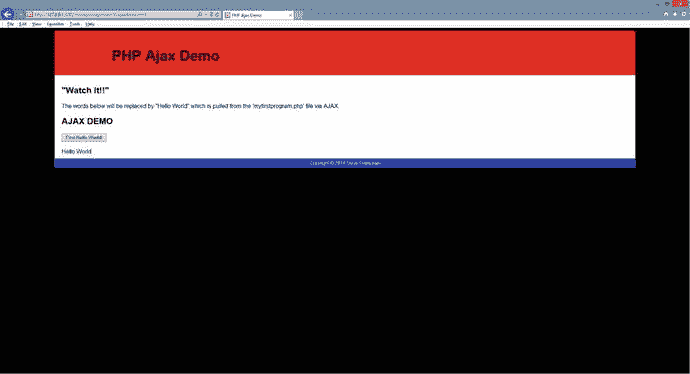

图 2-9。

The ajaxdemo.html file after the AJAX request

如果没有语法错误(或不正确的文件名或位置)，当用户单击按钮时，页面将使用 AJAX 请求`myfirstprogram.php`文件，并将在`div`标记之间显示程序的执行结果。在这个例子中，`Hello World`将被显示。

#### 做它

Copy the three files shown previously from the book’s web site into your projects folder (the location that you are running your projects in Apache). Run the HTML program. Was your test successful? If not, why not?   Change the file name of your `.js` file and change the link tag in your HTML file to reflect the new file name. Test your HTML program. Was your test successful? If not, why not?   Change the name of your PHP program. Make changes to the `.js` file to reflect the new name of your PHP program. Test your HTML program. Was your testing successful? If not, why not?  

### PHP、AJAX 和 CSS——智能手机网络应用

至此，您应该开始发现创建 PHP 应用的灵活性和强大功能。您可能会有点失望，因为我们没有详细介绍智能手机的应用开发。如前所述，智能手机上的应用通常对操作系统进行 API 调用，请求使用手机上的应用(如 GPS)。那种程度的编码已经超越了入门级。因此，超出了这本书的内容。然而，有时我们希望为智能手机提供从手机浏览器访问 web 应用的能力。我们只需对之前的演示做一些修改就可以提供这种能力。这为您提供了一个适用于任何大小的包含浏览器的设备的应用。

您将在不调整 HTML(除了添加链接)、JavaScript 或 PHP 代码的情况下做出这一更改。您可以使用 CSS 在智能手机或其他移动设备中调整`ajaxdemo`网页的格式。在这个例子中，你只需要改变 HTML 文件来发现显示(界面)的大小。然后，CSS 可以用来改变图形，以适应适当的屏幕尺寸。

如果 PHP 文件包含大量 HTML(和/或其他 CSS 代码)，我们可能也需要调整 PHP 文件。然而，我们应该总是考虑让 CSS 格式化整个输出(而不是 PHP 文件)。这将允许您在多个容器(主机)中使用相同的代码，正如您在本章中看到的演示。

您可以在`ajaxdemo.html`文件中原始 CSS 文件的链接下方添加以下行。

`<link href="ajaxdemomobile.css" rel="stylesheet" media="only screen and (max-device-width:480px)">`

`<meta name="viewport" content="width=device-width, initial-scale=1.0">`

Note

新的完整 HTML 文件位于该书的网站上。

这两行代码将尝试确定显示屏的大小，并将新的 CSS 文件用于 480px 或更小的屏幕。这个演示程序可以在大多数移动设备上运行。但是，让我们调整一下，去掉一些间距、填充和边距。

Note

您还可以将 CSS3 Flexbox 属性用于多种设备尺寸。由于它的使用需要对 CSS 有更多的了解，我们将坚持使用“旧风格”的方法。你可以在下面的 w3schools 链接找到更多关于 CSS3 Flexbox 的信息。

[T2`http://www.w3schools.com/css/css3_flexbox.asp`](http://www.w3schools.com/css/css3_flexbox.asp)

Example 2-4\. The ajaxdemomobile.css file

`body { background-color: #000000;`

`font-family: Arial, Verdana, sans-serif;`

`margin: 0;       }`

`#wrapper { margin: 0 auto;`

`width: 100%;`

`margin: 0;`

`min-width: 0px;`

`background-color: #cc0000;`

`color: #000066; }`

`#header { background-color: #ff0000;`

`color: #00005D;`

`font-size: 100%;`

`padding: 0.5px 0.5px 0.5px 0.5px; }`

`h1 { margin: 0px; }`

`#content { background-color: #ffffff;`

`color: #000000;`

`padding: 0.5px 0.5px;`

`overflow: auto; }`

`#footer { font-size: 80%;`

`text-align: left;`

`padding: 0px;`

`background-color: #0000FF;`

`color: #ffffff;`

`clear: both;}`

`h2 { color: #000000;`

`font-family: Arial, sans-serif;`

`margin: 0px;          }`

`#floatright { float: none;`

`margin: 0px; }`

对比示例 [2-4](#FPar8) 和示例 [2-3](#FPar5) 。示例 [2-4](#FPar8) 中的代码并不完美，但它确实给了你一个在移动设备上显示的原始 CSS 文件中可以调整的概念。本示例将边距和填充减少到零，或几乎为零。这极大地减少了较小移动设备的显示器上浪费的空间。

#### 做它

Locate the new HTML file and CSS file on the book’s web site. If you have a web host provider, upload these files (and the `.js` file) to the host. Try to access the HTML page from your smart phone. You can also try to display the page by using the URL location of the file on the book’s web site. Was your test successful? If not, why not? Did the page format properly on your phone? If not, what do you think needs to be adjusted?   Note

如果你在互联网上没有一个主机网站，你也可以通过下载一个免费的移动模拟器来测试这个 CSS 文件(试试 [`www.download.com`](http://www.download.com/) )。你也可以改变 HTML 文件中的链接标签指向`ajaxdemomobile.css`文件而不是`ajaxdemo.css`文件。然后试着缩小你的浏览器来模拟智能手机屏幕。

#### PHP、HTML、JavaScript、CSS 和动态网页

作为 PHP 程序容器(主机)的最后一个例子，让我们考虑一下浏览器。正如你在本章中看到的，你可以使用一个 HTML 文件来调用我们的 PHP 程序(点击前面演示中的按钮)。如第 1 章中所详述的，这将导致 PHP 程序执行并将结果返回给浏览器。你也可以让你的 PHP 程序返回 HTML 代码。

Example 2-5\. Dynamic HTML page created by a PHP program

`<?php`

`print "<html>";`

`print "<head><title>My Program</title></head>";`

`print "<body>";`

`print "<h1>Hello World</h1>";`

`print "</body>";`

`print "</html>";`

`?>`

您可以向请求执行 PHP 程序的设备(浏览器)返回一个完整的 HTML 页面(甚至包含 JavaScript 和链接)。示例 [2-5](#FPar9) 将从 PHP 代码中创建一个完整的动态 HTML 页面。创建的输出甚至可以包含指向 CSS 文件的链接和用于格式化的嵌入式 CSS 标签。然而，我强烈建议在嵌入依赖于容器大小的 CSS 标签时要小心。作为开发人员，您不知道哪种类型的设备会显示结果(PC、智能手机、平板电脑或 pad)。最好提供多个 CSS 文件(如前所示)来格式化不同设备的输出。

在前面的例子中，我们已经将初始界面(HTML 和 JavaScript)从 PHP 程序中分离出来。您实际上可以将 HTML(显示初始网页)和 PHP 代码放在同一个文件中。

您可以创建一个 PHP 文件来确定用户以前是否请求过该页面。如果没有，或者浏览器超时了，那么 PHP 程序会显示一个初始的 HTML 页面供用户交互(比如点击一个按钮)。然后，同一个程序可以再次调用自身来确定按钮是否被单击并返回响应。

让我们看一个不同版本的`Hello World`程序来完成这个任务。

Example 2-6\. The callmyself.php file

`<?php`

`if (isset($_POST['submitbutton']))`

`{`

`print "<h1> Hello World </h1>";`

`}`

`else`

`{`

`print "<html><head><title>PHP Example</title></head>";`

`print "<form method='post' action='callmyself.php'>";`

`print "<input type='submit' id='submitbutton' name='submitbutton' value='Find Hello World!'/>";`

`print "</form>";`

`print "</body></html>";`

`}`

`?>`

为了更深入地演示 PHP If 语句，请访问以下来自“新波士顿”(The New Boston)的免费视频:https://www.thenewboston.com/videos.php?cat=11&video = 17004。

这个程序包括一个简单的`if`条件语句来确定用户是否点击了提交按钮。

`if`语句的格式如下:

`if (conditional statement)`

`{`

`// code to execute if the conditional statement is true`

`}`

`else`

`{`

`// code to execute if the conditional statement is false`

`}`

条件语句通常比较两个值来确定它们是相同还是不同，或者调用返回`true`或`false`值的方法。我们一会儿将看看返回值的函数。让我们看一个第一种类型的简单例子。

条件语句使用比较运算符`(==, <, >, <=`和`>=`来确定语句是`true`还是`false`。

`If ( a > b)`

`{`

`print "it's A!";`

`}`

`else`

`{`

`print "it's B!";`

`}`

在这个例子中，比较属性`a`和`b`中的值。如果`a`大于`b`，那么“是 A！”显示。否则“是 B！”显示。当 PHP 认为有必要时，它会做一些类型转换。例如，假设`a = "5"`，和`b = 6`。PHP 会将`a`中的值从字符串 5 转换为数字 5，这样它就可以进行比较。许多语言不这样做，如果您尝试比较字符串和数字，会显示一个错误。如果不希望发生这种转换，可以使用一些特殊的比较运算符。例如，您可以使用三个`=`符号而不是两个符号来查看值是否完全相同(`a === b`)。

> And security-use = = instead of = = whenever possible. This will ensure that you get what you expect.

在示例 [2-6](#FPar10) 中，`if`语句调用一个方法(`isset`)。`$_GET`尝试检索属性(`'submitbutton'`)及其值(`Find Hello World`！")来自 HTML 表单，它使用 HTTP GET 来传递信息(您本来可以使用`$_POST`和 HTTP POST)。`isset`将向`if`语句返回一个`false`或`true`，这取决于`$_GET`是否可以检索属性(及其内容)。`true`或`false`将导致`if`语句决定执行哪个代码块。

正如在第一章中提到的，HTML 表单中的一个对象(比如一个按钮)将根据对象的名称和包含在该对象的值语句中的内容产生一个属性和值的组合。对于已经给定了名称(`id`)和值的提交按钮也是如此(如示例 [2-6](#FPar10) )。

第一次从浏览器调用程序时，按钮没有被单击。所以没有创建`submitbutton`变量。通过`isset`方法返回一个`false`。代码跳转到`else`部分并执行显示 HTML 表单和提交按钮的`print`语句(如图 [2-10](#Fig10) )。

图 2-11。

callmyself.php after the button is clicked

图 2-10。

callmyself.php before the button is clicked

当用户点击按钮时，程序调用自己(看一下`form`标签的`action`参数)。这一次，因为用户已经单击了按钮，所以有一个 submitbutton 属性和一个变量的值(`'Find Hello World!'`)。程序确定变量是“set”(里面有一个值)并返回一个`true`。然后，`if`语句执行`if`和`else`语句之间的一行代码。然后显示`Hello World`。PHP 程序处理应用的所有功能，而不使用任何现有的静态 HTML 页面。

这种技术的优点是所有代码都可以包含在一个文件中。因此，所有的变化都发生在一个地方。这种技术的缺点是所有代码都在一个文件中。代码越复杂，就可能变得越“混乱”。清理代码的一种方法是将代码转移到包含在其他 PHP 库中的函数中(我们将在后面讨论)。另一个缺点是，在不影响用户的情况下，不能更改文件名。如果您将文件名更改为`mynewprogram.php`，您将需要通知您的所有用户新的名称(可能还有位置)。前面使用 AJAX 的例子允许您在 HTML 代码页中更改文件名，但是不要求您更改用户请求的 HTML 页面的实际名称。

#### 做它

Find the `callmyself.php` file on the book’s web site. Download the file to your Apache `projects` folder. Change and add `print` statements to display your complete name, the term, and your major. Test your program. Did your program run successfully? If not, why not?  

## PHP 三层架构

这一章的大部分都在探索可以“托管”PHP 应用的不同平台(或容器)。我们发现 PHP 可以在几乎任何容器(PC、脸书、智能手机/移动设备或浏览器)中显示其输出。PHP 可以轻松地与 JavaScript、HTML 和 CSS 交互，这提供了这种灵活性。今天，几乎任何平台都有与互联网交互的能力(那些不具备这种能力的平台将在未来某个时候具备)。任何可以与互联网交互的平台也可以与 PHP 应用交互。

接口的这种独立性(或灵活性)展示了平台或接口主机与应用的其他“层”(部分)的逻辑分离。这就引出了对 PHP 应用的三层架构和逻辑设计的讨论。应用越大，就越有可能需要将应用分成模块。此外，这些模块更有可能驻留在不同的服务器(或 web 服务器)上。更大的应用可能需要多个程序员同时编写代码。这些程序员甚至可以使用不同的语言来创建程序模块。

构建一个大型应用与组装一辆汽车没有太大区别。汽车的各个部件(车身、车轮、电子设备和发动机)首先被单独组装。然后，每个完成的组件被放入汽车底盘内。然后将组件连接(软管、电线和皮带)到其他组件。完成后，汽车的所有部件一起工作。如果一个部件坏了，它可以被替换，而不会导致汽车中任何其他部件的替换或改变。

模块化(或组件)编程的思想是基于代码块的方法，这些代码块可以单独创建，然后与其他模块组装在一起，生成一个工作应用。这些模块可以被修改或替换，而不需要改变其他模块。这种方法已经存在一段时间了。即使在今天，许多程序也不是模块化的，因为较小的程序不需要分成模块也能有效地工作。然而，随着这些应用扩展成更大的应用，它们变得更加难以更新或维护。更改需要更新整个应用，而不仅仅是一个模块。在某种程度上，一个没有用模块创建的扩展应用必须从头开始重新设计成模块，以便更好地维护和提高可靠性。

正如在第一章中所讨论的，搜索引擎可以在用户电脑的浏览器中显示网页界面。一旦用户输入搜索请求，信息可以通过互联网传输到远程服务器(我们不知道在哪里)，远程服务器执行搜索应用(我们不知道它是用什么程序语言创建的)。然后，应用在数据库(我们不知道是什么 DBMS，也不知道它在哪里)中搜索所请求的信息。结果被发送回应用，应用又将信息发送回用户 PC 上的浏览器(通过 web 服务器)。

图 2-12。

Three-tier modular application design

这个过程中的信息流使得这种类型的 web 应用的设计自然地分为(至少)三层(模块)；接口层、业务规则层和数据层。将代码分成不同层的一个优点是能够在多个应用中重用层。例如，我们的搜索引擎可以为多种设备使用相同的业务规则层和数据层，同时使用不同的界面(PC 应用或智能手机应用)。不同的层也可以更新，而不会影响其他层。智能手机应用界面可以更新，以使用最新操作系统的最新功能，而无需更改业务规则或数据层。可以更新业务规则层中的代码来修复逻辑错误，而不需要更改接口或数据层。让我们看看每一层通常会发生什么。模块化的三层应用、设计和编程——三层设计提供了创建程序的能力，这些程序可以分为界面层、业务规则层和数据层。界面层包含与向用户显示信息相关的所有图形和程序代码。业务规则层不包含接口。但是，它处理从接口层提交的任何信息，然后可以将信息提交给数据层进行存储。数据层是应用的主要存储位置，可能包括数据库的使用。每一层都可以独立地更改和构建(编译),而不会影响其他层。

### 做它

What are the name of the three tiers of modular design?   How is modular design similar to designing a building?   How does modular programming make coding more efficient?  

### 界面层

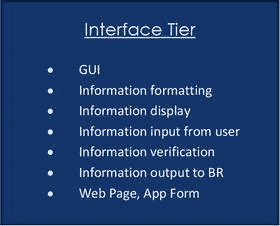

图 2-13。

Interface tier

界面层(IT)显示信息，并为用户提供与应用交互的能力。大多数界面都提供了图形用户界面(GUI ),允许用户以一种吸引人的方式查看信息并与应用交互。GUI 界面提供通用对象，包括文本框和按钮，帮助用户快速适应新的应用。此外，图片、图像、图标、视频和声音也经常被包含进来，以保持用户的兴趣。通常还包括菜单和其他导航对象，以帮助用户成功地在应用中移动。对象——对象是已经被编译用于应用的代码块。通过创建对象的实例，可以将对象放入程序中。对象包含方法和属性。方法(或函数)是完成一项任务的代码块(例如将项目放入列表框中)。属性(或变量)是可以改变的对象的特征(如背景颜色)。对象通常经过良好的测试，没有错误。通过重用现有对象，程序员可以快速创建更可靠的程序。

这一层将使用对象(如标签和图片框)或脚本代码(如本章中的`ajaxdemo.html`示例)来显示信息。该层还将通过交互式对象(如文本框和按钮)接受来自用户的信息。静态信息可以在层内提供(通过菜单、徽标或页脚)。动态信息通常从业务规则层提供给业务规则层(例如本章中显示的`myfirstprogram.php`的输出)。

接口层中可能会出现一些编码(在后面的章节中介绍),用于准备发送到其他层的信息。例如，验证用户输入了所有必需信息或正确信息(年龄文本框中的数字字符)的 JavaScript 代码是可以接受的。附加代码还可以准备从业务规则层接收的信息，以便在界面中显示(例如将数字转换为文本格式)。

> Verification/verification code-verification code verification information. The code compares the received information with the expected standard format. For example, the code can verify that the e-mail address contains both @ and. (period). If the information contains these two symbols, it can be considered as "valid" (although we are still not sure whether the email address really exists). Without these two symbols, the code is invalid. Invalid information usually causes the program to display an error message to the user, asking to re-enter valid information.

界面必须提供能够对用户交互(单击提交按钮)作出反应的代码，这通常称为用户事件。还可以提供代码来准备由用户提供的信息以供其他层使用(例如将用户输入的文本转换成数字格式以用于商业规则层中的计算)。事件——事件驱动语言(如 PHP)可以在事件发生时执行代码块。事件可以是用户已经完成的事情(比如点击按钮)。操作系统也可以触发事件。程序提供“听到”事件的监听器代码。当事件发生时，代码提供一个事件方法，然后执行该方法。程序通过侦听器代码的存在与否来选择要侦听的事件。

接口层不应该直接与数据库管理系统或数据库本身交互。通过这样做，这将把层锁定到数据库位置和数据库的实际设计中。该层不应操作数据(除了用于显示目的)。任何与应用本身相关的会计、数学计算或数据处理都应该在业务规则层完成。数据库管理系统(DBMS)——数据库管理系统是一种允许用户或应用创建和定义数据库的软件。它还提供了在数据库中插入、更新或删除信息的能力。

  
| 做 | 不 |
| --- | --- |
| 格式化数据以便显示 | 从数据库访问数据 |
| 验证用户提供的信息是否正确 | 计算结果 |
| 响应用户事件 | 过程信息 |
| 处理意外情况(异常) | 验证用户 id 和密码 |
| 格式化业务规则层的数据 |   |

### 做它

Give three examples of items that would be included in the interface tier.   Give three examples of items that would not be included in the interface tier.   Can some program code exist in the interface tier? If so, what tasks does this code provide?  

### 业务规则层

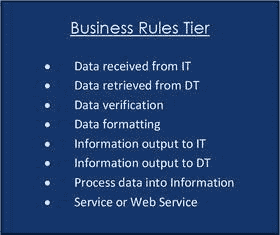

图 2-14。

Business rules tier

业务规则层处理从接口层和数据层收到的所有信息和数据。这个层还将返回接口层请求的信息(比如返回`"Hello World"`)，并将信息提交给数据层进行存储。大多数实际的编程代码都包含在这一层中。

业务规则层代码通常使一个应用真正不同于另一个应用。如果一个应用是受版权保护的，那么独一无二的创造性算法可能就隐藏在这一层。例如，web 搜索引擎中的许多差异以及信息最终将如何显示都嵌入到业务规则层中。

与可能在浏览器中包含代码的界面层不同，业务层中的所有编码都是使用服务器上的程序(如 PHP)完成的。驻留在服务器上的脚本和编程代码由服务器本身保护，用户不能访问。业务层代码也可以驻留在应用服务器(作为服务)或 web 服务器(作为 web 服务)上。服务器通过不允许用户直接访问来确保这一层中的代码是安全的。

> Server/application server /Web server-the server is connected to the network and provides services for any node (machine) on the network (or the Internet). Servers can provide multiple services (communication, security and/or storage) or specific services. The application server stores applications that users can access on the network (or Internet). The Web server hosts web pages and web applications. They are usually exposed to access outside the company. Service—A service is an application that resides in the memory of a computer or server and is used to respond to requests from other applications. Services can be automatically loaded into memory when the computer or server starts, or started and stopped manually when needed. Service has no GUI interface. The business rule layer can reside as a service on a computer or server.

如果在应用各层之间传递的信息可能会受到黑客的操纵，那么这一层可能会包含类似于接口层的代码，以验证所接收数据的格式是否有效和正确。

从这一层传递到其他层的信息可以被格式化以便于接受。例如，数据集(类似于表格或电子表格)可以返回到界面层，以便显示在网页上现有的表格或列表框中。数据集也可以被发送到数据层以插入到数据库中。数据集—数据集是一种可以容纳多个数据表的结构。数据表类似于数据库(包含行、列和数据)或电子表格中的表。数据集通常用于在层之间和方法之间传递信息。

业务规则层将值返回给请求它的层。该层不提供任何 GUI 界面或任何形式的表单。不需要界面，因为该层在任何时候都不与用户直接联系。所有与业务规则层的通信都是通过接口层或数据层来处理的。与接口层一样，业务规则层不直接更新数据库中存储的信息。所有存储更新都发生在数据层。

  
| 做 | 不 |
| --- | --- |
| 操纵数据 | 显示信息 |
| 格式化数据 | 在辅助设备上保存数据 |
| 将数据存储在内存中 | 显示错误消息 |
| 引发异常 |   |
| 验证数据 |   |

### 做它

What tasks can business rule tier code accomplish that is similar to a task accomplished by code in the interface tier? Why is this code possibility duplicated in both tiers?   How does the business rules tier pass and receive data (information)?   Why must the business rules tier talk indirectly through the interface tier to provide information to the users?  

### 数据层

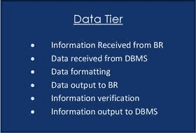

图 2-15。

Data tier

数据层的主要功能是在辅助设备上存储信息或将数据返回给业务规则层。数据可以(通常是)使用数据库管理系统(如 MySQL)存储在数据库中。该层与业务规则层相连接，因为在显示数据之前，可以对数据进行操作，就像创建报告一样。数据以业务规则层(和程序语言)可以接受的格式从该层返回。常见的格式包括 JSON、XML、SOAP 和数据集。JSON——JavaScript 对象符号是一种类似于 XML 的格式，用于存储和交换数据。JSON 可以在编辑器或浏览器中查看。它最常用于在层间传递数据。XML—可扩展标记语言是一种标记语言，类似于 HTML，用于存储和描述数据。XML 也可以用来在层之间传输数据。我们将在第 3 章中提供一个 XML 的例子。SOAP—简单对象访问协议用于与 web 服务交换数据。它与 HTTP(超文本传输协议)和 SMTP(简单邮件传输协议)一起提供应用和 web 服务之间的通信。Web 服务—没有接口的应用，可以被调用来处理信息。web 服务可以在 web 服务器上远程提供业务层和/或数据层的功能。web 服务描述语言(WSDL)用于描述对 web 服务的调用以及 Web 服务接受和返回的信息格式。WSDL 类似于 XML。

数据层的验证是在数据库管理系统中和/或通过程序代码完成的。这一层的验证是在数据库更新之前确保数据可靠和准确的最后机会。在存储验证问题之前发现它们比在记录无效信息之后发现它们要容易得多。

数据存储可以是本地和/或远程的。移动设备可以将存储限制在本地数据库(智能手机)，但也可以使用 WSDL (web 服务)在服务器或云中(如微软 Azure)远程存储和检索信息。此外，许多应用使用 cookies 在本地保存少量信息，或者在远程数据库中保存大量信息。微软 Azure——微软 Azure 是一个云平台，提供数据服务、应用服务和网络服务。Visual Studio 应用可以在 Microsoft Azure cloud 中上传和保护。

数据层使用 SQL 语句(INSERT、DELETE、UPDATE 和 SELECT)检索和更新数据库中的信息。然而，对信息进行更改的实际请求来自业务规则层。例如，在 web 应用中请求地址更改的用户必须在接口层输入所请求的更改，在业务规则层格式化更新请求，并在数据层更改数据库中的信息。

  
| 做 | 不 |
| --- | --- |
| 在辅助设备上保存数据 | 操纵数据 |
| 更新辅助设备上的数据 | 显示错误消息 |
| 引发异常 | 显示信息 |
| 验证数据 |   |

### 做它

Why must the data tier validate information again, before it is placed in a database?   What type of code, if any, can exist in the data tier?   What is SQL used for?  

### 把这一切放在一起

程序开发生命周期(PDLC)引导我们完成应用开发的整个设计和创建过程。应用开发成功的关键是在开始编码和开发之前正确规划系统的布局。这样做可以减少可能出现的错误和问题。许多项目可能会陷入一个“角落”,由于事先计划不周，开发人员无法绕过这个角落。不同的作者和教师对计划过程中花费的时间的估计会有所不同，因为这是基于个人的。一个更有技能或更有经验的人可能比不自信的人做得更少。然而，每个人都至少计划好了所需的模块和模块之间流动的数据类型；即使只是在草稿纸上完成。同样，关键是在编码和开发过程中修改你的计划。当你开始编码时，你会发现“我没有想到”的情况。回去，然后调整你的计划。你这样做得越多，你就越不可能碰到一个你找不到办法绕过的“角落”。

在你的 PDLC 过程中，一定要让用户参与进来，同时要有一个强大的专家团队。请记住，您开发这个项目是为了让您的客户满意。你可能相信你有最终的设计和解决方案。然而，如果你的用户不同意你的观点，那也没关系。有时候，你确实需要调整自己的思维，以便更符合客户的需求。在这个行业工作时，我记得我的工作团队正在创建一个重大的变革管理系统(我很高兴没有参与这个项目)。设计者和编码者创建了一个非常花哨和昂贵的系统，一旦在数据中心实施，就很难使用。为什么？数据中心人员不想要花哨的系统；他们想要一个能够快速完成所需任务的简单系统。尽管最初的项目需要六个月才能完成，但一名数据中心员工利用自己的几个周末时间创建了另一个系统，实现了他们的目标。该系统在此后的许多年里一直被实施和使用。

通常，PDLC 由五个步骤定义；规划和信息收集、分析、设计、实施和评估。在计划和信息收集步骤中，集合了项目和项目团队的所有需求。还创建了初始文档来回答问题“我们试图完成什么？”“我们将如何完成它？”，以及“我们将使用哪个团队？”在分析步骤中，确定项目的可行性。文档回答了这样的问题“我们能用可用的团队和资源完成项目吗？”、“需要收集哪些额外资源？”，以及“项目能否在规定的时间和预算内完成？”如果项目通过了分析步骤(许多项目没有)，那么实际的设计就开始了。在设计阶段，自顶向下的方法从首先查看整体所需的模块以及模块之间的数据流开始。随着所需方法的确定、平台的确定、通信工具的组合以及信息存储的设计，更多的细节将逐渐增加。

详细设计完成并获得批准后，项目将进入开发和测试阶段。单元测试(单个模块)和完整的应用测试都会发生。测试成功后，项目就可以进入实施阶段了。在实现过程中，必须决定如何安装项目以及何时安装。实现后，应用就“活”了。但是仍然应该进行持续的评估，以有效地确定需求、安全问题、逻辑问题以及项目可能的整体增强。最终，大多数项目会回到开发新版本过程的第一步。

本节假定规划、信息收集和分析步骤已经成功完成，这将使您进入设计步骤。总的来说，我们将关注决定什么类型的活动应该发生在应用的哪个层的过程。我们还将了解可能在各层之间流动的数据或信息的类型。在后面的章节中，我们将通过确定所需方法的类型以及必须流入和流出这些方法的信息和数据来完善这种分析。我们还将看看为这些方法创建的实际活动和代码。

最好的学习方法是通过实践，所以让我们看一个案例问题，然后从那里开始。

### 个案研究

公司:原子鱼孵化场有限公司。

项目:现场销售订单和佣金申请

范围:该应用将可从多种设备(移动设备和 PC)访问，以允许现场销售代理、经理和工资单人员轻松访问必要的信息。系统将接受来自销售代理的信息，这些信息将用于确定客户的购买成本、销售经理的销售量以及工资部门的佣金。项目的第一阶段是应用的开发，以接受来自销售代理的信息，显示购买成本，确定佣金，并将信息存储到 MySQL 数据库中。在成功测试平台后，它将被移动并安全保存在公司的云平台中。

输入(来自销售代理):销售代理编号、客户编号、订单编号、项目编号、数量和特殊需求

产出:(可能为未来阶段确定更多信息)

到数据库:除了来自销售代理的输入:佣金，销售总额

目标是确定每一层中将要出现的信息和流程的类型，以及各层之间的数据流。一旦确定下来，这些信息就可以用来开发一个通用的空层结构，这个结构最终将包含整个项目。

#### 界面层

该公司已请求从多个设备进行访问。因此，我们必须记住，除了笔记本电脑和个人电脑之外，移动设备(平板电脑和智能手机)也将用于输入和输出信息。我们可以决定为每种类型的设备创建多个接口。使用三层设计，您可以设计一个共享业务规则层和数据层内容的系统，同时允许这种灵活性。

作为一名设计师和/或程序员，你必须确定将要输入的信息类型；几个字段(销售代理编号、客户编号、订单编号、项目编号和数量)都表示将输入数字。您需要确定这些字段的大小，并验证是否只输入了数字信息。“金额”字段是唯一可能在未来计算中使用的字段。因此，所有其他字段都可以保持文本格式。在将信息传递给业务规则层之前，需要将 Amount 字段转换为整数格式。特殊需求字段将是一个更大的字段，可以接受字母数字字符。该数据库目前不存在，因此您需要根据公司政策和/或当前使用的纸质表单来确定字段大小。审查后，确定客户和销售代理编号为八个字符。订单编号和项目编号目前是六个字符。

收集完这些信息后，您现在可以设计接口层的俯视图，如图 [2-16](#Fig16) 所示。

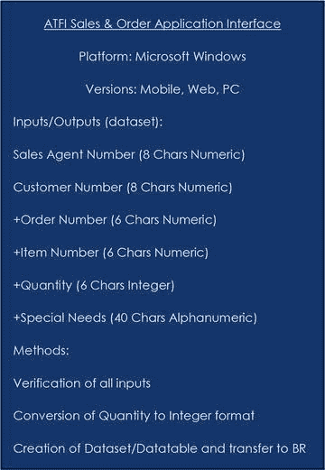

图 2-16。

Atomic Fish Hatchery Inc. sales and order application interface

销售代理可以多次使用带+的字段来输入所有信息。当创建实际的数据集和数据表时，必须有多个列可用于这些条目。

还会有一个额外的表单(未显示)来显示订单的结果。该表单将显示所购物品和总费用的摘要。所有信息都可以由销售代理输入、提交并保存在接口层(cookie？)，直到销售代理表示订单已完成。然后，可以将信息转移到业务规则层进行处理。然后，业务规则层可以返回要在第二个表单中显示的信息。第二个表单可以包含一个“批准”(或取消)按钮。一旦获得“批准”，信息就可以传递到数据层进行存储。

#### 业务规则层

业务规则层将包括两个流程。一个流程将接受完整的订单(数据集/数据表),并在销售代理单击“完成订单”按钮后确定总销售成本。然后，它会将该信息的摘要返回给第二个表单。当代理单击“批准”按钮时，将执行另一个流程。然后，该流程将确定佣金并创建一个数据集(现在有了额外的字段)传递给数据层。然后，信息将被传递存储。

此外，为了确保订单数据有效，需要一些方法来验证从接口接收的字段。业务规则层的俯视图如图 [2-17](#Fig17) 所示。

图 2-17。

Atomic sales and order application business rules tier

#### 数据层

在这种情况下，数据层仅用于存储业务规则层提供的信息。该层将验证收到的信息，并将其存储到数据库中，如图 [2-18](#Fig18) 所示。

图 2-18。

Atomic sales and order application data tier

有许多工具可以在设计过程中提供帮助。重要的因素是设计者在过程中包括所有重要的信息。作为示例的替代，您可以从层中删除数据集的描述，并将它们放在层之间的数据流中，如图 [2-19](#Fig19) 所示。

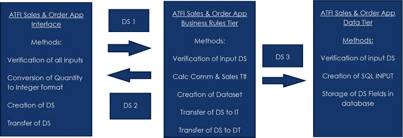

图 2-19。

Alternate three-tier model

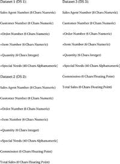

图 2-20。

Atomic Sales and Order Application Three-Tier Model

### 做它

When must you convert numbers to numeric form (such as Integer) for storage within a database?   Why use datasets to pass information between tiers?   What items have been missed or ignored in the case example?  

## MVC 和依赖注入

MVC(模型-视图-控制器)是软件工程师(包括 PHP 应用设计人员)使用的一种设计模式，通过控制器在视图和模型之间进行通信。控制器是将任何用户输入传输到模型的软件。MVC 设计可以被认为是循环的，因为模型、控制器和视图能够相互通信。标准的三层模型是线性的；对于接收信息或向数据层传递信息的接口，它必须通过业务规则层传递信息。市场上有很多工具(比如 Ruby on Rails)可以帮助软件工程师设计 MVC 应用。

> Visit thenewboston.com for a general example of MVC application: `https://www.thenewboston.com/videos.php?cat=88`

MVC 和基于组件的设计可以使用依赖注入。依赖注入允许程序(客户端)在不知道代码块的实际实现的情况下使用代码块(比如类)。这允许模块的独立开发、更新、测试和重用。这类似于汽车的点火装置与起动器通信的能力。点火装置对起动机部件及其工作原理知之甚少。它甚至不知道启动器的品牌。点火装置仅仅知道发送一个信号(电)给启动器，告诉它运行。如果更换了起动机，只要起动机在接收到信号时仍然工作，点火装置就不会察觉到这种变化，也不会受到这种变化的影响。虽然 MVC 和依赖注入是高级主题，但我们将在第 4 章的[中探索依赖注入的例子。](4.html)

## 章节术语

  
| 平台或集装箱 | GTK 软件开发工具包 |
| 智能手机 API | 脸书帆布平台 |
| 应用编程接口 | 脸书开发者页面 |
| 创建交互式、快速动态网页应用的网页开发技术 | 字符串 |
| `XMLHttpRequest` | `document.getElementById` |
| 半铸钢ˌ钢性铸铁(Cast Semi-Steel) | 条件语句 |
| 如果语句 | 三层架构 |
| 界面层 | 业务规则层 |
| 数据层 | 图形用户界面(GUI) |
| 目标 | 验证码 |
| 事件 | 数据库管理系统 |
| 服务器 | 应用服务器 |
| 网络服务器 | 服务 |
| 资料组 | 数据 |
| 可扩展置标语言 | 肥皂 |
| 服务描述语言 | 结构化查询语言 |
| Microsoft Azure | 聚合物分散液晶 |
| 规划和信息收集 | 分析步骤 |
| 设计步骤 | 实施步骤 |
| 评估步骤 | 模型-视图-控制器 |
| 依赖注入 |   |

## 第二章问题和项目

多重选择

The interface tier Is the primary storage location for the application, which may include the use of a database   Provides common objects, including textboxes and buttons, that help the user quickly adapt to new applications   Should be used for any accounting, mathematical calculations, or processing of data related to the application   Displays information and provides the user the ability to interact with the application     A service is an application that Can be manually started and stopped when required   Does not have an interface   Resides in the memory of a computer   All of the above     SOAP stands for Security Object Access Protocol   Simple Object Access Process   Simple Object Access Protocol   None of the above     The five steps of PDLC are Planning and Information Storing, Analysis, Design, Implementation, and Evaluation   Planning and Information Gathering, Analysis, Design, Implementation, and Evaluation   Planning and Information Gathering, Analysis, Data, Implementation, and Evaluation   Planning and Information Gathering, Analysis, Design, Observing, and Evaluation     The Web Service Description Language is used to Describe calls to the web server and the format of information sent and returned by the web service   Describe calls to the web service and the format of information accepted by the web service   Describe the code being used in HTML documents   Describe calls to the web service and discard the information received     CSS stands for Cascading Static Styles   Cascading Style Sheets   Cascading Script Sheets   Cache Style Scripts     What type of code belongs between the `` tags? Java   HTML   Servlets   Javascript     What is the three-tier architecture composed of? GUI/tags/validation   interface/business/data access   Objects/variables/SQL   JSPs/servlets/sockets     The best description for the Model View Controller (MVC) is An architectural pattern that divides a given software application into three interconnected parts.   A programming language used to validate and secure information in any browser.   A type of validator mainly used to check if the user entered the information on the correct format   A type of method that is used to convert a harmful code so it cannot be executed by the compiler.     What is performed in the Analysis step? Determination of the feasibility of the project   Creation the code and error correction   Determination of the logical data flow of the project   Re-evaluation of the implemented application for possible improvements     Why must you validate your code? To determine the capabilities of the browser you are using   To make sure your information is correct and secure   To make sure that you have only JavaScript and HTML5 code   To check if your browser can run your code     What is the correct HTML syntax for referring to an external cascading style sheet? `<stylesheet>my_style_sheet.css</stylesheet>`   `<link rel="stylesheet" type="text/css" href="my_style_sheet.css">`   `<style src="my_style_sheet.css">`   None of these     Which tier is used to store and retrieve data? Presentation tier   Data tier   Application tier   None of these     What does SQL stand for? Structured Question Language   Structured Query Language   Strong Question Language     Which is true about smart phone APIs? The smart phone APIs allow procedural (method) calls to be made to the phones operating system.   The smart phone APIs will allow web applications to make procedural (method) calls to the phone’s operating system.   The smart phone APIs re not needed for applications that use GPS.   Not all smart phones come equipped with an API.     A dataset is similar to A paragraph of data   Sets of two words together   A table or spreadsheet   None of these    

对/错

Facebook Canvas Platform can accept apps written in any code, not just in PHP.   WSDL stands for Web Service Definition Language.   AJAX is used to create more interactive applications.   AJAX provides the ability to dynamically change portions of a web page with reloading the complete page.   When using the HTTP GET function, the URL must be in quotation marks.   A service is a function provided by a web server.   The design step comes after the analysis steps have been completed successfully.   MVC (Model-View-Controller) is a design pattern used by software engineers (including PHP application designers) to communicate between the view and model using a controller.   Planning and information gathering is part of the PDLC.   Dependency Injection allows the program client to enter a block of code to know the implementation of the block of code it will be using.   Objects are blocks of code that have already been compiled for use within an application.   HTML stands for Hypertext Markup Language.   Method signature includes the method name, and the number, types, and order of its parameter.   Datasets are not one of the many formats used when sending data between tiers in a three-tier architecture.  

简答/短文

In your own words, briefly describe each of the steps in the PDLC.   Why do you think development of PC applications using PHP has decreased?   Why do you think some web sites do not allow themselves to be inserted inside other sites (such as the Facebook Canvas)?   What are the advantages of creating web pages that use AJAX?  

项目

Using the steps of the PDLC demonstrated in this chapter, design the logic for a smart phone and mobile device application that allows your water meter reader to enter the full address and meter readings. The application should validate the information and send valid information to a MySQL database. If the information is not valid, a message should be displayed back to the user indicating the problem.   Adjust the AJAX example in this chapter (the code is available on the book’s web site) to display a mini version of your resume.   Adjust the `Hello World` (Example [2-6](#FPar10), `callmyself.php`) program to display your college/university name, address, and main phone number.  

学期项目

Using the information you have determined from the [Chapter 1](1.html) Term Project assignment and the design techniques shown in this chapter, develop a logical design of the ABC Computer Parts Inventory application. This design should include all possible programs, interfaces, and data storage. The application design must be three-tier (interface, business rules, and data). Your final design should look similar to the examples shown in this chapter.