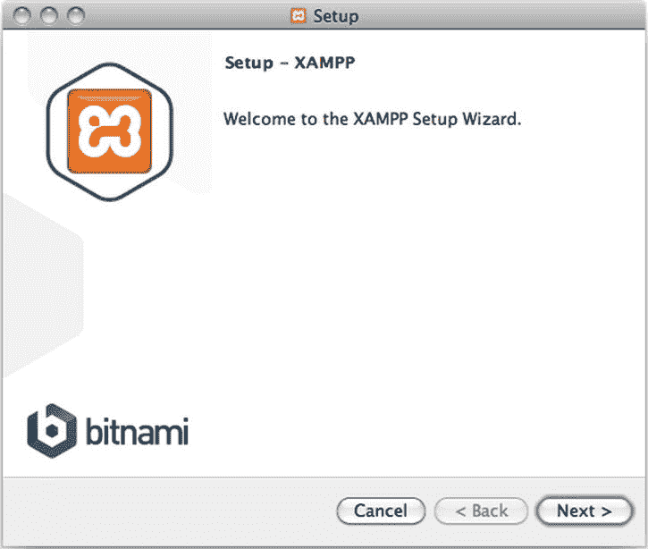
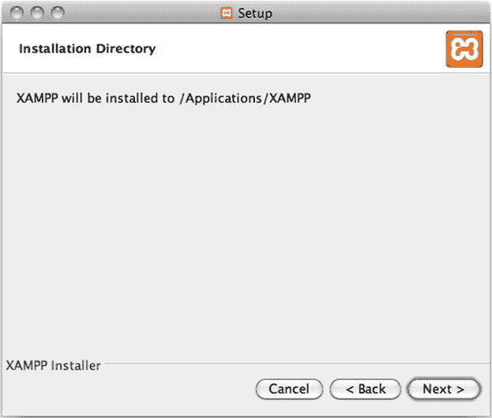
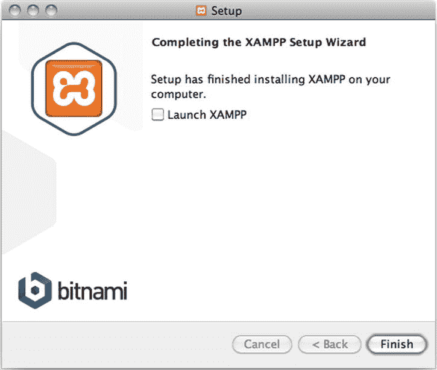
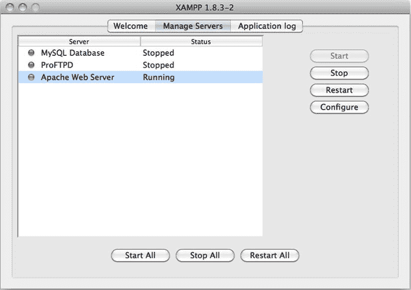
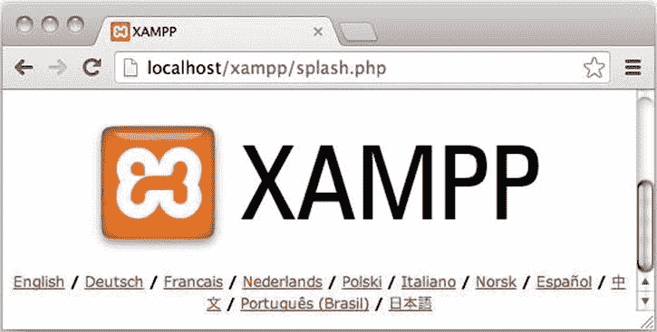
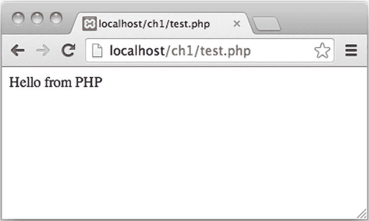

# 1.设置 PHP 开发环境

构建一个可工作的开发环境可能是令人生畏的，尤其是对于绝对的初学者来说。为了跟进本书中的项目，您需要访问 Apache、PHP 和 MySQL 的有效安装，最好是在您的本地机器上。出于速度和安全性的考虑，总是希望在本地进行测试。这样做既保护了你正在进行的工作不受开放互联网的影响，又减少了上传文件到 FTP 服务器和等待页面重新加载所花费的时间。

## 为什么需要 Apache、MySQL 和 PHP

PHP 是一种强大的脚本语言，可以在任何安装了 PHP 的计算机的命令行中独立运行。然而，单靠 PHP 不足以构建动态网站。要在网站上使用 PHP，您需要一个可以处理 PHP 脚本的服务器。Apache 是一个免费的 web 服务器，一旦安装在计算机上，就允许开发人员在本地测试 PHP 脚本；这使得它成为您的本地开发环境的无价之宝。

此外，用 PHP 开发的网站通常依赖于存储在数据库中的信息，因此可以快速方便地修改这些信息。这是 PHP 站点和 HTML 站点的一个显著区别。这就是关系数据库管理系统(如 MySQL)发挥作用的地方。这本书的例子依赖于 MySQL。我选择这个数据库是因为 PHP 提供了对它的原生支持，还因为 MySQL 是一个免费的开源项目。

Note

最终用户可以免费获得一个开源项目，并附带创建该软件所需的代码。用户可以自由地检查、修改和改进代码，尽管有某些附加条件。开源倡议列出了定义开源软件的十个关键条款。您可以在 [`www.opensource.org/docs/osd`](http://www.opensource.org/docs/osd) 查看这份名单。

PHP 是一种通用脚本语言，最初是由拉斯马斯·勒德尔夫在 1995 年构思的。Lerdorf 创建 PHP 是为了满足为万维网创建页面时对处理数据的简单方法的需求。

Note

PHP 的诞生源于拉斯马斯·勒德尔夫想要创建一个脚本来记录他的在线简历被访问的次数。由于他创作的剧本广受欢迎，勒多夫继续开发这种语言。随着时间的推移，其他开发人员也加入到他的行列中来开发软件。今天，PHP 是互联网上最流行的脚本语言之一。

PHP 最初代表个人主页，并作为一个免费的开源项目发布。随着时间的推移，这种语言被修改以满足用户的需求。1997 年，PHP 被重新命名为 PHP:超文本预处理器，就像现在所知道的那样。在我写这篇文章的时候，PHP 5.5.7 是当前的稳定版本。许多服务器上仍在使用 PHP 的旧版本。

### PHP 如何工作

PHP 一般用作服务器端脚本语言；它特别适合创建动态网页。脚本语言的特点是集成了对数据库接口的支持，如 MySQL，这使它成为构建各种 web 应用的首选，从简单的个人网站到复杂的企业级应用。

页面加载时，浏览器会解析 HTML。浏览器根本无法处理 PHP。PHP 由服务文档的机器处理(这个机器被称为服务器)。在文档被发送到访问者的浏览器之前，文档中的所有 PHP 代码都由服务器处理。因为 PHP 是由服务器处理的，所以它是一种服务器端脚本语言。

使用 PHP，您可以创建动态网页——可以根据条件变化的网页。例如:当我登录到我的脸书帐户，我看到我的内容。当您登录您的脸书帐户时，您可以看到您的内容。我们将加载相同的资源( [`www.facebook.com`](http://www.facebook.com/) )，但是我们将被动态地提供不同的内容。这对于 HTML web 文档来说是不可能的，因为它们是静态的，也就是说它们不能改变。每个用户都会看到完全相同的 HTML 页面。本书的其余部分探索了一些你可以用动态网页实现的事情。

PHP 是一种解释型语言，这是 PHP 程序员的另一大优势。许多编程语言要求在运行文件之前将文件编译成机器代码，这是一个非常耗时的过程。绕过编译的需要意味着您能够更快地编辑和测试代码。

因为 PHP 是服务器端语言，所以运行 PHP 脚本需要服务器。在本地机器上开发 PHP 项目意味着在本地机器上安装一个服务器。本书中的例子依靠 Apache Web 服务器来交付您的网页。

### Apache 及其功能

Apache 是 web 上最流行的 Web 服务器软件；它托管了当今几乎一半的网站。Apache 是一个开源项目，可以在几乎所有可用的操作系统上运行。Apache 是一个社区驱动的项目，许多开发人员为它的进展做出了贡献。Apache 的开源根源也意味着该软件可以免费获得，这可能大大有助于 Apache 相对于其竞争对手(包括微软的 IIS 和谷歌的 GWS 等)的压倒性人气。

在 Apache HTTP Server 项目网站( [`http://httpd.apache.org`](http://httpd.apache.org/) )上，Apache HTTP Server 被描述为“为包括 UNIX 和 Windows NT 在内的现代操作系统开发和维护开源 HTTP 服务器的努力。这个项目的目标是提供一个安全、高效、可扩展的服务器，提供与当前 HTTP 标准同步的 HTTP 服务。”

与所有 web 服务器一样，Apache 接受 HTTP 请求并提供 HTTP 响应。万维网是建立在 web 服务器上的，您访问的每个网站都展示了 Web 服务器的功能。我已经提到过，虽然 HTML 可以由 web 浏览器处理，但是服务器端脚本语言(如 PHP)必须由 web 服务器处理。由于 Apache 非常受欢迎，所以在本书中它被用于测试目的。

### 用 MySQL 存储信息

MySQL 是一个关系数据库管理系统(RDBMS)。本质上，这意味着 MySQL 允许用户在基于表的结构中存储信息，使用行和列来组织不同的数据。还有许多其他的关系数据库管理系统。本书中的例子依靠 MySQL 来存储您将在 PHP 脚本中使用的信息，从博客条目到管理员信息。这种方法有很大的优势，我们将详细探讨。

Note

Blog 是 weblog 的缩写，是个人或企业制作的在线日志。

## 安装 PHP、Apache 和 MySQL

对于新程序员来说，最大的障碍之一是起步。在编写第一行 PHP 代码之前，您必须下载 Apache 和 PHP，通常还有 MySQL，然后阅读那些充满您可能还不理解的技术术语的安装说明。这种经历会让许多开发人员感到不自信，怀疑他们是否正确安装了所需的软件。

就我自己而言，这个障碍让我几个月都没有学习编程，尽管我非常想超越普通的 ole HTML。在成功运行我的第一个 PHP 命令之前，我不止一次，而是三次尝试在我的本地机器上安装 PHP，但都没有成功。

幸运的是，开发社区已经对新手开发人员的挫折做出了回应，提供了几个选项，无论您是为 Windows、Mac 还是 Linux 机器创建应用，都可以免去设置开发环境的所有痛苦。这些选项包括设置 Apache、MySQL 和 PHP 安装的一体化解决方案。

最常见的一体化解决方案是一个名为 XAMPP ( [`www.apachefriends.org/en/xampp.html`](http://www.apachefriends.org/en/xampp.html) )的程序，它将 Apache、MySQL、PHP 和其他一些有用的工具整合到一个简单的安装程序中。XAMPP 是免费的，可用于 Windows、Mac 和 Linux。本书假设您将使用它作为您的开发环境。

Note

默认情况下，大多数 Linux 发行版都附带了 LAMP 栈(特定于 Linux 的软件，功能类似于 XAMPP)。默认情况下，某些版本的 Mac OS X 也会安装 PHP 和 Apache。

### 安装 XAMPP

足够的背景。现在，您可以在开发机器上安装 XAMPP 了。这个过程大约需要五分钟，而且完全无痛。

#### 第一步:下载 XAMPP

你的首要任务是获得一份 XAMPP 软件。前往 XAMPP 网站( [`www.apachefriends.org/en/xampp.html`](http://www.apachefriends.org/en/xampp.html) )下载最新版本(发布时为 1.8.3)。

#### 步骤 2:打开安装程序，按照说明进行操作

下载 XAMPP 后，找到新下载的安装程序并运行它。你应该会看到一个类似于图 [1-1](#Fig1) 所示的屏幕。

Note

本书中使用的所有截图都是在运行 Mac OS X 10.6.8 的电脑上拍摄的。如果您使用不同的操作系统，您的安装可能会略有不同。用于 Windows 的 XAMPP 提供了额外的选项，例如安装 Apache、MySQL 和 Filezilla(一种 FTP 服务器)作为服务的能力。这是不必要的，会消耗计算机资源，即使它们没有被使用，所以最好关闭这些服务。此外，Windows 用户应该保留`c:\xampp`安装目录，以便更容易地理解本书的示例。

图 1-1。

The introductory screen for the XAMPP installer on Mac OS X

点击下一步按钮进入下一个屏幕(见图 [1-2](#Fig2) )，在这里您可以选择要安装的组件。使用默认选择即可。XAMPP 安装程序将引导您完成安装过程。图 [1-3](#Fig3) 至 [1-5](#Fig5) 显示了剩余的步骤。

图 1-5。

When you’re ready to install, click Next

图 1-4。

You don’t have to learn more about BitNami at this point

图 1-3。

XAMPP installation directory

图 1-2。

Select components to install

安装需要一两分钟才能完成，此时安装人员会显示最后一个屏幕(见图 [1-6](#Fig6) )，确认安装成功。

图 1-6。

Installation is complete

#### 步骤 3:测试 XAMPP 以确保正确安装

到目前为止，您已经使用 XAMPP 向导安装了 Apache、PHP 和 MySQL。下一步是激活 Apache，这样就可以写一些 PHP 了。

### 打开 XAMPP 控制面板

您可以通过导航到新安装的 XAMPP 文件夹并打开 XAMPP 管理器来激活刚安装的应用(参见图 [1-7](#Fig7) )。

Note

打开 XAMPP 控制面板时，可能会提示您输入密码。这对服务本身没有影响，也不应该影响本书所涉及的项目。

在开发机器上激活 Apache、PHP 和 MySQL 就像在 XAMPP 管理器中点击 Apache 旁边的 Start 按钮一样简单。系统可能会提示您确认是否允许服务器在您的计算机上运行，并且可能会要求您输入系统密码。这样做之后，状态应该表明 Apache 正在运行，如图 [1-7](#Fig7) 所示。

图 1-7。

The XAMPP manager shows that the local Apache Web Server is running Note

在 XAMPP 有一个 FTP(文件传输协议)选项。FTP 提供了一种在网络间移动文件的方法。本书中的例子不需要这个选项，所以没有必要在 XAMPP 控制面板中激活它。前几章甚至不需要 MySQL 数据库。

### 如果 Apache 没有运行呢？

有时，XAMPP Apache 服务器不运行，即使你试图启动它。最常见的问题是它与使用您电脑上相同端口的其他服务冲突。检查您是否运行了 Skype 或 Messenger 或其他类似的网络服务。完全关闭 Skype，如果你幸运的话，你的 Apache 还能运行。

如果它仍然不运行，你可以求助于互联网。XAMPP 在线社区非常有用，大多数安装问题已经在位于 [`https://community.apachefriends.org/f/viewforum.php?f=34`](https://community.apachefriends.org/f/viewforum.php?f=34) 的 Apache Friends 论坛中得到解决。您也可以在 [`http://stackoverflow.com/`](http://stackoverflow.com/) 转而搜索或询问。

### 验证 Apache 和 PHP 正在运行

检查 Apache 是否在您的开发机器上正常运行是一件简单的事情。只需打开浏览器，进入以下地址:http://localhost。如果一切正常，你将被重定向到`http://localhost/xampp/splash.php`(见图 [1-8](#Fig8) )。

图 1-8。

Check in your browser that your Apache Web Server is running

如果这个屏幕加载，您已经成功地在开发机器上安装了 Apache 和 PHP！地址 http://localhost 是您正在使用的当前电脑的别名。使用 XAMPP 时，在浏览器中导航到 http://localhost 会告诉服务器打开 web 根目录。这是包含在 XAMPP 安装目录中的`htdocs`文件夹。使用服务器访问本地计算机上的 web 根目录的另一种方法是导航到 IP 地址(分配给连接到计算机网络的任何设备的数字标识符)，它充当所有 HTTP 服务器的“主”地址:http://127.0.0.1。

## 选择 PHP 编辑器

您的开发机器现在正在运行 PHP 编程所需的所有程序。下一步是决定如何编写脚本。PHP 脚本是基于文本的，所以您有无数的选择，从简单的`Notepad.exe`和文本编辑程序到高度专业化的集成开发环境(ide)。

大多数有经验的 PHP 开发人员都使用 IDE，因为它有很多好处。许多初学者在使用 IDE 时会有一些困难，也许是因为 IDE 有太多的特性，初学者会感到困惑。

您可能可以使用任何您用来编写 HTML 和 CSS 的程序来编写 PHP 代码。一个好的编辑应该有一些特点。

*   语法突出显示:这是识别编程语言中某些单词的能力，例如变量、控制结构和各种其他特殊文本。这个特殊的文本被突出显示或以其他方式区分，以便更容易地扫描您的代码。
*   内置函数引用:当您输入函数或对象方法的名称时，该特性会显示可用的参数、声明该函数的文件、该函数功能的简短描述以及参数和返回值的更深入的细分。事实证明，在处理大型库时，这个特性是非常宝贵的，它可以省去您查阅 PHP 手册来检查函数的参数顺序或可接受的参数的麻烦。
*   自动完成特性:该特性将可用的 PHP 关键字添加到一个下拉列表中，允许您快速、轻松地从列表中选择想要的关键字，省去了您每次记忆和键入关键字的努力。说到工作效率，每一秒都很重要，这个特性是节省时间的好方法。
*   代码折叠:这个特性允许您折叠代码片段，使您的工作空间整洁，代码易于导航。
*   自动缩进:自动缩进你写的代码，保持一致。这种缩进的代码对于人类读者来说更容易阅读，因为缩进表明了代码块之间的关系。
*   内置 ftp:当你想在万维网上发布你的项目时，你需要 ftp 把你的 PHP 文件上传到一个在线的 web 服务器上。您可以使用独立的 ftp 程序，但是如果它内置在您的 IDE 中，您只需单击一下就可以上传整个项目。

您有许多好的 ide 和编辑器可供选择。NetBeans 和 Eclipse PDT 都是优秀的免费 ide。如果您想习惯专业开发人员经常使用的工具，请尝试一种或两种方法。初学者可能会发现从简单的编辑器开始更容易。我真的很喜欢 Komodo Edit:它和任何编辑器一样容易使用，并且它提供了刚刚列出的开箱即用的大多数功能，包括 PHP 和许多其他语言的优秀自动完成功能。下面是刚才提到的三个 PHP 编辑器的下载链接:

*   从 [`https://netbeans.org/downloads/`](https://netbeans.org/downloads/) 获取 NetBeans。
*   从 [`http://projects.eclipse.org/projects/tools.pdt`](http://projects.eclipse.org/projects/tools.pdt) 获取 Eclipse PDT。
*   从 [`www.activestate.com/komodo-edit/downloads`](http://www.activestate.com/komodo-edit/downloads) 获取科莫多编辑。

我将使用科莫多编辑这本书的例子。使用任何其他编辑器都应该不难理解这些示例。如果您决定使用 ide，您将必须查阅在线文档，以了解如何在您选择的 IDE 中建立新项目。

## 创建你的第一个 PHP 文件

一切都设置好并正常运行后，是时候冒险编写您的第一个 PHP 脚本了。作为一种服务器端脚本语言，PHP 需要 Apache 之类的 web 服务器才能运行。您已经在本地计算机上安装了 Apache，所以您的系统已经准备好了。

Apache 将解释保存在名为`htdocs`的文件夹中的任何 PHP 文件。你可以在`XAMPP/xamppfiles/htdocs`的 XAMPP 装置中找到它。

您很快就会创建许多 PHP 文件，所以保持它们的有序是个好主意。在`htdocs`里面新建一个文件夹，命名为`ch1`。

现在打开 Komodo Edit，或者任何你决定使用的编辑器或 IDE。从科莫多编辑，您可以选择文件➤新➤新文件从主菜单。在新文件中，编写以下内容:

`<?php`

`echo "Hello from PHP";`

在 Komodo Edit 中，选择文件➤保存以查看文件保存对话框(图 [1-9](#Fig9) )。将新文件另存为`test.php`，在`htdocs/ch1`中；将格式设置为所有文件；然后单击保存。

图 1-9。

The Save As dialog box from Komodo Edit

## 运行您的第一个 PHP 脚本

下一步是让 Apache 处理您的 PHP 脚本。如果您通过浏览器请求脚本，这将自动发生。因此，打开一个 web 浏览器，导航到 http://localhost/ch1/test.php，您会惊奇地在浏览器中看到 php 生成的输出(图 [1-10](#Fig10) )。您已经成功地创建并执行了您的第一个 PHP 脚本！

图 1-10。

Seeing the output from `test.php` in the Chrome web browser

## 摘要

在这一章中，你学习了一些关于 PHP、MySQL 和 Apache 的知识。您发现了它们是什么，以及它们在动态网站的开发中扮演什么角色。通过安装 XAMPP 和科莫多编辑软件，你还学会了在本地计算机上安装一个功能齐全的开发环境的简单快捷的方法。

在下一章中，您将学习 PHP 的一个小而有效的子集，包括变量、对象和一些本地语言结构和语句。几乎你学到的所有东西都将在你的新开发环境中进行测试，所以保持 XAMPP 的 Apache 服务器开放和运行。