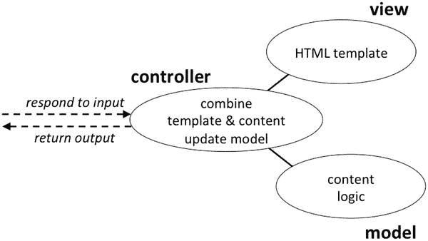
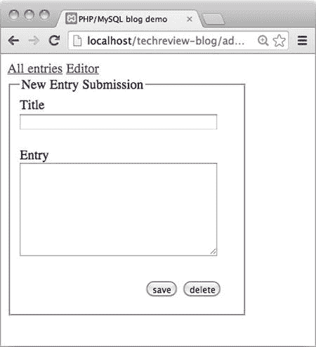

# 7.构建入口管理器

至此，你已经足够了解如何开始构建你的个人博客系统了。这本书的其余部分涵盖了发展和改善个人博客。本章将带你了解如何构建你的博客应用的主干:博客条目管理器。您将构建的部分包括以下内容:

*   一个视图，它是一个接受条目输入的 HTML 表单
*   一个控制器，用于处理来自表单的输入
*   一个模型，用于保存和检索数据库中的条目

本章结束时，你将拥有一个基本的个人博客系统入口管理器。在构建条目管理器的过程中，您将会重温以前讨论过的主题，例如基本的数据库设计、SQL、用 MVC 组织您的 PHP，以及连接到数据库。

## 创建 blog_entry 数据库表

任何新应用最重要的步骤之一是规划保存数据的表。这对以后扩展应用的容易程度有很大的影响。扩展是应用处理更多信息和/或用户的扩展，如果在开始一个新项目时没有向前看，这可能是一个巨大的痛苦。首先，您的博客需要存储几种类型的条目信息才能运行，包括以下内容:

*   唯一标识
*   条目标题
*   条目文本
*   创建日期

为条目表中的每个条目使用一个唯一的 ID，使您能够访问只包含一个数字的信息。这对于数据访问非常有帮助，尤其是如果数据集在将来发生了变化(例如，如果您向表中添加了一个“imageURL”列)。

第一步是确定条目表需要的字段。您的表必须定义每列中存储什么类型的信息，所以让我们快速看一下每列必须存储的信息。

*   `entry_id`:识别条目的唯一编号。这将是一个正整数，这个数字自动递增是有意义的，因为这样可以确保这个数字是唯一的。因为每个条目都有一个唯一的`entry_id`，所以可以用这个数字来标识一个条目。`entry_id`将是该表的主键。
*   `title`:应该相对较短的字母数字字符串。您将把字符串限制在 150 个字符以内。
*   `entry_text`:长度不定的字母数字字符串。你不会限制这个字段的长度(在合理的范围内)。
*   `date_created`:条目最初创建时自动生成的时间戳。您将使用它来按时间顺序对条目进行排序，并让您的用户知道条目最初是何时发布的。

现在是创建数据库的时候了。打开你的 XAMPP 控制面板，启动 MySQL 和 Apache。将浏览器指向 http://localhost/phpmyadmin/下面是执行此操作的 SQL:

`CREATE DATABASE simple_blog CHARSET utf8`

下一步是编写创建`entries`表的代码。确保从 phpMyAdmin 控制面板左侧的菜单中选择`simple_blog`数据库。接下来，打开 SQL 选项卡，输入以下 SQL 语句:

`CREATE TABLE blog_entry (`

`entry_id INT NOT NULL AUTO_INCREMENT,`

`title VARCHAR( 150 ),`

`entry_text TEXT,`

`date_created TIMESTAMP DEFAULT CURRENT_TIMESTAMP,`

`PRIMARY KEY ( entry_id )`

`)`

您可以看到创建`blog_entry`表的语句类似于您用来创建 poll 表的`CREATE`语句。你也可以看到一些不同之处。

`title`属性有一个新的数据类型:`VARCHAR(150)`。因此，任何标题都必须包含长度为`VAR`的`CHAR`角色。博客条目标题可以是 0 到 150 个字符长的字符串。如果您要插入 151 个字符长的标题，只有前 150 个字符会保存在`blog_entry`表中。这就是`VARCHAR(150)`的作用。

属性`date_created`也用新的数据类型`TIMESTAMP`声明。一个`TIMESTAMP`保存着关于某一时刻的相当精确的信息。它将年、月、日、小时、分钟和秒存储为 YYYY-MM-DD HH:MM:SS

您已经看到了如何使用默认值创建 MySQL 表属性。这里再次针对`date_created`属性。第一次插入新条目时，MySQL 会根据服务器的时钟自动存储当前的`TIMESTAMP`。

## 规划 PHP 脚本

你已经为你的博客创建了一个数据库。合乎逻辑的下一步是用 PHP 创建一个博客条目编辑器，这样您就可以创建新的博客条目。博客条目编辑器只适用于博客作者。普通网站访问者应该不能创建新的条目。普通的站点访问者应该只是看到你的博客条目，而不能编辑现有的条目或创建新的条目。

完成这项任务的一个方法是创建两个主要的网站入口:`index.php`供普通访问者使用，而`admin.php`只供你观看。在 MVC 术语中，`index.php`和`admin.php`都是前端控制器。在本书的后面，我将向你展示如何通过登录来限制对`admin.php`的访问。

管理页面应该能够列出所有的博客条目，它应该给你一个条目编辑器，这样你就可以创建新的条目，编辑或删除现有的条目。您将需要单独的视图:一个用于列出所有条目，另一个用于显示编辑器。

脚本`admin.php`应该输出一个 HTML5 页面。它将是你的前端控制器，它将决定是显示编辑器还是列出所有条目。图 [7-1](#Fig1) 使用 MVC 思想来开发博客管理模块的示意图。

图 7-1。

Distribution of responsibilities

注意每个视图都有一个相应的控制器。还要注意，条目使用条目模型来显示所有条目，并由编辑器重用来保存新条目。让我们回顾一下 MVC 方法提出的关注点分离(见图 [7-2](#Fig2) )。视图是用户可以看到的东西。模型包含内容。控制器负责将正确的视图与正确的模型连接起来，并将结果输出返回给用户。控制器还负责响应用户输入；通常这意味着更新模型。

图 7-2。

Model-view-controller

## 创建博客网站

在`XAMPP/htdocs`中新建一个文件夹。调用新文件夹`blog`。在`blog`文件夹中，你可以创建另外四个文件夹:`models`、`views`、`controllers`和`css`。

您可以从图库项目中复制`ch4/templates/page.php`文件。在`blog/views/page.php`中保存一份`page.php`的副本。同样，从图库项目中复制`ch4/classes/Page_Data.class.php`，并在`blog/models/Page_Data.class.php`中保存一个副本。在`css/blog.css`中创建一个空白样式表。

现在是时候创建`blog/admin.php`并编写一点代码来检查到目前为止一切都很好地一起工作了:

`<?php`

`//complete code for blog/admin.php`

`error_reporting( E_ALL );`

`ini_set( "display_errors", 1 );`

`include_once "models/Page_Data.class.php";`

`$pageData = new Page_Data();`

`$pageData->title = "PHP/MySQL blog demo";`

`$pageData->addCSS("css/blog.css");`

`$pageData->content = "<h1>YES!</h1>";`

`$page = include_once "views/page.php";`

`echo $page;`

保存文件并在浏览器中加载 http://localhost/blog/admin . PHP。如果一切按预期运行，您应该得到一个格式良好的 HTML5，带有一个 PHP/MySQL 博客演示的`<title>`和一个高兴地欢呼是的`<h1>`元素！在浏览器中看到“是”是对项目设置正确的直观确认。

### 创建条目管理器导航

您的条目管理器应该有两个基本视图:一个列出所有条目，另一个显示条目编辑器。让我们为条目管理器创建一个导航。在你完成之前，你可以期待这个项目包含许多 PHP 文件。我建议您创建一些文件夹，将与管理模块相关的脚本放在一起。在现有的`views`文件夹中创建一个名为`admin`的文件夹。在`views/admin/admin-navigation.php`新建一个文件:

`<?php`

`//complete code for views/admin/admin-navigation.php`

`return "`

`<nav id='admin-navigation'>`

`<a href='admin.php?page=entries'>All entries</a>`

`<a href='admin.php?page=editor'>Editor</a>`

`</nav>";`

您可以看到，条目管理器导航与您在第 4 章和第 5 章中为动态图库创建的导航非常相似，或者与第 2 章中为动态作品集站点创建的导航非常相似。您应该记住 URL 变量`page`,每当用户单击导航项目时，该变量就会被编码。

管理导航是一个静态视图，这意味着脚本中没有动态或数据库驱动的信息。导航不需要模型，因为所有内容都是硬编码到视图中的。您确实需要一个控制器来加载导航。这将非常简单，因为导航应该一直被加载和显示。你可以从`admin.php`开始控制:

`//partial code listing for admin.php`

`$pageData->addCSS("css/blog.css");`

`//code changes below here`

`//comment out or delete the YES`

`//$pageData->content = "<h1>YES!</h1>";`

`//load navigation`

`$pageData->content = include_once "views/admin/admin-navigation.php";`

`//no changes below`

`$page = include_once "views/page.php";`

`echo $page;`

保存您的工作，并在浏览器中重新加载 http://localhost/blog/admin . PHP。您应该会看到浏览器窗口顶部显示的导航。单击导航项目不会有任何立即可见的效果；导航只是一个视图。单击任何导航项目都会对一个名为`page`的 URL 变量进行编码。你可以在浏览器的地址栏里看到它。您需要创建控制器代码来响应用户交互，比如单击。

### 加载管理模块控制器

您可以使用`admin.php`来控制当导航项目被点击时要做什么。这是前端控制器主要关心的问题。前端控制器应该加载与用户单击的导航项目相关联的任何控制器。在你的导航中有两个链接，所以你需要两个控制器。

要在单击导航项目时看到浏览器中的任何可见变化，您必须创建两个初级控制器。在`controllers`文件夹中创建一个名为`admin`的新文件夹，并创建一个新文件来控制条目编辑器视图，如下所示:

`<?php`

`//complete source code for controllers/admin/editor.php`

`return "<h1>editor controller loaded!</h1>";`

如您所见，编辑器控制器一开始不会做很多事情。最初，您只是想检查是否连接了正确的文件。有了这些，你就可以开发更复杂的代码了。创建另一个文件来控制最终列出所有条目的视图，如下所示:

`<?php`

`//complete source code for controllers/admin/entries.php`

`return "<h1>entries controller loaded!</h1>";`

您可以从`admin.php`载入这些控制器。您必须检查导航项目是否被点击。如果是，您应该加载相应的控制器。在创建了`$pageData`对象之后，在`echo`之前插入这几行代码:

`<?php`

`//complete code for blog/admin.php`

`error_reporting( E_ALL );`

`ini_set( "display_errors", 1 );`

`include_once "models/Page_Data.class.php";`

`$pageData = new Page_Data();`

`$pageData->title = "PHP/MySQL blog demo";`

`$pageData->addCSS("css/blog.css");`

`$pageData->content = include_once "views/admin/admin-navigation.php";`

`//new code begins here`

`$navigationIsClicked = isset( $_GET['page'] );`

`if ( $navigationIsClicked ) {`

`//prepare to load corresponding controller`

`$contrl = $_GET['page'];`

`} else {`

`//prepare to load default controller`

`$contrl = "entries";`

`}`

`//load the controller`

`$pageData->content .=include_once "controllers/admin/$contrl.php";`

`//end of new code`

`$page = include_once "views/page.php";`

`echo $page;`

记住文件名`entries.php`和`editor.php`。这些名字是必不可少的。它们必须与用户单击导航项时声明的 URL 变量`page`的相应值相匹配。让我们仔细看看导航中使用的`href`值:

`<a href='admin.php?page=entries'>All entries</a>`

`<a href='admin.php?page=editor'>Editor</a>`

当用户点击`All entries`项时，URL 变量`page`得到一个值`entries`。在`admin.php`中，使用`$_GET`获取 URL 变量`page`。字符串值`entries`存储在一个名为`$contrl`的变量中，随后用于包含`controllers/admin/$contrl.php`，这将真正转化为包含`controllers/admin/entries.php`，因为变量`$contrl`保存值`entries`。

如果点击`Editor`项，将包含`controllers/admin/editor.php`。

在前面的代码中，您应该不会感到惊讶。尽管如此，明智的做法是进行理智检查。保存文件并在浏览器中重新加载 http://localhost/blog/admin . PHP。默认情况下，您应该会看到从条目控制器返回的消息。如果您单击编辑器的导航项，您应该会看到从编辑器控制器返回的消息。

### 创建条目输入表单

现在你有了一个动态导航，你不妨把它用在一些有意义的事情上。您可以为编辑器显示一个 HTML 表单。最终，应该可以使用编辑器创建新的博客条目。因此，编辑器表单应该有用于创建条目标题和条目文章的字段。还应该有一个保存新条目的按钮。同时，您也可以创建一个删除条目的按钮。创建一个新文件`views/admin/editor-html.php`，如下所示:

`<?php`

`//complete source code for views/admin/editor-html.php`

`return "`

`<form method='post' action='admin.php?page=editor' id='editor'>`

`<fieldset>`

`<legend>New Entry Submission</legend>`

`<label>Title</label>`

`<input type='text' name='title' maxlength='150' />`

`<label>Entry</label>`

`<textarea name='entry'></textarea>`

`<fieldset id='editor-buttons'>`

`<input type='submit' name='action' value='save' />`

`<input type='submit' name='action' value='delete' />`

`</fieldset>`

`</fieldset>`

`</form>`

`";`

大多数前面的代码应该是熟悉的，即使您看到了一些您以前可能没有遇到过的元素。你可以看到两个`<fieldset>`元素。它们用于将相关的表单字段分组在一起。主`<fieldset>`有一个`<legend>`元素。一个`<legend>`就像一个`<fieldset>`元素的标题。

条目标题的`<input>`元素的`maxlength`属性设置为 150。您可能会猜到显示的文本字段只接受 150 个字符。这很好，因为数据库中的条目表接受最多 150 个字符的新`title`属性。

属性增强了表单的可用性，因为用户很难通过表单创建无效的标题。属性执行客户端验证，只允许提交有效的标题。需要记住的一点是，客户端验证对于增强可用性非常重要。它不会提高安全性，因为您应该预料到恶意用户能够覆盖客户端验证。

创建了新的编辑器视图后，您必须更新控制器，以便它显示视图。编辑器的控制器可以在`controller/admin/editor.php`中找到。更改代码，如下所示:

`<?php`

`//complete source code for controllers/admin/editor.php`

`$editorOutput = include_once "views/admin/editor-html.php";`

`return $editorOutput;`

当从`admin.php`加载控制器时，这几行代码应该连接视图并显示它。重装 http://localhost/blog/admin . PHP 就可以自己看了？page =浏览器中的编辑器。您应该会看到表单。

### 样式编辑器

您可能会同意，无样式的条目编辑器表单看起来很难看。一点点 CSS 可以带你走很长一段路，提高审美。您很可能希望在编辑器的视觉设计上做更多的工作。这里有一个小小的 CSS 让你开始:

`/* code listing for blog/css/blog.css */`

`form#editor{`

`width: 300px;`

`margin:0px;`

`padding:0px;`

`}`

`form#editor label, form#editor input[type='text']{`

`display:block;`

`}`

`form#editor #editor-buttons{`

`border:none;`

`text-align:right;`

`}`

`form#editor textarea, form#editor input[type='text']{`

`width:90%;`

`margin-bottom:2em;`

`}`

`form#editor textarea{`

`height:10em;`

`}`

您可能还记得，也可能不记得，我在`admin.php`中的代码期望在`css/blog.css`中找到一个外部样式表。如果你的`admin.php`和我的一样，你会希望你的样式表在那个位置。显然，您可以在不同的文件夹中用不同的名称创建样式表。记得更新`admin.php`，让它指向你的样式表。你可以在图 [7-3](#Fig3) 中看到最终的编辑器设计。

我喜欢保持我的 HTML 整洁，没有`id`和`class`属性，我喜欢手工编写我的 CSS。我需要能够将样式规则与正确的 HTML 元素挂钩。我发现，通过使用上下文选择器和属性选择器，我经常可以应付过去。

如果你更喜欢使用 CSS 框架，你可能会采取完全相反的方法。您将手动编写很少的 CSS，并大量使用您最喜欢的 CSS 框架使用的`class`和`id`属性。你看着办吧！

图 7-3。

The editor displayed in Google Chrome

### 连接到数据库

您已经完成了基本的编辑器视图。很快，您应该能够通过编辑器表单将新的博客条目插入到您的`blog_entry`数据库表中。为此，您需要一个从 PHP 应用到 MySQL 数据库的数据库连接。

您可以采用与轮询相同的方法:使用 PDO 建立连接，并在前端控制器中建立连接，以便与随后加载的控制器共享。

您可以在`admin.php`中创建一个 PDO 对象，并与您将要加载的所有控制器共享它。在创建了`$pageData`之后，在`echo`之前，您应该在`admin.php`中编写以下代码:

`//partial code listing for admin.php`

`//new code starts here`

`$dbInfo = "mysql:host=localhost;dbname=simple_blog";`

`$dbUser = "root";`

`$dbPassword = "";`

`$db = new PDO( $dbInfo, $dbUser, $dbPassword );`

`$db->setAttribute( PDO::ATTR_ERRMODE, PDO::ERRMODE_EXCEPTION );`

`//end of new code – no changes below`

`$navigationIsClicked = isset( $_GET['page'] );`

`if ($navigationIsClicked ) {`

`$contrl = $_GET['page'];`

`} else {`

`$contrl = "entries";`

`}`

`$pageData->content .=include_once "controllers/admin/$contrl.php";`

`$page = include_once "views/page.php";`

`echo $page;`

请注意输入正确的数据库凭证，并指明您想要连接到`simple_blog`数据库。您可以通过重新加载浏览器来测试连接是否正常。如果连接失败，您应该会看到一条错误消息。因此，如果您没有看到错误消息，这意味着您已经成功连接到数据库。

### 使用设计模式

设计模式是对一项常见任务的通用最佳实践解决方案。有些设计模式定义得相当全面。随着经验的增长，你会遇到更多的设计模式。作为一个绝对的初学者，你不需要对设计模式进行全面的处理——那可能会更令人困惑而不是更有帮助。

这本书使用了一些设计模式的简单实现。您已经看到了前端控制器设计模式的简单实现和同样简单的 MVC 实现。您可以看到在同一个项目中组合几种设计模式是可能的。

Note

你可以在 [`http://en.wikipedia.org/wiki/Software_design_pattern`](http://en.wikipedia.org/wiki/Software_design_pattern) 了解设计模式。

许多设计模式对于初学者来说很难理解。但是许多常见的编码问题都有设计模式。这本书在简单的实现中使用了一些设计模式。您应该知道您在代码中使用的是哪种设计模式，以及还有其他的可能性。你可以把这样的知识当做未来发展的路线图。

Note

我可以强烈推荐 Matt Zandstra 的书《PHP 对象、模式和实践，第四版》(Apress，2013)。在 [`www.apress.com/9781430260318`](http://www.apress.com/9781430260318) 找到它。这不是一本真正适合初学者的书，但你可以把它记在心里以备将来参考。

#### 表格数据网关设计模式

您的代码必须与数据库表进行广泛的通信。有许多方法可以持续地管理这种沟通。一种方法是实现表数据网关设计模式。

表数据网关设计模式并不是大型 MVC 框架中处理数据库访问最常见的方法。许多流行的 PHP MVC 框架使用活动记录模式。我建议您使用表数据网关，因为这是一种相对容易理解的设计模式。表数据网关模式指定为数据库中的每一个表创建一个(PHP)类。这个想法是你的系统和那个表之间的所有通信都通过一个这样的对象发生。表数据网关封装了系统和特定数据库表之间的数据通信。

这意味着该通信所需的所有 SQL 语句都将在表数据网关类定义中声明。这有几个优点:一是您知道在哪里编写 SQL 语句。因此，您也知道在哪里可以找到与特定数据库表相关的 SQL 语句。

数据库设计和开发本身就是一种职业。如果作为一名 PHP 开发人员，您将所有的 SQL 封装在相对较少的类定义中，那么您团队中的任何数据库专家都只需要处理这几个类。与将 SQL 语句分散在代码库中相比，这是一个巨大的优势。

### 编写 Entry_Table 类

最初，您需要能够插入从编辑器表单接收的新博客条目。您可以为`blog_entry`表的表数据网关创建一个新的类定义。它将用于与您的数据库通信。

新类将需要一个 PDO 对象来与数据库通信。你可以使用你在前一章已经看到的想法。使用构造函数方法创建一个类，并将 PDO 对象作为参数传递。停下来思考一下你将要写的类。应该是模型、视图，还是控制器？答案应该是显而易见的:负责与您的数据库通信的脚本应该是一个模型！

在名为`Blog_Entry_Table.class.php`的新文件中的`models`文件夹中创建一个新的类定义。下面是它的代码:

`<?php`

`//complete code listing for models/Blog_Entry_Table.class.php`

`class Blog_Entry_Table {`

`private $db;`

`//notice there are two underscore characters in __construct`

`public function __construct ( $db ) {`

`$this->db = $db;`

`}`

`public function saveEntry ( $title, $entry ) {`

`$entrySQL = "INSERT INTO blog_entry ( title, entry_text )`

`VALUES ( '$title', '$entry' )";`

`$entryStatement = $this->db->prepare( $entrySQL );`

`try{`

`$entryStatement->execute();`

`} catch (Exception $e){`

`$msg = "
You tried to run this sql: $entrySQL
`

`
Exception: $e
";`

`trigger_error($msg);`

`}`

`}`

`}`

在被另一个脚本使用之前，`Blog_Entry_Table`不会做任何事情。在使用之前，我想看看这段代码。如您所见，`Blog_Entry_Table`有一个属性`db`和两个方法:`constructor`和`saveEntry()`。这个构造函数接受一个 PDO 对象作为参数。接收到的 PDO 对象将被存储在`db`属性中。这样，`Blog_Entry_Table`的所有方法都可以访问 PDO 对象，并通过它访问`simple_blog`数据库。

在面向对象的术语中，`Blog_Entry_Table`和 PDO 现在通过`has-a`关系联系在一起。`Blog_Entry_Table has-a` PDO 的对象。

在开发的早期阶段，您只能保存新条目。因此，`Blog_Entry_Table`类除了构造函数之外只有一个方法。`saveEntry()`方法有两个参数:`title`和`blog_entry`保存在数据库中。

变量`$entrySQL`保存一个 SQL 字符串，以使用接收到的`title`和`blog_entry`插入一个新的`blog_entry`。`$entryStatement`是一个`PDOStatement`对象，然后你可以`try()`到`execute()`来实际插入一个新的`blog_entry`。

如果该操作失败，它将抛出一个`Exception`对象，您的代码将捕获该对象。如果发生异常，您的代码将触发一个错误，显示导致异常的 SQL 字符串以及对异常的更详细的查看。

### 处理表单输入并保存条目

创建了`Blog_Entry_Table`类后，您可以继续开发。合乎逻辑的下一步可能是处理从编辑器表单接收的输入，并使用一个`Blog_Entry_Table`对象在数据库中保存一个新的博客条目。哪个负责处理用户交互？模型、视图还是控制器？MVC 设计模式规定用户交互应该在相关的控制器中处理。在这种情况下，相关的控制人是`controllers/admin/editor.php`:

`<?php`

`//complete code for controllers/admin/editor.php`

`//include class definition and create an object`

`include_once "models/Blog_Entry_Table.class.php";`

`$entryTable = new Blog_Entry_Table( $db );`

`//was editor form submitted?`

`$editorSubmitted = isset( $_POST['action'] );`

`if ( $editorSubmitted ) {`

`$buttonClicked = $_POST['action'];`

`//was "save" button clicked`

`$insertNewEntry = ( $buttonClicked === 'save' );`

`if ( $insertNewEntry ) {`

`//get title and entry data from editor form`

`$title = $_POST['title'];`

`$entry = $_POST['entry'];`

`//save the new entry`

`$entryTable->saveEntry( $title, $entry );`

`}`

`}`

`//load relevant view`

`$editorOutput = include_once "views/admin/editor-html.php";`

`return $editorOutput;`

保存并测试您的编辑器。它应该能够插入新的博客条目。尝试通过编辑器表单创建一些新的博客条目。一旦您完成了这些，您就可以使用 phpMyAdmin 控制面板浏览您的`blog_entry`表的内容。您可以在您的`blog_entry`表中找到创建的博客条目。你的条目编辑器工作了！

#### 哪个按钮被点击了？

条目编辑器表单中有两个按钮。最终，您会希望脚本根据单击的按钮做出不同的响应。所以，你的代码必须知道哪个按钮被点击了。让我们来看看产生按钮的 HTML:

`//partial source code for views/admin/editor-html.php`

`<fieldset id='editor-buttons'>`

`<input type='submit' name='action' value='save' />`

`<input type='submit' name='action' value='delete' />`

`</fieldset>`

看看这两个不同的按钮如何具有相同的`name`属性。按钮之间唯一的区别是它们的`value`属性。您可以使用该知识来识别哪个按钮被单击了。实际上，你已经在`controllers/admin/editor.php`做到了:

`//one line of code from controllers/admin/editor.php`

`//don't make any changes`

`$buttonClicked = $_POST['action'];`

变量`$buttonClicked`将保存被点击按钮的值。所以，如果用户点击了保存按钮，`$buttonClicked`将保存相应的值`'save'`。如果`$buttonClicked`的值为`save`，那么您知道用户正在尝试插入一个新条目。看看下面一行。变量`$insertNewEntry`会持有什么？

`//one line of code from controllers/admin/editor.php`

`//don't make any changes`

`$insertNewEntry = ( $buttonClicked === 'save' );`

在括号内，变量`$buttonClicked`与字符串`'save'`进行比较。如果`$buttonClicked`与`'save'`相同，`$insertNewEntry`的值将为`true`。如果不是，它将有一个值`false`。在随后的代码中，您可以看到，如果`$insertNewEntry`为真，则会插入一个新的`blog_entry`。所以你的大部分代码只有在用户点击保存按钮时才会运行。

#### 安全警报:SQL 注入攻击

`saveEntry()`方法展示了一个漂亮的编码实践。它使用表单输入数据动态生成 SQL 字符串。这是一个很好的技巧，因为它是将用户输入插入数据库表的关键。但这也是一个巨大的安全漏洞。SQL 注入攻击可能是对数据库驱动的 web 应用最常见的攻击。您的条目编辑器现在很容易受到这种攻击。

Note

在 [`http://en.wikipedia.org/wiki/SQL_injection`](http://en.wikipedia.org/wiki/SQL_injection) 了解更多关于 SQL 注入的信息。

基本上，SQL 注入攻击利用了通过表单输入的文本被用来动态生成 SQL 语句这一事实。用户通过表单输入的任何内容都将用于 SQL:

`//the code that makes you vulnerable`

`$entrySQL = "INSERT INTO blog_entry ( title, entry_text )`

`VALUES ( '$title', '$entry' )";`

看看前面的代码。变量`$title`和`$entry`是从表单接收的文本的简单占位符。通过表单输入的任何内容都将成为 SQL 字符串的一部分。因此，对 SQL 有深入了解的恶意用户可以通过表单输入恶意 SQL，从而直接访问您的数据库表。您保存在数据库中的任何数据都可能会暴露。攻击者可能会在表单的输入字段中输入类似如下的字符串:

`attack'); DROP TABLE blog_entry;--`

有了这个输入，`$entrySQL`就会变成

`$entrySQL = "INSERT INTO blog_entry ( title, entry_text )`

`VALUES ( '$title', ' attack'); DROP TABLE blog_entry;--' )";`

您可以看到,`$entrySQL`现在保存了两条 SQL 语句:一条用于插入一个`blog_entry`,另一条用于删除整个`blog_entry`表。很明显，您不希望用户能够在您的系统中删除表！您应该知道前面描述的特定攻击实际上不会起作用。我不想教你如何执行 SQL 注入攻击，但我想让你知道这个漏洞。

#### 可用性警告:带有引号字符的博客条目

条目编辑器也有一个主要的可用性缺陷。(如果您的编辑器容易受到最常见类型的黑客攻击还不够的话！)如果您通过编辑器的输入字段输入以下文本，您可以自己看到问题:

`Brennan's child said: "I want some breakfast!"`

PDO 抛出了一个例外。罪魁祸首是单引号字符:

`//the code that makes your form submission break`

`$entrySQL = "INSERT INTO blog_entry ( title, entry_text )`

`VALUES ( '$title', '$entry' )";`

因为变量`$title`和`$entry`包含在单引号字符中，所以您的条目编辑器表单不能处理任何包含单引号字符的内容。因此，您键入的句子会导致异常。

只需对代码做一点小小的改动，您就可以用双引号将`$title`和`$entry`括起来，但是这样一来，您的条目编辑器将无法处理任何带有双引号字符的条目。所以，这个句子仍然会导致一个异常。

#### 解决方案:准备好的报表

很明显，动态生成 SQL 字符串的代码给你带来了很多痛苦。这使你容易受到 SQL 注入的攻击，正因为如此，你的博客文章必须没有单引号或双引号字符。PDO 优雅地支持一个可以同时解决这两个问题的功能。PDO 支持事先准备好的声明。

Note

这里有一个很好的教程，可以进一步了解 PDO 和准备好的语句: [`http://net.tutsplus.com/tutorials/php/why-you-should-be-using-phps-pdo-for-database-access`](http://net.tutsplus.com/tutorials/php/why-you-should-be-using-phps-pdo-for-database-access) 。

预准备语句是为动态内容准备的 SQL 语句。您可以在 SQL 语句中声明占位符，然后用实际值替换这些占位符，而不是直接在 SQL 语句中删除 PHP 变量。如果您使用 PDO 预准备语句，您将不会受到 SQL 注入攻击，也不会因为单引号和双引号等特殊字符而遇到任何麻烦。下面是如何在`models/Blog_Entry_Table.class.php`中做到的:

`//partial code for models/Blog_Entry_Table.class.php`

`//edit existing method`

`public function saveEntry ( $title, $entry ) {`

`//notice placeholders in SQL string. ? is a placeholder`

`//notice the order of attributes: first title, next entry_text`

`$entrySQL = "INSERT INTO blog_entry ( title, entry_text )`

`VALUES ( ?, ?)";`

`$entryStatement = $this->db->prepare( $entrySQL );`

`//create an array with dynamic data`

`//Order is important: $title must come first, $entry second`

`$formData = array( $title, $entry );`

`try{`

`//pass $formData as argument to execute`

`$entryStatement->execute( $formData );`

`} catch (Exception $e){`

`$msg = "
You tried to run this sql: $entrySQL
`

`
Exception: $e
";`

`trigger_error($msg);`

`}`

`}`

有三个同样重要的变化，如下所示:

characters are used as placeholders in the SQL string.   An array is created with the dynamic data. The order of items must match the order used in the SQL string.   Pass the array with dynamic data as an argument to the `execute()` method.  

你可以自己测试。用单引号和双引号插入条目。你将很难证实你的编辑器不再容易受到 SQL 注入的攻击。您必须能够执行 SQL 攻击，才能验证编辑器现在是安全的。我想你必须相信我的话。

## 摘要

这是一个相对较短的章节，只演示了几个新的编码原则。但是你已经向个人博客系统迈出了第一步，并且开发了一个超酷的条目编辑器。

在这个过程中，你有机会更加熟悉你在前面章节中学到的几乎所有东西。你有

*   创建了一个带有表的 MySQL 数据库
*   通过 web 表单将数据插入到表格中
*   创建了 MVC web 应用结构
*   使用前端控制器设计模式
*   使用了表格数据网关设计模式

除此之外，您还了解了 SQL 注入攻击，并了解了如何使用 PDO 准备好的语句来保护您的 PHP 项目。