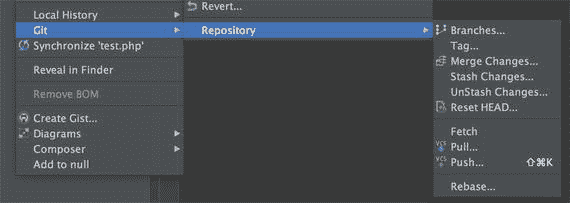
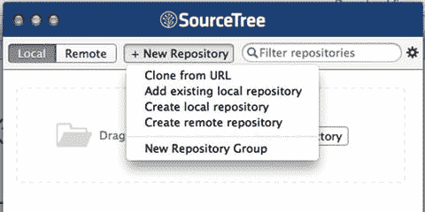
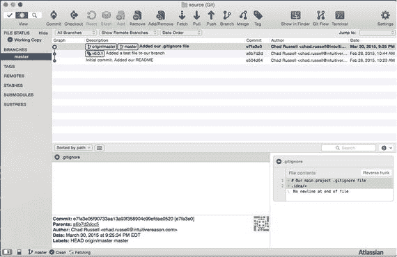
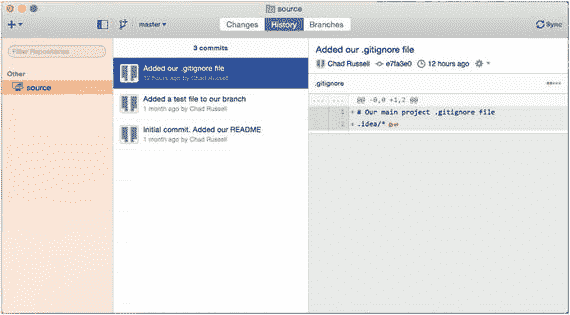
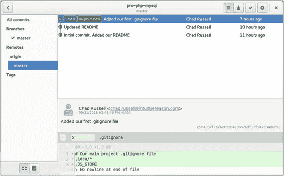

# 1.版本控制

如果您还没有在您的项目中使用某种类型的版本控制，那么您绝对应该现在就开始。无论您是一个单独的开发人员还是一个更大团队的一部分，版本控制为任何项目，无论大小，都提供了许多好处。

如果你不熟悉什么是版本控制，它是一个用来捕获和记录项目中文件变化的系统。它为您提供了这些更改的可视化历史记录，使您能够回过头来查看是谁做了更改，他们更改了什么`—`文件和更改的内容，他们何时做了更改，以及通过读取他们的提交消息，为什么更改。此外，它还为您提供了一种机制来隔离代码中的变更，称为分支(稍后将详细介绍)。

有许多可用的版本控制系统，有些是免费的和开放源码的，有些是专有的和需要许可的。出于本章的目的，我们将关注免费的开源 Git。Git 最初是由 Linus Torvalds 为 Linux 内核项目开发的。Git 是一个分布式版本控制系统(DVCS ),它允许您将您的存储库的许多副本(镜像)分发给团队的其他成员，以便能够跟踪变更。这意味着每个拥有存储库克隆的人在克隆时都拥有系统的完整工作副本。Git 是为了简单、快速和完全可分发而构建的。

这一章的目的是给你一个 Git 的概述，涵盖足够的信息让你开始每天在你的项目中使用它。因为我只有一章来介绍这一点，所以我将只触及 Git 最常用功能的表面。然而，这应该足够让你舒服地使用它了。要更完整、更深入地了解 Git，请查看由斯科特·沙孔和本·施特劳布撰写的 Pro Git，可从 Apress 获得。

## 使用 Git

要开始使用 Git，首先需要在您的系统上安装它。访问 [`http://git-scm.com`](http://git-scm.com) 并下载适用于您的操作系统的二进制文件，即可获得适用于 Mac OS X、Windows、Linux 和 Solaris 的二进制文件。除此之外，使用 Debian/Ubuntu 上的`yum`包管理器或`apt-get`，Git 也可用于 RedHat/CentOS 系统。在 Mac OS X 上，你可以通过安装 Xcode 命令行工具来获得它。在这篇手稿中，我们将使用 Linux 版本的 Git。

### Git 配置

现在 Git 已经安装好了，让我们通过在 Git 配置工具中设置您的姓名和电子邮件地址来进行最少量的配置，以便为您所做的提交显示这些信息(提交是将新版本的代码放入存储库中的行为)。我们可以使用`git config`工具来完成这项工作:

```php
$ git config --global user.name "Chad Russell"
$ git config --global user.email chad@intuitivereason.com

```

我们可以通过再次使用`git config`工具来验证这些设置，这次使用属性键作为我们想要检查的设置:

```php
$ git config user.name
Chad Russell
$ git config user.email
chad@intuitivereason.com

```

请注意，您将在 Windows 和 Unix 环境中运行相同的配置命令。

### 初始化您的存储库

要创建您的第一个 Git 存储库，您只需使用`git init`命令。这将在您的源代码目录中初始化一个空的 Git 存储库。初始化之后，就可以对新的存储库执行第一次提交了。对于这个例子，我们有一个空目录，我们将在其中初始化，然后我们将添加一个`README`文件，最后我们将添加并提交文件到我们的新存储库。

请记住，Git 将根据调用 Git 命令的目录启动。例如，如果你在

```php
C:\Program Files (x86)\Git

```

那么结果将会是

```php
Initialized empty Git repository in C:/Program Files (x86)/Git/bin/.git/

```

随着本书的进展，我们将使用以下存储库和目录来跟踪我们将使用的各种代码示例:

```php
$ git init
Initialized empty Git repository in /Apress/source/.git/

```

### 初始提交

既然我们已经初始化了我们的空存储库，我们将向它添加一个非常基本的`README`文件，然后执行我们的初始提交:

```php
$ echo "This is our README." > README.md

```

现在，如果我们使用`git status`来查看我们的存储库的当前状态，我们将会看到我们现在有一个未被跟踪的文件，这意味着这个文件还没有被添加到我们的存储库中或者被 Git 跟踪变更。您可以在任何时候使用`git status`来查看您的存储库的工作分支的状态:

```php
$ git status
On branch master

Initial commit

Untracked files:
  (use "git add <file>..." to include in what will be committed)

        README.md

```

现在，我们将使用`git add`将文件添加到我们的存储库中:

```php
$ git add README.md

```

如果我们再次查看`git status`，我们会看到我们的文件已经被添加，但是还没有提交(保存)到存储库:

```php
$ git status
On branch master

Initial commit

Changes to be committed:
  (use "git rm --cached <file>..." to unstage)

        new file:   README.md

```

最后，我们将提交我们的更改，我们的新`README`现在将在我们的存储库中，并被跟踪以了解未来的更改:

```php
$ git commit -m "Initial commit. Added our README"
[master (root-commit) e504d64] Initial commit. Added our README
 1 file changed, 1 insertion(+)
 create mode 100644 README.md

```

我们可以从从`git commit`收到的消息中看到，我们的提交被保存了。现在，如果我们再检查一次`git status`,我们会看到我们目前没有其他要提交的内容:

```php
$ git status
On branch master
nothing to commit, working directory clean

```

### 暂存更改

我们的存储库中有我们最初跟踪的文件，并且已经看到了如何向 Git 添加一个新文件来进行跟踪。现在让我们更改`README`，然后准备并提交此更改。

我已经在`README.md`文件中添加了一个变更，修改了我们添加的初始文本，使其信息稍微丰富一些。让我们再次运行`git status`,看看它会显示什么:

```php
$ git status
On branch master
Changes not staged for commit:
  (use "git add <file>..." to update what will be committed)
  (use "git checkout -- <file>..." to discard changes in working directory)

        modified:   README.md

```

它显示我们的`README`被修改了，但是还没有提交。我们通过使用`git add`命令来做到这一点。我们将添加它并再次检查状态:

```php
$ git add README.md
$ git status
On branch master
Changes to be committed:
  (use "git reset HEAD <file>..." to unstage)

        modified:   README.md

```

最后，我们将进行新的提交，这将结束我们对文件所做的更改:

```php
$ git commit -m "Updated README"
[master ca476b6] Updated README
 1 file changed, 1 insertion(+), 1 deletion(-)

```

Note

在 Windows 环境中，分段更改的配置可能会有所不同。

### 查看历史记录

有了我们刚刚做的所有更改，能够返回并查看我们的存储库的历史是很有帮助的。最简单的方法之一是使用`git log`命令。当没有参数传递给它时，`git log`将显示您的存储库中的所有提交，从您最近的更改开始，并从那里按时间顺序递减:

```php
$ git log
commit ca476b6c41721cb74181085fd24a40e48ed991ab
Author: Chad Russell <chad@intuitivereason.com>
Date:   Tue Mar 31 12:25:36 2015 -0400

    Updated README

commit dc56de647ea8edb80037a2fc5e522eec32eca626
Author: Chad Russell <chad@intuitivereason.com>
Date:   Tue Mar 31 10:52:23 2015 -0400

    Initial commit. Added our README

```

有许多选项和参数可以传递给`git log`。您可以通过传入一个数字作为参数来限制结果的数量；您可以只查看特定文件的结果；您甚至可以使用`--pretty`参数和许多不同的选项来更改输出格式。例如，如果我们只想查看对我们的`README.md`文件的最后一次提交，并把提交总结到一行中，我们可以使用下面的代码:

```php
$ git log -1 --pretty=oneline -- README.md
ca476b6c41721cb74181085fd24a40e48ed991ab Updated README

```

为了分解这个命令，我们告诉它限制为`-1`一个结果，使用`oneline` pretty 格式，并且`-- README.md`只用于我们的`README.md`文件。

Note

到目前为止，您最常用的命令将是`git add`、`git commit`、`git log`、`git pull`和`git push`。这些命令添加文件，将文件提交到存储库，从远程源提取更改，或者将本地更改推送到远程源(例如托管存储库—稍后将详细介绍)。然而，Git 提供了许多附加命令和子命令来执行各种任务。要查看完整的命令列表，您可以使用`git --help`，并使用`git --help a`显示可用的子命令。

### 忽略特定文件

在您的项目中，通常会有许多您不希望 Git 跟踪的文件和目录。Git 通过一个名为 Git Ignore 的文件提供了一种简单的指定方法。`gitignore`。您可以将这些文件保存在项目中的任何地方，但是通常您会从项目根目录开始创建。

创建并保存该文件后，可以在 IDE 或文本编辑器中编辑它，并添加想要忽略的文件和/或路径。现在，我想忽略我的 IDE PHP storm 创建的设置文件。PHPStorm 创建了一个名为`.idea`的目录，其中存储了许多特定于我的 IDE 对该项目的设置的文件。我们绝对不希望它出现在我们的存储库中，因为它与项目并不特别相关，而且它可能会给克隆这段代码并使用 PHPStorm 的其他开发人员带来问题。我们的初始。`gitignore`文件现在看起来像这样:

```php
# Our main project .gitignore file
.idea/*

```

现在，我们有两条路线；第一个是注释，可以使用数字符号`#`将其添加到文件中的任何位置。第二行告诉 Git 忽略`.idea`文件夹和其中的任何内容，使用星号表示通配符匹配。然后，我们希望将此文件提交到我们的存储库，以便将它分发给其他任何可能克隆此存储库并对其做出贡献的人。

随着项目的增长，您有了不想要的新文件或目录，只需继续添加到这个文件中。其他经常被忽略的项目是包含密码或其他系统特定信息的配置文件、临时文件(如缓存、其他媒体)或项目不直接需要的资源，甚至是开发团队内部维护的资源。

### 删除文件

有时，您需要从存储库中删除文件。根据您的意图，有几种不同的方法来删除文件。

如果您想从存储库和您的本地工作副本中完全删除一个文件，那么您可以使用`git rm`命令来执行这个任务。如果您使用操作系统或 IDE 从本地副本中删除该文件，那么它将显示为需要提交的已删除文件。

让我们来看看。首先，我们将创建一个简单的文本文件添加到我们的存储库中，提交它，然后删除它:

```php
$ touch DELETEME
$ git add DELETEME
$ git commit -m "Adding a file that we plan on deleting"
[master 5464914] Adding a file that we plan on deleting
 1 file changed, 0 insertions(+), 0 deletions(-)
 create mode 100644 DELETEME
$ git rm DELETEME
rm 'DELETEME'
$ git status
On branch master
Changes to be committed:
  (use "git reset HEAD <file>..." to unstage)

        deleted:    DELETEME

$ git commit -m "Removed our temporary file"
[master 6e2722b] Removed our temporary file
 1 file changed, 0 insertions(+), 0 deletions(-)
 delete mode 100644 DELETEME

$ git status
On branch master
nothing to commit, working directory clean

```

现在，我们将首先在本地系统上删除它，然后从 Git 中删除它，然后我们将提交更改:

```php
$ touch DELETEME
$ git add DELETEME
$ git commit -m "Adding another temporary file to delete"
[master b84ad4f] Adding another temporary file to delete
 1 file changed, 0 insertions(+), 0 deletions(-)
 create mode 100644 DELETEME
$ rm DELETEME
$ git status
On branch master
Changes not staged for commit:
  (use "git add/rm <file>..." to update what will be committed)
  (use "git checkout -- <file>..." to discard changes in working directory)

        deleted:    DELETEME

no changes added to commit (use "git add" and/or "git commit -a")
$ git rm DELETEME
rm 'DELETEME'
$ git status
On branch master
Changes to be committed:
  (use "git reset HEAD <file>..." to unstage)

        deleted:    DELETEME

$ git commit -m "Removing our second temporary file"
[master e980b99] Removing our second temporary file
 1 file changed, 0 insertions(+), 0 deletions(-)
 delete mode 100644 DELETEME

```

最后，您可能会发现您想从 Git 中删除一个文件，这样它就不再被跟踪，但是您想在本地保存这个文件。也许您不小心提交了一个已经添加到您的`.gitignore`文件中的配置文件；出于显而易见的原因，您希望将其从 Git 中移除，但保留在本地。为此，您将使用`--cache`选项和`git rm`命令:

```php
$ touch DELETEME
$ git add DELETEME
$ git commit -m "Adding a temporary file to delete one more time"
[master f819350] Adding a temporary file to delete one more time
 1 file changed, 0 insertions(+), 0 deletions(-)
 create mode 100644 DELETEME
$ git rm --cached DELETEME
rm 'DELETEME'
$ git status
On branch master
Changes to be committed:
  (use "git reset HEAD <file>..." to unstage)

        deleted:    DELETEME

Untracked files:
  (use "git add <file>..." to include in what will be committed)

        DELETEME

$ git commit -m "Removed temporary file just in the repository"
[master 26e0445] Removed temporary file just in the repository
 1 file changed, 0 insertions(+), 0 deletions(-)
 delete mode 100644 DELETEME
$ git status
On branch master
Untracked files:
  (use "git add <file>..." to include in what will be committed)

        DELETEME

```

## 分支和合并

分支是一种机制，它允许您将代码变更的各个部分分离到某种子库中。合并是将这些代码重新组合在一起的方法。例如，假设您有一个主线存储库，大多数开发都是在这个存储库下进行的。然后，您需要在应用程序中构建一套全新的功能，但是您仍然需要对现有的代码库进行各种不相关的更改和错误修复。通过为这个新功能创建一个单独的分支，您可以继续对您的主线代码进行更改并跟踪您的更改，并单独处理新功能的更改。一旦您准备好将这个更改集成到您的主代码中，您将执行一个合并，这将把您的更改合并到主线分支中。

然而，请注意，Git 分支不像通往 Subversion ( `git svn`)分支的桥梁，因为`svn`分支仅用于捕获偶尔的大规模开发工作，而 Git 分支更多地集成到我们的日常工作流中。

首先，让我们创建一个分支来探索这一功能:

```php
$ git branch branch-example
$ git checkout branch-example
Switched to branch 'branch-example'

```

我们用第一条命令创建了新的分支，名为`branch-example`。第二个命令告诉 Git 切换到那个分支，以便开始工作并跟踪那里的变化。分支之间的切换通过`git checkout`命令完成。现在，我们将为这个新分支创建一个测试文件并提交它:

```php
$ touch test.php
$ git add test.php
$ git commit -m 'Added a test file to our branch'

```

如果我们切换回初始分支(主分支),我们会看到该文件不在那里:

```php
$ git checkout master
Switched to branch 'master'
$ ls
README.md
$ git log
commit e504d64a544d6a1c09df795c60d883344bb8cca8
Author: Chad Russell <chad@intuitivereason.com>
Date:   Thu Feb 26 10:23:18 2015 -0500

    Initial commit. Added our README

```

### 合并

一旦我们准备好让测试分支中的变更出现在主分支中，我们将需要执行一个合并。当执行合并时，Git 将比较两个分支中的变更，并尝试自动将变更合并在一起。在变更冲突的情况下，意味着相同的代码行在两个分支中都被更改了，这将需要您手动干预来解决冲突。一旦解决，这将作为另一个提交被跟踪，并且您可以完成您的合并。

让我们将我们的`branch-example`变更合并到主分支中:

```php
$ git merge branch-example
Updating e504d64..a6b7d2d
Fast-forward
 test.php | 0
 1 file changed, 0 insertions(+), 0 deletions(-)
 create mode 100644 test.php

```

既然我们已经合并了这个，在这种情况下我们不再需要我们的`branch-example`。我们可以再次使用`git branch`命令简单地删除它:

```php
$ git branch -d branch-example

```

### 存储更改

在处理您的项目时，很多时候您可能需要在准备好提交您正在处理的内容之前从远程存储库中提取变更，或者您可能需要在准备好提交并且不想丢失您的变更之前切换到另一个分支来做一些其他的工作。这就是`git` `stash`命令派上用场的地方。

要保存您的更改，您只需调用`git stash`命令。您可以通过传入`list`子命令来查看您保存的 stashes，并且您可以通过使用`apply`子命令来重新应用更改。让我们来看看它的实际应用:

```php
$ git status
On branch master

Changes not staged for commit:
  (use "git add <file>..." to update what will be committed)
  (use "git checkout -- <file>..." to discard changes in working directory)

        modified:   test.php

$ git stash
Saved working directory and index state WIP on master: 08e9d29 adding a test file
HEAD is now at 08e9d29 adding a test file
$ git status
On branch master

nothing to commit, working directory clean

```

您可以看到，我们对`test.php`进行了尚未提交的更改；调用`git stash`之后，我们现在有了一个干净的工作目录。看这里:

```php
$ git stash list
stash@{0}: WIP on master: 08e9d29 adding a test file
$ git stash apply
On branch master

Changes not staged for commit:
  (use "git add <file>..." to update what will be committed)
  (use "git checkout -- <file>..." to discard changes in working directory)

        modified:   test.php

no changes added to commit (use "git add" and/or "git commit -a")
$ git status
On branch master

Changes not staged for commit:
  (use "git add <file>..." to update what will be committed)
  (use "git checkout -- <file>..." to discard changes in working directory)

        modified:   test.php

```

我们可以使用`git stash list`查看我们保存的库存。我们可以在调用`git stash apply`后重新应用它，并在我们的工作目录中看到它。默认情况下，调用`git stash apply`将应用列表中最近的存储。如果您想申请特定的库存，那么您必须提供您在调用`git stash list`时看到的库存编号。以前面的列表输出为例，我们将使用以下内容:

```php
$ git stash apply stash@{0}

```

### 磨尖

Git 中的标记允许您用标签标记任何给定的提交，以供将来参考。例如，您可以使用它来标记代码的特定版本或开发过程中的其他重要里程碑。

Git 提供了两种不同的标记类型。还有轻量级标签，它只是指向提交的标签。相反，带注释的标签是完整的校验和对象，包含加标签的人的姓名和电子邮件，并且可以包括消息。强烈建议您总是使用带注释的标签，除非您需要临时标记一些东西，在这种情况下，轻量级标签就可以了。

#### 轻量级标签

让我们创建一个简单的轻量级标记来演示，然后删除它并创建一个带注释的标记。

创建初始轻量级标签:

```php
$ git tag v0.0.1

```

现在显示标签的详细信息:

```php
$ git show v0.0.1
commit a6b7d2dcc5b4a5a407620e6273f9bf6848d18d3d
Author: Chad Russell <chad@intuitivereason.com>
Date:   Thu Feb 26 10:44:11 2015 -0500

    Added a test file to our branch

diff --git a/test.php b/test.php
new file mode 100644
index 0000000..e69de29

```

我们可以使用`-d`选项删除标签:

```php
$ git tag -d v0.0.1
Deleted tag 'v0.0.1' (was a6b7d2d)

```

#### 注释标签

现在创建带注释的版本:

```php
$ git tag -a v0.0.1 -m "Initial Release"

Show the details of the annotated tag:
$ git show v0.0.1
tag v0.0.1
Tagger: Chad Russell <chad@intuitivereason.com>
Date:   Sun Mar 15 18:54:46 2015 -0400

Initial Release

commit a6b7d2dcc5b4a5a407620e6273f9bf6848d18d3d
Author: Chad Russell <chad@intuitivereason.com>
Date:   Thu Feb 26 10:44:11 2015 -0500

    Added a test file to our branch

diff --git a/test.php b/test.php
new file mode 100644
index 0000000..e69de29

```

如您所见，在带注释的版本中，我们有创建标记的人的日期、姓名和电子邮件。

### 撤消更改

有时，您可能会意外地提交想要撤消的内容，或者您可能想要将本地工作副本重置为上次提交或存储库历史中给定提交时的状态。撤销 Git 中的更改可以分解为以下几种方式:

*   改进
*   联合国实习方案
*   文件重置
*   软复位
*   混合复位
*   硬重置

#### 改进

通过更改提交消息或添加额外文件来撤销之前的提交，可以使用带有`git`的`--amend`选项来完成。例如，假设您有两个文件要提交，而您不小心只提交了其中一个。您可以将想要提交的另一个文件附加到同一个文件中，甚至可以使用- `amend`选项更改提交消息，如下所示:

```php
$ git add second.php
$ git commit -m "Updated commit message" --amend

```

#### 联合国实习方案

此操作将取消暂存已暂存但尚未提交的文件。卸载文件使用了`git reset`命令。例如，假设您意外暂存了两个要提交的文件，但您现在只想暂存并提交其中一个文件。您可以使用`git reset`命令和文件名来卸载它，如下所示:

```php
$ git status
On branch master
Changes to be committed:
  (use "git reset HEAD <file>..." to unstage)

        new file:   first.php
        new file:   second.php

$ git reset HEAD second.php
$ git status
On branch master
Changes to be committed:
  (use "git reset HEAD <file>..." to unstage)

        new file:   first.php

Untracked files:
  (use "git add <file>..." to include in what will be 

committed)

        second.php

```

#### 文件重置

文件重置意味着将您对文件的工作更改恢复到最近一次提交或您指定的较早提交。要将文件重置为最近一次提交，您将使用`git checkout`:

```php
$ git status
On branch master
Changes not staged for commit:
  (use "git add <file>..." to update what will be committed)
  (use "git checkout -- <file>..." to discard changes in working directory)

        modified:   first.php

$ git checkout -- first.php
$ git status
On branch master
nothing to commit, working directory clean

```

如果您想将文件重置回特定的提交，您可以使用`git reset`以及提交散列和文件名，如下所示:

```php
$ git reset a659a55 first.php

```

#### 软复位

软重置会将您的存储库索引重置回最近一次提交或指定的提交，并且保持您的工作更改不变，而暂存您的文件。使用带有`git reset`的`--soft`选项调用它。您可以指定要重置的提交哈希，也可以省略提交哈希，它将重置为最近的提交:

```php
$ git reset –soft 26e0445

```

#### 混合复位

与软重置非常相似，混合重置会将您的存储库索引重置回最近一次提交或指定的提交，而不会影响您正在进行的更改。但是，它会从转移中删除任何文件。这是只使用`git reset`或`git reset`以及提交散列的默认操作，例如:

```php
$ git reset 26e0445

```

#### 硬重置

最后，硬复位是所有选项中最危险的，所以只有在绝对必要时才使用它。这是在放弃所有工作和暂存更改的同时，将存储库硬重置回给定的提交。此操作不可撤销，因此在执行之前，请确保您知道要执行此操作:

```php
$ git reset --hard e504337
HEAD is now at e504337 Added our first .gitignore file

```

## 云中的版本控制:Bitbucket 和 GitHub

使用 Git 时，拥有一个远程托管的存储库是常见的做法，而不仅仅是为了您自己的个人项目。虽然有许多不同的方式来实现这一点，但有两种非常流行的服务允许您在云中托管存储库。输入 Bitbucket ( [`http://bitbucket.com`](http://bitbucket.com) )和 GitHub ( [`http://github.com`](http://github.com) )。

这些服务都提供免费和付费计划。这两种服务提供的免费计划的最大区别是 Bitbucket 允许无限量的私有存储库，仅限于五个合作者，GitHub 只提供公共免费存储库。一旦您拥有了这些服务中的一个帐户并创建了您的存储库，您将在本地 Git 配置中定义这个远程存储库，以允许您向它推送和从中提取更改。

### Bitbucket

让我们从 Bitbucket 开始吧。当您第一次访问他们的网站时，您将创建一个新帐户。创建您的帐户后，您将登录并获得设置新存储库的选项。在我们继续创建我们的存储库之前，我们可以做一个简单的步骤来简化与这个存储库的交互，这就是添加一个 SSH 密钥来进行身份验证。

Bitbucket 最重要的一个优点是它是 JIRA 集成的，并且支持 Mercurial。

#### SSH 密钥

您可以向您的 Bitbucket 帐户添加一个 SSH 密钥，这将允许您从本地机器上的 Git 中与它进行交互，而不必反复输入您的 Bitbucket 密码。为此，导航到管理帐户部分，然后找到“SSH 密钥”在这里，您可以从本地机器添加一个 SSH 密钥，该密钥将在您的帐户下使用任何远程存储库时用作授权。如果您从未设置过 SSH 密钥，那么在 Mac OS X 和 Linux 上，以及在 Windows 上使用 Git Bash，都可以很容易地完成。

在 Mac OS X 或 Linux 中，打开一个终端，或者在 Windows 上打开一个 Git Bash 提示符，然后发出以下命令并回答它提出的几个问题:

```php
$ ssh-keygen -t rsa -C "chad@intuitivereason.com"

```

强烈建议您接受它提供的默认值，包括存储新密钥对的路径。

一旦这些步骤完成，您将创建一个公钥和私钥对。找到公钥(使用从`ssh-keygen`过程显示的路径),并使用您喜欢的文本编辑器打开它。然后，您将把公钥的内容复制到您的 Bitbucket 帐户并保存它。这将完成您帐户的密钥设置。

#### 创建您的第一个远程存储库

有了 Bitbucket 帐户中的 SSH，现在就可以创建存储库了。首先，单击顶部导航栏中的“创建”按钮，这将带您进入创建表单。输入有关项目的信息，然后单击创建存储库。这将把您带到存储库配置页面。这将为您提供一些关于如何处理这个新存储库的选项。如果您还没有创建您的本地存储库，正如我们之前所做的，那么您可以使用“从头创建”选项。然而，在我们的例子中，我们希望将我们当前的存储库推到这个新的远程 Git 存储库。按照此屏幕上提供的说明，让我们链接我们的存储库，并对其进行第一次推送，以将我们的当前代码复制到其中:

```php
$ git remote add origin git@bitbucket.org:intuitivereason/pro-php-mysql.git
$ git push -u origin --all
Counting objects: 6, done.
Delta compression using up to 8 threads.
Compressing objects: 100% (3/3), done.
Writing objects: 100% (6/6), 524 bytes | 0 bytes/s, done.
Total 6 (delta 0), reused 0 (delta 0)
To git@bitbucket.org:intuitivereason/pro-php-mysql.git
 * [new branch]      master -> master
Branch master set up to track remote branch master from origin.

```

现在我们已经成功地推送了它，我们可以点击 Bitbucket 上的“Source”图标来查看我们的代码。

### 开源代码库

如果不使用 Bitbucket，你可能想使用 GitHub，当比较它们时，我们可以说它们有非常不同的计费结构，它们在历史查看器和协作功能上也有所不同。

使用 Github 的步骤非常相似。您首先找到并单击 New Repository 按钮，然后它会向您显示一个 Repository Create 表单，类似于我们使用 Bitbucket 时的表单。在这里，您将填写表单并创建存储库。在下一个屏幕上，您将看到基于这是一个新的还是现有的存储库的说明，就像 Bitbucket 一样。我们可以像使用 Bitbucket 一样添加这个存储库:

```php
$ git remote add origin git@github.com:intuitivereason/pro-php-mysql.git
$ git push -u origin --all

```

## 推动、拉动和冲突解决

正如我们最初将代码推送到新的远程存储库一样，我们将使用`git` `push`命令继续将代码推送到新的远程存储库，并利用`git` `pull`命令从存储库中拉出代码，这些代码可能是其他人在我们上次拉出后提交的。

例如，假设您邀请另一位开发人员与您合作一个项目。您从远程存储库中取出最新版本，然后做一些工作。Developer 2 做了同样的事情，但是在您之前提交并把他的更改推送到远程存储库。当您进入 push 时，您将收到来自 Git 的消息，告诉您您的存储库版本落后了。然后，您将使用`git pull`命令获取任何更改，并尝试自动合并和重置您的更改。然后，您可以将您的更改推送到存储库。在使用存储库时，你们都将继续这种模式。

如果你们两个人都在处理样本文件，并且有重叠的修改，Git 将无法确定哪个版本是正确的。这叫冲突。您必须手动解决冲突，然后提交解决的更改并推回到远程存储库。

## 转到工具

有许多工具可以让使用 Git 变得更容易。许多 ide 提供了与 Git 的集成，Bitbucket 和 Github 都提供了自己的 GUI 工具，使得使用 Git 更加容易。

### PHPStorm

如果您不熟悉 PHPStorm，它是一个流行的跨平台(Linux、Mac OS X 和 Windows) PHP IDE，由 JetBrains 开发。它是我在各种例子中使用的 IDE 然而，要做这本书里的任何练习，你不一定要有 PHPStorm。

您可以从以下网址下载 PHP Storm:

```php
https://www.jetbrains.com/phpstorm/download/

```

如果在 PHPStorm 的项目根文件夹中有一个 Git 存储库，它会自动检测它并提供菜单项来执行许多不同的操作，如图 [1-1](#Fig1) 所示。


图 1-1。

PHPStorm Git menu entries

在这里，我们可以看到，在查看这些选项时，我们可以在`test.php`文件上执行许多操作。从这里我们可以提交或添加文件，如果它还没有被添加的话。我们还可以做一个比较，将本地文件与存储库中的相同版本或者远程存储库中的最新版本进行比较。我们还可以将它与我们存储库中的另一个分支进行比较，或者查看这个文件的所有变更的历史。另一个功能是“恢复”功能，它允许您将文件中任何未提交的更改快速恢复到上次本地提交时的状态。

图 [1-2](#Fig2) 显示了存储库子菜单条目及其在该子菜单中提供的操作。



图 1-2。

Git Repository sub-menu entry in PHPStorm

从这个条目中，我们可以查看分支、标记、合并、隐藏或取消隐藏我们当前的变更，或者从远程存储库获取、拉取或推送变更。

### sourcetree(资源分区)

SourceTree 应用程序是一个面向 Windows 和 Mac 用户的免费 Git 客户端，由运行 Bitbucket 的 Atlassian 公司开发。这是一个非常强大的 Git GUI 客户端，使得本地和远程的 Git 库的工作和交互变得非常容易。

#### 安装源代码树

SourceTree 可以通过访问 [`http://www.sourcetreeapp.com`](http://www.sourcetreeapp.com) 下载。下载完成后，运行安装程序并按照说明将其安装到您的开发机器上。首次运行 SourceTree 时，它会提示您使用现有的 Bitbucket 或 GitHub 帐户登录。您可以登录或跳过这一步。如果您选择登录，您将能够在 SourceTree 的主书签/浏览器窗口中看到您的远程存储库。您可以随时选择在以后添加这些关联帐户之一。

#### 添加存储库

要将 Git 存储库添加到 SourceTree，您将单击 New Repository 按钮，并选择是克隆现有的远程存储库、添加现有的本地存储库，还是创建新的本地或远程存储库(图 [1-3](#Fig3) )。



图 1-3。

Adding a new repository to SourceTree

通过选择“添加现有的本地存储库”，添加您在本章前面创建的新存储库这将让您导航到存储库初始化的目录，然后单击 Add 按钮。该存储库现在将在 SourceTree 书签/浏览器窗口中可见。只需双击存储库的名称即可调出完整的 GUI(图 [1-4](#Fig4) )。



图 1-4。

SourceTree repository view

从这里开始，您可以继续使用 Git 完成我们到目前为止讨论过的所有操作和其他操作，包括提交、分支、合并、推送到远程存储库和从远程存储库拉出等等。

### GitHub GUI

GitHub 也有自己的免费 Git GUI。它使用起来非常干净和直观，但是缺少 SourceTree 中的一些高级特性。然而，如果你正在寻找一个好的、干净的接口来使用 Git，它绝对值得一看。

#### 安装 GitHub GUI

和 SourceTree 一样，GitHub GUI 对 Windows 和 Mac 用户都可用。Mac 用户可以通过访问 [`https://mac.github.com`](https://mac.github.com) 下载，Windows 用户可以通过访问 [`https://windows.github.com`](https://windows.github.com) 下载。下载并安装后，GitHub 将引导您完成安装过程。

#### 添加存储库

GitHub GUI 的一个有趣的特性是，它可以在您的系统上找到 Git 存储库，并在安装过程中向您提供这些存储库，还可以选择将它们导入到 GitHub GUI 中，开始在 GitHub GUI 中使用它们。如果您选择不这样做，也可以在以后使用菜单项添加或创建新的存储库。一旦您的存储库被添加到 GitHub GUI 中，您将看到存储库视图，如图 [1-5](#Fig5) 所示。



图 1-5。

GitHub GUI repository view

### gitg

gitg 是一个开源的 Git GUI，由 Gnome 基金会开发，只面向 Linux 用户。

#### 安装 gitg

gitg 可以使用`yum`和`apt-get`进行安装。gitg 不太能提供 SourceTree、GitHub 甚至 PHPStorm IDE 中的功能和可用性。然而，它确实为在 Linux 系统上浏览或搜索存储库的历史提供了一个很好的界面。

#### 添加存储库

要使用 gitg 添加一个存储库，您可以点击“齿轮”图标，它会显示一个打开本地存储库或者克隆远程存储库的子菜单。添加完成后，您可以点击打开存储库视图，如图 [1-6](#Fig6) 所示。



图 1-6。

gitg repository view

## 摘要

在这一章中，我们介绍了 Git 分布式版本控制系统(DVCS)。我们讨论了在日常开发中使用 Git 的基础知识，比如添加和提交变更、合并和分支。我们还介绍了使用流行的 Github 和 Bitbucket 服务处理远程存储库。然后，我们讨论了如何与其他开发人员合作，以及如何管理提交文件的冲突解决，然后讨论了一些可以用来简化 Git 工作的工具。希望您现在已经掌握了 Git 的知识，并且能够马上在您的项目中使用它！

在下一章中，我们将讨论虚拟化开发环境。