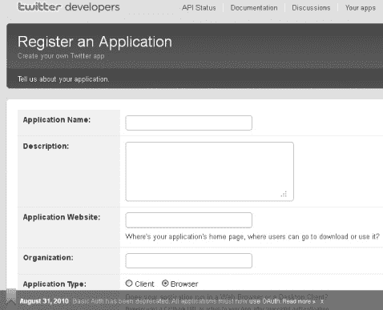
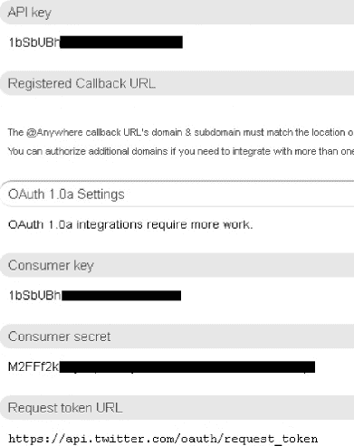
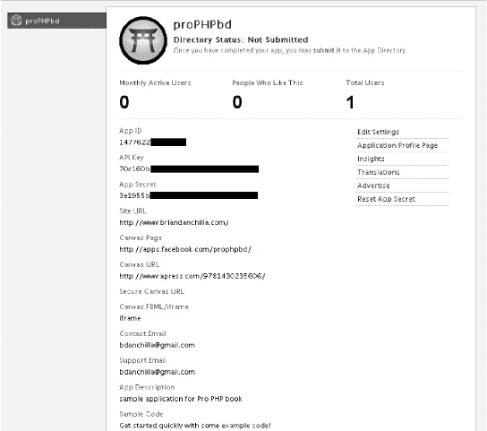
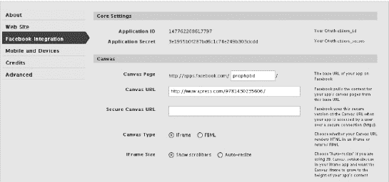
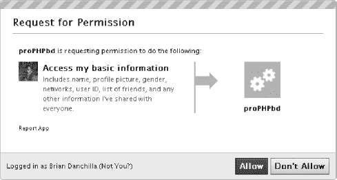
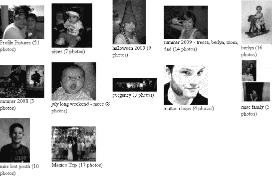

# 四、社交媒体

社交媒体融合了技术和通信来创造社交互动和协作。Twitter 和脸书是两个最受欢迎的社交媒体网站，吸引了数百万忠实用户，引发了一些争议，而在脸书的情况下，导致了一部获奖电影。

自 2006 年推出以来，Twitter 一直是世界上最受欢迎的微博服务。它已经提供了数十亿条推文(140 个字符或更短的消息)，通过网络和 SMS(短消息服务)设备共享。马克·扎克伯格的大宝宝脸书比以往任何时候都更加引人注目。新闻报道了脸书的隐私问题，*时代杂志宣布扎克伯格为年度人物，电影*社交网络*获得了很多好评。*

 *Twitter 和脸书都通过 OAuth 认证。在本章中，我们将解释 OAuth 是什么以及如何与之连接。

Twitter 有三个应用编程接口(API)。有一个使用 GET 查询的公共搜索 API 和两个私有 REST APIs。一个 REST API 在您的个人网络中提供特定的用户信息和动作，而另一个提供低延迟和高容量的流。在这一章中，我们将展示如何使用公共搜索 API 和认证后的私有 API。

有了 Twitter，你可以拥有朋友，他们被定义为你正在关注的人或正在关注你的人。我们将向您展示如何生成您的 Twitter 好友及其状态的列表。我们还将讨论将 Twitter 登录绑定到您自己网站的身份验证的高级主题，使用数据库来存储用户凭证，以及使用数据库缓存来帮助消除过度 tying Twitter 和达到我们的请求限制。

脸书有一个开发良好的 API 和一个官方的 PHP SDK。在这一章中，我们将学习用脸书创建一个新的应用，认证，并进行一些 API 调用。

### 非统组织

OAuth 代表开放身份验证，它使用为特定应用生成的密钥/秘密令牌字符串，这些字符串持续固定的时间。OAuth 发生在消费者应用和服务提供者之间。使用 OAuth 进行身份验证的基本步骤如下:

1.  OAuth 应用将其消费者令牌发送给服务提供商(如脸书或 Twitter ),以换取请求令牌。
2.  系统会提示用户获取权限，并授予用户权限。
3.  使用回叫 URL 或个人识别码(PIN)来验证许可请求。
4.  请求令牌和 PIN(或回叫)被交换为访问令牌。
5.  用户现在可以使用带有访问令牌的应用。

 **注**更多 OAuth 信息，请访问`[http://oauth.net](http://oauth.net)`。对于 Twitter 内部的 OAuth 来说，`[http://dev.twitter.com/pages/auth](http://dev.twitter.com/pages/auth)`是一个有价值的资源。

在撰写本文时，PHP 最流行的两个 OAuth 模块是 PECL OAuth 和 Zend_Oauth。关于 PECL OAuth 的信息可以在`[www.php.net/manual/en/book.oauth.php](http://www.php.net/manual/en/book.oauth.php)`找到，Zend_Oauth 在`[http://framework.zend.com/manual/en/zend.oauth.html](http://framework.zend.com/manual/en/zend.oauth.html)`找到。

Twitter 提供了三种使用 OAuth 的机制。如果您只需要连接到应用所有者的帐户，那么您将获得可以直接使用的访问令牌。这允许您绕过上面概述的前四个步骤。如果您的程序允许多个用户访问他们的 Twitter 帐户，那么您可以对客户端应用使用 PIN 验证方法，或者定义一个回调页面，这样可以绕过让用户进行验证。我们将在本章的后面更深入地讨论每一种方法。

### 推特

#### 公共搜索 API

要搜索特定的推文，我们不需要认证。从`http://dev.twitter.com/doc/get/search`的 Twitter 搜索文档中，我们可以看到搜索 Twitter 的 URL 是:

`http://search.twitter.com/search.format`

(其中`format`是 JSON 或者 Atom)。

可以设置可选参数，例如语言、地理编码、开始和结束时间间隔以及区域设置。搜索查询本身由参数`q`表示。标准的 Twitter 符号是有效的，比如用户的`@`和关键字散列标签的`#`。查询`[http://search.twitter.com/search.json?q=montreal&lang=en&until=2010-10-21](http://search.twitter.com/search.json?q=montreal&lang=en&until=2010-10-21)`将搜索在 2010 年 10 月 21 日之前发布的带有“蒙特利尔”一词的英语推文。

清单 4-1 显示了一个搜索 Twitter 帖子的简单表单。

***清单 4-1。**搜索示例:`twitter_get_search.php`*

`<HTML>
<HEAD>
<meta http-equiv="Content-Type" content="text/html; charset=UTF-8" />
</HEAD>
<BODY>
<FORM action="twitter_get_search.php" method="post">
    

        <LABEL for="query">query: </LABEL>
        <INPUT type="text" id="query" name="query"/> &nbsp; &nbsp;
        <INPUT type="submit" value="Send" />
    

</FORM>
<?php
error_reporting ( E_ALL ^ E_NOTICE );

$url = "http://search.twitter.com/search.json?lang=en&q=";
if ( isset ( $_POST ['query'] ) ) {
        $full_query = $url . urlencode ( $_POST ['query'] );
        $raw_json = file_get_contents ( $full_query );
        $json = json_decode ( $raw_json );

        //uncomment to display the available keys
        /* foreach ( $json->results[0] as $key => $value ) {
             echo $key . " ";
          }
        */

        echo "<table style='width:500px;'>";
        echo "<tr><th>user</th><th>tweet</th></tr>";
        foreach ( $json->results as $r ) {

                echo '<tr><td>profile_image_url . '"/>&nbsp;';
                echo $r->from_user . '</td>';
                echo '<td>' . $r->text . '</td>';
                echo '</tr>';
        }
        echo "</table>";
}
?>
</BODY>
</HTML>`

清单 4-1 的第一部分显示了一个简单的表单，带有一个用于查询的文本字段和一个提交按钮。下一部分检查表单提交并对查询进行编码。然后从生成的 URL 获取输出。我们使用`json_decode`将返回的 JSON 格式的对象转换成 PHP 对象。我们留下了一些注释掉的代码，可以用来标识可用的字段。最后，结果被循环并显示为一个 HTML 表。

注意，我们在脚本的顶部调用了`error_reporting(E_ALL ^ E_NOTICE);`，它显示了除通知之外的所有错误消息。这将有助于我们在出现问题时进行调试。关于 JSON 的更多信息可以在第 15 章中找到。

#### 私有 REST API

许多 PHP 库被编写成与 Twitter API 接口。然而，大多数这些库使用凭证(用户名和密码的组合)作为连接的基本身份验证。截至 2010 年 8 月，Twitter 使用 OAuth，不再支持基本认证。总之，许多与 Twitter 接口的库现在都过时了，或者至少需要更新。从基本身份验证更改为 OAuth 的原因是为了增加安全性。

最常用的 PHP OAuth-Twitter 库之一是 twitteroauth，可在`[https://github.com/abraham/twitteroauth/downloads](https://github.com/abraham/twitteroauth/downloads)`获得。我们将在整章中使用这个库。Twitteroauth 由两个主要文件组成，Twitteroauth 和 oauth.php。对于我们的例子，将两者都放在相对于 webroot 的目录`'/twitteroauth/'`中。

您还需要确保启用了 curl library for PHP。所需的库文件会因您使用的操作系统而异。在 Windows 上，库是`php_curl.dll`，在你的`php.ini`文件中，你可以添加或者取消注释行`extension=php_curl.dll`。在 Linux 上，库是`curl.so`，你需要在你的`php.ini`文件中有一行`extension=curl.so`。您还可以在 shell 中使用命令`php –m`或者通过调用`phpinfo()`函数来检查您安装的模块，

##### 最重要的事情:获得一个 Twitter 账户

为了学习这些例子，你需要一个 Twitter 账户。在`[https://twitter.com/signup](https://twitter.com/signup)`注册过程快速简单。参见[图 4-1](#fig_4_1) 。您将收到一封确认电子邮件。一旦你确认了你的账户，前往 Twitter 的发展区`[http://dev.twitter.com/](http://dev.twitter.com/)`。我们将在`[http://dev.twitter.com/apps/new](http://dev.twitter.com/apps/new)`创建一个新的应用，用于 OAuth。

***图 4-1。** Twitter 应用注册表单*

 **注意** Twitter 要求填写应用网站字段。如果您正在本地测试您的应用，或者您的应用没有公共主页，您将需要假装您有。填写任何有效的网址，如[http://foobar.com。](http://foobar.com.)

对于我们的第一个演示，我们将使用以下设置:

`Application Type: *Client*
Default Access Type: *Read-only*`

这两种类型的应用是桌面“客户端”和网络“浏览器”。web 浏览器应用使用公共回调 URL 在身份验证过程中接收信息。桌面客户端不需要外部访问就可以与 OAuth 服务提供者进行通信。相反，会给出一个 PIN，并要求用户返回到应用以完成身份验证。

访问类型可以是“只读”(默认)或“读写”只读仅允许您请求和查看信息。读写访问还允许您将数据发送回应用。

Twitter 将为我们生成一个消费者密钥和消费者秘密令牌，我们将在示例中使用它们。

***图 4-2。** Twitter 生成的消费代币*

本章中的大多数 Twitter 示例都需要使用我们的消费令牌，所以为了方便起见，我们将它们放在一个外部文件中。参见[清单 4-2](#list_4_2) 。

***清单 4-2。**定义我们的消费代币:`twitter_config.php`*

`<?php

define ( 'CONSUMER_KEY', '1bSbUBh***************' );
define ( 'CONSUMER_SECRET', 'M2FFf2k**********************************' );
?>`

##### 使用我的访问令牌进行认证

在我们的应用的右边菜单上，有一个到我的访问令牌的链接。这为我们提供了访问令牌和访问秘密令牌。这些令牌允许我们进行身份验证，而无需经过所有常见的 OAuth 步骤。

***图 4-3。** Twitter 单用户直接访问令牌*

使用我们的直接访问令牌，我们可以连接 twitteroauth。参见[清单 4-3](#list_4_3) 。

***清单 4-3。**用`twitteroauth`和我的接入令牌:`twitter_direct_access.php`* 进行简单认证

`<?php

error_reporting ( E_ALL ^ E_NOTICE );
require_once ("twitteroauth/twitteroauth.php");
require_once ("twitter_config.php");

//My Access tokens
$accessToken = 'ACTUAL_ACCESS_TOKEN';
$accessTokenSecret = 'ACTUAL_SECRET_ACCESS_TOKEN';

//since we know our access tokens now, we will pass them into our constructor
$twitterOAuth = new TwitterOAuth ( CONSUMER_KEY, CONSUMER_SECRET, $accessToken, $accessTokenSecret );

//verify credentials through Twitter API call
$user_info = $twitterOAuth->get ( "account/verify_credentials" );
if ( $user_info && !$user_info->error ) {
        print "Hello " . $user_info->screen_name . "! ";
} else {
        die ( "error verifying credentials" );
}
?>`

该脚本加载 twitteroauth 库，并传入我们的消费者、消费者秘密和“我的访问”令牌作为参数。你当然需要为`'ACTUAL_ACCESS_TOKEN'`和`'ACTUAL_SECRET_ACCESS_TOKEN'`行输入真实值。

在 http://localhost/Twitter _ direct _ access . PHP 上调用我们的脚本，成功输出:

`Hello bdanchilla!`

 **注意**保护您的消费者和访问令牌不被潜在黑客窃取是非常重要的。

##### 使用个人识别号(PIN)进行客户端认证

在本例中，我们假设另一个用户正在尝试进行身份验证。因此，我们没有访问令牌。我们将把我们的应用消费者令牌输入到 twitteroauth 构造函数中，获取请求令牌，然后重定向到 Twitter 开发区域。我们将被告知，我们的脚本正试图访问我们的应用，并拒绝或接受它。我们当然会接受，然后给一个 PIN。

将这个七位数的 PIN 输入第二个脚本将完成我们的激活。这只需要做一次。如果在非公共脚本中使用身份验证，例如桌面应用或没有公共可访问域的本地主机，则使用这种方法。

在 twitteroauth 库中，我们可以通过将 PIN 作为参数传递给函数`getAccessToken`来使用它进行身份验证:

`function getAccessToken($oauth_verifier = FALSE);`

要获得 PIN，我们需要将消费者令牌交换为请求令牌，然后注册请求令牌。一旦我们有了 PIN，我们就使用它和请求令牌来获得访问令牌。当我们有了访问令牌，我们就可以认证和使用 Twitter APIs 了。

###### 第一步:获取个人识别码

***清单 4-4。**推特注册:`twitter_registration.php`*

`<?php
error_reporting ( E_ALL ^ E_NOTICE );
require_once ('twitteroauth/twitteroauth.php');
require_once ('twitter_config.php');
session_start (); //start a session

//the constructor takes our 'consumer key', 'consumer secret' as arguments
$twitterOAuth = new TwitterOAuth ( CONSUMER_KEY, CONSUMER_SECRET );

//returns the oauth request tokens {oauth_token, oauth_token_secret}
$requestTokens = $twitterOAuth->getRequestToken ();` 
`//we write the tokens into the $_SESSION
$_SESSION ['request_token'] = $requestTokens ['oauth_token'];
$_SESSION ['request_token_secret'] = $requestTokens ['oauth_token_secret'];

//redirect to the Twitter generated registration URL, which will give us our PIN
header ( 'Location: ' . $twitterOAuth->getAuthorizeURL ( $requestTokens ) );

?>`

这个脚本将请求令牌返回给我们，然后我们将它保存在`$_SESSION`中。最后，脚本将我们重定向到 Twitter PIN 页面。参见[图 4-4](#fig_4_4) 。

***图 4-4。**请求令牌并被重定向后的 PIN 输出*

###### 步骤 2:验证 PIN 以接收访问令牌

要获得访问令牌，运行清单 4-5 中的[，将 PIN 作为 GET 参数传入](#list_4_5)

***清单 4-5。** Twitter PIN 验证:`twitter_pin_validation.php`*

`//example usage:
//http://localhost/twitter_pin_validation.php?pin=9352006

<?php

error_reporting(E_ALL ^ E_NOTICE);
require_once("twitteroauth/twitteroauth.php");
require_once("twitter_config.php");
session_start();

if ( isset( $_GET["pin"] ) ) {
    if ( is_numeric( $_GET["pin"] ) ) {
        if ( validatePIN () ) {
            print "PIN validation script was run";
        }` 
`    } else {
        print "Error: non-numeric PIN";
    }
} else {
    print "Error: no PIN passed in";
}

function validatePIN() {

    //since we know our request tokens now, we will pass them into our constructor
    $twitterOAuth = new TwitterOAuth(
                CONSUMER_KEY,CONSUMER_SECRET,
                $_SESSION['request_token'], $_SESSION['request_token_secret']
                );   
    //Generate access tokens {oauth_token, oauth_token_secret}
    //we provide the PIN from twitter in the previous step
    $accessOAuthTokens = $twitterOAuth->getAccessToken( $_GET["pin"] );

   if ($accessOAuthTokens && $accessOAuthTokens['oauth_token']) {
        //write our oauth access tokens to the $_SESSION
        $_SESSION["access_token"] = $accessOAuthTokens['oauth_token'];
        $_SESSION["access_token_secret"] = $accessOAuthTokens['oauth_token_secret'];
        return true;
    } else {
        print "Error: PIN usage timed out!";
        return false;
    }
}
?>`

在清单 4-5 的[中，我们增加了一些安全检查来确保正确的 PIN 输入。如果成功，输出将是`"PIN validation script was run"`,如果失败，输出将是错误消息。这些错误可能是由于没有传入 PIN、非数字 PIN 或生成的 PIN 超时。](#list_4_5)

该脚本加载了保存在[清单 4-4](#list_4_4) 中的注册令牌。我们创建一个新的`TwitterOAuth`对象，这次将请求令牌作为附加参数传入。然后我们调用`getAccessToken`,将我们的 PIN 作为参数传入。这将返回访问令牌。最后，我们将访问令牌写入会话，或者在 PIN 超时时返回错误消息。

 **注意**从[清单 4-5](#list_4_5) 中生成的 PIN 确实有到期日期/时间。如果我们将`twitter_pin_validation.php`的执行延迟太久，就会得到一个错误。

尽管 OAuth 是比用户名/密码凭证更安全的系统，但您仍然需要采取预防措施。如果攻击者能够检索您的访问令牌，那么他们就能够访问您的 Twitter 帐户。

###### 步骤 3:使用访问令牌进行身份验证，以使用 Twitter API

现在，我们的会话数据中保存了访问令牌。这些令牌使我们能够认证和使用 Twitter API。参见[清单 4-6](#list_4_6) 。

***清单 4-6。**推特用法示例:`twitter_usage.php`*

`<?php
error_reporting(E_ALL ^ E_NOTICE);
require_once("twitteroauth/twitteroauth.php");
require_once("twitter_config.php");
session_start();

//since we know our access tokens now, we will pass them into our constructor
$twitterOAuth = new TwitterOAuth(
   CONSUMER_KEY,CONSUMER_SECRET,
   $_SESSION["access_token"], $_SESSION["access_token_secret"]);

//verify credentials through Twitter API call
$user_info = $twitterOAuth->get( "account/verify_credentials" );
if ( $user_info && !$user_info->error ) {
    print "Hello ".$user_info->screen_name."! ";

    print "Pushing out a status message.";
    // Post our new status
    $twitterOAuth->post(
        'statuses/update',
        array( 'status' => "writing status…foobar " )
        );

    //other api calls
}else{
   die( "error verifying credentials" );
}
?>`

如果我们通过了正确的身份验证，这将输出以下内容:

`Hello bdanchilla!
Pushing out a status message.`

这条线

`$twitterOAuth->post(
  'statuses/update',
  array( 'status' => " writing status…foobar " )
  );`

应该输出一个状态信息。然而，如果我们去我们的 Twitter 账户，我们看到什么也没有发表。这是因为我们的应用不允许写访问。

Twitter REST API 方法是`GET`或`POST`。`GET`方法读取数据。`POST`方法写数据。我们大部分的函数调用都是读取数据，因此会用`GET`来调用。编辑信息，比如更新我们的状态或关注新朋友，需要写权限，因此调用`POST`。

要纠正这一点，我们需要回到 Twitter 开发站点，将应用的默认访问类型设置从只读更改为读写。参见图 4-5 。确保保存配置更改。

 **注意**当切换应用类型和访问类型时，您可能需要清除您的会话数据。

***图 4-5。**修改我们应用的访问类型*

重新运行前面的脚本，然后再次检查 Twitter。我们的状态现在应该已发布。

###### API 使用示例:朋友状态

对于我们的下一个例子，如清单 4-7 所示，我们将显示我们朋友的最新状态。在本例中，我们像前面的脚本一样连接到 Twitter。然后我们调用`statuses/friends,`来检索我们朋友的最后状态。这非常类似于我们的公共搜索 API 示例，但是显示的是我们的朋友而不是普通人。

我们也调用`shuffle($friends)`来随机化我们的朋友列表。

***清单 4-7。**显示好友的最新状态:`friend_status.php`*

`<?php

error_reporting(E_ALL ^ E_NOTICE);
require_once("twitteroauth/twitteroauth.php");
require_once("twitter_config.php");
session_start();

//since we know our access tokens now, we will pass them into our constructor
$twitterOAuth = new TwitterOAuth(
                CONSUMER_KEY, CONSUMER_SECRET,
                $_SESSION["access_token"], $_SESSION["access_token_secret"] );

//verify credentials through Twitter API call
$user_info = $twitterOAuth->get( "account/verify_credentials" );
if ( $user_info && !$user_info->error ) {
    echo '<h2>Connected as: </h2>';
    echo '<table style="width: 500px;">';
    echo '<tr><td>';
    echo $user_info->screen_name . ' ';
    echo 'profile_image_url . '"/>&nbsp;';
    echo '</td>';
    echo '<td>';
    echo '<td>';
    echo '<strong>Last tweet:</strong> <em>' . $user_info->status->text . '</em></td>';
    echo '</td>';
    echo '</tr>';
    echo '</table>';

    echo '<h2>My Friends</h2>';
    $friends = $twitterOAuth->get( "statuses/friends" );
    shuffle( $friends ); //randomize which tweets are shown
    echo '<table style="width: 500px;">';
    foreach ( $friends as $f ) {
        echo '<tr background-color: ' . $f->profile_background_color . '">';
        echo '<td>';
        echo $f->screen_name . ' ';
        echo 'profile_image_url . '"/>&nbsp;';
        echo '</td>';
        echo '<td>';
        echo '<strong>Last tweet:</strong> <em>' . $f->status->text . '</em></td>';
        echo '</td></tr>';
    }
    echo '</table>';
} else {
    die( "error verifying credentials" );
}
?>` 

***图 4-6。**朋友最后一条推文的输出示例*

##### 通过回调进行认证

在前面的示例中，您可能会认为，一定有比获取您的 PIN 并在单独的步骤中手动输入它更好的身份验证方法。确实有；但是，它需要一个外部可用的 web 服务器，以便 OAuth 服务提供者(Twitter)可以回调消费者(我们的应用)。

拥有回调位置比 PIN 少产生一个步骤，因为回调脚本充当对您的验证。它证明你拥有这个应用。这很像当你加入一个新的网站，他们通过给你发送确认信息来验证你提供的电子邮件。如果没有回电，那么你可以假装成其他任何人。

回到我们的 Twitter 开发帐户，我们需要将应用类型更改为 browser，并提供一个回调 URL。参见图 4-7 。

***图 4-7。**更改我们的应用类型并提供回调 URL*

 **注意**记住回调必须是外部可用的，因此本地测试服务器(即`[http://localhost/](http://localhost/)`)将不起作用。

我们认证的第一部分重用了在[清单 4-4](#list_4_4) 中找到的`twitter_registration.php`脚本。我们将被重定向到一个像你在[图 4-8](#fig_4_8) 中看到的页面，要求我们输入用户名和密码。

***图 4-8。**重定向至登录屏幕*

当我们点击“登录”时，我们将被重定向到我们的回调函数，这是我们在应用设置中注册的。这消除了对 PIN 验证的需要。我们应该看到这样的结果:

`Welcome bdanchilla!
You have logged in using Twitter.`

[列表 4-8](#list_4_8) 是我们的回调脚本。

***清单 4-8。**我们的回调处理程序，`callback.php`*

`<?php
error_reporting(E_ALL ^ E_NOTICE);
require_once("twitteroauth/twitteroauth.php");
require_once("twitter_config.php");
session_start();

//verify that the oauth_token parameter of the callback URL matches the session token
if ( $_GET["oauth_token"] == $_SESSION["request_token"] ) {
    //pass in our  request tokens that have been stored in our $_SESSION
    $twitterOAuth = new TwitterOAuth(
     CONSUMER_KEY, CONSUMER_SECRET,
      $_SESSION["request_token"], $_SESSION["request_token_secret"] );

    $accessToken = $twitterOAuth->getAccessToken();

    //ensure that we have a numeric user_id
    if ( isset($accessToken["user_id"]) && is_numeric($accessToken["user_id"]) ) {

        //save the access tokens to our session
        $_SESSION["access_token"] = $accessToken["oauth_token"];
        $_SESSION["access_token_secret"] = $accessToken["oauth_token_secret"];

        // Success! Redirect to the welcome page
        header( "location: welcome.php" );
    } else {
        // Failure : ( go back to the login page
        header( "location: login.php" );
    }
}else{
    die( "Error: we have been denied access" );
}
?>`

在我们的欢迎页面或会话中的任何其他页面上，我们现在可以构造一个新的`TwitterOAuth`对象并连接到 twitter。参见[清单 4-9](#list_4_9) 。

***清单 4-9。**欢迎页面:`welcome.php`*

`<?php
error_reporting(E_ALL ^ E_NOTICE);
require_once("twitteroauth/twitteroauth.php");
require_once("twitter_config.php");
session_start();` 
`if( !empty( $_SESSION["access_token"] ) &&
    !empty( $_SESSION["access_token_secret"] )
  ) {

  $twitterOAuth = new TwitterOAuth(
          CONSUMER_KEY,
          CONSUMER_SECRET,
           $_SESSION["access_token"],
           $_SESSION["access_token_secret"] );

  //check that we are connected
  $user_info = $twitterOAuth->get( 'account/verify_credentials' );
  if ( $user_info && !$user_info->error ) {
     echo "Welcome " . $user_info->screen_name."!";  

     //perform other
     //API calls
  } else {
     die( "Error: bad credentials." );
  }
} else {
   die( "Error: your access_token was not found in your \$_SESSION." );
}

?>`

#### 使用 Twitter OAuth 登录您的网站

与使用 OpenID 类似，您可以使用 Twitter 的 OAuth 登录作为网站的登录机制。你可能已经看过下面这张图片，可以从`[http://dev.twitter.com/pages/sign_in_with_twitter](http://dev.twitter.com/pages/sign_in_with_twitter)`的各个网站上获得。

要在前面的例子中添加登录按钮，我们只需修改清单 4-4 中的代码，使其不自动重定向我们，而是显示一个图片链接。参见[清单 4-10](#list_4_10) 。

***清单 4-10。【login.php T2】用签到按钮注册 Twitter】***

`<?php
error_reporting(E_ALL ^ E_NOTICE);
require_once('twitteroauth/twitteroauth.php');
require_once('twitter_config.php');
session_start(); //start a session

//the constructor takes our 'consumer key', 'consumer secret' as arguments
$twitterOAuth = new TwitterOAuth( CONSUMER_KEY,CONSUMER_SECRET );` 
`//returns the oauth request tokens {oauth_token, oauth_token_secret}
$requestTokens = $twitterOAuth->getRequestToken();

//we write the tokens into the $_SESSION
$_SESSION['request_token'] = $requestTokens['oauth_token'];
$_SESSION['request_token_secret'] =  $requestTokens['oauth_token_secret'];

**//header( "Location: ". $twitterOAuth->getAuthorizeURL( $requestTokens  ) );**
**//Display Twitter log in button with encoded link**
**?>**
**<a href="<?php echo $twitterOAuth->getAuthorizeURL**($_SESSION['request_token'] **);?>">**
**</a>**`

##### 使用一个数据库存储多个用户

我们将扩展前面的例子，在数据库中存储用户凭证，见清单 4-11 。为了简单起见，我们将使用 SQLite。在生产环境中，您可能希望确保存储的文件保存在 webroot 之外，或者使用非平面文件数据库以获得更高的安全性。有关 SQLite 的更多信息，请参考[第 7 章](07.html#ch7)。

***清单 4-11。** Twitter 数据库连接类:`twitter_db_connect.php`*

`<?php

class Twitter_DBConnect {

    static $db;
    private $dbh;

    private function Twitter_DBConnect() {
        try {
            $this->dbh = new PDO( 'sqlite:t_users' );
            $this->dbh->setAttribute( PDO::ATTR_ERRMODE, PDO::ERRMODE_EXCEPTION );
        } catch ( PDOException $e ) {
            print "Error!: " . $e->getMessage() . "\n";
            die ();
        }
    }

    public static function getInstance() {
        if ( !isset( Twitter_DBConnect::$db ) ) {
            Twitter_DBConnect::$db = new Twitter_DBConnect();
        }
        return Twitter_DBConnect::$db->dbh;
    }

}
?>`

这个类遵循单例设计模式来存储数据库连接的一个实例。Singleton 模式的关键特征是构造函数是私有的，我们确保返回类的同一个实例。

 **注意**本书没有涉及设计模式，但是关于单例模式的更多内容，请参考`[http://en.wikipedia.org/wiki/Singleton_pattern](http://en.wikipedia.org/wiki/Singleton_pattern)`。特别是对于 PHP 设计模式，我们建议你阅读 Matt Zandstra (Apress，2010)的 *PHP 对象、模式和实践*。

***清单 4-12。**数据库操作–选择、插入、更新:`twitter_db_actions.php`*

`<?php

error_reporting(E_ALL ^ E_NOTICE);
require_once('twitter_db_connect.php');
session_start();

class Twitter_DB_Actions {

    private $dbh; //database handle

    public function __construct() {
        $this->dbh = Twitter_DBConnect::getInstance();
        $this->createTable();
    }

    public function createTable() {
      $query = "CREATE TABLE IF NOT EXISTS oauth_users(
        oauth_user_id INTEGER,
        oauth_screen_name TEXT,
        oauth_provider TEXT,
        oauth_token  TEXT,
        oauth_token_secret TEXT
       )";
       $this->dbh->exec( $query );
    }

    public function saveUser( $accessToken ) {
        $users = $this->getTwitterUserByUID( intval($accessToken['user_id']) );
        if ( count( $users ) ) {
            $this->updateUser( $accessToken, 'twitter' );
        } else {
            $this->insertUser( $accessToken, 'twitter' );
        }
    }` 
`    public function getTwitterUsers() {
        $query = "SELECT * from oauth_users WHERE oauth_provider = 'twitter'";
        $stmt = $this->dbh->query( $query );
        $rows = $stmt->fetchAll( PDO::FETCH_OBJ );
        return $rows;
    }

    public function getTwitterUserByUID( $uid ) {
        $query = "SELECT * from oauth_users WHERE oauth_provider= 'twitter' AND oauth_user_id = ?";
        $stmt = $this->dbh->prepare( $query );
        $stmt->execute( array( $uid ) );
        $rows = $stmt->fetchAll( PDO::FETCH_OBJ );
        return $rows;
    }

    public function insertUser( $user_info, $provider = '' ) {
        $query = "INSERT INTO oauth_users (oauth_user_id, oauth_screen_name,
           oauth_provider, oauth_token, oauth_token_secret) VALUES (?, ?, ?, ?, ?)";
        $values = array(
            $user_info['user_id'], $user_info['screen_name'], $provider,
            $user_info['oauth_token'],
            $user_info['oauth_token_secret'] );
        $stmt = $this->dbh->prepare( $query );
        $stmt->execute( $values );
        echo "Inserted user: {$user_info['screen_name']}";
    }

    public function updateUser( $user_info, $provider = '' ) {
        $query = "UPDATE oauth_users SET oauth_token = ?, oauth_token_secret = ?,
                         oauth_screen_name = ?
        WHERE oauth_provider = ? AND oauth_user_id = ?";
        $values = array( $user_info['screen_name'], $user_info['oauth_token'],
            $user_info['oauth_token_secret'], $provider, $user_info['user_id'] );
        $stmt = $this->dbh->prepare( $query );
        $stmt->execute( $values );
        echo "Updated user: {$user_info['screen_name']}";
    }

}
?>`

***清单 4-13。**我们更新了回调脚本，`callback_with_db.php`*

`<?php
error_reporting(E_ALL ^ E_NOTICE);
require_once("twitteroauth/twitteroauth.php");
require_once("twitter_config.php");
**require_once("twitter_db_actions.php");**
session_start();` 
`//verify that the oauth_token parameter of the callback URL matches the session token
if ( $_GET["oauth_token"] == $_SESSION["request_token"] ) {
    //pass in our request tokens that have been stored in our $_SESSION
     $twitterOAuth = new TwitterOAuth(
  CONSUMER_KEY, CONSUMER_SECRET,
  $_SESSION["request_token"], $_SESSION["request_token_secret"] );

    $accessToken = $twitterOAuth->getAccessToken();

    //ensure that we have a numeric user_id
    if ( isset( $accessToken["user_id"] ) && is_numeric( $accessToken["user_id"] ) ) {
**        // Save the access tokens to a DB**
**        $twitter_db_actions = new Twitter_DB_Actions();**
**        $twitter_db_actions->saveUser($accessToken);**

        //Success! Redirect to welcome page
        //The welcome.php page will also need to be modified to read our tokens from the           database and not the session
        header( "location: welcome.php" );
    } else {
        // Failure :( go back to login page
        header( "location: login.php" );
    }
}
?>`

将 OAuth(或 OpenID)与您的站点集成的优点是，您不需要人们提交另一个注册表单并记住另一个用户名/密码集。大多数主要的内容管理系统(CMSes)都有 OAuth 和 OpenID 插件，比如 Wordpress 和 Drupal。

##### 缓存数据

为了消除每次页面刷新时向 Twitter 请求信息的需要，一种常见的方案是缓存数据。Twitter REST API 将 OAuth 用户的请求调用限制为每小时 350 个，匿名用户为每小时 150 个。在人口密集的网站上，缓存是必要的。我们不会实现缓存，但会描述基本的技术。

数据缓存存储数据以供以后检索。要缓存 Twitter 信息，您需要定期向 Twitter 发出请求。这通常是通过所谓的 cron 作业自动完成的。每次请求后，新的结果被插入数据库，过时的记录被删除。当用户访问网站时，他们看到的信息来自数据库，而不是直接来自 Twitter。

#### 更多 API 方法和示例

Twitter API 分为以下几类:*时间线*，*状态*，*用户*，*列表*，*列表成员*，*列表订阅者*，*直接消息*，*友情*，*社交图*，*账号*，*收藏夹*，*通知*，

涵盖整个 API 超出了本书的范围，但是我们可以尝试一些方法。详细描述可在网上获得。例如，方法`friends_timeline`在`[http://dev.twitter.com/doc/get/statuses/friends_timeline](http://dev.twitter.com/doc/get/statuses/friends_timeline)`有文档。从文档中，我们可以看到该方法是用`GET`调用的，可以以 JSON、XML、RSS 或 Atom 格式返回，需要认证，并且有各种可选参数。

当然，我们不需要在会话中存储我们的访问令牌。我们可以将访问令牌内容保存到文件中。为了安全起见，这些应该在文档根目录之外。我们可以修改[清单 4-5](#list_4_5) 来将我们的访问令牌写入磁盘(参见[清单 4-14](#list_4_14) )。

***清单 4-14。**在物理文件中存储我们的访问令牌*

`     //write our oauth access tokens to files
     file_put_contents( "access_token", $accessOAuthTokens['oauth_token'] );
     file_put_contents( "access_token_secret", $accessOAuthTokens['oauth_token_secret'] );`

将我们的应用更改为“client”，运行 twitter_registration.php，然后使用 PIN 将清单 _4-14.php 保存到磁盘上。现在我们在磁盘上有了访问令牌，我们可以通过用`file_get_contents`读取它们来进行身份验证。见清单 4-15 。

***清单 4-15。**一个单独的可重复使用的文件，`twitter_oauth_signin.php, to authenticate`*

`<?php

error_reporting(E_ALL ^ E_NOTICE);
require_once("twitteroauth/twitteroauth.php");
require_once("twitter_config.php");

//access_token and access_token_secret are
//the file names holding our access tokens
$twitterOAuth = new TwitterOAuth(
                CONSUMER_KEY, CONSUMER_SECRET,
                file_get_contents( "access_token" ),
                file_get_contents( "access_token_secret" ) );
?>`

我们可以要求清单 4-15 中的文件来缩短我们调用 Twitter API 的脚本。

在这里，我们按顺序检索并输出多达 20 条好友更新的 Twitter 数据，包括我们自己。这与我们个人 Twitter 主页上的视图相同。参见[清单 4-16](#list_4_16) 。

***清单 4-16。**按顺序获取好友更新的 Twitter 数据*

`<?php

error_reporting(E_ALL ^ E_NOTICE);
require_once("twitter_oauth_signin.php");

$friends_timeline = $twitterOAuth->get( 'statuses/friends_timeline', array( 'count' => 20 ) );
var_dump( $friends_timeline );
?>`

清单 4-17 显示了我们最近的 tweet IDs 和状态。

***清单 4-17。**我们最近的推文及其 id*

`<?php

error_reporting(E_ALL ^ E_NOTICE);
require_once("twitter_oauth_signin.php");

$tweets = $twitterOAuth->get( 'statuses/user_timeline' );
foreach ( $tweets as $t ) {
    echo $t->id_str . ":   " . $t->text . " ";
}
?>`

清单 4-17 的示例输出如下:

`  68367749604319232: 850,000,000,000 pennies for skype
  68367690535940096: Da da da da dat, da da da da Jackie Wilson said
  47708149972602880: Tuesday morning and feelin' fine
  43065614708899840: Devendra Banhart - At the Hop http://bit.ly/sjMaa
  39877487831957505: shine on you crazy diamond
  39554975369658369: Excited to listen to new Radiohead and Fleet Foxes soon : )
  39552206701072384: writing a chapter...about twitter`

如果我们想通过编程删除一条推文呢？我们简单地输入 id 值并调用 Twitter API POST 方法`statuses/destroy`。tweet ID 应该是一个字符串，而不是一个数字。参见[清单 4-18](#list_4_18) 。

***清单 4-18。**摧毁一个状态*

`<?php

error_reporting(E_ALL ^ E_NOTICE);
require_once("twitter_oauth_signin.php");

$tweet_id = "68367749604319232";
$result = $twitterOAuth->post( 'statuses/destroy',
            array( 'id' => $tweet_id )
          );

if ( $result ) {
  if ( $result->error ) {
      echo "Error (ID #" . $tweet_id . ") ";
      echo $result->error;
  } else {
      echo "Deleting post: $tweet_id!";
  }
}
?>`

要添加和删除友谊，我们首先检查友谊是否存在，然后销毁或创建一个。参见[清单 4-19](#list_4_19) 。

***清单 4-19。**建立和破坏友谊*

`<?php

error_reporting(E_ALL ^ E_NOTICE);
require_once("twitter_oauth_signin.php");

//get our information
$user_info = $twitterOAuth->get( "account/verify_credentials" );

//check if we are friends with Snoopy, if not, then we create the friendship.
if ( !$twitterOAuth->get( 'friendships/exists', array(
            'user_a' => $user_info->screen_name,
            'user_b' => 'peanutssnoopy' ) ) ) {
    echo 'You are NOT following Snoopy. Creating friendship!';
    $twitterOAuth->post( 'friendships/create', array( 'screen_name' => 'Snoopy' ) );
}

//check if we are friends with Garfield. If not, then we create the friendship.
if ( !$twitterOAuth->get( 'friendships/exists', array(
            'user_a' => $user_info->screen_name,
            'user_b' => 'garfield') ) ) {
    echo 'You are NOT following Garfield. Creating friendship!';
    $twitterOAuth->post( 'friendships/create', array( 'screen_name' => 'Garfield' ) );
}

//check if we are friends with Garfield. If yes, we destroy that friendship.
if ( $twitterOAuth->get( 'friendships/exists', array(
            'user_a' => $user_info->screen_name,
            'user_b' => 'garfield') ) ) {
    echo 'You are following Garfield. Destroying friendship!';
    $twitterOAuth->post( 'friendships/destroy', array( 'screen_name' => 'garfield' ) );
}
?>`

在[清单 4-19](#list_4_19) 中，`exists`查询是一个`GET`方法，而`destroy`和`create`命令是`POST`方法。

### 脸书

好消息是，使用脸书 API 开发应用与开始使用 Twitter API 非常相似，因为两者都使用 OAuth 进行身份验证。

首先，转到`[www.facebook.com/developers/apps.php](http://www.facebook.com/developers/apps.php)`并点击“设置新应用”链接。系统会提示您通过手机或信用卡验证您的帐户。这和 Twitter 不一样，Twitter 是做邮件验证的。

 **注意**如果您已经通过电话在脸书上验证了不同的功能，如移动服务，您将不会再次收到验证挑战。

***图 4-9。**脸书验证请求*

电话方法只需要重新发送短信中收到的代码，不需要提供信用卡信息。因此，丹希拉建议这样做。接下来，选择一个应用名称。有趣的是，没有脸书的许可，你不能在你的申请中使用“脸”这个词。

***图 4-10。**选择应用名称并同意服务条款*

就像我们的 Twitter 应用一样，我们得到一些为我们生成的 OAuth 消费者密钥。

***图 4-11。**我们的申请信息和设置*

 **注意**因为脸书使用 OAuth，我们可以在 Twitter 部分创建的`oauth_users`表中插入用户。我们唯一需要改变的是将“facebook”作为`$provider`参数传入。

与 Twitter 不同，脸书有一个用 PHP 编写的官方 SDK。它在`[https://github.com/facebook/php-sdk/downloads](https://github.com/facebook/php-sdk/downloads)`可用，由一个文件`facebook.php`组成。我们与脸书连接的方式需要一个公共可访问的回调位置，就像我们的第二个 Twitter 连接示例一样。我们需要指定我们的应用将被使用的网站 URL。默认回调位置是已执行脚本的当前 URL。

***图 4-12。**我们的网站设置*

我们还可以选择为我们的应用创建一个*画布页面*。http://developers.facebook.com/docs/guides/canvas/的脸书官方称画布页是“…字面上的意思是在脸书运行你的应用的空白画布。您可以通过提供画布 URL 来填充画布页面，其中包含构成您的应用的 HTML、JavaScript 和 CSS。”

***图 4-13。**我们的脸书集成画布设置*

虽然画布页旨在与您的脸书应用相关联，但它可以是任何网页。在图 4-14 中，我们简单地将这本书的进展页面列为画布 URL。

***图 4-14。**我们的画布页*

每个脸书应用都有一个关联的个人资料页面，其中有链接、建议、设置和广告选项。

***图 4-15。**我们的申请简介页面*

此外，还有一些选项可以帮助在 iPhone、Android 上设置脸书应用，并通过脸书积分实现货币化。

现在让我们看看我们的第一个 API 例子，如清单 4-20 所示。

***清单 4-20。**我们的登录脚本:`login.php`*

`<?php

error_reporting(E_ALL ^ E_NOTICE);
require_once("facebook.php");

//create a new Facebook object
$facebook = new Facebook( array(
            'appId' => 'YOUR_APP_ID',
            'secret' => 'YOUR_APP_SECRET'
        ) );

//the login page is also the callback page, so we check if we have been authenticated
$facebook_session = $facebook->getSession();

if ( !empty( $facebook_session ) ) {
    try {` 
`       //API call for information about the logged in user
        $user_info = $facebook->api( '/me' );

        if ( !empty( $user_info ) ) {
            displayUserInfo( $user_info );
        } else {
            die( "There was an error." );
        }
    } catch ( Exception $e ) {
        print $e->getMessage();
    }
} else {
    //try generating session by redirecting back to this page
    $login_url = $facebook->getLoginUrl();
    header( "Location: " . $login_url );
}

function displayUserInfo( $user_info ) {
    /*  id, name, first_name, last_name, link, hometown,
      location, bio, quotes, gender, timezone, locale
      verified, updated_time */
    echo "Welcome <a href='{$user_info['link']}' rel='external'/>" .
    $user_info['name'] . '</a>! ';
    echo "Gender: ".$user_info['gender']." ";
    echo "Hometown: ".$user_info['location']['name']." ";
}
?>`

您可能会注意到，脸书认证比 Twitter 更加简化。运行[清单 4-20](#list_4_20) 会把你带到一个权限请求页面，就像你在[图 4-16](#fig_4_16) 中看到的那样。

***图 4-16。**向用户请求基本权限*

当用户点击“允许”时，你会立即收到一堆关于他们的信息。确切的信息量取决于脸书臭名昭著的隐私政策、用户设置以及我们要求的任何额外权限。获得授权后，该脚本将显示如下输出:

`Welcome <ins>Brian Danchilla</ins>!
Gender: male
Hometown: Saskatoon, Saskatchewan`

#### 添加退出脸书的链接

在清单 4-20 中的[调用之后，我们将添加一个注销链接，如清单 4-21](#list_4_20) 中的[所示。](#list_4_21)

***清单 4-21。**我们修改的登录脚本`login2.php`，带有注销回拨*

`<?php

error_reporting(E_ALL ^ E_NOTICE);
require_once("facebook.php");

//create a new Facebook object
$facebook = new Facebook( array(
            'appId' => 'YOUR_APP_ID',
            'secret' => 'YOUR_APP_SECRET'
        ) );

//the login page is also the callback page, so we check if we have been authenticated
$facebook_session = $facebook->getSession();

if ( !empty( $facebook_session ) ) {
    try {
        //API call for information about the logged in user
        $user_info = $facebook->api( '/me' );

        if ( !empty( $user_info ) ) {
            displayUserInfo( $user_info );
           //adjust the URL to match that of the application settings
           $logout_location = (string) html_entity_decode(
                  $facebook->getLogoutUrl(
                    array( 'next' => 'http://www.foobar.com/logout.php' ) ) );
            echo "<a href='" . $logout_location . "'>Logout</a>";
        } else {
            die( "There was an error." );
        }
    } catch ( Exception $e ) {
        print $e->getMessage();
    }

} else {` `    //try generating session by redirecting back to this page
    $login_url = $facebook->getLoginUrl();
    header( "Location: " . $login_url );
}

function displayUserInfo( $user_info ) {
    /*  id, name, first_name, last_name, link, hometown,
      location, bio, quotes, gender, timezone, locale
      verified, updated_time */
    echo "Welcome <a href='{$user_info['link']}' rel='external'/>" .
    $user_info['name'] . '</a>! ';
    echo "Gender: ".$user_info['gender']." ";
    echo "Hometown: ".$user_info['location']['name']." ";
}
?>`

我们已经传入了参数`'next'`，这将是脸书在执行注销后重定向的地方。参见[清单 4-22](#list_4_22) 。

***清单 4-22。**我们的注销文件，`Logout.php`*

`
You are now logged out. 
<a href="http://www.foobar.com/login.php">login</a>
`

#### 请求额外权限

使用脸书 API 还可以做许多其他事情，但是有些需要用户授予额外的权限。为了获得更多的许可，我们向我们的登录 URL 传递一个带有关键字`req_perms`的数组。req_perms 的值应该是逗号分隔的权限列表。

`   $login_url = $facebook->getLoginUrl(
            array( "req_perms" => "user_photos, user_relationships" ) );` 

***图 4-17。**向用户请求额外权限*

我们现在可以通过在`displayUserInfo`函数的末尾添加下面一行来将关系状态添加到我们的显示中。

` echo $user_info['relationship_status'] . " (" .$user_info['significant_other']
['name'].") ";

Welcome <ins>Brian Danchilla</ins>!
Gender: male
Hometown: Saskatoon, Saskatchewan
Engaged (Tressa Kirstein)`

`getLoginUrl`函数还有一些我们应该知道的可选参数。这些是:

`next: the URL to go to after a successful login
cancel_url: the URL to go to after the user cancels
display: can be "page" (default, full page) or "popup"`

#### 图形 API

脸书的每个对象都可以通过它的图形 API 获得。可访问的对象类型包括相册、应用、签入、评论、文档、域、事件、友好列表、组、见解、链接、消息、注释、页面、照片、帖子、评论、状态消息、订阅、主题、用户和视频。

 **注意**更多关于脸书图形 API 的信息可在`[http://developers.facebook.com/docs/reference/api/](http://developers.facebook.com/docs/reference/api/)`获得。

作为 API 的一个例子，关于用户 Brian Danchilla 的信息可以在 URL 中找到

`[http://graph.facebook.com/brian.danchilla](http://graph.facebook.com/brian.danchilla)`，输出 JSON:

`{
   "id": "869710636",
   "name": "Brian Danchilla",
   "first_name": "Brian",
   "last_name": "Danchilla",
   "link": "http://www.facebook.com/brian.danchilla",
   "username": "brian.danchilla",
   "gender": "male",
   "locale": "en_US"
}`

Graph API 的一些安全区域要求提供访问令牌。需要访问令牌的示例 URL 是`[http://graph.facebook.com/me](http://graph.facebook.com/me)`，否则它将输出以下内容:

`{
   "error": {
      "type": "OAuthException",
      "message": "An active access token must be used to query information about the current user."
   }
}`

##### 查找相册和照片

在本章的最后一个例子中，我们将显示脸书相册，包括封面图片、相册名称和照片数量。从清单 4-21 的[开始，用`displayAlbums();`替换行`displayUserInfo( $user_info );`。我们现在将定义`displayAlbums`函数，如清单 4-23](#list_4_21) 所示。

***清单 4-23。**显示脸书相册的方法*

`function displayAlbums( Facebook $facebook ) {
    $albums = $facebook->api( '/me/albums?access_token=' . $facebook_session['access_token'] );
    $i = 0;
    print "<table>";
    foreach ( $albums["data"] as $a ) {
        if ( $i == 0 ) {
            print "<tr>";
        }
        //get the cover photo cover
        $photo = $facebook->api( $a['cover_photo'] . '?access_token=' .
                 $facebook_session['access_token']);
        print "<td>";
        print " ";
        print $a["name"] . " (" . $a["count"] . " photos) ";
        print "</td>";
        ++$i;
        if ( $i == 5 ) {
            print "</tr>";
            $i = 0;
        }
    }
    print "</table>";
}`

在清单 4-23 的[中，我们将`$facebook`对象传递给了`displayAlbums`方法。我们提供我们的访问令牌，并检索我们所有的相册。然后我们遍历结果，开始在一个五列宽的表格中显示专辑信息。我们将获得的`cover_photo` id 信息输入到第二个 API 调用中，以获取具有该 id 的照片细节。](#list_4_23)

***图 4-18。**[清单 4-23](#list_4_23) 样本专辑输出*

### 总结

在本章中，您学习了 OAuth 的认证流程，然后可以自由使用 Twitter 和脸书 API。了解一个新的 API 的最好方法通常是一头扎进去。作为开发人员，通常没有必要对一个 API 了如指掌。学习当前任务的相关部分，并根据需要扩展你的知识库。在开发环境中，不要害怕错误或第一次尝试就不成功的代码。

社交媒体开发是时尚的，不像其他编程领域那么重要。然而，这并不意味着它一定容易。准备学习新兴技术、库和不断变化的 API。

社交媒体火起来的一个关键原因是它具有吸引力和社会性。换句话说，人们喜欢使用它。作为社交媒体开发人员，有一些独特而有趣的开发机会，我们也应该试着从中获得乐趣。*